# 数据科学系列 EP 3

> 原文：<https://medium.com/geekculture/data-science-series-ep-3-950e326c8beb?source=collection_archive---------35----------------------->

# 橙色工具介绍第 1 部分

**欢迎来到数据科学博客系列。**请点击这里查看我在数据科学博客系列[中的前一篇博客。](/@rushi-positive)

简介
随着对数据科学经理的需求日益增长，我们需要能够消除数据科学研究中的困难并使其变得有趣的工具。不是每个人都愿意学习编码，即使他们想学习/应用数据科学。这就是基于 GUI 的工具派上用场的地方。

今天，我将向您介绍另一个基于 GUI 的工具——Orange。这个工具对于那些希望可视化模式并理解他们的数据而不真正知道如何编码的初学者来说是非常棒的。

在本教程结束时，你将能够预测某一组人中的哪一个人有资格获得 Orange 贷款！

# **目录:**

1.为什么是橙色？
2。设置您的系统:
3。创建您的第一个工作流程
4。熟悉基础知识
1。问题陈述
2。导入数据文件
3。理解数据
5。你如何清理你的数据？
6。训练你的第一个模型

**1。为什么是橙色？Orange 是一个基于 GUI 工作流的挖掘和分析平台。这意味着你不必知道如何编码，就能使用 Orange 和 mine 数据工作，处理数字并获得洞察力。**

您可以执行从基本的可视化到数据操作、转换和数据挖掘的各种任务。它将整个流程的所有功能整合到一个工作流程中。

Orange 最好的部分和与众不同之处在于它有一些精彩的视觉效果。你可以尝试剪影、热图、地理图和各种可用的可视化工具。

1.1 Orange Tool Logo

**2。设置您的系统如果您之前已经安装了 Anaconda 工具，Orange 将内置该工具。如果没有，请按照以下步骤下载 Orange。**

**第一步:进入**[**https://orange . biolab . si**](https://orange.biolab.si/)**点击下载。**

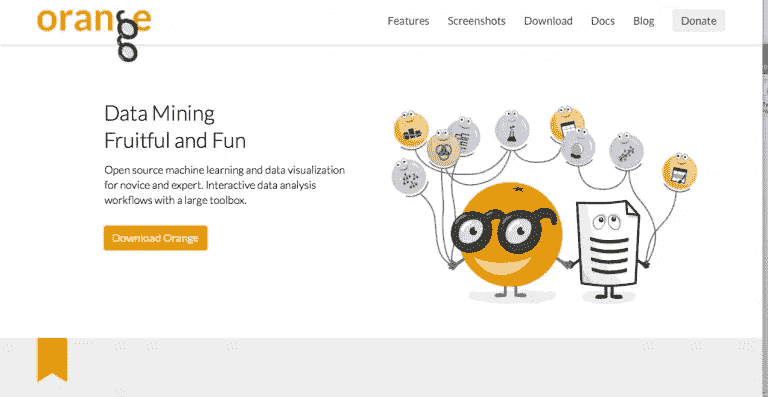

1.2 Orange Tool Download Page

**第二步:安装平台，为 Orange 设置存储其文件的工作目录。**

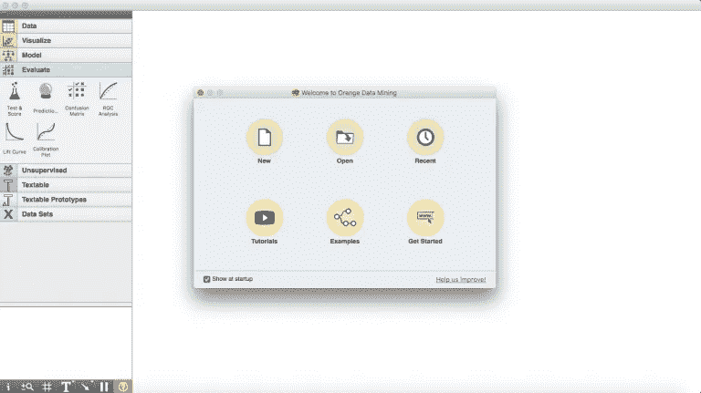

1.3 Installing Orage Tool

这是 Orange 的启动页面的样子。您可以选择创建新项目、打开最近的项目或查看示例并开始。

在我们深入研究 Orange 如何工作之前，让我们定义几个关键术语来帮助我们理解:

1.**小部件**是任何数据操作的基本处理点。它可以根据您在屏幕左侧的小部件选择器中选择的内容来执行许多操作。
2。**工作流**是您在平台中完成特定任务所采取的一系列步骤或行动。

一旦创建了第一个工作流，您还可以转到启动屏幕上的“示例工作流”查看更多工作流。

现在，点击“新建”,让我们开始构建您的第一个工作流。

**3。创建您的第一个工作流程**

这是解决任何问题的第一步。我们需要首先了解我们需要采取什么步骤来实现我们的最终目标。在上面的步骤中单击“新建”后，这就是您应该看到的内容。

1.15 Creating Workflow

这是你在 Orange 上的空白工作流程。现在，您可以通过将 widget 菜单中的任何 widget 拖到您的工作流程中来探索和解决任何问题。

**4。熟悉基础知识** Orange 是一个可以帮助我们解决当今数据科学中大多数问题的平台。从最基本的可视化到训练模型的主题。您甚至可以对数据集进行评估和无监督学习:

**4.1 问题** 

**4.2 导入数据文件** 

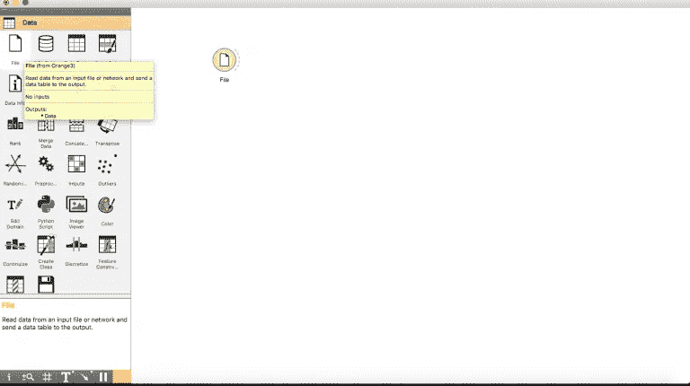

1.16 Step 1 for Importing Data Files

**步骤 1** :点击小部件选择器菜单上的“数据”选项卡，将小部件“文件”拖动到我们的空白工作流程中。

**第二步**:双击“文件”小工具，选择要加载到工作流程中的文件。在本文中，由于我们将学习如何解决贷款预测的实践问题，我将从相同的中导入训练数据集。

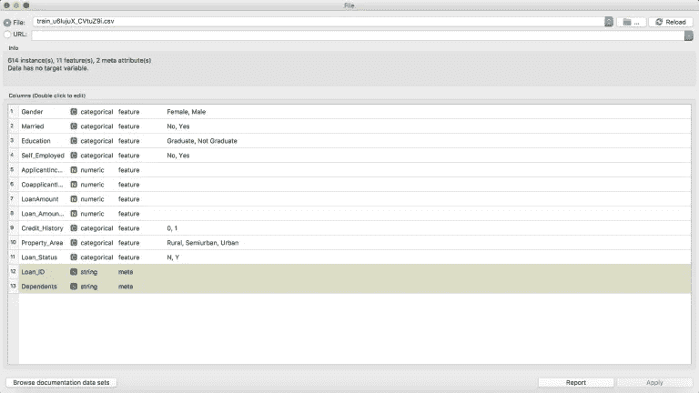

1.17 Step 2for Importing Data Files

**第三步:**一旦你可以使用小部件看到你的数据集的结构，关闭这个菜单返回。

**第四步:**既然我们已经生了。csv 详细信息，我们需要将它转换成我们可以在挖掘中使用的格式。单击“文件”小部件周围的虚线并拖动，然后单击空白区域的任意位置。

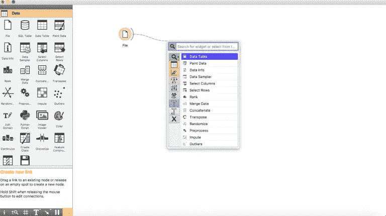

1.18 Step 3 for Importing Data Files

**步骤 5:** 因为我们需要一个数据表来更好地显示我们的发现，所以我们单击“数据表”小部件。

**第六步:**现在双击小部件来可视化你的表格。

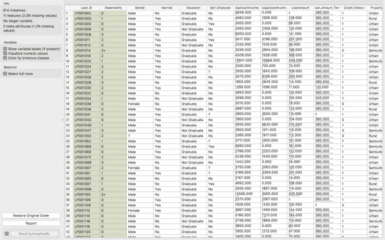

1.19 Step 4 for Importing Data Files

整洁！不是吗？

现在让我们可视化一些列，以在数据中找到有趣的模式。

**4.3 了解我们的数据
4.3.1 散点图**
点击“文件”小部件前面的半圆，将其拖动到工作流程中的空白区域，选择“散点图”小部件。

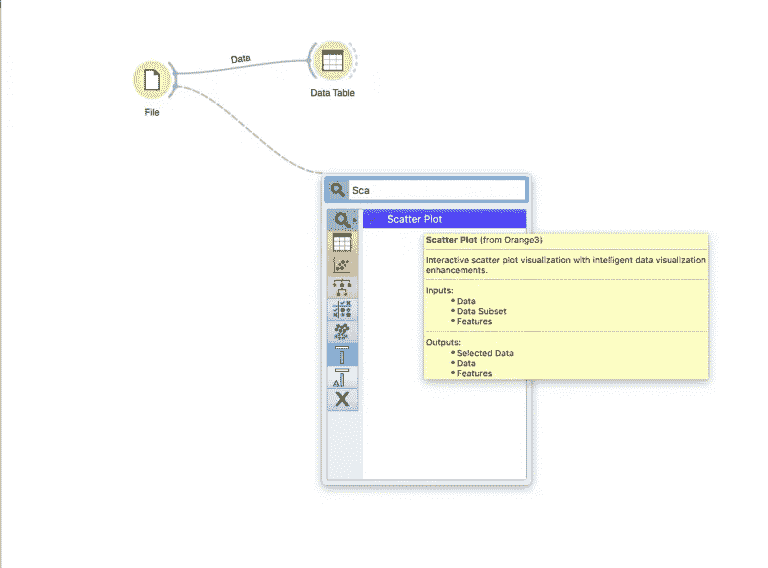

1.20 Step 5 for Importing Data Files

创建散点图小部件后，双击它并像这样浏览您的数据！您可以选择 X 和 Y 轴、颜色、形状、大小和许多其他操作。

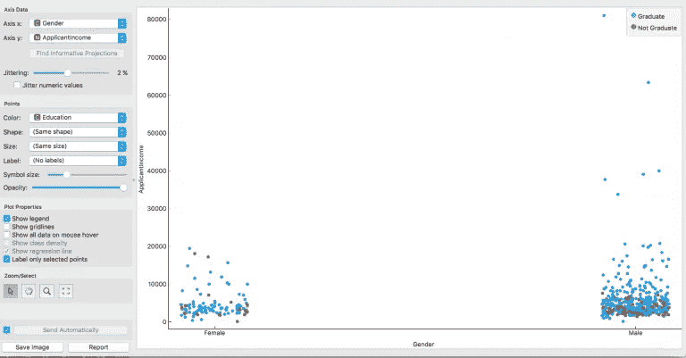

1.21 Step 6 for Importing Data Files

我研究的这个图是一个按收入划分的性别图，颜色是根据教育水平设置的。正如我们在男性身上看到的，高收入群体自然属于毕业生！

尽管在女性中，我们看到许多女性毕业生收入很低或者几乎没有收入。有什么具体原因吗？让我们用散点图来找出答案。

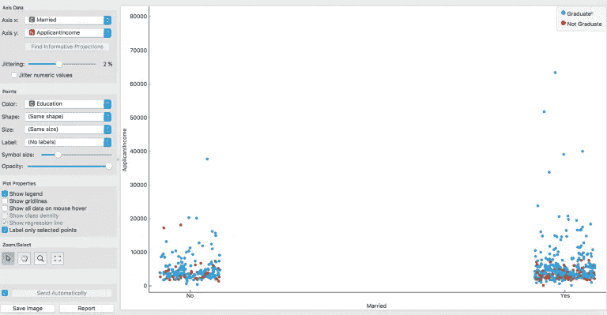

1.22 Step 7 for Importing Data Files

我发现的一个可能的原因是婚姻。大量已婚毕业生被发现属于低收入群体；这可能是因为家庭责任或者额外的努力。很有道理，对吧？

**4.3.2 分配**

可视化我们的发行版的另一种方式是“发行版”小部件。再次单击半圆，拖动鼠标找到小部件“Distributions”。

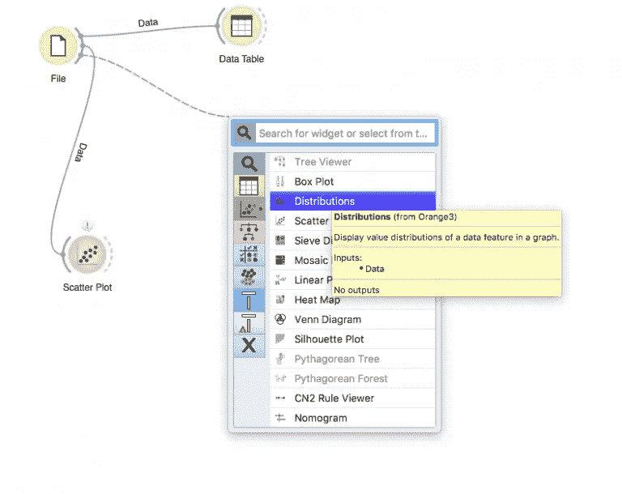

1.23 Step 7 for Importing Data Files

现在双击它并想象！

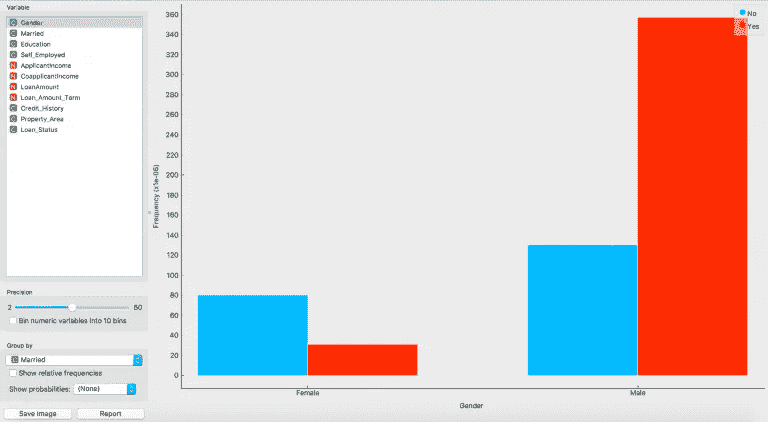

1.24 Step 8 for Importing Data Files

我们看到的是一个非常有趣的分布。在我们的数据集中，已婚男性比女性多。

**4.3.3 筛图**

收入与教育水平有什么关系？毕业生的工资比非毕业生高吗？

让我们用筛图来形象化。

从“文件”小部件中单击并拖动，然后搜索“筛图”。

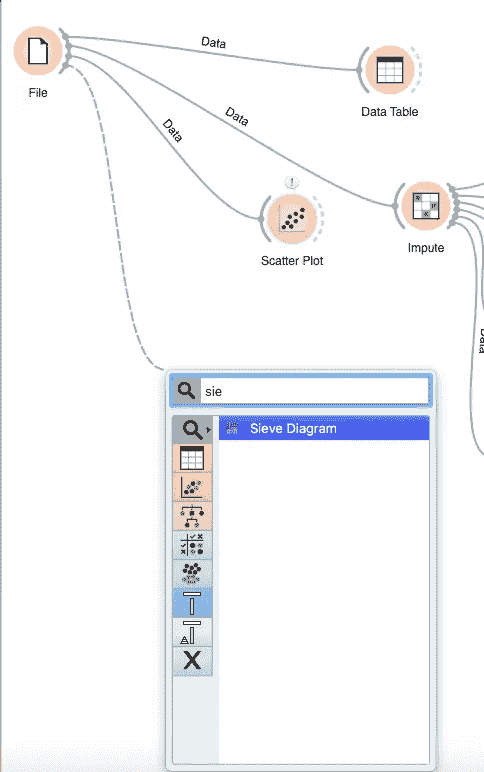

1.25 Step 9 for Importing Data Files

一旦你放置它，双击它并选择你的轴！

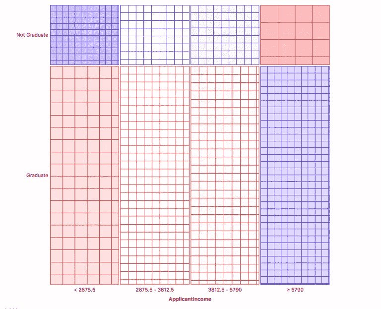

1.26 Step 10 for Importing Data Files

该图将分布部分分为 4 个箱。将鼠标悬停在这些部分上可以对其进行研究。

比如毕业生和非毕业生 78%除以 22%。然后，将申请人的收入分成 4 个相等的组，每个组 25%的细分。这是给你的任务，从这些图表中获得洞察力，并在评论区分享。

现在让我们看看如何清理我们的数据，以开始构建我们的模型。

**5。你如何清理你的数据？** 这里出于清理的目的，我们将估算缺失值。插补是理解和充分利用我们的数据的一个非常重要的步骤。

点击“文件”小部件，拖动找到“估算”小部件。

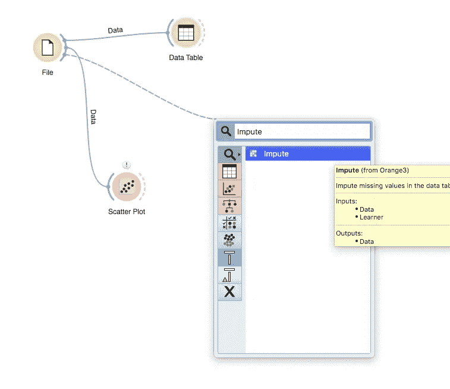

1.27 Step 11 for Importing Data Files

当您在放置小部件后双击它时，您会看到有多种插补方法可供您使用。您也可以使用默认方法，或者为每个类分别选择单独的方法。

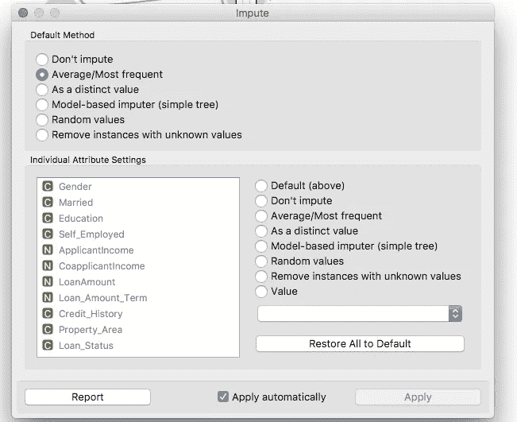

1.28 Step 12 for Importing Data Files

这里，我选择了默认的方法，对于数字值是平均值，对于基于文本的值(分类)是最常见的。

您可以从各种插补中进行选择，例如:

1.  独特的价值
2.  随机值
3.  删除缺少值的行
4.  基于模型的

在训练模型的方法中，还可以包括特征提取和生成。为了进一步理解，请阅读这篇关于数据探索和特性工程的文章

**6。训练您的第一个模型** 从基础开始，我们将首先训练一个包含所有特征的线性模型，以便理解如何选择和构建模型。

**第一步:**首先我们需要设置一个目标变量，对其进行 Logistic 回归。

**第二步**:转到“文件”小工具，双击它。

**第三步:**现在，双击 Loan_Status 列，选择它作为目标变量。单击应用。

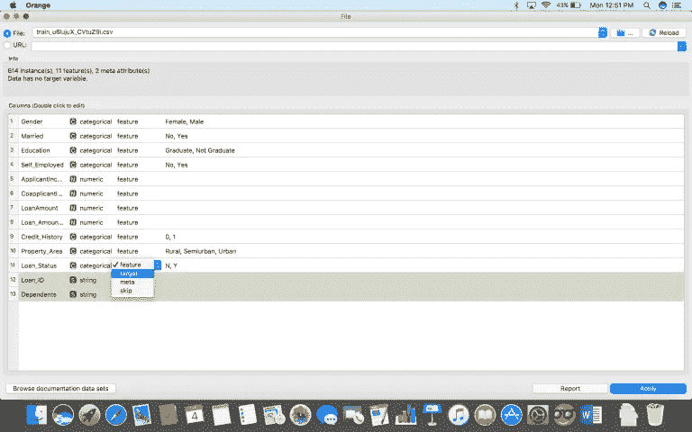

1.29 Step 13 for Importing Data Files

**步骤 4:** 一旦我们设置了目标变量，从“估算”小部件中找到干净的数据，如下所示，并放置“逻辑回归”小部件。

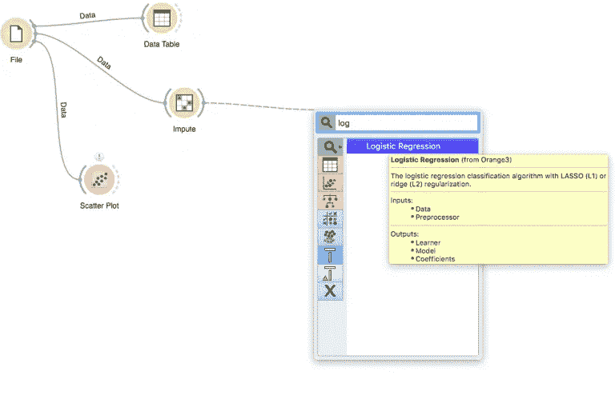

1.30 Step 14 for Importing Data Files

**第五步:**双击小工具，选择想要执行的正则化类型。

1.  **岭回归:**

*   执行 L2 正则化，即添加相当于系数大小平方的惩罚
*   最小化目标= LS Obj + α *(系数的平方和)

2.**套索回归:**

*   执行 L1 正则化，即添加相当于系数幅度绝对值的惩罚
*   最小化目标= LS Obj + α *(系数绝对值之和)

**步骤 6:** 接下来，点击“估算”或“逻辑回归”小部件，找到“测试和评分”小部件。确保将**数据和模型连接到测试小部件**。

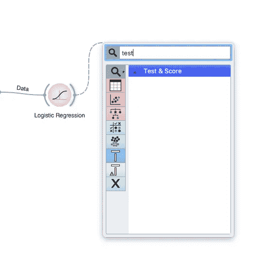

1.31 Step 15 for Importing Data Files

**步骤 7:** 现在，点击“测试和评分”小部件，看看你的模型做得如何。

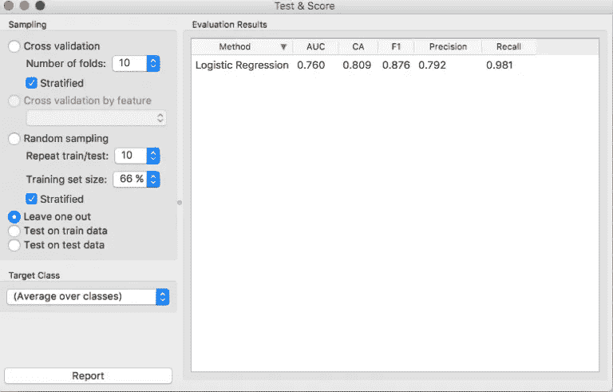

1.32 Step 16 for Importing Data Files

**第八步:**为了更好地可视化结果，从“测试和评分”小部件中拖放找到“混淆矩阵”。

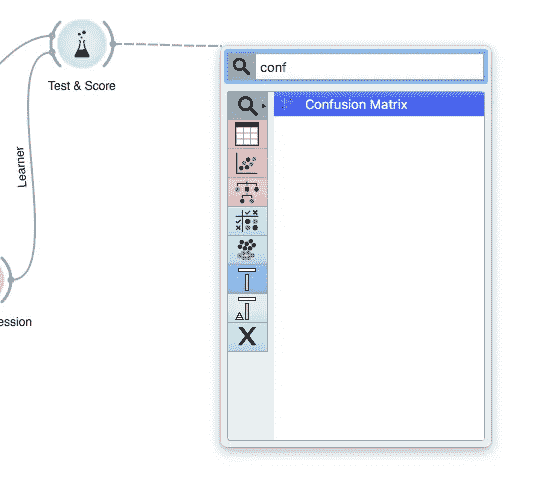

1.33 Step 17 for Importing Data Files

第 9 步:一旦你把它放好，点击它来可视化你的发现！

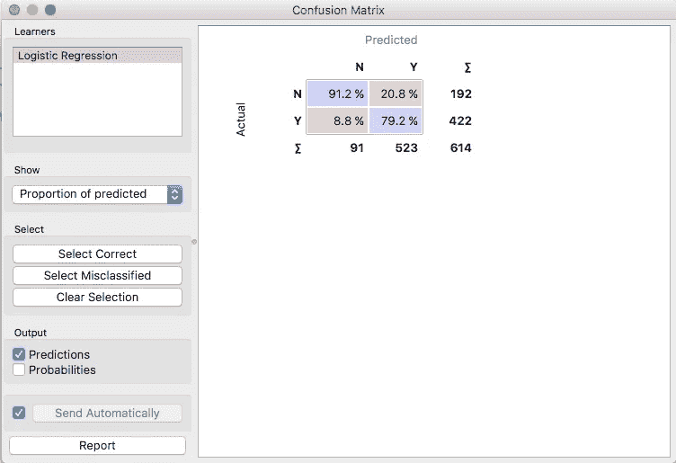

1.32 Step 18 for Importing Data Files

通过这种方式，您可以测试不同的模型，看看它们的表现有多准确。

让我们试着评估一下，一个随机的森林会怎么样？把建模方法改成随机森林，看混淆矩阵。

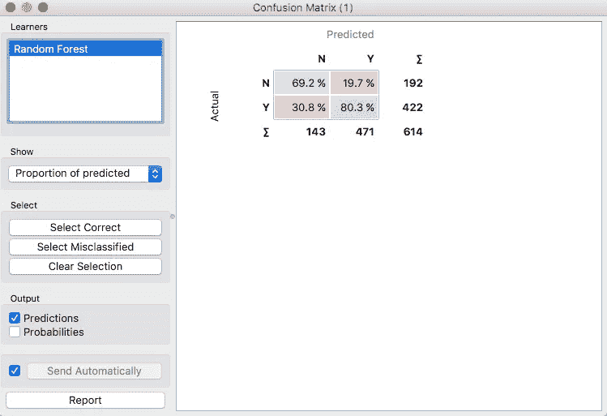

1.33 Step 19 for Importing Data Files

看起来不错，但逻辑回归表现更好。

我们可以用支持向量机再试一次。

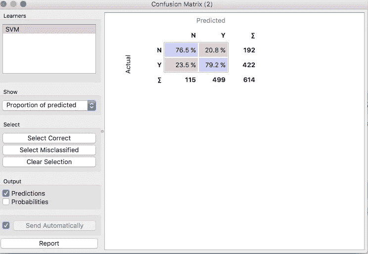

1.34 Step 20 for Importing Data Files

比随机森林好，但仍不如逻辑回归模型。

有时候越简单的方法越好，不是吗？

这是您完成整个流程后，最终工作流程的外观。

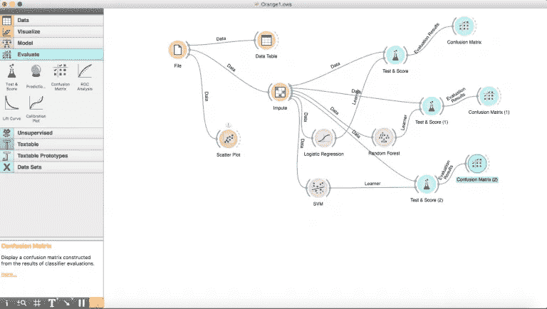

1.35 Step 21 for Importing Data Files

对于希望在团队中工作的人，您还可以导出您的工作流程，并将其发送给可以与您一起工作的朋友！

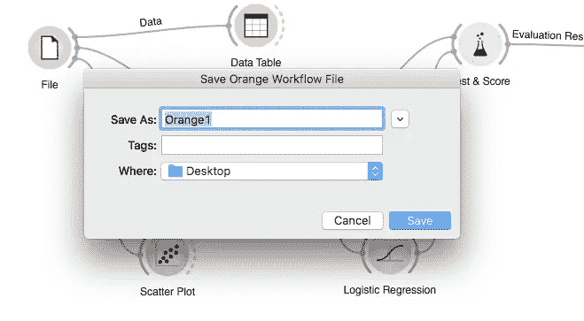

1.36 Step 22 for Importing Data Files

> ***加载本地数据集:***

现在，我们在橙色工具中加载本地数据集。从 [***这里下载 Iris.csv。*T32**](https://gist.githubusercontent.com/netj/8836201/raw/6f9306ad21398ea43cba4f7d537619d0e07d5ae3/iris.csv)

为了从本地设备加载 CSV，我们必须使用 **CSV 导入**小部件。通过使用这个小部件，我们能够将本地数据加载到 Orange 工具的表格格式中。我们可以使用**数据表**控件查看数据信息。

以下是本地数据集加载的工作流。

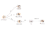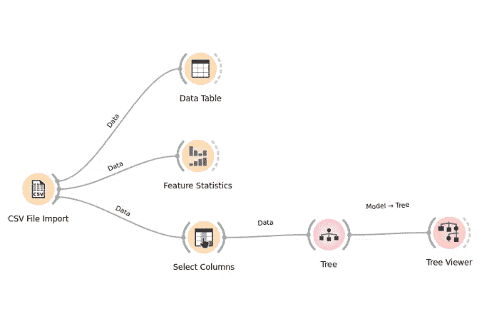

1.37 Local Dataset Loading Workflow

正如您在这里看到的，我使用了两个新的小部件进行探索。

**(1)特征统计:**用于获取中值、众数、缺失值、分布、最小值、最大值等统计信息。

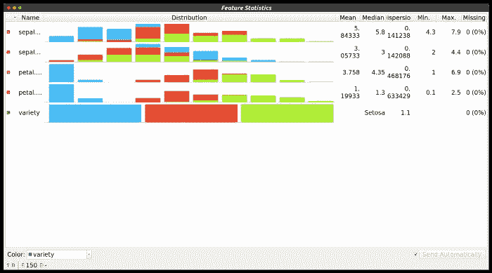

1.38 Feature Statistics of Variety Column

**(2)选择列:**选择列用于给出特征变量和目标变量的信息。当我们加载本地数据集时，我们必须使用选择列，这就是 Orange 工具通知要素和目标变量的方式。

> ***从 API/URL 加载数据集:***

现在，我们将加载互联网上可用的数据，而无需下载。我使用这个 URL 来加载数据。

[https://gist . githubusercontent . com/netj/8836201/raw/6 f 9306 ad 21398 ea 43 CBA 4 f 7d 537619 d0e 07 D5 AE 3/iris . CSV](https://gist.githubusercontent.com/netj/8836201/raw/6f9306ad21398ea43cba4f7d537619d0e07d5ae3/iris.csv)

我们可以通过使用**文件小部件**从 URL 加载数据。文件小部件有一个名为 URL 的选项，在该部分中，我们必须提供我们的 URL，然后我们就可以简单地获取数据。

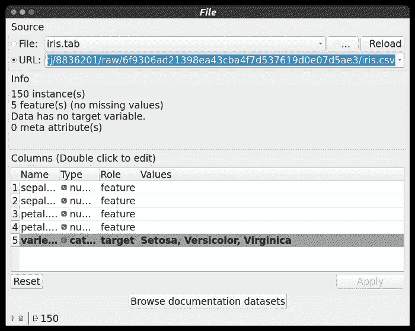

1.39 File Widget with URL option

其他 Widgets 信息 [***此处。***](https://orangedatamining.com/widget-catalog/)

> 结论

Orange 是一个平台，几乎可以用于任何类型的分析，但最重要的是，它具有漂亮和简单的视觉效果。在本文中，我们探讨了如何可视化数据集。预测建模也进行了，使用逻辑回归预测，SVM，和随机森林预测，找到每个人相应的贷款状态。

希望这篇教程已经帮助你解决了你以前可能没有理解或者忽略的问题。了解数据科学管道和我们训练模型所采取的步骤非常重要，这肯定会帮助您尽快构建更好的预测模型！

> ***领英:***

 [## 印度古吉拉特邦巴鲁奇史茹楚达萨马-钱杜拜 s .帕特尔理工学院

### 我是一名在 Charotar 科技学院攻读信息技术学士学位第四年的学生。我…

www.linkedin.com](https://www.linkedin.com/in/rushi-chudasama-63473819a/) 

> ***更多项目和博客:***

 [## 史茹-45 -概述

### 阻止或报告从 AadityaKhetan/Autograder 分叉-前端一个网络应用程序，以帮助进行实验室会议…

github.com](https://github.com/Rushi-45) 

**博客:**

 [## 史茹中号

### 简而言之，预处理是指在将数据提供给算法之前对其进行转换…

medium.com](/@rushi-positive) 

> ***最后备注:***

**感谢阅读！如果你喜欢这篇文章，请点击**👏尽可能多次按下按钮。这将意味着很多，并鼓励我继续分享我的知识。如果你喜欢我的内容，请在 medium 上关注我，我会尽可能多地发布博客。