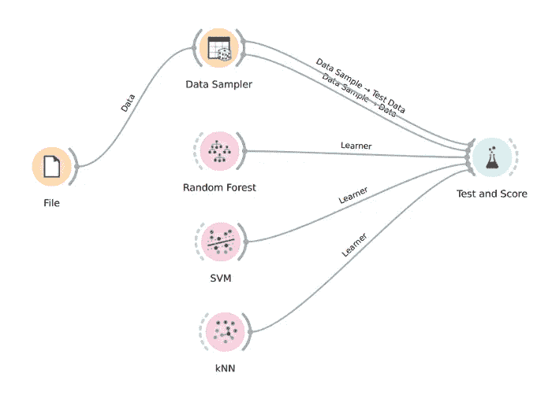
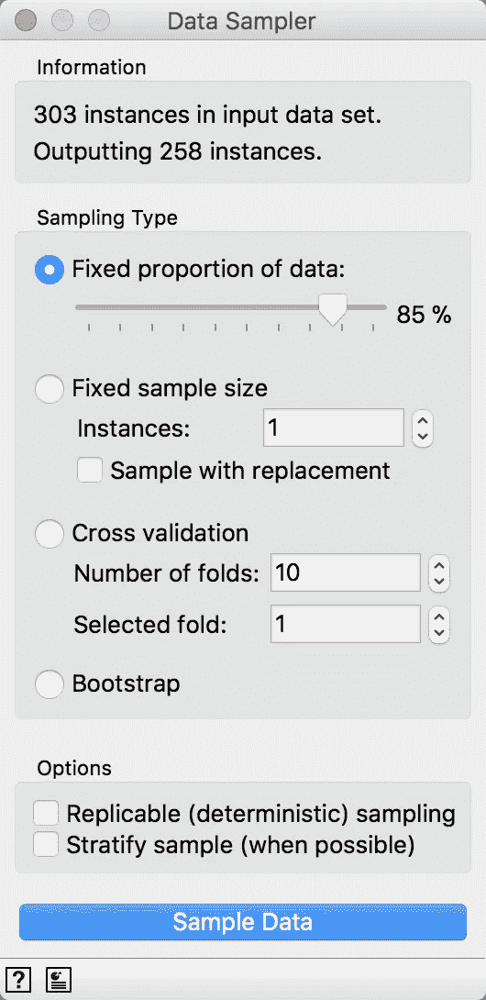
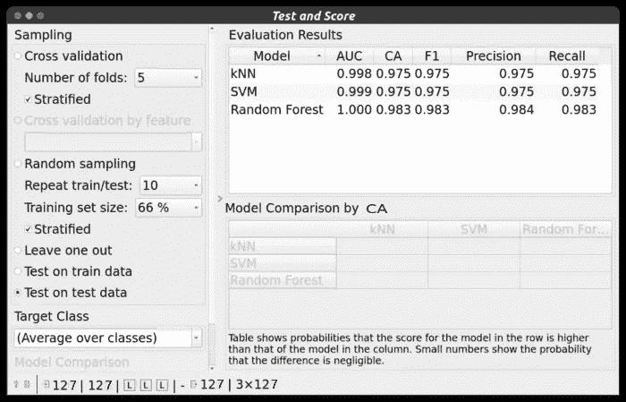
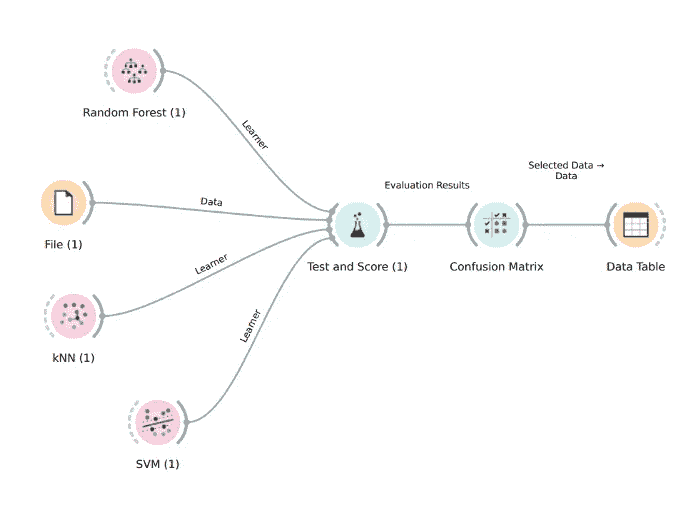
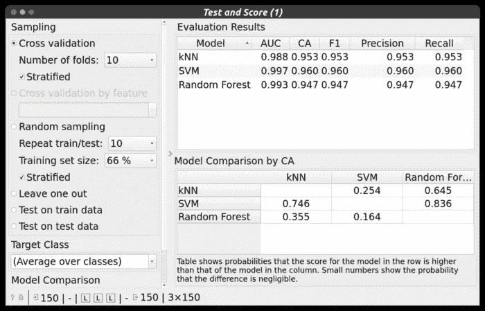
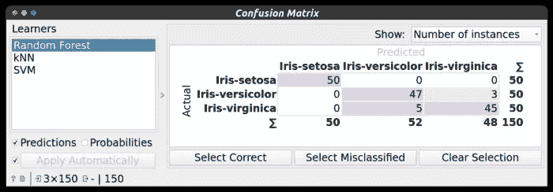
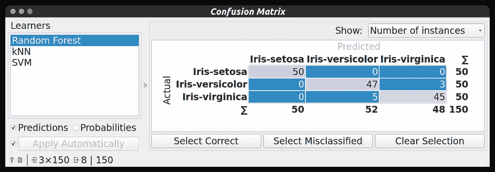
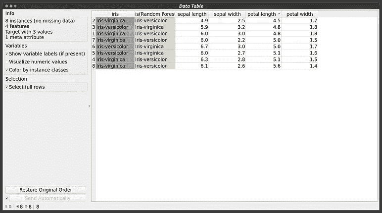
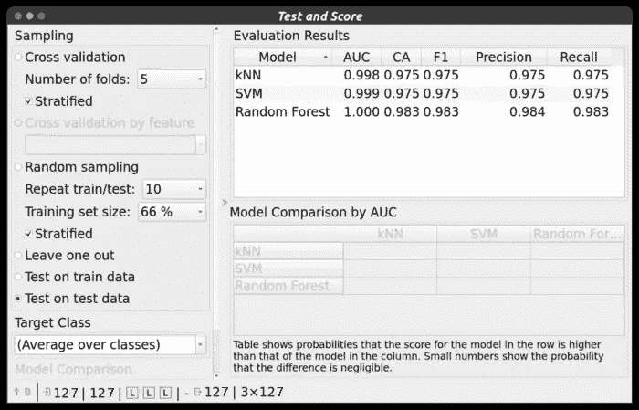
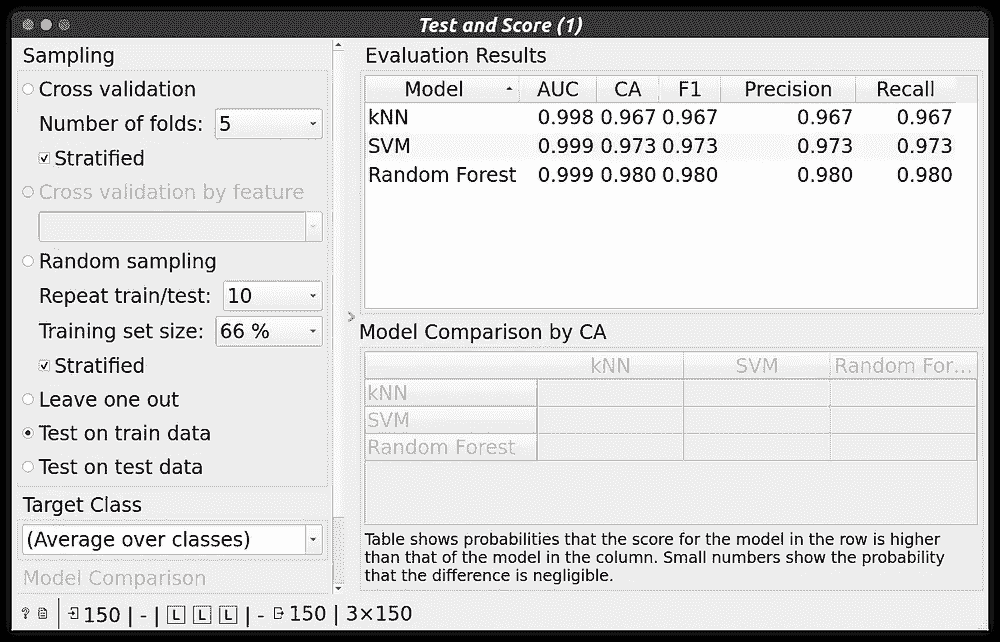

# 数据科学系列 EP 4

> 原文：<https://medium.com/geekculture/data-science-series-ep-4-cf970a8323fd?source=collection_archive---------39----------------------->

# 橙色工具介绍第 2 部分

**欢迎来到数据科学博客系列。**请点击这里查看我在数据科学博客系列[中的前一篇博客。](/@rushi-positive)

> **先决条件:**

[**橙色工具介绍-1**](https://rushi-positive.medium.com/data-science-series-ep-3-950e326c8beb)

> ***列车测试拆分:***

“足够大”的概念是特定于每个预测建模问题的。这意味着有足够的数据将数据集分成训练和测试数据集，并且每个训练和测试数据集都是问题域的合适表示。这要求原始数据集也是问题域的合适表示。

> **如何配置列车测试分割**

该过程有一个主要的配置参数，即训练集和测试集的大小。对于训练或测试数据集，这通常表示为 0 和 1 之间的百分比。例如，大小为 0.67(67%)的定型集意味着将剩余百分比 0.33(33%)分配给测试集。

没有最佳分割百分比。

您必须选择符合项目目标的分割百分比，考虑因素包括:

*   训练模型的计算成本。
*   评估模型的计算成本。
*   训练集代表性。
*   测试集代表性。

然而，常见的分割百分比包括:

*   培训:80%，测试:20%
*   培训:67%，测试:33%
*   培训:50%，测试:50%

对于训练测试分割，我使用了下面的工作流程。

2.2 Train Test Split Workflow

这里，像往常一样，我将 iris.tab 数据集加载到 orange 工具附带的文件小部件中。

之后，我将整个数据集传递到**数据采样器**小部件中。在数据采样器小部件中，我们将把数据集划分为训练和测试数据。

2.3 Data Sampler Configuration

我已经将数据分成了 85:15 的比例，即 85%的训练数据和 15%的测试数据。在底部，您可以从总共 150 个数据点中看到 127 个数据点用于训练，23 个数据点用于测试。

现在，在分割数据后，我将数据采样器与测试和分数部件连接起来。我连接了两条线，一条用于训练数据，另一条用于测试数据。

*数据样本- >数据(列车数据)*

*数据样本- >测试数据(测试数据)*

现在为了创建模型，我使用了随机森林、SVM(支持向量机)和 KNN ( K 最近邻)部件。这些小工具都是机器学习算法。连接所有的部件与测试和分数部件。

测试和分数部件必须需要两件事。

(1)数据(训练和测试)

(2)机器学习算法

当我们使用训练测试数据时，我们总是在测试数据上测试我们的模型，所以我们必须在测试和分数小部件中指定那个东西。

2.4 Test & Score Widget Properties

如您所见，在左侧**选择了测试数据测试**，即您看到的结果(右侧)来自测试数据测试。

我们得到了所有算法的最佳结果。(大约 98%的分类准确度)

**拆分数据对分类结果/分类模型有什么影响？**

2.5 With Splitting vs Without Splitting

正如你所看到的，分割的精确度要高一点，但并非总是如此。这里我们有非常干净和低的数据(150 个数据点)，但在某些情况下，当我们有很多数据点时，如果你不分割你的数据，那么你的模型可能会过拟合。所以把数据分成训练和测试总是好的。这样我们就可以获得我们的模型在未知数据集(测试数据)上表现如何的信息。

> ***交叉验证:***

交叉验证是一种**重采样程序，用于评估有限数据样本上的机器学习模型**。

我们可以使用 Test & Score 小部件进行交叉验证。注意，在分割数据交叉验证期间，不仅使用训练数据，也不使用测试数据，而是使用整个数据集。

对于交叉验证，我使用了以下工作流程:

2.6 Cross-Validation Workflow

现在你已经熟悉了这个工作流程，这是一个非常简单的工作流程，我们将直接关注测试和分数小部件。

2.7 Test & Score with Cross-Validation

如你所见，我使用的折叠次数= 10，即总共 10 次随机数据点将在我们的模型上进行测试，然后我们将得到一个平均结果。交叉验证是评估模型的一种非常强大的技术。我们还可以通过交叉验证来发现我们的模型是否过度拟合。

之后，测试和分数小部件与**混淆矩阵**连接，我们可以在混淆矩阵中看到结果，之后，我们可以从混淆矩阵中选择数据并在**数据表**小部件中查看。

2.8 Confusion Matrix ( with not selected anything )

2.9 Misclassified data

正如你所看到的，首先我从混淆矩阵中选择错误分类的数据，然后在数据表小部件上查看它。这就是我们如何使用混淆矩阵和数据表小部件来探索我们的结果。

**交叉验证对模型输出/准确性有什么影响？**

2.10 Without Cross-Validation vs With Cross-Validation

如你所见，在使用交叉验证时，我们的准确性在下降，但这仍然是一个非常好的性能。在没有交叉验证的情况下，我们将测试我们的模型一次，在有交叉验证的情况下，我们在来自数据集的随机数据点上测试我们的模型 K 次**(K =折叠数)**。这就是为什么在获得测试数据的良好准确性后，总是通过执行交叉验证来确保准确性。

使用交叉验证时，您可以通过准确性、精确度、召回率、f1 值、AUC 曲线等指标参数查看模型比较

点击这里阅读这篇文章，了解更多关于交叉验证 [***的细节。***](https://orangedatamining.com/blog/2019/1/28/the-mystery-of-test-and-score/)

> ***结论:***

我希望现在你能在橙色工具中自己工作。我试着尽可能多地报道一些事情。现在你可以自己探索更多。

请点击这里查看橙色工具 [***的更多特性。***](https://orangedatamining.com/docs/)

> ***领英:***

 [## 印度古吉拉特邦巴鲁奇史茹楚达萨马-钱杜拜 s .帕特尔理工学院

### 我是一名在 Charotar 科技学院攻读信息技术学士学位第四年的学生。我…

www.linkedin.com](https://www.linkedin.com/in/rushi-chudasama-63473819a/) 

> ***更多项目和博客:***

 [## 史茹-45 -概述

### 阻止或报告从 AadityaKhetan/Autograder 分叉-前端一个网络应用程序，以帮助进行实验室会议…

github.com](https://github.com/Rushi-45) 

**博客:**

 [## 史茹中号

### 欢迎来到数据科学博客系列。请点击这里查看我之前的数据科学博客系列…

medium.com](/@rushi-positive) 

> ***最后注:***

**感谢阅读！如果你喜欢这篇文章，请点击**👏尽可能多的按按钮。这将意味着很多，并鼓励我继续分享我的知识。如果你喜欢我的内容，请在 medium 上关注我，我会尽可能多地发布博客。