# 数据科学系列|橙色工具入门

> 原文：<https://medium.com/geekculture/data-science-series-getting-started-with-orange-tool-1ba74daa41a?source=collection_archive---------9----------------------->

了解如何使用橙色工具加载和可视化数据。


# ***什么是橙色工具？***

Orange 是一个开源的数据可视化、机器学习和数据挖掘工具包。它带有一个可视化编程前端，用于探索性数据分析和交互式数据可视化，并能够将其用作 Python 库。Orange 是一个基于组件的软件套件，擅长机器学习和数据挖掘，特别是可视化。小部件是涵盖从可视化到预处理、评估和预测建模的所有内容的组件。

使用 Orange 工具，我们可以执行以下任务:

1.  显示数据表并拾取要素。
2.  分析信息。
3.  比较和对比学习算法和预测。
4.  数据项可以被可视化。

# ***安装***

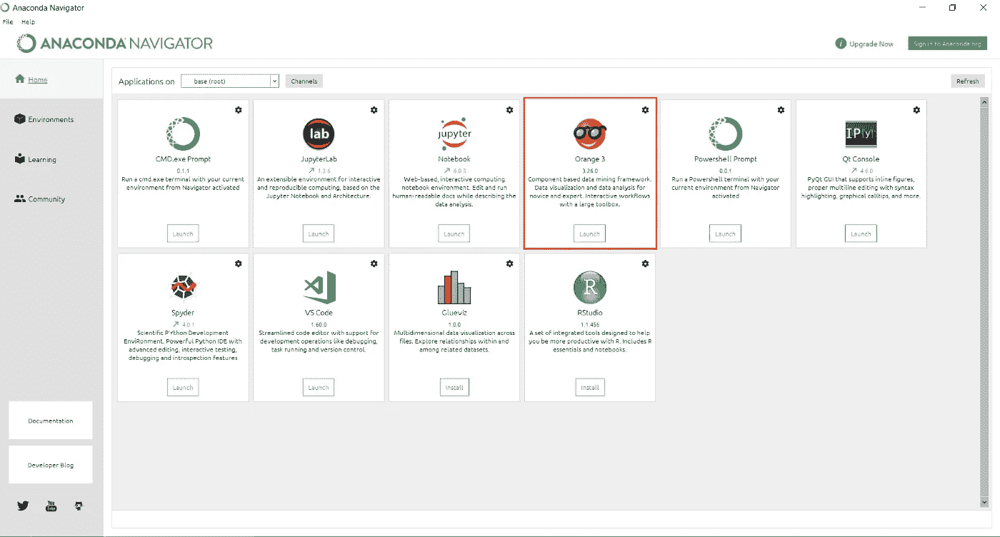

Orange in Anaconda Navigator

当您将 Anaconda 环境下载到您的机器中时，Orange 就内置了。我们也可以显式下载并安装 Orange 为此，我们需要运行以下命令:

```
pip install orange3
```

如果您使用的是 Anaconda 提供的 python，那么运行以下命令:

```
conda config --add channels conda-forge
conda install orange3
```

有关下载的更多信息，[点击此处](https://orangedatamining.com/download/#windows)

# ***如何使用 Orange 工作流***

Orange 工作流由读取、分析和可视化数据的组件(也称为小部件)组成。Orange 小部件是在 Orange 的可视化编程环境中组装的数据分析工作流构建元素。小部件根据其用途进行分类。典型的工作流是用于数据输入和过滤、可视化和预测数据挖掘的小部件的混合。

现在，让我们为众所周知的 IRIS 数据集生成一个工作流。你既可以使用 Orange 的内置数据集，也可以导入自己的数据集。

步骤 1:使用部件库，选择**文件**部件

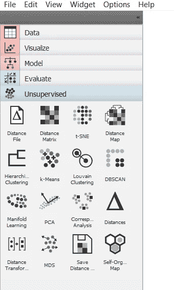

Widget options in the left pane of the orange window

现在，双击文件后，我们需要选择数据集，这里我们利用了 IRIS 数据集。


IRIS dataset

步骤 2:用文件小部件导入数据集后，我们通过从文件小部件拖动一条线到数据信息(创建通道)来创建**文件-数据信息**小部件之间的流。只需将小部件拖放到画布中，并在两个小部件之间创建一个链接。

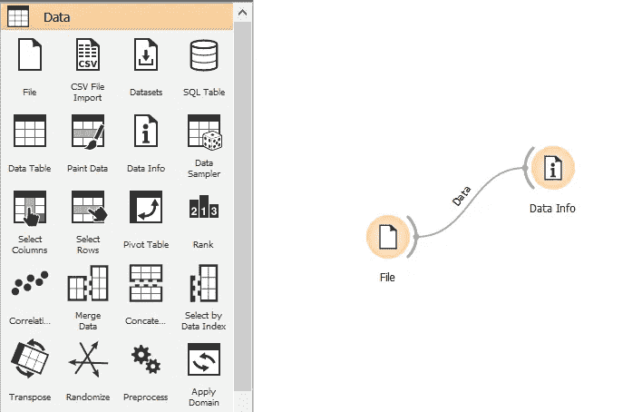

Data flow between two widgets.

**数据信息**小部件用于获取关于已加载数据的信息。它还显示数据集的行数、列数和目标数，以及数据集的名称、大小、功能、描述、行数、列数、目标数和数据特征。

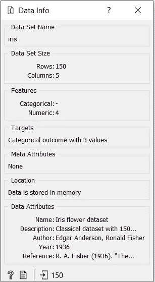

Data Info

类似地，然后我们在**文件数据信息、文件散点图、文件数据表和文件分布**之间建立一个流程。我们可以用这种方式在 Orange 中设计一个简单的工作流。

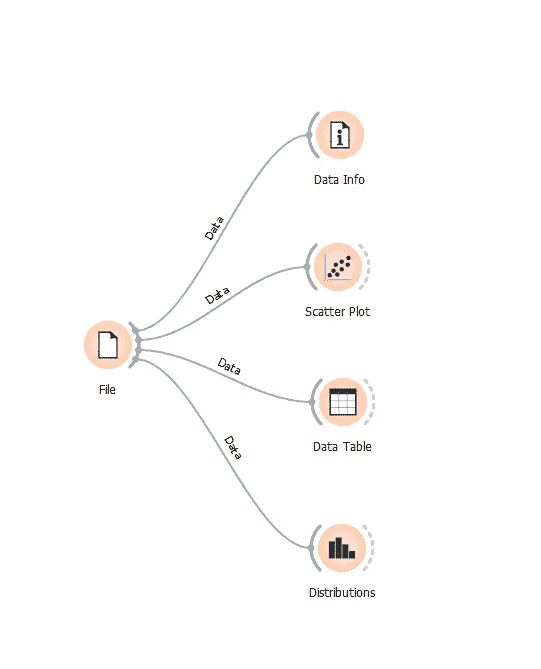

Sample Workflow

我们还使用**选择列**或**选择行**小部件来过滤掉不必要的行和列。

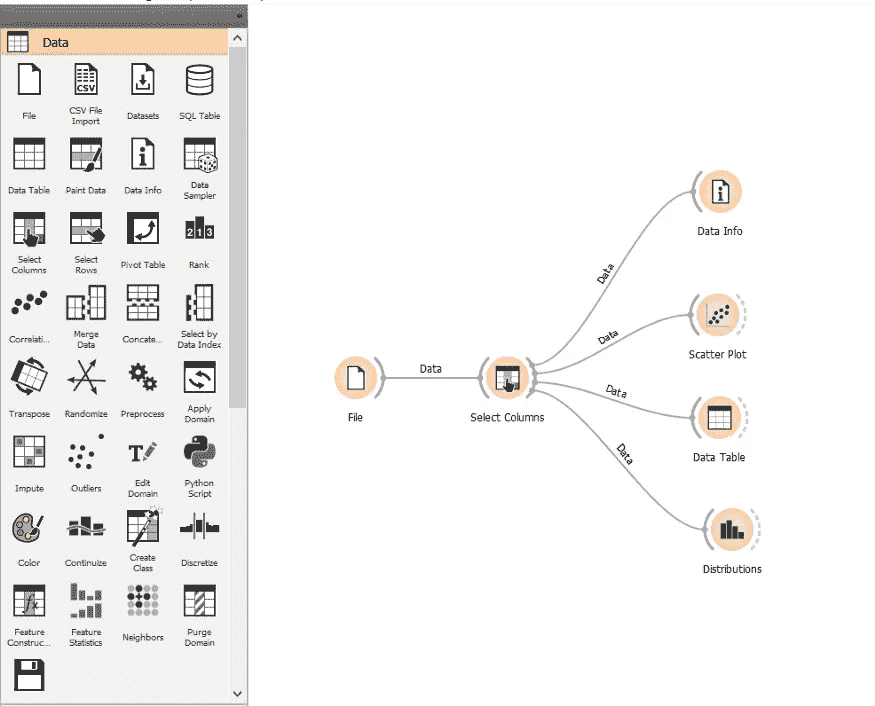

Column filter

***选择列***

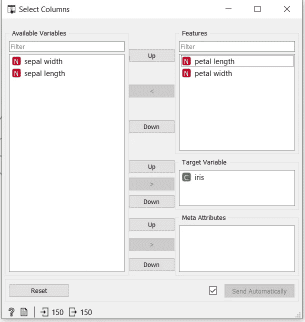

Selected Columns

如此处所示，我们可以根据需要将特性转移到可用变量类别或目标变量类别中。

## ***散点图小工具***

它用于绘制所需特征之间的散点图。我们还改变 X 轴和 Y 轴的值，我们还直接获得信息投影，并在彩色区域中绘图。

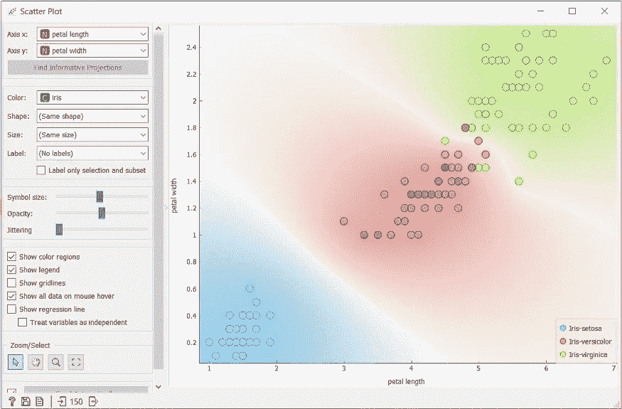

Scatter Plot

## ***数据表小部件***

使用数据表微件以表格格式查看数据。

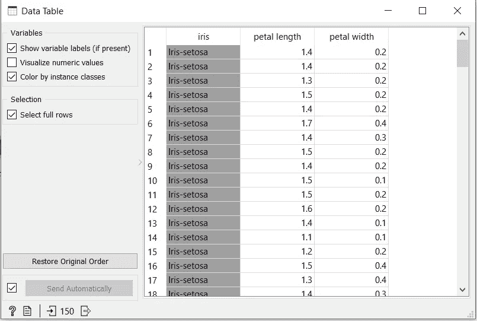

Data Table

## ***分发小工具***

要获取数据集值的图形表示，请使用数据分布小部件。在这里可以很容易地看到数据集中不同要素的分布情况。基于虹膜分割的花瓣宽度的分布可以在下图中看到。同样，您可以使用要素和目标变量之间的不同组合来可视化数据集。

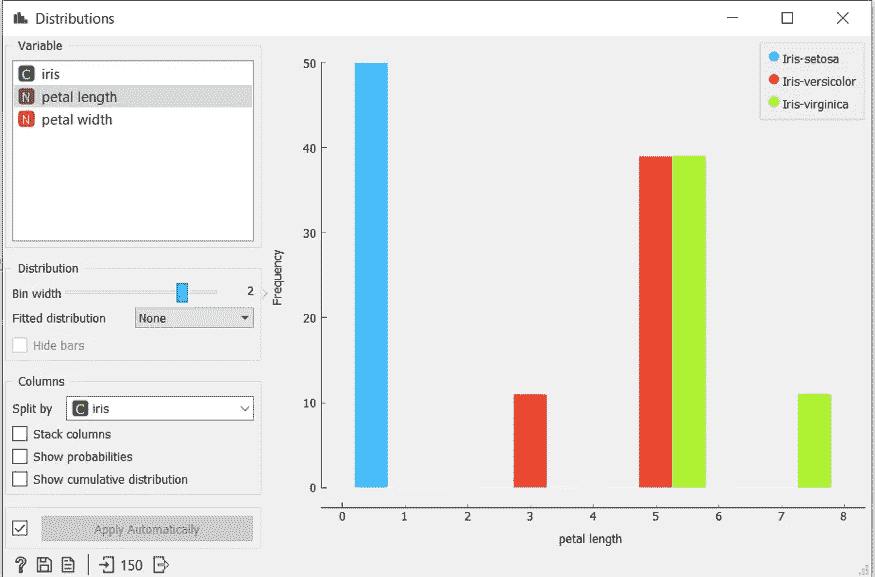

Distribution Widget

## ***如何在 Orange 中从 API 加载你的数据或外部数据？***

要从 URL 或本地机器加载表格数据，我们可以使用文件小部件本身。在下图中，我们可以看到有两个选项，文件和 URL。如果我们需要从本地机器加载数据，我们必须选择一个文件，在文件的右侧，有一个文件夹图标，我们可以使用它从本地机器加载。

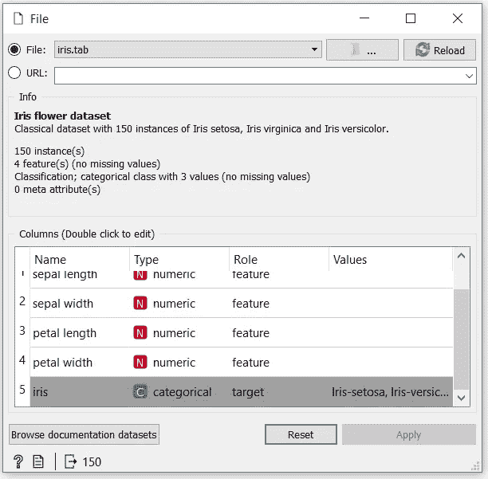

File widget (URL or Local)

如果要导入在线可用的数据集，需要将该数据集的 URL 添加到 URL 字段中以导入数据集。如果您想要导入已经下载到您的计算机上的数据集，那么您只需选择“浏览”选项，该选项位于“重新加载”选项旁边，并根据您的要求选择适当的数据集，然后将其加载到您的工作流中。另一个选项是我们可以使用 **CSV 文件导入小工具**来导入 CSV 文件。