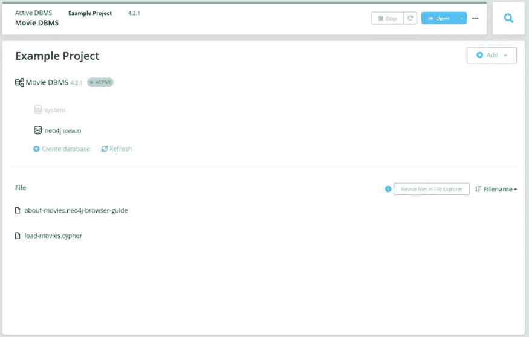
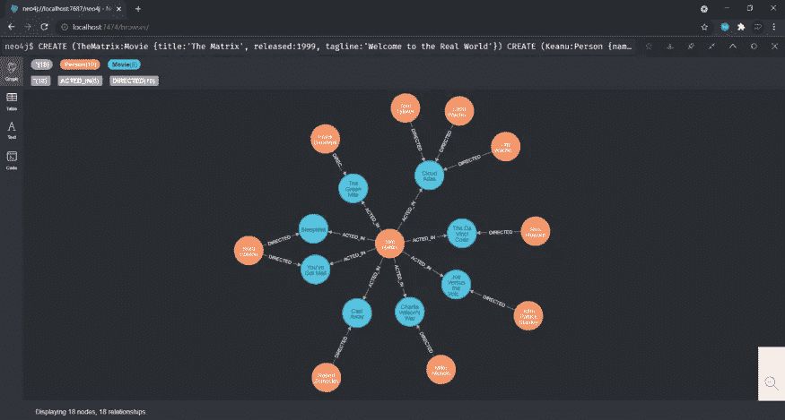
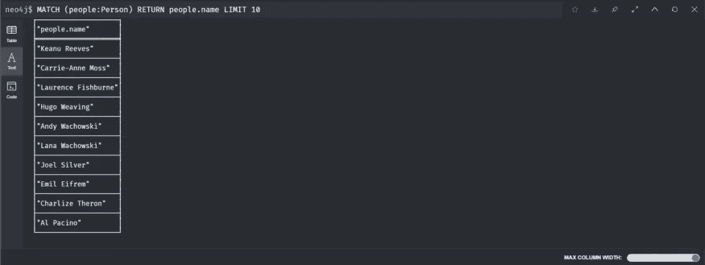
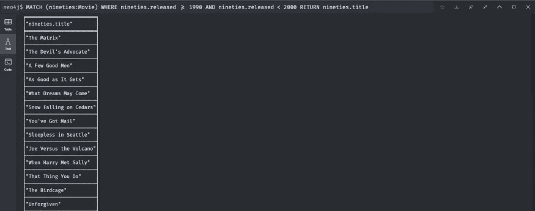
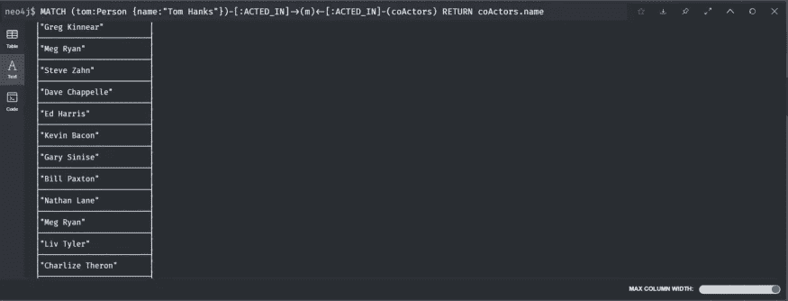
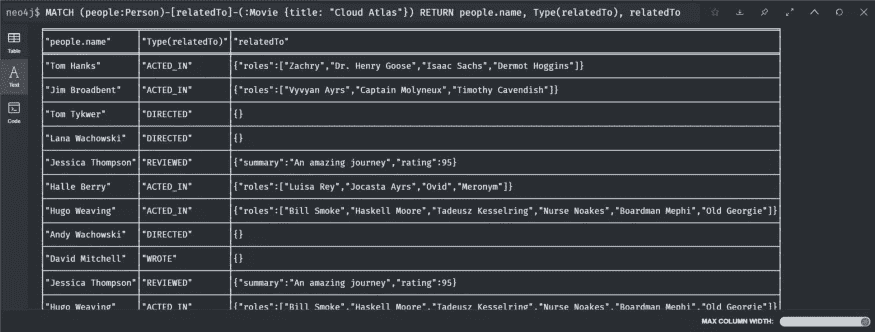
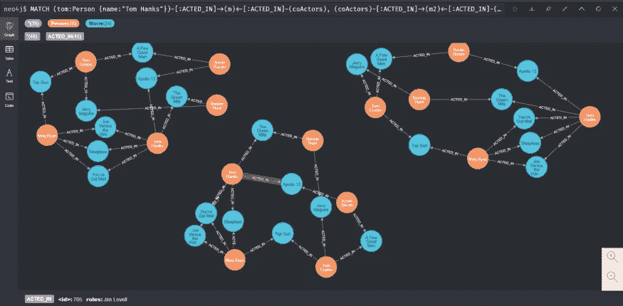
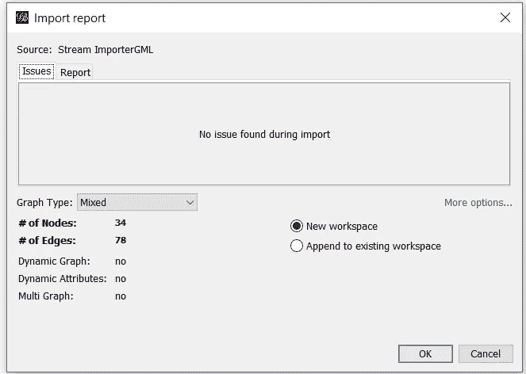
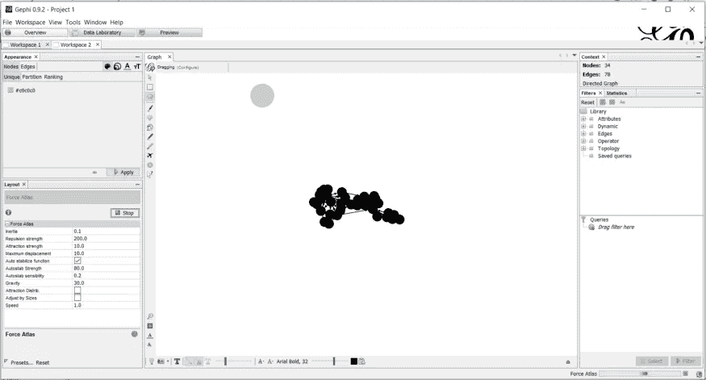

# 数据科学系列| Neo4j 和 Gephi 工具简介

> 原文：<https://medium.com/geekculture/data-science-series-introduction-to-neo4j-and-gephi-tool-f0757331001?source=collection_archive---------19----------------------->

关于如何使用 Neo4j 和 Gephi 数据可视化工具的初学者指南。

Neo4j 以更自然、更互联的状态存储和管理数据，维护数据关系，从而提供闪电般的查询、更深入的分析上下文以及轻松的可修改数据模型。

简单地说，Neo4j 是图形数据库的 MySQL。它提供了一个图形数据库管理系统、一种查询数据库的语言、一个密码和一个带有 neo4j 浏览器的可视化界面。

让我们开始演示，

1.  下载并安装 neo4j 桌面
2.  安装完成后，让我们执行演示

启动电影数据库，并在 Neo4j 浏览器中查看该数据库。

Movie DBMS project

现在，打开您的浏览器并转到以下 URL:[http://localhost:7474/browser/](http://localhost:7474/browser/)

在访问上面提到的链接时，从浏览器连接到电影 DBMS 项目。现在，将电影数据库加载到 neo4j，它将以图形格式显示数据。

Generated graph from Movies DBMS

现在让我们运行一些查询，

这是电影数据库管理系统中 10 个名字的列表，

Returning ten names

以下是 20 世纪 90 年代上映的电影列表:

Movies released between 1990–2000

以下是为获取 20 世纪 90 年代发行的电影而提交的查询摘要:

Code summary for films released between 1990–2000

这是根据电影数据库管理系统列出的汤姆·汉克斯的合作演员名单

List of co-actors

以下是所有与电影《云图》有关的人的名单:

List of people connected to Cloud Atlas

现在，这是如何将汤姆·汉克斯和汤姆·克鲁斯联系起来的图示；如下所示，有三种可能的方式将汤姆·汉克斯和汤姆·克鲁斯联系起来:

Generating Movie connection between Tom Hanks and Tom Cruise

**Gephi**

**Gephi** 是 NetBeans 平台上用 Java 编写的开源网络分析和可视化软件包。

导入数据集

Importing the GML file

您可以更改任何节点的颜色，并以更好的方式可视化数据集。

关于 Neo4j 工具和 Gephi 工具的介绍就到此为止。你可以很容易地看到这个工具中的所有信息。