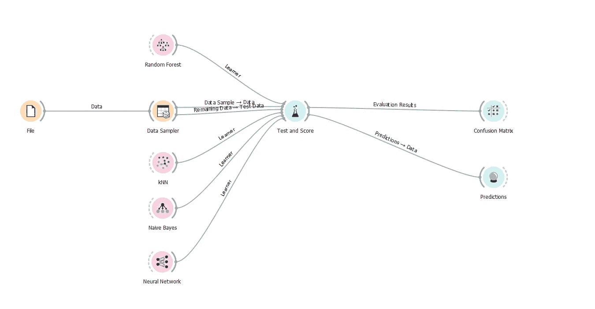
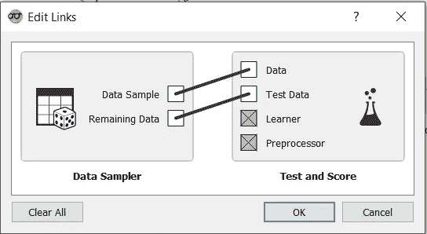
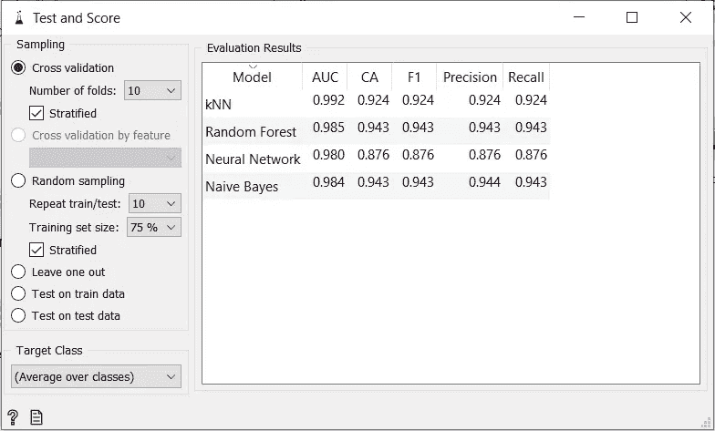
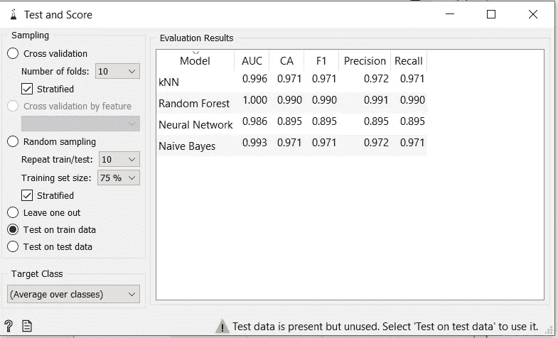
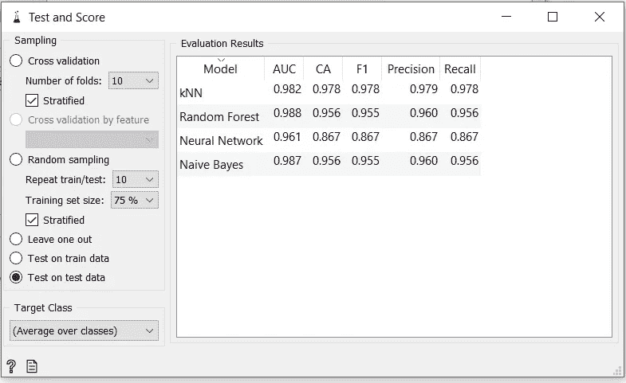
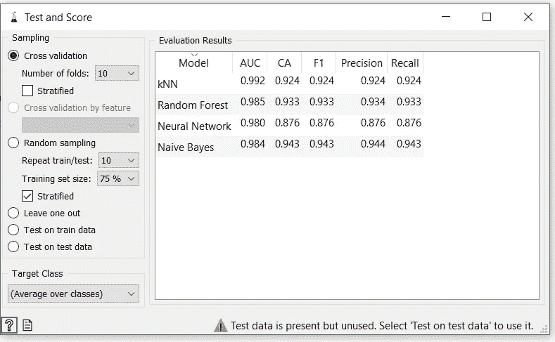
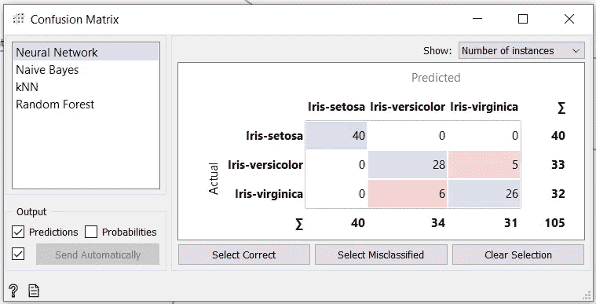
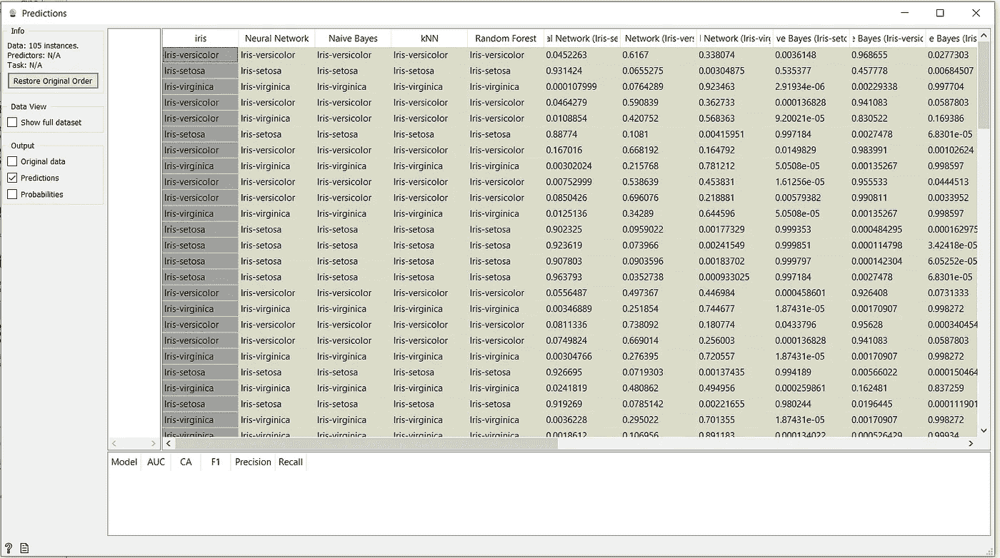

# 数据科学系列|使用 Orange 工具进行可视化编程

> 原文：<https://medium.com/geekculture/data-science-series-visual-programming-using-orange-tool-27addd176448?source=collection_archive---------21----------------------->

如何使用 Orange Tool 执行可视化编程的分步指南

如果你是使用 Orange3 的新手，那么我建议你点击这里阅读 Orange 的基本概述。

让我们从基本的工作流程开始。我们在工作流程中使用了 IRIS 数据集。

> ***将数据拆分为训练数据和测试数据***

为了分割数据集，我们使用**数据采样器**小部件。我们将把数据分成两部分，80%的数据用于训练，20%用于测试。我们将发送前 80%的建立一个模型，其余的测试目的。

首先，将文件连接到数据采样器。然后，单击数据采样器，并在数据采样器中修改您想要的更改。

***数据采样器***

它从输入数据集中选择数据实例的子集。

**输入**

*   数据:输入数据集

**输出**

*   数据样本:采样的数据实例(用于训练)
*   剩余数据:样本外数据(用于测试)

所以我们必须将整个数据集传递到**数据采样器**小部件中。默认情况下，数据集在**数据采样器**中分为训练数据(70%)和测试数据(30%)。在**数据采样器**小部件中，我们将把数据集分成训练(80%)和测试数据(20%)。

> ***数据拆分对分类模型的影响&结果***

首先，为了知道效果，我们必须创建一个工作流来测试数据上的学习算法(SVM，KNN，等等)并给它们打分。我们将使用**测试和评分**小部件，该小部件从**数据采样器**获取数据，并对学习器算法进行训练、测试和评分。

Generated Workflow

***测试和评分***

测试数据的学习算法。

**输入**

*   数据:输入数据集
*   测试数据:用于测试的单独数据
*   学习者:学习算法

**输出**

*   评估结果:测试分类算法的结果。

分割数据后，我们必须通过连接两条线用于训练数据，另一条用于测试数据，将数据采样器与测试和得分小部件连接起来。因此，通过点击链接，它打开**编辑链接，**我们必须编辑链接，如下所示。

Link edit

数据样本(80%) ->数据(训练数据)

剩余数据(20%) ->测试数据

此工作流利用朴素贝叶斯、随机森林、神经网络和 KNN ( K 近邻)微件来创建模型。所有的小工具都使用了机器学习方法。您可以像在生成的工作流中所做的那样，将您的所有小部件与作为学习者的**测试&分数**小部件连接起来(见上图)。

**测试和评分**小工具必须需要两件东西来测试和评分，如上面的**测试和评分**部分所示。

(1)数据(培训和测试)

(2)机器学习算法

在将模型与训练和测试样本一起发送到**测试&得分**后，我们在**测试&得分**小部件内的表格中观察它们的表现。但是在观察评估结果之前，我们必须制作 **Test and Score** widget，通过点击 widget 左侧面板上的 **Test on test data** 选项来评估测试样本，如下图所示。因为还有其他可供评估的选项，比如交叉验证、忽略一个选项等等。所以当使用测试数据时，我们总是在测试数据上测试我们的模型。

Test and Score on Test Data

> ***测试与训练数据分离的重要性***

数据分离的主要目的是为了评估。因为过拟合是训练模型时常见的问题。当一个模型在我们用来训练它的数据上表现得非常好，但不能很好地推广到新的、以前看不见的数据点时，就会发生这种现象。

因此，测试数据充当新的、以前看不见的数据点，当模型基于测试数据进行评估时，我们开始知道模型的实际准确性。或者，当模型基于训练数据进行评估时，它会给出比测试数据更好的准确性，因为模型已经基于我们用于评估目的的相同特征进行了训练。但是这种模型并不适用于真实世界的数据，它们只是过度适应了训练集。

Test and Score on Training Data

Test and Score on Test Data

所以拆分数据对分类模型的影响无非就是 CA(分类准确率)。这里我们可以看到，用于训练数据测试的 CA(左侧)更大，但我们知道这并不被认为是实际的准确性；我们真的希望我们的模型能够推广到每一个测试数据。

> ***交叉验证***

交叉验证是一种用于估计机器学习模型性能(或准确性)的统计方法。它用于防止预测模型中的过度拟合，尤其是在可用数据量有限的情况下。在交叉验证中，创建一组数量的数据折叠(或分区)，对每个折叠进行分析，并对总误差估计值进行平均。

将数据分为训练数据和测试数据，这也是我们上面所做的验证类型，称为维持验证。改进维持方法的一种技术是使用 K-fold 交叉验证。这种策略确保了我们的模型的分数独立于训练和测试集的选择。数据集被细分为 k 个子集，并且保持方法被应用于每个子集 k 次。

关于交叉验证的进一步阅读，请访问这个 [**博客**](https://www.mygreatlearning.com/blog/cross-validation/) **。**

***橙色中交叉验证的高效使用***

对于使用测试和评分小部件的相同工作流，我们可以通过单击小部件左侧面板上的交叉验证选项来使用交叉验证，如下图所示。同样，我们可以改变 K 倍的值。

Cross-Validation

如我们所见，我们使用 K=10 进行交叉验证，因此这里的折叠数是 10。数据集被细分为 10 个子集，并且维持方法被应用于每个子集 10 次。

> ***对模型输出的影响&精度***

交叉验证是一种评估机器学习模型预测新数据能力的方法。它还可以用于检测过度拟合或选择偏差等问题，并提供有关模型如何推广到不同数据集的信息。这里，它执行 K 次，而不是单次保持方法，提供了模型更好的实际准确性。因此，我们可以看到交叉验证的准确性较低，但更准确或更一般化。

混淆矩阵也可以用于分析输出。

Confusion Matrix for the Neural Network

The output of the Prediction method

**预测**小部件接受两个输入。一个是数据集，通常来自测试数据，另一个是“**预测器**”。"**预测器**是指任何**模型**小部件的输出。您可以将任意数量的**模型**部件与**预测**部件连接起来。

所以，就这样了。这就是你如何用 Orange3 进行基本的可视化编程。