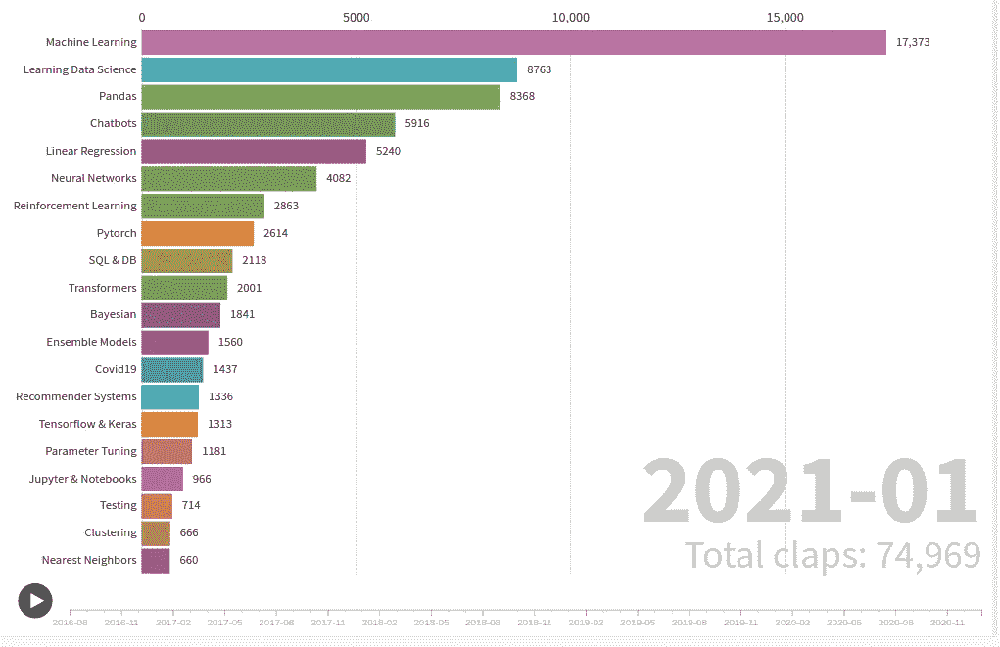

# 数据科学趋势 2016–2021

> 原文：<https://medium.com/geekculture/data-science-trends-2016-2021-d141024eeb8d?source=collection_archive---------34----------------------->

## 面向数据科学帖子的趋势检测

Screenshot by author — live visualization at end of post

今天我从 T [owards Data Science](https://towardsdatascience.com/) 的出版物上搜集了 41739 个中等职位的头衔。基于这些标题，我想试着找出哪些主题随着时间的推移而成为趋势，以及哪些主题现在成为趋势。

为了执行趋势检测分析，我想使用一些巧妙的方法来给出…