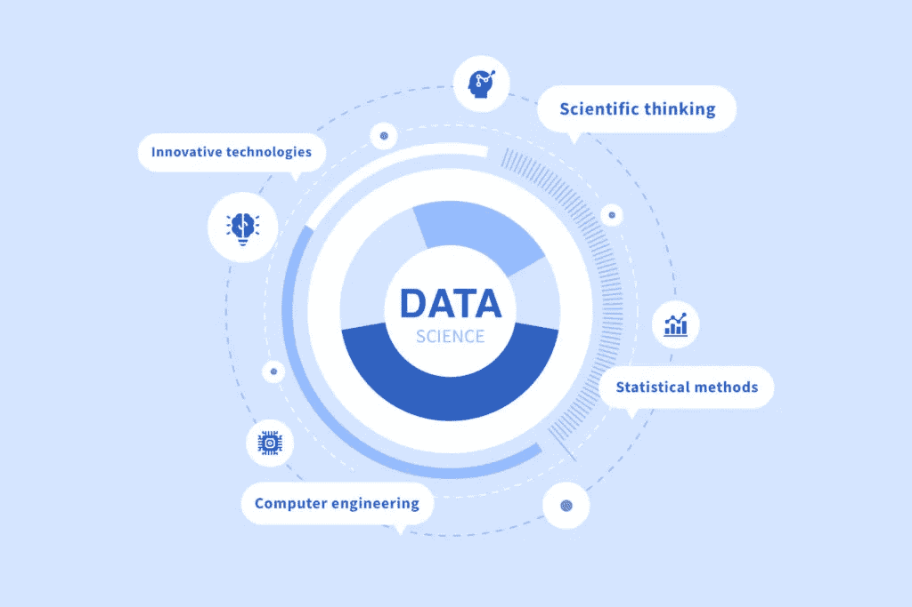
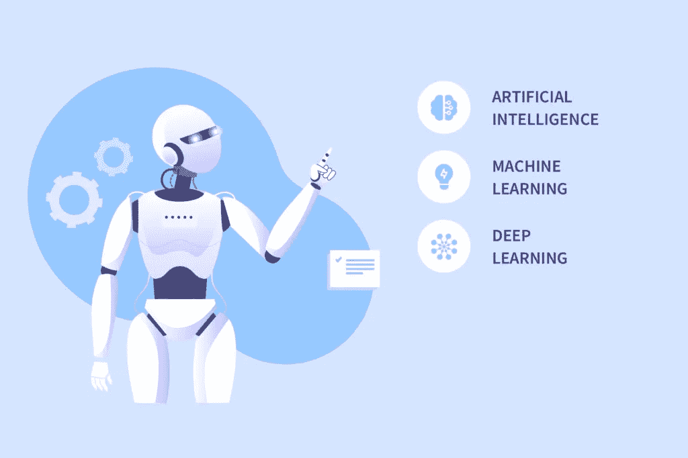

# 数据科学 vs 人工智能:关键差异——NIX United

> 原文：<https://medium.com/geekculture/data-science-vs-artificial-intelligence-key-differences-nix-united-a694ebdd24d9?source=collection_archive---------21----------------------->

数据科学 vs 人工智能——这场“术语冲突”是怎么回事？虽然你肯定听说过甚至可能使用过这两个术语，但你对它们的含义了解多少呢？这是一个相关的问题，因为许多人认为它们是可以互换的，并且觉得两者之间没有太大的区别。是的，它们可以紧密相连，但数据科学和人工智能概述了本质上不同的专业知识和工作领域。

让我们仔细看看这两个术语，并了解更多关于[数据科学](https://nix-united.com/services/data-science/)与[人工智能](https://nix-united.com/services/ai-solutions-artificial-intelligence/)的信息。舒服一点，继续读下去！

# 什么是数据科学？

在我们深入研究数据科学与人工智能之争之前，让我们先从基础开始。数据科学是一个相对广泛的研究领域，涉及数据系统和各种侧重于管理数据的流程。采用数据科学解决方案的最终结果是从结构不良或根本没有结构的数据中提取有价值的见解。这些通常是所有类型的市场参与者都非常渴望的业务推动见解。

为了完成工作，[数据科学家](https://nix-united.com/blog/data-science-team-structure-roles-and-responsibilities/)将专业工具和技术结合起来，实现高效的大数据分析。目标是为处理特定的业务任务或问题精心设计模型。为此，专家使用数学分析，并确定可以放在有用的数据模型核心的数据模式和趋势。

然后，这些模型被转化为全面的业务预测和建议。这需要相当广泛的技能，包括强大的数学，统计能力，编程技能，以及有效地交流自己的发现的能力。了解各种人工智能实现也是一个基本要求。

今天的公司每天都会产生大量的数据，这些数据中的大部分都是真正的商业增长黄金。但是，海量数据集要求数据科学家使用大量工具，从不同角度进行分析。底层工具可能从 Python 和 Hadoop 延伸到 SQL 等，而主要方法(除了传统的深入业务分析和数据可视化)有:

*   **规定性分析。这种分析通过确定哪些活动最有可能成功来帮助企业设定目标。规定性分析利用了模型的推论，并帮助公司提出实现目标的最佳方法。**
*   **预测性因果分析:**这种方法用于建立业务预测。它模拟并展示了不同商业行为的结果，并帮助企业主预测他们公司未来的重要议程。

# 何时使用数据科学

在比较数据科学和人工智能之前，我们先来看看数据科学可以用在什么地方。作为概括一系列统计、设计和开发技术的集合术语，数据科学可以应用于:

*   当统计见解是强制性的
*   当用户需要识别趋势和模式时
*   当使用探索性数据分析时
*   当需要检查预测分析时

如今，数据科学广泛应用于医疗保健、金融、人力资源、政府项目和市场营销等领域。例如，营销团队使用它来找出哪种产品或服务更受欢迎，更有可能被售出。没有数据科学，定向广告也几乎不可能，因为其算法有助于通过个性化的自主技术了解更多关于目标用户的信息。现代医疗保健行业离不开数据科学模型，因为它们有助于药物开发、图像分析等。

# 什么是人工智能？

人工智能是一个非常广泛使用的术语，可以跨行业和细分市场提及。通常，它与智能机器人或机器主宰人类生活和工作的许多领域的未来世界联系在一起。这种概括使它在表面层次上不同于数据科学的术语。在全球 it 市场的规模上，对人工智能与数据科学的话题进行更深入的探讨，更多的本质差异变得如此明显。

人工智能(AI)是计算机科学的一个分支，致力于创造像人类一样工作、思考和对各种环境做出反应的智能机器。人工智能研究处理的问题是如何创造出具有智能行为、自主决策和机器可以自己运行的有利可图的工作的计算机。

人工智能的关键目标是根据用户的经验，教会计算机执行基于这些知识的不同任务。来自这个领域的所有专家都指望全面的学习，因为这有助于机器找到模式和推论。尽管人工智能可以有广泛的应用领域，但它在很大程度上是基于机器学习、自然语言处理和计算机视觉的。

这催生了一些工具和软件产品，它们都是为了追求一个目标——帮助计算机实时读取和学习数据。最终的结果是使决策过程更容易，从长远来看更明智和有效。

如今，人工智能产品在各个行业的应用最为活跃，尤其是在零售和电子商务、银行和金融服务、医疗保健和科学、教育、制造和汽车生产以及社交媒体等领域。

至于现实生活中的应用，亚马逊、谷歌和脸书等知名公司长期以来一直在产品中使用人工智能。例如，几乎所有智能手机和平板电脑用户都使用人工智能语音助手，如 Siri 和 Alexa，在他们的设备中进行语音导航。

当在网飞上选择电影时，用户将他们的查询输入搜索，产生个性化的结果。联系支持服务(例如，银行)的人经常与聊天机器人打交道，聊天机器人逐渐取代了呼叫中心的工作人员。

埃隆·马斯克的粉丝买特斯拉是为了自驾的好处。这样的例子几乎可以无穷无尽地列举出来，证明了人工智能已经在普通人的生活中扎下了多么深的根。

# 何时使用人工智能

让我们来看看与人工智能的积极应用最相关的主要案例:

*   当有必要快速做出决定时
*   当需要精度时
*   当重复但复杂的任务需要自动化时
*   当需要进行风险分析时
*   当需要逻辑决策帮助时

如今，人工智能并不是软件开发中不可替代的组成部分，但它无疑被视为高级解决方案和计划的标志，这些解决方案和计划通常包含自称是市场定义的功能。它通常用于根据用户的在线行为(购买、对某些数字组件的注意力、网站访问习惯、点击率等)向用户提供个性化推荐。).

人工智能也越来越多地用于[医疗保健](https://nix-united.com/blog/how-the-benefits-of-ai-in-healthcare-can-serve-your-business/)中，以解释和分类临床记录，简化文书管理，并可视化复杂的医疗资产。自然语言处理(NLP)系统可以审查关于患者的非结构化临床记录，从而提供关于医疗保健服务质量改进、治疗阐述和患者利益的深刻见解。

人工智能通过提供一系列自动化、分类和分析机会，最终提高了人类工作的速度、准确性和效率。人工智能方法可用于金融业务，以识别欺诈性交易，开发快速准确的信用评分，并自动化劳动密集型数据管理活动。

# 数据科学 vs 人工智能:详细的对照表

现在，当你对这两个术语都有所了解时，就该对它们进行比较，找出主要的区别和相似之处了。什么是人工智能 vs 数据科学？请查看下表，了解主要区别:

你应该记住，尽管存在常见的人工智能与数据科学的争论，但人工智能是数据科学的必备工具。简而言之，它用于以一种更加自主、简化的方式分析数据。数据科学家的主要目标是使用 NoSQL 或 SQL 查询提取数据，解决所有与数据相关的问题，分析模式，并应用各种模型来生成见解。另外，数据科学家使用人工智能工具来追求一个更重要的目标——进行严格的数据分类和预测。

您可以看到，数据科学领域包含了广泛的活动，包括预处理、分析和预测。另一方面，人工智能是预测模型的应用，用于预测和概述未来事件。

# 数据科学 vs 人工智能:数据科学和人工智能专家概述

就比较数据科学和人工智能而言，前者是一个快速增长的行业，为最终用户和从事这一细分市场的人提供了一系列机会。数据科学家通常参与其中，处理数学和计算机科学。这个行业最令人兴奋的事情之一是大量的工作机会。最受欢迎的数据科学职位如下:

*   数据工程师
*   数据库管理员
*   数据架构师
*   数据科学家
*   数据分析师

另外，你应该记住，这个行业也为学生提供了许多机会。他们可以作为数据科学实习生、ML 研究实习生和初级数据科学学徒工作，并在这个领域获得体面的经验。

现在，让我们来看看人工智能的工作。此时此刻，这个领域对各种工作都有巨大的需求。这是一项先进的技术，已经创造了许多与国际科技公司打交道并获得可观收入的机会。以下是 2022 年最受欢迎的人工智能工作:

*   人工智能工程师
*   商业智能开发人员
*   机器人工程师
*   计算机视觉工程师
*   自然语言处理专家

# 结论

总的来说，我们刚刚涵盖了人工智能和数据科学的基础知识。你可以看到这两个术语是相关但不同的。你可以看到，在数据科学 vs 人工智能的争论中，前者大多是处理计算性的运算，通常是对数据进行运算。然而，AI 工具基于数据生成预测。目前，这两个领域都有需求。如果你渴望在这些领域中找到一份好工作，你应该记住，如果你擅长数据分析，那么数据科学的工作可能正合你的胃口。如果你喜欢人工智能概念，那么这个领域的工作可能会非常适合你的需要。

*原载于 2022 年 5 月 13 日 https://nix-united.com***。**