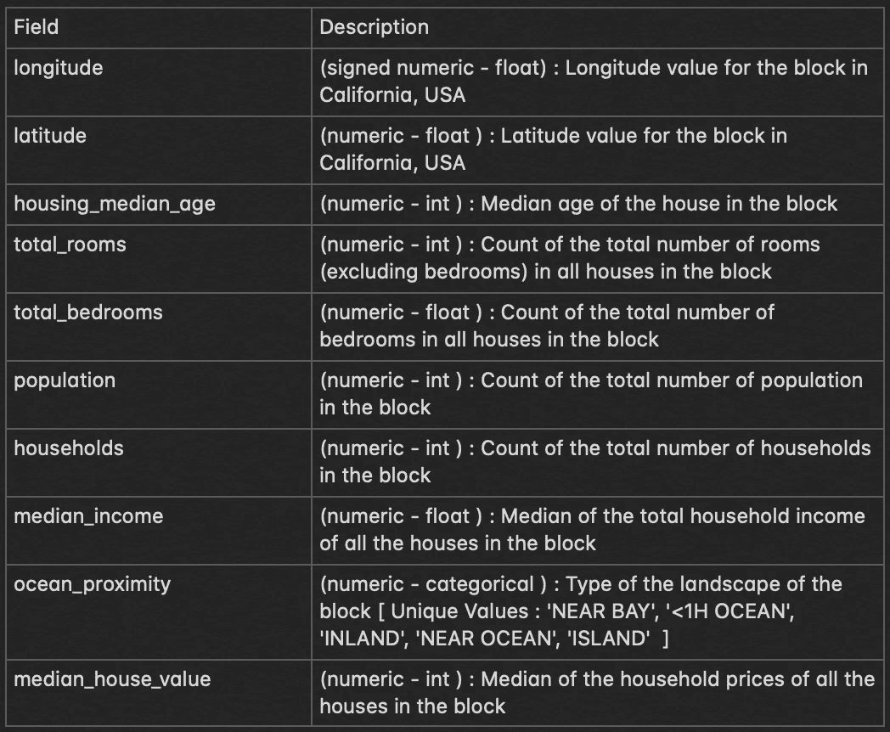
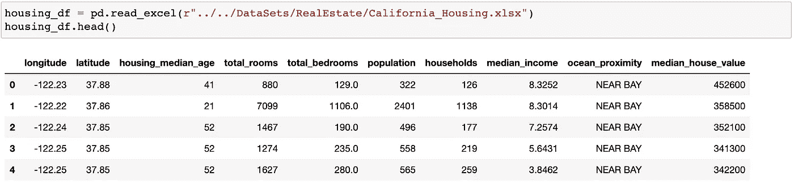
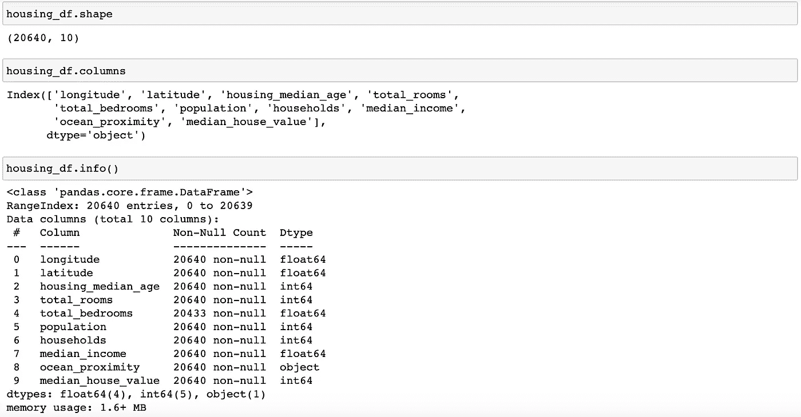
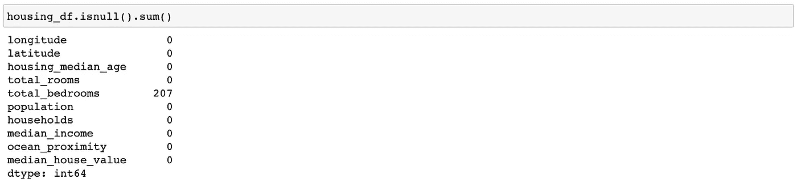
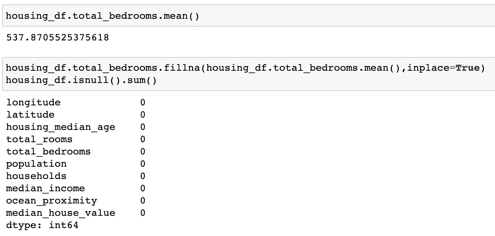
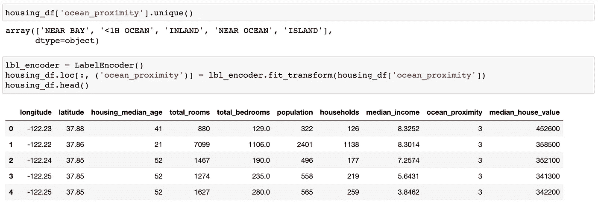

# 房地产数据科学—第一部分

> 原文：<https://medium.com/geekculture/data-sciences-in-real-estate-part-i-47cb9d28cb66?source=collection_archive---------15----------------------->


1\. Source: [https://economictimes.indiatimes.com/industry/indl-goods/svs/construction/delhi-cooperative-housing-finance-corporation-limited-to-reduce-interest-rates-on-home-loans/articleshow/80753368.cms?from=mdr](https://economictimes.indiatimes.com/industry/indl-goods/svs/construction/delhi-cooperative-housing-finance-corporation-limited-to-reduce-interest-rates-on-home-loans/articleshow/80753368.cms?from=mdr)

**加州房价预测**

美国人口普查局公布了加州人口普查数据，其中包括 10 种指标，如加州每个街区的人口、中值收入、中值房价等。该数据集还用作项目范围的输入，并尝试为其指定功能性和非功能性需求。

**问题目标:**

该项目旨在建立一个房价模型，以使用提供的数据集预测加州的中值房价。这个模型应该从数据中学习，并能够在给定所有其他指标的情况下，预测任何地区的中值房价。

地区或街区组是美国人口普查局发布样本数据的最小地理单位(街区组通常有 600 到 3000 人)。项目数据集中有 20，640 个区。

**领域**:金融和住房

**数据集描述:**



2\. Dataset Description

**要执行的分析任务:**

1.  使用提供的数据集构建一个房价模型来预测加利福尼亚州的房价中值。
2.  在给定所有其他指标的情况下，训练模型从数据中学习以预测任何地区的中值房价。
3.  根据中值收入预测房价，并绘制回归图。

我们开始吧！

**步骤 1:导入库**
下面是分析过程中使用的所有库，您可以选择一次添加或以后添加。

```
# Import Libraries **
import** **numpy** **as** **np
import** **pandas** **as** **pd
import** **os** **import** **seaborn** **as** **sns
import** **matplotlib.pyplot** **as** **plt** **from** **sklearn.preprocessing
import** LabelEncoder **from** **sklearn.model_selection
import** train_test_split **from** **sklearn.preprocessing
import** StandardScaler **from** **sklearn.linear_model
import** LinearRegression **from** **sklearn.metrics
import** r2_score, mean_squared_error
```

**第二步:加载数据**
将文件夹中的“California_Housing.xlsx”文件读入程序。我们打印这些数据的前几行。

```
# Data Loading
housing_df = pd.read_excel(r"../../DataSets/RealEstate/California_Housing.xlsx")
housing_df.head()
```



3\. Housing Data Sample

我们还研究加载数据的基本结构，比如形状、列名和数据类型以及每列的定义。

```
# Data Definitions
housing_df.shape
housing_df.columns
housing_df.info()
```



4\. Structure of Housing Data

数据集有 20，640 条记录，每条记录有 10 列，*即，“经度”、“纬度”、“住房 _ 中位数 _ 年龄”、“总房间数”、“T17”、“总卧室数”、“人口”、“家庭数”、“中位数 _ 收入”、“T18”、“海洋 _ 邻近度”、“中位数 _ 房屋值”。*除了 *'ocean_proximity'* 列为 object 类型并包含字符串值之外，*列均为数值类型连续(float64)或离散(int64)，如‘NEAR BAY’*

**第三步:数据清理** 我们现在将尝试查找是否有任何数字列有由 Null 或 NaN 表示的缺失数据。我们可以删除这些记录，或者尝试用相应列的平均值来填充缺失的值。

```
# Data Cleaning
housing_df.isnull().sum()
housing_df.total_bedrooms.mean()
housing_df.total_bedrooms.fillna(housing_df.total_bedrooms.mean(),inplace=True)
housing_df.isnull().sum()
```



5\. Find Missing Values

我们注意到“total _ hydro es”列有 207 个空记录。现在，我们将使用“total _ hydro es”列的平均值来填充这些空值，如下所示:



6\. Replace Null values with the mean of the total_bedrooms column and verify

**步骤 4:编码分类数据** 我们注意到*“ocean _ proximity”*列是*‘object’*类型，带有字符串值，如*“NEAR BAY”*。我们现在将使用标签编码将中的分类列转换为数字数据。

```
housing_df['ocean_proximity'].unique()
lbl_encoder = LabelEncoder()
housing_df.loc[:, ('ocean_proximity')] = lbl_encoder.fit_transform(housing_df['ocean_proximity'])
housing_df.head()
```



7\. Apply Label Encoding on “ocean_proximity” column

请注意，*“OCEAN _ proximity”*列的值，*即“近海湾”、“T45”【1H 海洋”、“内陆”、“近海洋”、“岛屿”*被替换为范围从 0 到 4 的数值，每个数字表示每个唯一的字符串值，例如“近海湾”= 3。

我们需要执行这个步骤来找到独立变量*“海洋 _ 邻近度”*与*“中位数 _ 房屋 _ 价值”的相关性。*这也使我们能够将该列包括在数值模型中，例如用于*“median _ house _ value”*的未来预测的线性回归。

在接下来的部分中，我们将执行以下操作:

**提取并分割数据集**:

*   从数据集中提取输入(X)和输出(Y)数据。
*   将数据分成 80%的训练数据集和 20%的测试数据集。

5.**标准化数据**:

*   标准化训练和测试数据集。

6.**进行线性回归**:

*   对训练数据执行线性回归。
*   使用拟合模型预测测试数据集的输出。
*   打印线性回归的均方根误差(RMSE)。

**用一个自变量进行线性回归**:

*   从独立变量(从 **X_train** 和 **X_test** )中只提取 median_income 列。
*   根据**中值收入**进行线性回归预测房价。
*   使用拟合模型预测测试数据集的输出。
*   绘制训练数据和测试数据的拟合模型，以检查拟合模型是否满足测试数据。

请关注此空间了解更多信息。谢谢！

资源链接:
Jupyter 笔记本(Python)代码请点击 [*这里*](https://github.com/pspriyankasethi/data-sciences/blob/master/Code/Python/CaliforniaHousing.ipynb) 。
对于数据集，请点击 [*此处*](https://github.com/pspriyankasethi/data-sciences/blob/master/DataSets/RealEstate/California_Housing.xlsx) *。*