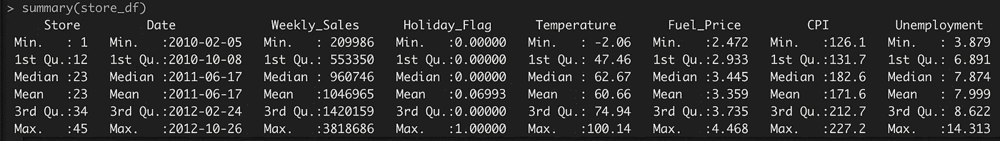
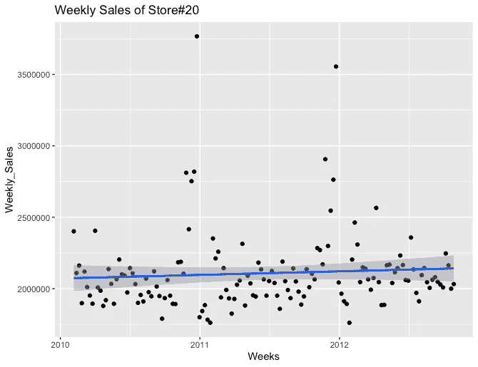
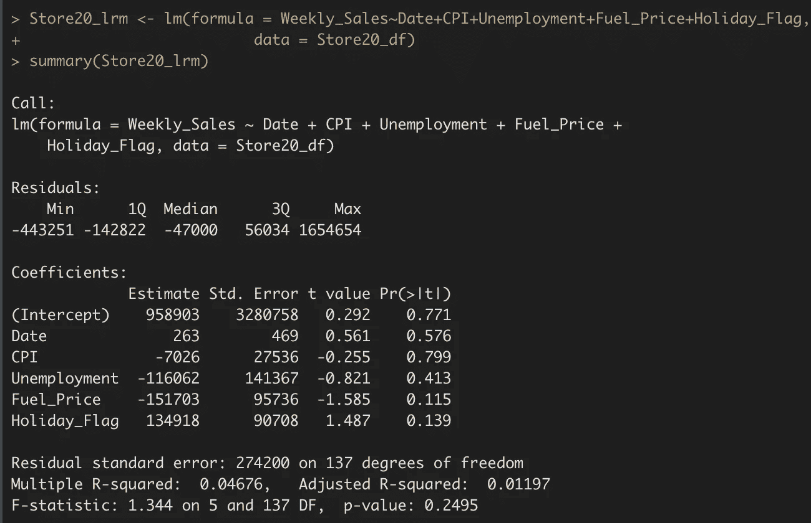
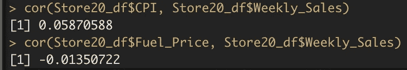
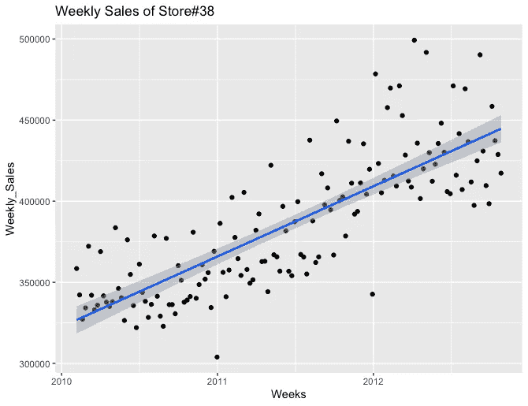
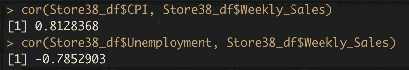
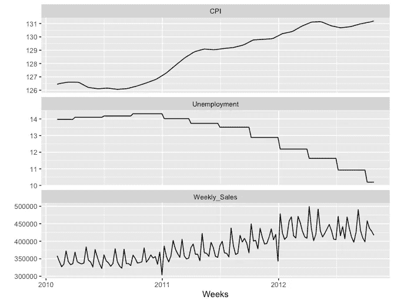
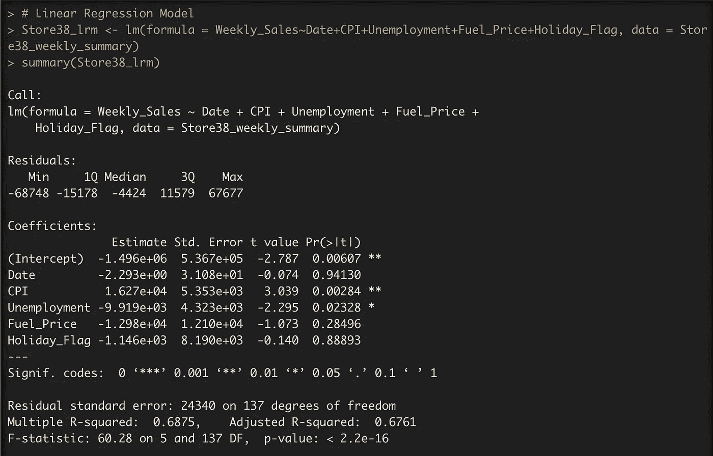

# 零售业中的数据科学——第二部分

> 原文：<https://medium.com/geekculture/data-sciences-in-retail-part-ii-42f07ed1b3bd?source=collection_archive---------17----------------------->

第一部分请点击 [*此处*](https://pspriyankasethi.medium.com/data-sciences-in-e-commerce-part-ii-81f1ab34cd01?source=post_settings_page-----81f1ab34cd01----0----------------------------) 。数据集请点击 [*此处*](https://github.com/pspriyankasethi/data-sciences/blob/master/DataSets/Retail/Store_sales.csv) 。

第一部分概要:
1。发现单个商店的销售贡献——表现最佳和表现不佳。
2。45 家商店中排名前 7 位的商店(15%)贡献了 30%的销售额，贡献几乎相同，对任何一家商店的任何影响都可能影响该零售连锁店的顶线。
3。45 家商店中有 15 家(33%)只贡献了总销售额的 15%左右，因此我们可能会调查原因。此外，如果 it 业务不可行，我们可以考虑合并位于中间位置的两家商店，或者培训表现不佳的商店的员工，或者关闭位于特定位置的商店。
4。表现最好的商店有很高的标准差(意味着他们的周销售额变化很大)，我们确认这是由于一年中的假日季节，尤其是圣诞节和感恩节期间。
5。我们还注意到，在圣诞节后的一周，顾客购买情绪出现了最高降幅，这种情况一直持续到整个 1 月份。

在这一部分，我们将尝试创建一个线性回归预测模型，以找出各种独立变量(如 CPI、失业率、燃料价格等)对商店销售的影响。此外，我们将尝试和预测未来的销售。让我们快速绘制一下所有商店的销售额:

1\. Summary of the Store Data

对所有商店数据的快速总结揭示了非常重要的见解。最小和最大日期证实了数据是从 2010 年到 2012 年的大约 3 年。
2。平均每周销售额约为 100 万美元。然而，商店的最低周销售额是平均销售额的 1/5(约 2.1 万美元)，最高周销售额是平均销售额的 4 倍(约 400 万美元)。这对于减少店面的供需缺口非常有用。(请注意，我们可以进一步细化每个商店的这些统计数据，以计算每个商店的确切数字。)
3。节假日平均值约为 0.069。但它是针对 45 家店的，暗指 0.069/45 = ~0.0015。如果结合第 1 部分和上述(第 2 点)见解，这是一个有趣的观察。一年中只有 0.2%的日子符合最高消费者购买情绪，即一年中最大的销售或营销活动。请注意，2012 年的感恩节和圣诞节尚未包括在内，因此我们可以预计它会略高于 0.2%。
4。温度范围是零下 2 度到 100 度。这些商店位于不同的地理位置，可能离得很远。
5。燃料价格从 2.472 英镑到 4.468 英镑不等。这一差异约为 81%,这是相当大的，并且可能是燃油价格较高的商店与燃油价格较低的商店相比销售额较低的原因。
6。消费者价格指数(或 CPI)是另一个重要的杠杆，我们可以注意到它的范围是 126.1-227.2，即 80%。如果这些地区的 CPI 较高，这可能是表现不佳的商店销售额较低的一个关键因素。
7。失业也是决定消费者购买情绪的一个重要因素。数据显示，其范围为 3.9-14.3，即这些地区的失业率比最低的地区高 367%。

让我们试着计算可能影响商店每周销售额的最重要的杠杆(在上述所有杠杆中)。出于演示目的，我们将选择表现最佳的 20 号店铺。我们假设:
H0:20 号店的周销售额取决于 CPI 和燃料价格独立变量。
H1:20 号店的周销售额不受 CPI 和燃油价格自变量的影响。
现在，我们用线性回归模型绘制 20 号店的散点图:

2\. Scatter plot of Weekly Sales of Store#20

该图显示，该商店的周销售额虽然最高，但却停滞不前。我们希望生成统计数字来找出不同独立变量对周销售额的影响。

3\. Linear Regression Model Statistics for Store#20

线性回归模型统计显示，在预测#20 商店的周销售额时，没有一个变量是显著的。我们还可以通过计算它们的相关性来证实这一点，相关性非常小:

4\. Correlation of Weekly Sales with CPI and Fuel Price for Store#20

我们可以使用线性回归模型预测这家商店未来的每周销售额，但这不是很有用，主要是因为相关性较小和销售停滞。所以，我们拒绝零假设 H0，接受替代假设 H1。

我们现在将挑选一家表现不佳的商店(比如 38 号商店),看看我们是否可以应用 LRM 来预测其周销售额:

5\. Scatter plot of Weekly Sales of Store#38

这是一个有趣的图表，原因有二:
1。它显示了周销售额是时间的函数，而
2。然而，在第一部分的分析中，该店的周销售额是最低的，销售额持续增长，这表明该店不是一家不良商店，而是一家比成熟商店更早开业的新商店。我们假设:
H0:38 号店的周销售额取决于 CPI 和失业自变量。
H1:38 号店的周销售额不受 CPI 和失业自变量的影响。
我们将计算这些变量与周销售额的相关性:

6\. Correlation of Weekly Sales with CPI and Unemployment for Store#38

CPI 和失业率与周销售额密切相关。我们现在可以绘制一个多变量时间序列，包括周销售额、CPI 和失业率。

7\. Multivariate Time Series for Store#38

我们可以清楚地看到，失业率逐年下降，商店的每周销售额也有所提高(负相关)。同样，时间序列显示，消费物价指数的增长正积极影响每周销售。这支持了我们的假设。现在，我们将计算商店的线性回归统计数据:

8\. Linear Regression Model for Store#38

在这种情况下，CPI 和失业率是最显著的因素。我们将在本系列的下一部分对此进行分析。

*未完待续……*

谢谢！

这里 可以找到 R 码 [*。*](https://github.com/pspriyankasethi/data-sciences/blob/master/Code/Retail/2.R)