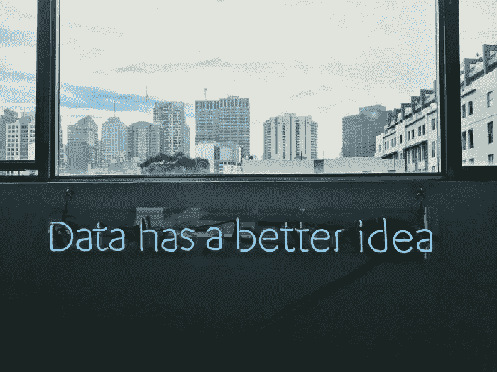

# 数据科学家:成为一名数据科学家我需要什么？

> 原文：<https://medium.com/geekculture/data-scientist-what-do-i-need-to-become-a-data-scientist-8184123c7b1d?source=collection_archive---------12----------------------->

Photo by [Franki Chamaki](https://unsplash.com/@franki?utm_source=unsplash&utm_medium=referral&utm_content=creditCopyText) on [Unsplash](https://unsplash.com/s/photos/data-science?utm_source=unsplash&utm_medium=referral&utm_content=creditCopyText)

为了回答这个问题，我想起了著名动画电影《料理鼠王》中 Ego 先生的一句话:

> 在这次活动之前，我从未掩饰过对食神 Gusteau 的座右铭“任何人都能做饭”的不屑。然而，我意识到只有现在我才明白他的话。不是每个人都能成为伟大的艺术家，但伟大的艺术家可以来自任何地方。