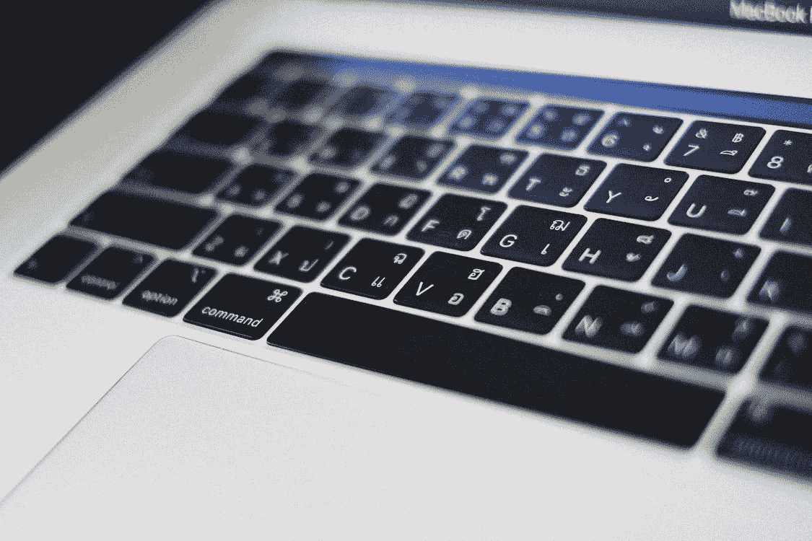

# 数据科学家需要警惕这些偏见

> 原文：<https://medium.com/geekculture/data-scientists-need-to-wary-of-these-biases-380e874e1518?source=collection_archive---------18----------------------->

## 介绍和解释不同类型的偏见

Source: Free for Use Image from [Pexels](https://www.pexels.com/ko-kr/photo/12484548/)

# 介绍

什么是偏见？偏见，在一般意义上是指我们对一个现象、人或概念的偏见或错误的定性。在数据科学的上下文中，偏差是“[模型预测与数据](https://www.mastersindatascience.org/learning/difference-between-bias-and-variance/)中目标值的差异量”。有…