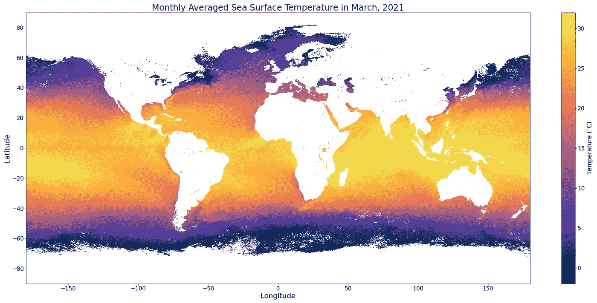
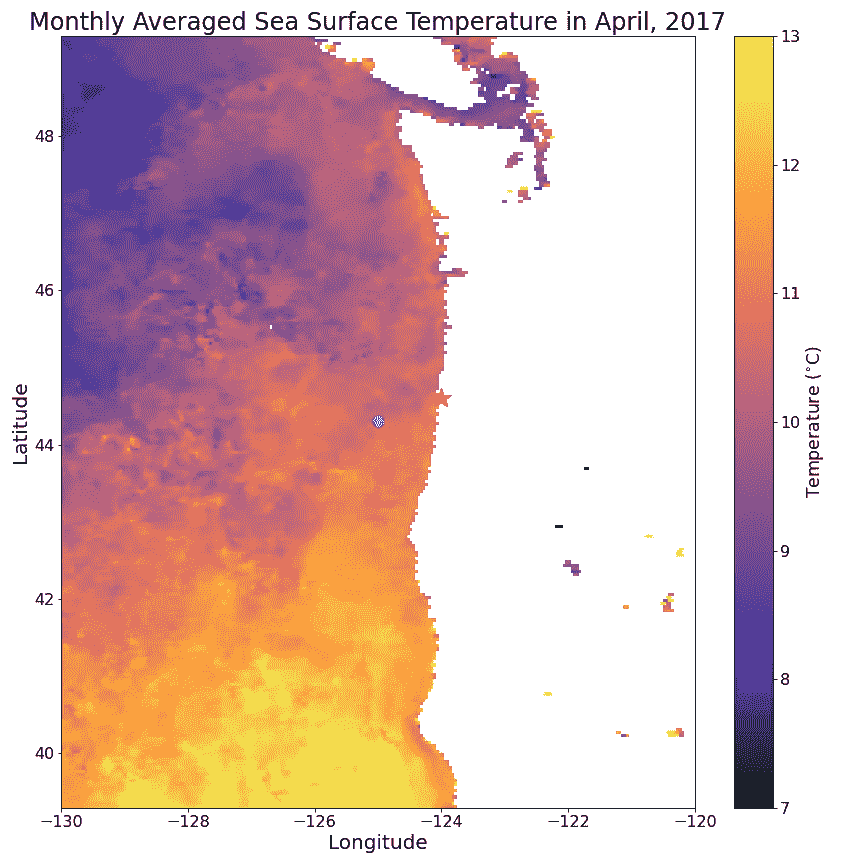
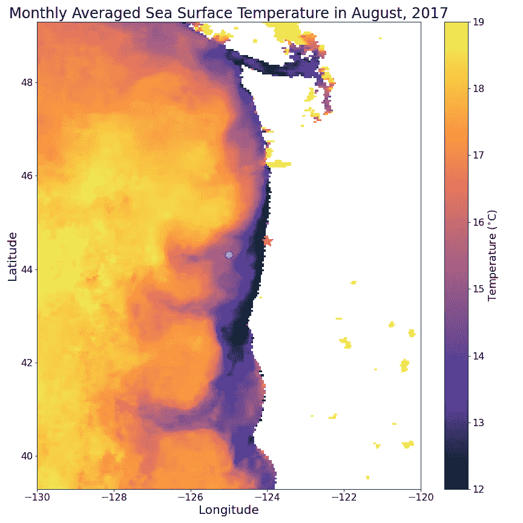
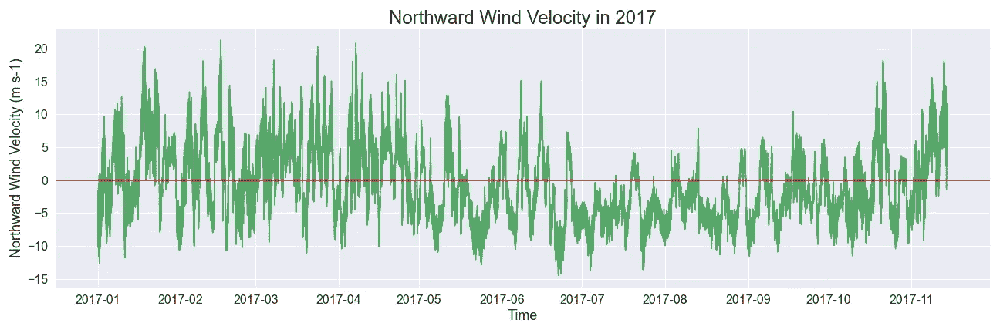
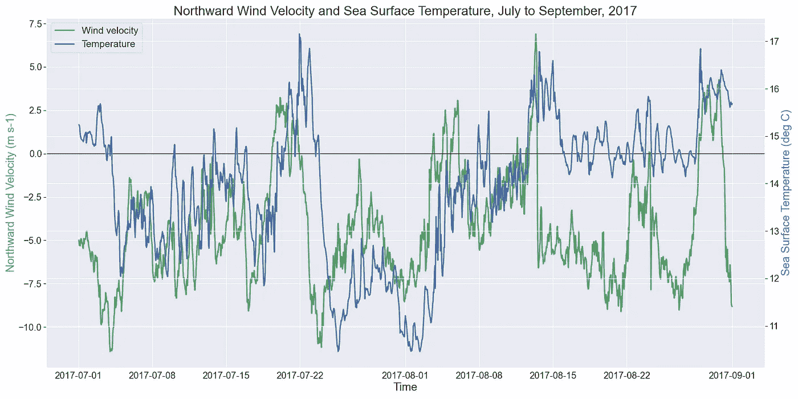
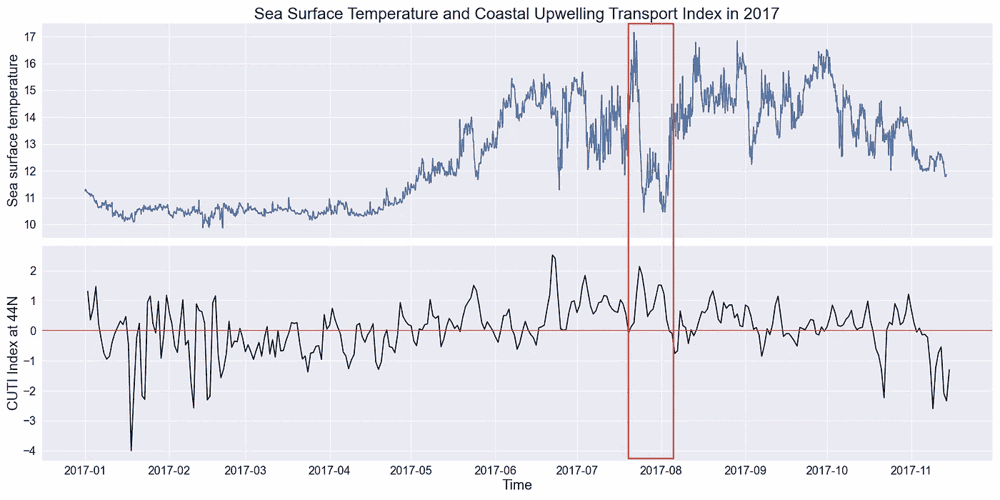

# 数据显示海岸涌升如何影响俄勒冈州的海面温度

> 原文：<https://medium.com/geekculture/data-shows-how-coastal-upwelling-affects-sea-surface-temperature-in-oregon-30761986eec9?source=collection_archive---------29----------------------->

## 数据科学顶点项目系列

## 顶石系列第 2 部分:海面数据分析

如果你曾经将冷牛奶倒入一杯热气腾腾的咖啡或茶中，你可能会注意到牛奶在开始混合之前会直接沉入底部。尽管比你的一杯咖啡大得多，但海洋的结构却大同小异:冰冷的海水沉入海底，在那里，它可能会作为深海洋流在海底潜行几个世纪，然后最终浮出水面。这篇文章是关于海洋温度的，所以这里有一个全球海面温度的快照，可以帮助你开始提出一些问题:

Monthly averaged sea surface temperature of the globe in March 2021, collected by the [NASA Aqua/MODIS satellite](https://neo.sci.gsfc.nasa.gov/view.php?datasetId=MYD28M). The white areas are landmasses, ice, and cloud cover, and the colored areas are sea surface temperatures. Yellow is warmer, and blue is colder.

以咖啡为例，当你对着咖啡吹气来冷却它时，你的呼吸会把饮料的表面推离你，更多的液体会从侧面和底部进入来代替它。这也发生在海洋中！当风沿着海岸线吹向正确的方向时，表层水被推离海岸，而深层海水向上移动取代。这被称为**海岸涌升**，我们可以在卫星图像中看到它的发生，如下图所示。

Monthly averaged sea surface temperature data off the coasts of Washington and Oregon collected by the [NASA Aqua/MODIS satellite](https://neo.sci.gsfc.nasa.gov/view.php?datasetId=MYD28M&year=2017). The white area is the west coast of North America, and the colored area is the Pacific Ocean, colored according to its temperature (yellow is warmer, blue is colder). The white circle is the OOI Oregon Offshore site that I’m studying, and the red star is Yaquina Bay at Newport, OR.

这些是俄勒冈海岸海面温度的地图；青色圆圈是我研究的 OOI 遗址之一所在的位置(下一步会有更多介绍)，红星是新港的亚奎纳湾。白色区域代表北美大陆，彩色区域是太平洋。第一组是 4 月份的，当时没有上升流发生。注意直接接触海岸的海水与远离海岸的海水温度相似。第二个面板显示了 8 月上升流条件下的海面温度变化:南风将表层水推离海岸，来自深海的**冷水向上移动以取代它**。因此，海岸周围的海水温度比公海温度低几度——brrr！这两个板块看起来如此不同，因为在俄勒冈海岸上升流季节性地发生，从晚春开始，在整个夏天强度和浓度都在增加，然后在秋天再次减少。

当海洋中的传感器记录到异常寒冷的海水温度时，我们也可以探测到沿海的上升流。例如，在过去的两个月里，我一直在查看海洋观测站倡议(OOI)沿海耐力阵列中一个名为俄勒冈州近海站点(上图中的青色圆圈)的站点的海水数据，该站点位于新港或俄勒冈州(上图中的红星)以西约 40 英里处。这个研究地点有一个表面系泊(像一个浮标)覆盖着传感器和电子设备，在**海气界面**收集大气和海洋学数据，并将其传输回陆地上的研究人员。

## 海面水温

利用这些表面系泊数据，我们可以绘制出 2017 年俄勒冈海岸的海面温度。我选择了 2017 年的数据，以避免 2014 年和 2019 年海洋热浪事件的任何信号。

Sea surface temperature off the coast of Oregon.

你可以很快观察到，冬天的温度很低，大约在 10–11°C 之间，而夏天会变暖。这种模式并不奇怪，因为它符合典型的北半球季节。接下来你可能会注意到，夏季的气温是多么的不稳定，尤其是与冬季的气温相比。比如 7 月中旬，海面水从 17.5℃的高位降到 11℃以下，冷到 1 月中旬！我的海洋学家大脑看着这个图，惊呼:“上升流！”但是我们怎么知道上升流真的导致了这些寒冷的温度峰值呢？

## 向北风速

沿海深水上升流是一个**风驱动的过程**，所以我们要考虑风速和风向来解释一些寒冷的海面测量。为此，我们转向海气界面浮标的“空气”部分。此处的图表显示了北/南方向的风数据-当风吹向北方时，值为正值，当风吹向南方时，值为负值。我加了一条红色的水平线，这样更容易看到风吹向哪个方向。

Northward wind velocity from the Oregon Offshore METBK package. The red horizontal line sits at 0 (no northward or southward blowing wind), positive values represent northward blowing wind, negative values represent southward blowing wind.

你应该注意到这个数据中也有季节性:夏天的风比冬天更容易往南吹。海洋学家知道**向南吹的风会在这个区域引起上升流**，所以我们预计这种季节性会与我们在海面温度数据中看到的趋势相匹配，事实也确实如此！

如果我们把这两条线一条接一条地画出来，放大到夏季的几个月，我们可以看到表层水的冷尖峰直接跟随强劲的南风而来。

Sea surface temperatures are shown in blue (right y-axis), and northward wind velocities are shown in green (left y-axis). The red line represents a northward wind velocity of 0.

然而，你可能会注意到这些趋势之间的滞后。这是因为尽管向北的风速是这一过程的主要驱动力，但它并不是上升流的完美指标。为了查看在该区域的任何一天是否有有利的上升流条件，我们可以检查[海岸上升流传输指数](https://oceanview.pfeg.noaa.gov/products/upwelling/cutibeuti)或 CUTI。

## 沿岸上升流输送指数

这个指数值是北美西海岸独有的，计算为上升流引起的水运动总量。幸运的是，CUTI 很容易解释:当它是积极的，有上升流；当它是负的，就有下降。数值越大，水的输送量越大。因此，如果我们在 CUTI 值的背景下查看海面温度数据，它们之间的一致性要比风数据好得多。

Top panel: sea surface temperature. Bottom panel: Coastal Upwelling Transport Index. Annual-scale trends are visible in both panels, and we can see short-lived upwelling events between May and November. The red box highlights one potential upwelling event: sustained positive CUTI values are aligned with a dramatic decrease in sea surface temperature.

在这个图中，希望大家可以看到，当 CUTI(下图)是一个较大的正值时，当天的海面温度(下图)急剧下降。我在一个潜在的上升流事件周围画了一个红框，但是如果你仔细观察，你可以在五月下旬、六月下旬、整个七月和八月，甚至到秋天看到类似的事件！

这项数据分析旨在使用这些数据建立一个机器学习模型，该模型可以根据海洋表面温度等环境变量来识别上升流。根据你在这里看到的图表，**，你认为一个模型可以仅通过观察水柱中几个位置的海水数据来判断上升流是否发生在某一天**？请在评论中告诉我你的想法！

我对这个问题的简短回答是肯定的，我的详细回答将在以后的帖子中给出。然而，仅使用水柱中的两个位置并不能向我们展示全貌，这就是为什么我将在下一篇文章中讨论由浅层剖面仪收集的水柱数据。

如果你想了解更多关于上升流和我的顶点项目，你可以阅读我以前的博客文章，关于[强风如何将水从深海带到海洋表面](/geekculture/classifying-coastal-upwelling-using-environmental-variables-8e648d909170)以及海洋中所有跟踪这种水运动的酷传感器。然后，请尽快回来查看更多的数据分析和我的模型结果。感谢阅读！

我用 Python 制作了这篇文章中的所有视觉效果；海面温度的[图和海面温度、风速、CUTI 数据](https://github.com/dgumustel/blog_visualizations/blob/main/SST/modis-sst.ipynb)的[线图见 GitHub。](https://github.com/dgumustel/coastal-upwelling/blob/main/notebooks/02_data_analysis_2017.ipynb)