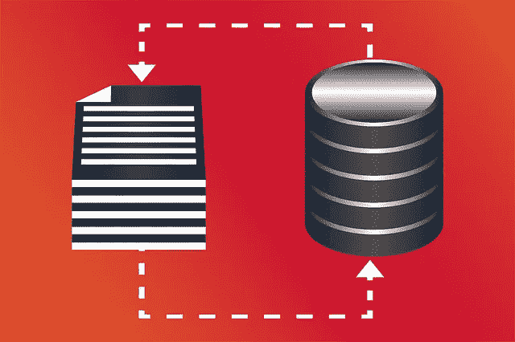

# 数据存储容量

> 原文：<https://medium.com/geekculture/data-storage-capacity-c1a881fb7f3b?source=collection_archive---------20----------------------->

# 介绍

数据存储始于 1880 年存储歌曲的黑胶唱片。它可以存储 200 兆字节的数据。但是，它不能重写数据&只能一次性使用。第一个磁带数据存储起源于 1947 年。这种磁带可以存储 60 MB 的数据，数据可以在同一磁带上多次重写。

第一个硬盘驱动器出现在 1957 年，名为 IBM 305 RAMAC。它可以存储 4 MB 数据，重量为 900 K.G. [硬盘可以实时写入&重写数据。](https://www.technologiesinindustry4.com/)第一款固态硬盘于 1991 年问世，具有 20 MB 的数据存储容量。这个驱动器没有移动部件&只有电子电路来写&重写数据无数次。

目前最大的可用硬盘容量是 16，000 GB &最大的可用固态硬盘容量是 8，000 GB。它们的尺寸是 3.5 英寸* 2 英寸，重量只有 500 克(半公斤)。

与 2020 年的 16，000 GB 相比，1991 年的 20 MB 容量仅为数据存储容量的 0.12 %。高速互联网、YouTube 视频、工业 4.0、人工智能和机器学习技术已经成为可能，因为今天有如此巨大的数据存储容量。

# 描述

数据存储容量讨论存储设备中可以保存多少数据。不同的存储设备有不同的容量。一些具有小的数据容量，而另一些具有巨大的数据容量。

储物室是一个家，我们把东西放在那里以保护自己

未来使用。数据存储指的是保存数据的设备。它通过输入输出(I/O)过程与计算机相关联。它允许计算机获取数据，无论是暂时的还是永久的。数据受到电磁或光学装置的保护。保存的数据可以用电脑保存。

# 数据存储的类型

数据备份有两种选择:

*   局部存储器
*   [远程存储](https://www.technologiesinindustry4.com/)

以下是本地存储下的存储类型。

**外置硬盘**

这就像安装在电脑上的硬盘。唯一不同的是，这个硬盘可能会被保留并从计算机中删除。

**固态硬盘(SSD**

它看起来像一个硬盘。虽然它内部没有活动部件。

**网络附加存储(NAS)**

这是一个或多个链接到网络集线器的固定 IDE 或 SATA 硬盘。

**u 盘或闪存盘**

[这与固态硬盘相当，但尺寸和容量都有所降低。](https://www.technologiesinindustry4.com/)

**光驱(CD / DVD)**

这种类型非常适合存储媒体和软件以供分发。

云存储是远程存储选项下的唯一类型。该存储空间可以从任何具有互联网连接的计算机中检索。

# 测量单位

*   数据存储量以字节为单位。
*   每个字节实际上是 8 位的模式。
*   位是数据存储的基本构件。
*   1 字节= 8 位(例如 10011011)
*   1 个半字节= 4 位(例如 1001)
*   每一位用 1 或 0 来表示。
*   这也被认为是二进制代码。
*   1 个字节可以包含 1 个字符的数据，例如，p 是 1 个字节。
*   所有较大的单位通常用它们的简称来表示。
*   因此，我们可以继续添加更多的前缀来谈论不断增长的数据。

# 我们需要这样的存储

在过去的几十年里，工具和技术进步如此之快。三十年前的主硬盘几乎只能存储几个现代 MP3 文件。如今，为个人笔记本电脑购买 1tb 外部硬盘存储的客户可能会存储 100，000 个这样的容量。

大软盘已经被小存储卡、 [USB 驱动器和各种便携式存储设备所取代。](https://www.technologiesinindustry4.com/)然而，普通用户可能不知道，全世界每天都在创建超过 2.5 万亿字节的数据。大部分数据都是在过去几年中形成的。

比特是最小的数据存储单位。我们开始讨论具有大量存储的解决方案，尽管企业的存储容量稍显不足。小企业拥有更多的自由。对于小型企业来说，将文件、图像或其他重要文档存储在 CD、USB 驱动器和低容量外置硬盘上可能就足够了。类似 Google Drive 和 Dropbox 的服务让我们可以在线存储文件。

数字存储需求；

*   [物理服务器](https://www.technologiesinindustry4.com/)
*   硬盘驱动器
*   电缆和其他需要储存的技术。

当企业开始需要存储 Pb、EB 甚至 zettabytes 的数据时，我们将需要大量硬件。权衡可供我们使用的不同方法的利弊是很重要的。同样，也可以选择依赖其他公司的资源，并将数据存储在云中。

更多详情请访问:[https://www . technologiesinindustry 4 . com/2021/12/data-storage-capacity . html](https://www.technologiesinindustry4.com/2021/12/data-storage-capacity.html)