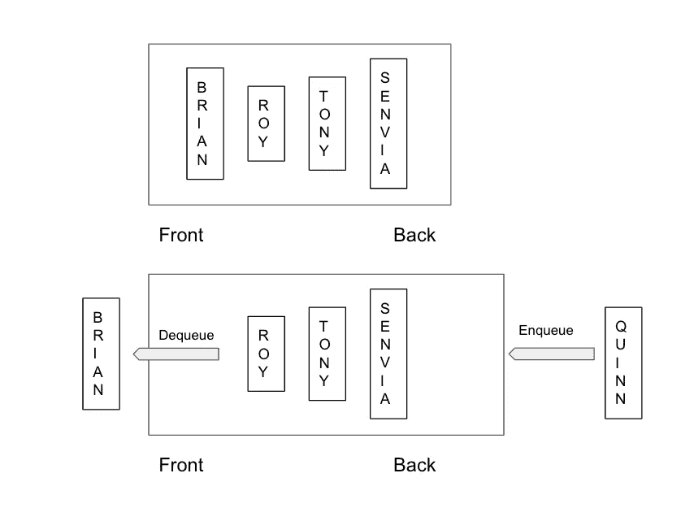

# Swift 中的数据结构:队列

> 原文：<https://medium.com/geekculture/data-structure-in-swift-queue-f859147e0d5c?source=collection_archive---------18----------------------->

让我们在 Swift 中摇滚另一个数据结构。排队！

Photo by [Melanie Pongratz](https://unsplash.com/@melanie_sophie?utm_source=medium&utm_medium=referral) on [Unsplash](https://unsplash.com?utm_source=medium&utm_medium=referral)

## 概观

队列是一个抽象的数据结构，代表现实世界中的队列，如上图所示。在计算机科学术语中，队列是 **FIFO** (先进先出)，这意味着进入队列的第一个数据也将是从队列中出来的第一个数据。如果必须保持数据的顺序，您可能需要使用 queue。

## 基本操作

首先，让我们在这里定义队列的基本协议

队列数据结构中有两种主要的操作，分别是*入队*和*出列。*我们还在该协议中定义了两个附加属性。

1.  入队
    这个操作是将新数据添加到队列的末尾。如果操作成功，此函数将返回 true。
2.  出列
    该操作是删除队列的第一个数据。如果队列不为空，那么它应该返回数据。
3.  isEmpty
    这个属性将检查队列是否为空。将返回布尔值。
4.  Peek
    这个属性将获取队列的第一个数据，而不删除它。

想象一下这样排队:

在队列的第一个状态中，有四个人在排队买电影票，他们是布莱恩、罗伊、托尼和森维亚。然后 Brian 已经得到了票，所以他将从队列中*出列*，将有一个新的人叫 Quinn，她将*入队*或插入队列。在这种状态下，队列不为空，如果我们调用 *peek* ，那么返回的人就是 Roy。希望你理解:】。

那么，我们如何在 Swift 中创建这种数据结构呢？基本上我们可以用四种方法创建队列。

1.  排列
2.  双向链表
3.  环形缓冲区
4.  两叠

但是在本文中，我将只使用数组实现来创建队列。让我们来看看代码。

## 履行

好了，我们创建了通用的 *QueueArray* 结构，并使其符合我们之前已经创建的*队列*协议。在它内部，我们使用 array 作为存储器，让数据*入队*和*出队*。那么对于 *isEmpty* 属性我们可以直接调用 *array.isEmpty* 来检查队列中是否有数据。对于 *peek，*因为它返回可选的，那么我们可以直接调用 *array.first* ，因为 *peek* 是返回队列中的第一个数据，而不是删除它。*入队*是将新数据插入队列的最后，然后我们可以调用 *array.append()* ，复杂度为 O(1)。然后对于*出列，*我们需要检查当前队列是否为空。如果它是空的，那么我们返回 nil，否则我们调用 array.removeFirst()。但是对于*出列*操作，它需要 O(N ),因为我们使用数组，如果我们删除数组中的第一个数据，我们需要将现有数据逐个移动到新的索引。如果我们有一个庞大的数据，那么不建议使用数组作为队列数据结构的存储。你可以尝试另一种创建队列的方法，比如双向链表，环形缓冲区，或者使用两个堆栈。

## 要点

1.  队列是 **FIFO** (先进先出)数据结构，这意味着添加到队列中的第一个数据将总是从队列中移除的第一个数据。
2.  如果需要保持数据的顺序，请使用 queue。你只需要在最后插入数据，然后删除第一个数据。你不关心它们之间的数据。
3.  如果你有一个巨大的数据集，不推荐使用数组来创建队列。因为当你调用*出列*操作时，复杂度为 O(N)。你可以考虑另一种选择，比如双向链表、环形缓冲区或者两个堆栈。