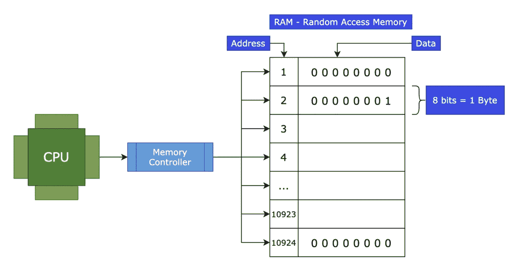
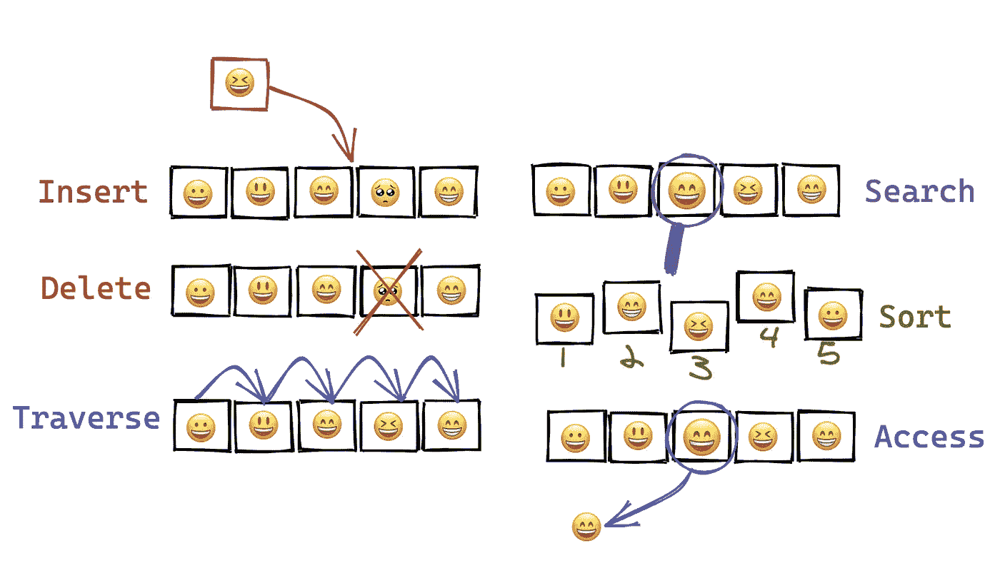

# JavaScript 数据结构

> 原文：<https://medium.com/geekculture/data-structure-with-javascript-2d3791598453?source=collection_archive---------13----------------------->

Different Containers to Hold Different Things — [Cupboard](https://www.dreamstime.com/stock-illustration-open-wardrobe-wooden-closet-tidy-clothes-shirts-sweaters-boxes-shoes-home-interior-flat-design-vector-illustration-image61956070) for clothes, [Cabinet](http://clipart-library.com/clipart/2043957.htm) for Files, [Book Case](http://clipart-library.com/bookshelf-cliparts.html), [Suitcase](http://clipart-library.com/packing-cliparts.html) for packing items while travelling, and [Fridge](http://clipart-library.com/clipart/fridge-cliparts_13.htm) for Clothes.

在现实生活中，我们有装食物(冰箱)、文件(文件夹/文件柜)、玩具(包装盒)或衣服(橱柜)的容器。每个容器都是特定的。我们不会把文件放在包装箱里，因为它们会碎掉。这是我们整理物品的一种方式，这样我们就可以轻松地回去拿回它们*。*

*类似地，我们将数据放入数据结构中，并从数据结构中检索它们——仅此而已。*

*就像在现实生活中一样，编程中也有[吨的数据结构](https://en.wikipedia.org/wiki/List_of_data_structures)。*

# *数据结构导论*

*数据结构是值的集合，这些值之间可以有关系，它们可以应用函数。*

*每一个都有不同的功能和用途。*

*一个知道数据结构和算法如何工作以及如何使用它们的人可以写出很棒的程序。*

> *`Data Structure + Algorithms = Programs`*

*这些是永恒的。无论你使用什么编程语言，它的底层都是数据结构和算法。*

# *理解数据结构*

*理解数据结构有两个部分*

1.  *怎么建一个？*
2.  *怎么用一个？*

*第二点比第一点更重要，因为数据结构通常只是工具，大多数时候它们已经为我们预先构建好了。基于我们的需求，我们确定一个我们想要使用的。*

# *计算机如何存储数据*

*为了运行代码，计算机需要跟踪变量、数字、字符串或数组。这些变量存储在随机存取存储器(RAM)中。*

*我们还有储物空间，可以存放视频、音乐和文档等物品。这种存储可以是磁盘驱动器、闪存驱动器或固态驱动器。*

*计算机由它的 CPU 运行，CPU 负责所有的计算。它需要访问 RAM 和存储，但访问 RAM 及其信息的速度比访问存储要快。*

## ***随机存取存储器***

> *对于主动学习检查[寄存器和 RAM:速成计算机科学#6](https://www.youtube.com/watch?v=fpnE6UAfbtU) 。看过视频的可以跳过下面的解释。*

*计算机中的 RAM 是一个海量的存储区域(就像数据结构一样)。这个巨大的储藏区有编号的架子。它们被称为地址。*

**

*Random Access Memory*

*每个架子容纳 8 位(1 和 0)。比特是一个微小的电子开关，可以打开或关闭。8 位称为一个字节。[每个货架有一个字节的存储空间](https://stackoverflow.com/questions/21300929/how-many-characters-can-you-store-with-1-byte/56721054#56721054)。*

*CPU 连接到一个*内存控制器*，该控制器进行 RAM 的读/写操作。**内存控制器直接连接到每个机架。因此，访问 0、7 或 10781 架并不意味着它必须爬上或跨过这些架。这就是随机存取存储器这个名字的含义。***

*我们可以很快地访问内存，因为我们有这些连接。我们需要知道我们要找的是哪个书架，我们可以立即访问内存中任意随机地址的位！*

*即使这个内存控制器可以在相距很远的内存地址之间快速跳转，程序还是倾向于访问附近的内存。信息离 CPU 越近，传输的信息越少，程序运行的速度就越快。例如，在 0 和 1 位置访问内存仍然比在 0 和 1000 位置访问要快。*

*为了进一步优化，CPU 具有存储最近使用的数据的高速缓冲存储器。*

## ***存储数据的知识和数据结构有什么关系？***

*数据结构是数据的排列。我们的目标是尽量减少 CPU 获取信息的操作。这就是数据结构如此强大的原因。*

*我们现在有一种方法来思考数据结构实际上如何影响我们计算机的处理，以及我们如何利用我们对计算机的了解来编写伟大的代码。*

# *数据结构操作*

*在进入数据结构之前，让我们看看可以在不同的数据结构上执行的操作。*

**

*Operations on Data Structure (Made using [Excalidraw](https://excalidraw.com/))*

*   *插入—在给定的项目集合中添加数据。*
*   *删除—从我们的列表中删除数据。*
*   *遍历—对每个数据项只访问一次，以便可以对其进行处理*
*   *搜索—如果数据项存在于给定的集合中，找出它的位置。*
*   *排序——根据给定的信息排列数据。*
*   *访问—获取具有某些给定信息的数据。*

# *使用 JavaScript 的数据结构*

**

*Beginning of Data Structure with JavaScript*

*在数据结构中，我们将涉及:*

1.  *[数组](https://darshnarekha09.medium.com/ds-with-js-arrays-11e9e5e4db6a)*
2.  *[哈希表](https://darshnarekha09.medium.com/ds-with-js-hash-tables-f8fec13ad12a)*
3.  *[链表](https://darshnarekha09.medium.com/ds-with-js-linked-lists-1062e386ae26)*
4.  *[堆栈&队列](https://darshnarekha09.medium.com/ds-with-js-stacks-queues-10ceb9830efb)*
5.  *树*
6.  *图表*

*在接下来的系列文章中，我们将介绍简短的介绍、复杂性、JavaScript 实现，以及它们各自的优缺点。*