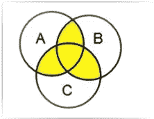
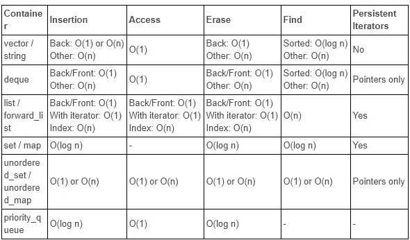

# 数据结构:多集合 vs 集合 vs 无序集合

> 原文：<https://medium.com/geekculture/data-structures-multi-set-vs-set-vs-unordered-set-bcc4f6609ac9?source=collection_archive---------13----------------------->

These data structures have something or the other in common within themselves

你对这些数据结构之间的区别感到困惑吗？那我们就让你步入正轨吧！

在今天的小帖子中，我将列出它们的大部分差异及其实现。我还会在文章的最后附上一张包含不同数据结构的时间复杂度的图片。

首先，让我说明一下，我将遵循 C++编程语言。因此，名称和一些属性、方法和时间复杂性可能会因其实现的不同而有所不同。

所以，让我们开始吧，不要再废话了！

> 简单来说:
> **Set** 是一个存储 ***排序和唯一*** 元素的容器。
> ***Unordered _ set***难道**不排序**并存储**唯一的**元素。
> *多 _ 集可以有*的重复元素但是是**。
> 我们还有****Unordered _ multiset、*** *其中可以有****duplicates****但是就是* ***没有排序*** *。****

**所以，所有这些都有这样或那样的共同点。**

# **1)设置**

> **按照**排序的**顺序存储数值。
> 仅存储**唯一的**值。
> 只能插入或删除元素，而**不能修改**。
> 实现为**二叉查找树**。**

# **2)无序集**

> **元素**未按顺序存储**。
> 存储**唯一的**值。
> 实现为**散列表**，用于存储元素。
> 所有其他属性类似于集合。**

# **3)多组**

> **按照**排序的**顺序存储元素。允许存储**重复元素**。
> C++标准没有规定 multi_set 的实现，但是 **GCC** 将其实现为**红黑树**，这允许更快的查找、插入和删除。所有其他属性类似于 set。**

# **4)无序多重集**

> **元素没有按顺序排序。
> **可以存储重复的元素**。
> 实现为**散列表**，用于存储元素。
> 所有其他属性类似于 set。**

**现在你可能会想“vector 和 unordered_multiset 有什么区别？?"阅读[这个关于堆栈溢出的答案](https://stackoverflow.com/questions/33193269/usecases-for-stdunordered-multiset)可以清楚地了解这个问题。**

****开门见山**:所有这些关联数据结构在大多数情况下都提供了更快的查找、删除和插入，因为它们是基于哈希表和二分搜索法树实现的。**

**现在是时间复杂性的时候了，这是我们在编码时最关心的。这张图片包含了其中的大部分:**

****

**我希望你从今天的帖子中学到了一些东西。如果你也想让我写其他数据结构，请告诉我。请在评论区告诉我。此外，如果我写错了什么或错过了什么，请随时分享。**

**你可以看看我其他的一些帖子:**

**[我编写了一个脚本来下载 Google Drive](https://mohithgupta.medium.com/how-i-coded-a-script-to-download-the-download-restricted-files-of-google-drive-718e74c55a68?source=your_stories_page-------------------------------------)
[的“下载受限”文件，只需点击一下](https://python.plainenglish.io/play-youtube-videos-in-vlc-with-just-1-click-2baca84c03f3)
[转换你的就可以在 VLC 播放 YouTube 视频。py '到 a '。exe '文件，只包含两个命令](https://python.plainenglish.io/convert-your-py-to-exe-with-just-2-commands-4c6cefe9af4c)
[关于 JavaScript 中的“获取 API”](https://javascript.plainenglish.io/all-you-need-to-know-about-the-fetch-api-6929930572a8)**

**在评论区分享你的想法。如有任何疑问或其他问题，你可以在 mohithgupta@gmail.com 联系我，或者在推特上找到我。**

**今天到此为止，Arigato for reading :) Sayonara！下一集再见！**