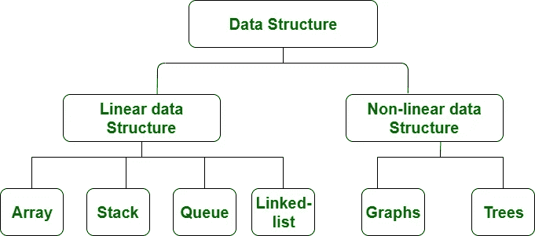
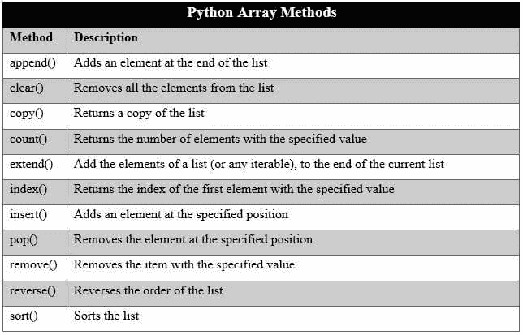
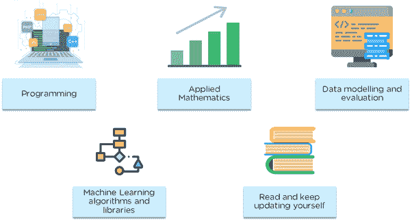
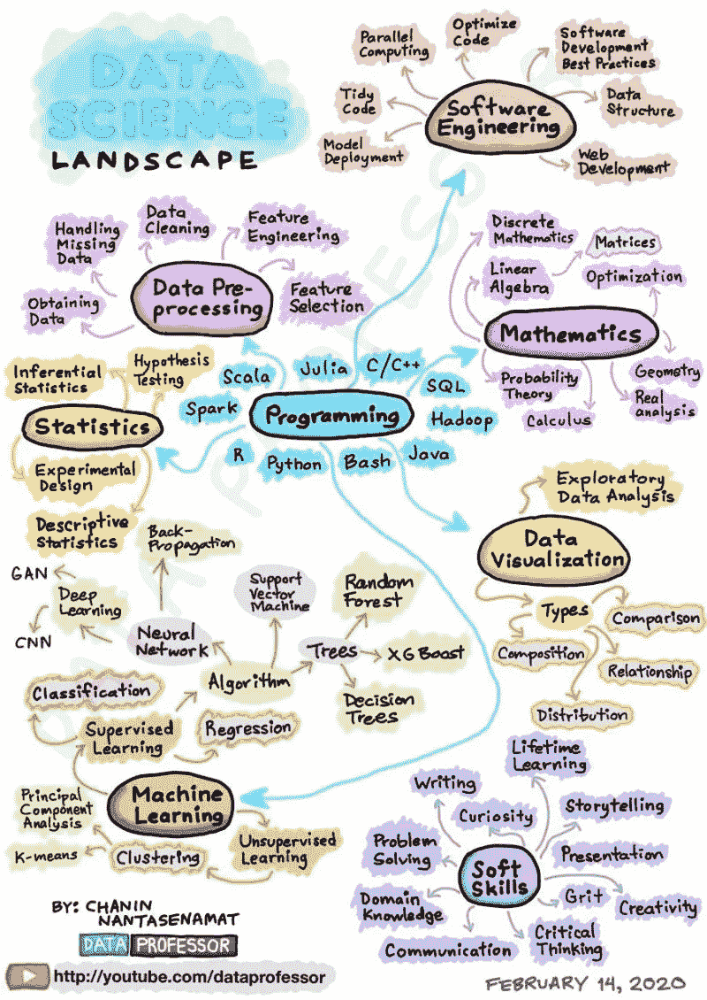

# 数据科学和机器学习算法现在需要的数据结构

> 原文：<https://medium.com/geekculture/data-structures-you-need-now-for-machine-learning-algorithms-32fada12be64?source=collection_archive---------12----------------------->

在过去的几年里，我注意到追求数据科学/机器学习技能的学生数量激增，然而他们只知道 Python 中的包。这不是真正的机器学习。你必须了解理论。即便如此，拥有机器学习技能也是不够的。光知道理论是不够的。你需要良好的数据结构工作知识。也许你想知道我从哪里开始？我最需要什么？具体来说，我将专注于我在 Python 中使用最多的编程机器学习算法的数据结构。

首先，你需要知道一些基本知识。有两种不同类型的数据结构:线性和非线性。

Image by GeeksforGeeks

# 线性数据结构

定义:一种数据结构，它以有序的方式排列数据项，其中元素相邻连接。

## 排列

数组是最基本和最常见的数据结构。你会在机器学习中不断使用数组，无论是:

*   将熊猫数据帧中的一列转化为列表，用于预处理或分析
*   使用元组数组对数据集中出现的单词的频率进行排序
*   使用标记化单词列表开始主题聚类
*   为单词嵌入创建多维矩阵
*   还有更多…！

每个元素都可以通过它们在数组中的索引来唯一标识。最低索引是 arr[0]，对应于第一个元素，最高索引对应于最后一个元素。

Python has a set of built-in methods that you can use on lists/arrays.

现在，Python 数组与其他编程语言中的数组略有不同。 **Python 的“列表”比数组提供了更多的灵活性**，因为它们可以包含**不同类型的数据，并且它们的长度可以变化。**如果你正在用 Python 为你的机器学习算法编程，我 ***高度*** 推荐你从非常*熟悉使用数组开始。*

## *堆栈和队列*

*栈是用来为你的撤销和重做按钮编程的，因为它们的功能就像一堆书。将一本书添加到堆栈的底部(第一个元素)是没有意义的。不可能的。您只能检查最近添加的内容。添加和移除发生在栈顶。就当是后进先出(LIFO)吧。*

*队列的工作方式不同。它们是先进先出(FIFO)结构。把它想象成人们站着排队等候。先到先得。然而，Python 中的队列数据结构有三种类型:FIFO、LIFO(堆栈)和优先级队列。在优先级队列中，元素保持排序，最低值的元素先出。*

*SimpleQueue()是无界的，而 Queue()可以有上限。*

*队列对象(Queue、LifoQueue、SimpleQueue 或 PriorityQueue)提供下列公共方法:*

*   *queue . qsize()-返回队列的大小*
*   *Queue.empty() —如果队列为空，则返回 True，否则返回 False*
*   *Queue.full() —如果队列已满，则返回 True，否则返回 False*
*   *Queue.put( *项目* ) —将*项目*放入队列中*
*   *Queue.get() —从队列中移除并返回项目*

*Python 中队列模块最有趣的地方是它如何用于**多线程。**这个概念是 ***对机器学习非常有用*** ，因为数据收集、网页抓取和常见的预处理任务通常可能是时间密集型的。多线程和多处理的最有效使用是优化和比较不同的并行范例，以最大限度地提高机器学习算法的效率。*

*下面是一个如何对队列使用多线程的示例，其中函数“worker”同时运行了 30 次。*

*队列是机器学习的重要资源，用于:*

*   *管理网站列表以收集数据*
*   *将文档排队以进行数据解析*
*   *在有组织的文件系统中处理大量数据(不在文档上重复处理)*
*   *还有更多…！*

*如果数据类型很大，构建队列会耗尽内存。如果您正在考虑使用任务生成速度快于完成速度的队列，我建议您使用线程安全队列，该队列在磁盘上对项目进行排队，并有一个可选的内存缓冲区。如果你对使用队列感兴趣并且很认真，但是又想节省内存，可以看看这个 GitHub:[https://github.com/GP89/FileQueue](https://github.com/GP89/FileQueue)。*

*对于新的程序员，我建议尝试 LeetCode easy questions 来获得一些关于队列的实践，然后尝试使用 PriorityQueue 来解决这个问题[https://leetcode.com/problems/task-scheduler/](https://leetcode.com/problems/task-scheduler/)。*

*有趣的事实:* *你总是可以使用 Python 列表实现你自己的队列类！***

## *链表*

*链表是一个节点序列，其中每个节点只是一个包含一个值和指向下一个值的指针的对象。也有双向链表，其中每个节点包含下一个和前一个节点的地址。*

**

*Image by GeeksforGeeks*

*在数据科学和机器学习中，链表最适合在常数 O(1)时间内将大量数据插入到一个列表中，尤其是当你不知道列表中会有多少项的时候。但是，您必须确保不需要随机访问任何元素。*

*使用链表的另一个好处是我们不需要相邻的空间需求，因为节点可以在内存中的任何地方。对于常规数组(Python list)，节点必须作为一个内存序列来分配。*

# *非线性数据结构*

## *地图(Python 中的键字典)*

*绝对是最有名的数据结构，maps(Java 中的 HashMap，Python 中的 dictionaries，C++中的 unordered_map 等等。)是在算法中尝试最小化运行时间时的首选。*

*Python 中的字典在数据科学和机器学习中非常有用，因为许多函数和算法都会返回字典。在 Python 中，它们通常用于映射每个键有多个值的键/值对。换句话说，键被映射到集合和列表。这对于多维度(25、50、100、200 等)的单词嵌入非常有用。*

*唯一的规则是每个键必须是唯一的(如果不是，它将被覆盖)，并且没有特定的顺序(它们没有排序)。*

*在实现稀疏矩阵(在机器学习中非常常见)时，字典也很有帮助。稀疏性指的是包含大部分零值(较少成对交互)的矩阵，不同于大部分值非零的密集矩阵。这个概念在网络理论中很有用，我在自然语言处理中碰到过很多稀疏矩阵*。几乎每一种独热编码技术都会产生稀疏矢量。**

**使用标准矩阵结构(2D 阵列)将意味着处理和宝贵的内存浪费在零上。通常使用列表的列表，但是仍然浪费内存。然而，字典也可以拯救世界！对于键，我们可以使用包含矩阵的行号和列号的元组，值将表示矩阵中的实际值。**

## **图表**

****

**Visualization of a paper citation network**

**到目前为止，网络理论是我在数据科学旅程中学习的最有趣的东西之一。使用 networkx 包和使用 Gephi 进行可视化让我爱上了图形，特别是因为它们可以很容易地作为 Python 字典加载，其中的键是一个节点，值表示该节点连接的所有节点。这使得查找节点间的最短路径变得极其容易。图形是一种非常优雅的数据结构，它可以提供惊人的可视化效果，并从所有类型的数据中收集真实信息，甚至是文本。**

**我真的建议在接受 networkx 包之前先深入图论。然后，尝试用网络抓取或使用 Kaggle 上的数据集，基于你的 tweet 数据建立一个社交网络图！**

**数据科学和机器学习的目标是提供新的见解。计算机继续以人类无法独自完成的方式学习和发现模式。对于人类来说，图表是超越视觉能力的一种很好的方式，也是发现和看到人类生活各个方面的联系的一种很好的方式。**

**图形可以加载到各种算法中，特别是神经网络，在神经网络中可以执行回归、分类和聚类等任务。**

**这里有一些图形在机器学习中用来解决实际问题的漂亮方法:**

*   **知识图表**
*   **社交网络图**
*   **关键词图**

**我实现了一个基于 twitter 数据的关键字图，并将其用于节点分类和社区检测，以便预测/假设一个潜在事件的摘要，这是迄今为止我在机器学习中最有趣的事情。**

**我还能够通过应用中心性测量，使用社交网络图来定位影响者。**

**如果你对图形能做的所有美丽的事情感兴趣，我鼓励你阅读关于图形机器学习的文章，并查看这个详细的分类。**

## **树**

****

**Image by GeeksforGeeks**

**上面是一个二叉树，每个节点最多可以有两个子节点。在树中还有一个独特的节点叫做“根”(树的开始)。与图形不同，树中也不可能有循环。**

**决策树非常适合分类和回归任务，因为它们能够捕捉复杂的非线性关系。然而，他们确实记住了数据中存在的噪音。**

**你 ***必须*** 理解你的第一个机器学习模型(通常是基于分类和回归)的树的结构。知道如何修剪一棵树有助于减少过度拟合，并将改善您的模型。**

# **结论**

**数据结构是编程的重要组成部分，编程是数据科学和机器学习的基本技能。你必须从某个地方开始。声称自己是数据科学家或机器学习工程师是不够的，然而在试图解决/分析问题时，你在选择适当的数据结构方面毫无经验。**

**要成为最好的 ML/AI 专业人士，你需要的不仅仅是理论。下面是一个简单的图表，展示了实现这一目标所需的技能:**

****

**Image by Quora**

**注意编程是第一个。如果你对所涉及的数据结构没有很好的理解，你就不能有效地实现你的任何想法。你可以边走边学，把时间浪费在试错上，或者参加一门严肃的数据结构和算法课程，这门课程会给你适当的工具，让你先思考问题。[这里](https://www.codespaces.com/best-data-structures-and-algorithms-courses-classes.html)是 2021 年最佳的链接。**

****

**以上是数据科学所需技能的更详细的可视化。注意机器学习是如何在这个范围内的。请注意整个分支是如何致力于数据预处理、数据可视化、统计和数学的。数据科学是一项需要多年发展的职业。它不仅仅包括知道如何使用 Python 包。它们如此受重视而又难以找到是有原因的。许多人声称拥有技能，但实际上并没有发展出正确的技能，他们也不明白真正成为一名数据科学家意味着什么。**

**如果你刚刚开始，尝试预处理和收集数据。做一些有趣的网络搜集项目。在了解如何使用和操作提供的数据集之后，学习如何自己收集数据。然后，确保你知道你的数据结构。因为如果你不这样做，你将是第一个被淘汰出面试程序的人。但是不要气馁。学的时间那么多，也不急。这一代人每分钟都在前进，消耗信息的速度太快了。给你的大脑时间去处理。就像你的模特需要时间训练一样，你也是。接受这个事实，并以正确的速度前进。在你对数据结构有了深刻的理解之前，不要离开它们。**

**祝你机器学习之旅好运，编码快乐！**

## **来源:**

 **[## queue -一个同步的队列类- Python 3.9.6 文档

### 源代码:Lib/queue.py 该模块实现了多生产者、多消费者队列。它在…方面特别有用

docs.python.org](https://docs.python.org/3/library/queue.html)** ** [## 线性和非线性数据结构的区别

### 线性数据结构:数据元素顺序排列或线性排列的数据结构

www.geeksforgeeks.org](https://www.geeksforgeeks.org/difference-between-linear-and-non-linear-data-structures/)**