# JavaScript 中的数据类型和数据类型转换

> 原文：<https://medium.com/geekculture/data-types-and-data-types-converting-in-javascript-f59dda6928ba?source=collection_archive---------3----------------------->


> 数据类型指定了程序中可以存储和操作的数据类型。在 JavaScript 中，数据类型分为两部分。 **原始数据类型** *和* **引用数据类型** *。这些数据类型被细分为几种类型。*

> *原始数据类型有* **字符串、数字、布尔、空、未定义、符号** *。众所周知，字符串是用来表示* ***文本*** *的。数字* *用来表示* **数字** *，布尔用来表示******【假】** *，空用来表示变量* **【没有值】** *，未定义用来表示* **不定变量*****
> 
> ****参考数据类型是在对象内创建的数据类型。这些是* **数组、对象、函数、日期等。*****

***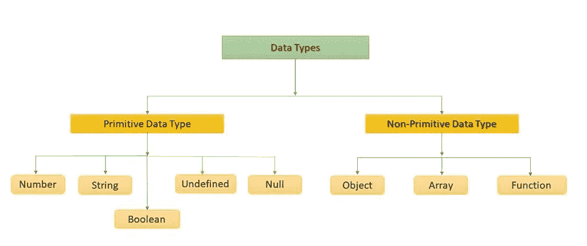***

# ***原始数据类型。***

*****字符串数据类型。*****

> ****字符串是用引号写的。您可以使用单引号或双引号。字符串(或文本字符串)是一系列字符。示例:****

```
*const str = "JavaScript";
console.log(typeof str);*
```

***上述示例的算法如下。首先，我们创建一个名为***【str】***的变量。然后我们给那个变量赋值***【JavaScript】***。在第二部分中，用***【type of】***命令，我们打印出变量的类型，其名称为*【str】*，其值为***【JavaScript】***。如果我们在浏览器中打开控制台，我们会看到字符串打印在屏幕上。***

***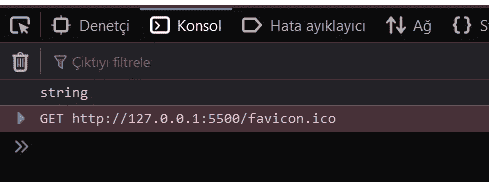***

> ****我们说过，在 JavaScript 中字符串是用引号写的。有时我们想在引号内使用引号。但在这种情况下，我们面临一个问题。我们的字符串值不能在浏览器端读取。让我们通过代码把问题解释清楚。****

```
*const str = "JavaScript and "Data Types" ";
console.log(str);*
```

***如果我们“运行”我们的代码，我们将在浏览器控制台中遇到一个错误。为了避免这种错误，Js 开发人员找到了如下解决方案。***

```
*const str = "Javascript and 'Data Types' ";
console.log(str);*
```

***还有，***

```
*const str = 'JavaScript and "Data Types" ';
console.log(str);*
```

# ***数字数据类型。***

> ***JavaScript 只有一种类型的数字。数字可以用小数书写，也可以不用小数。***

```
*const nmbr = 20;
console.log(typeof nmbr);*
```

***我们代码的算法与字符串数据类型相同，如果我们 ***【运行】*** 我们的代码，我们可以看到 ***【数字】*** 被打印在我们浏览器的控制台部分。***

***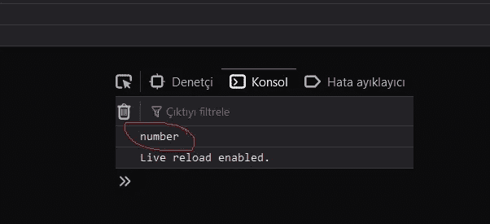***

***超大或极小的数字可以用科学(指数)符号来表示。***

```
*const nmbr = 123e5;
console.log(nmbr);*
```

***它与，***

```
*const nmbr = 12300000;
console.log(nmbr);*
```

# ***布尔数据类型。***

> ****布尔值只能有两个值:* **真** *或* **假** *。****

```
*const bln = true;
console.log(typeof bln);*
```

***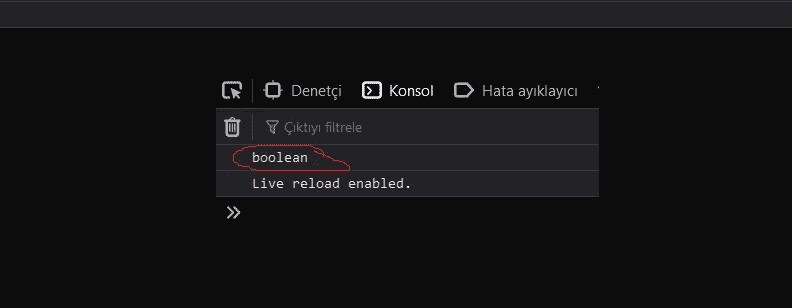***

***布尔经常在条件测试中使用。***

```
*const x = 15;
const y = 15;
console.log(x==y);*
```

***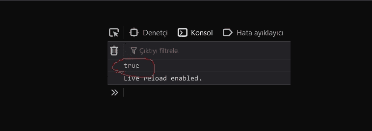***

***If the result of our operation is correct, it returns true.***

```
*const x = 15;
const y = 14;
console.log(x==y);*
```

***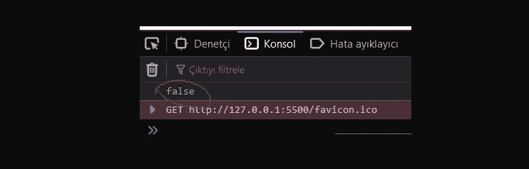***

***If the result of our operation is incorrect, it returns false.***

# ***空数据类型。***

> ****在 JavaScript 中 null 是* **【无】** *。应该是不存在的东西。不幸的是，在 JavaScript 中，null 的数据类型是一个对象。你可以认为这是 JavaScript 中的一个 bug，null 的类型是一个对象。它应该为空。****

```
*var nll = null;
console.log(typeof nll);*
```

******

# ***未定义的数据类型。***

> ****在 JavaScript 中，没有值的变量，其值是未定义的。该类型也未定义。****

```
*var undf;
console.log(typeof undf);*
```

******

# ***未定义数据类型和空数据类型的区别。***

> ***Undefined 和 null 值相等，但类型不同。***

```
*typeof undefined           // undefined
typeof null                // objectnull === undefined         // false
null == undefined          // true*
```

# ***引用数据类型。***

***数组数据类型。***

> ****JavaScript 数组是用方括号写的。数组项用逗号分隔。数组索引是从零开始的，这意味着第一项是[0]，第二项是[1]，依此类推。****

```
*var programmingLanguage = ["C", "C++", "R"];
console.log(programmingLanguage);*
```

***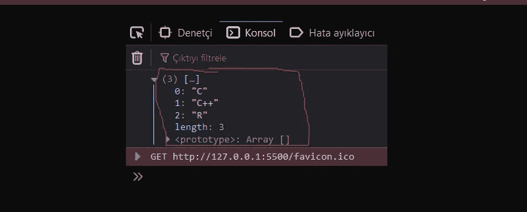***

***对象和符号数据类型。***

> ****符号类型用于创建对象的唯一标识符。为了完整起见，我们必须在这里提到它，但也要等到我们了解对象之后再谈细节。JavaScript 对象是用花括号* **{}** *写的。对象属性以名称:值对的形式书写，用逗号分隔。****

```
*var person = { firstName: "Mehdi", lastName: "Huseyn", age: 111, eyeColor: "blue" };console.log(person);*
```

***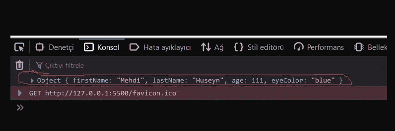***

## ***函数数据类型。***

> ***函数是 JavaScript 的基本构件之一。JavaScript 中的函数类似于过程——一组执行任务或计算值的语句，但是对于一个有资格成为函数的过程，它应该接受一些输入并返回一个输出，其中输入和输出之间有一些明显的关系。要使用一个函数，你必须在你希望调用它的范围内的某个地方定义它。函数定义(也称为函数声明或函数语句)由 function 关键字组成，后跟:
> 1)函数名。2)函数的参数列表，用括号括起来，并用逗号分隔。3)定义函数的 JavaScript 语句，用花括号括起来，{…}。例如，下面的代码定义了一个名为 cubic 的简单函数。***

```
*function cubic(number) {
    return number * number * number;
}
console.log(cubic(3));// Output is: 3*3*3=27;*
```

***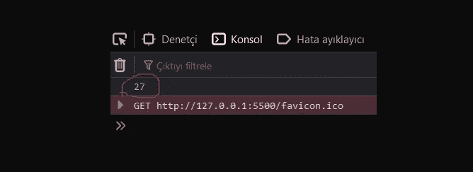***

> ****函数立方取一个* **参数** *，称为* **号** *。该函数由一个语句组成，该语句返回该函数的参数(即数字)乘以自身两次。语句 return 指定函数返回的值。****

# ***数据类型转换。***

***数字→字符串***

```
*var nmbr = 5;
console.log(typeof nmbr);
nmbr = String(5);
console.log(typeof nmbr);*
```

***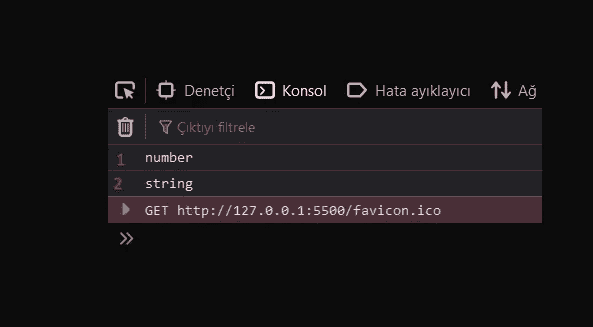***

***布尔→字符串***

```
*let data = false;
console.log(typeof data);
data  = String(false);
console.log(typeof data);*
```

***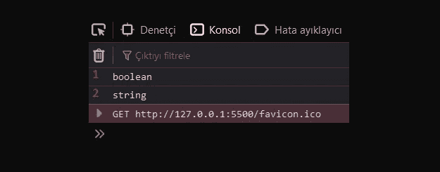***

***数组→字符串***

```
*arry = [0, 1, 2, 3];console.log(typeof arry);arry = String([0, 1, 2, 3]);console.log(typeof arry);*
```

***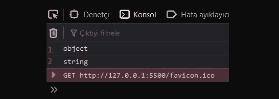***

***字符串→数字***

```
*var str = "JavaScript";console.log(typeof str);str = Number("Javascript");console.log(typeof str);*
```

***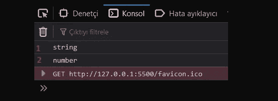***

***布尔→数字***

```
*var bln = true;console.log(typeof bln);bln = Number(true);console.log(typeof bln);*
```

***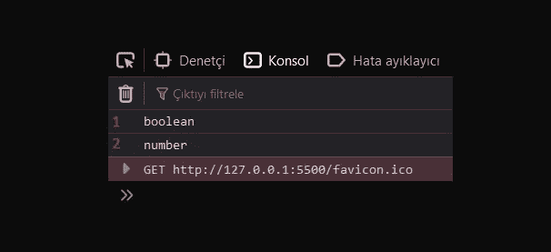***

***空→数字***

```
*var nll = null;console.log(typeof nll);nll = number(nll);console.log(typeof nll);*
```

***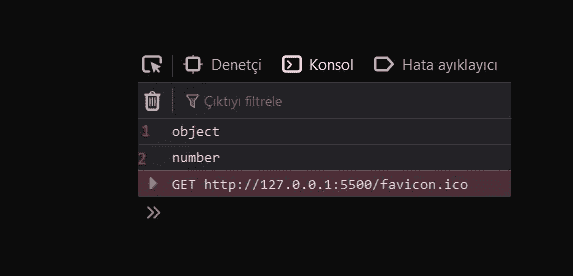***