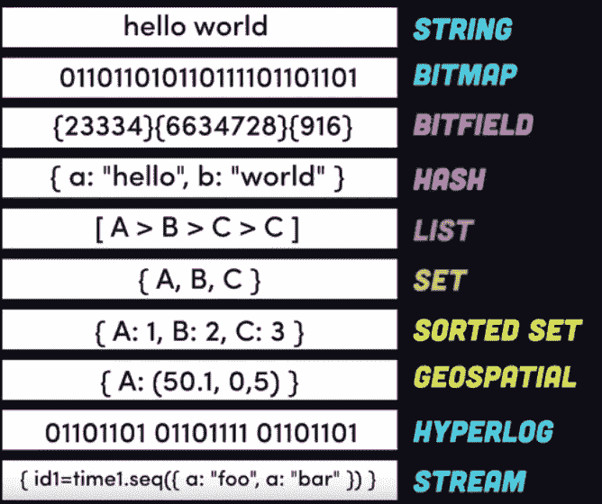

# 数据类型摘要

> 原文：<https://medium.com/geekculture/data-types-summary-443f8f54948?source=collection_archive---------21----------------------->

Examples of data types and their common name in some programming languages.

> **定义:**数据类型是数据的分类，它告诉编译器或解释器程序员打算如何使用数据。大多数编程语言支持各种类型的数据，包括整数、实数、字符或字符串以及布尔值。

一个**数据类型**或者在计算机科学和计算机编程中的简单类型是一个数据属性，它通知编译器或解释器程序员打算使用…