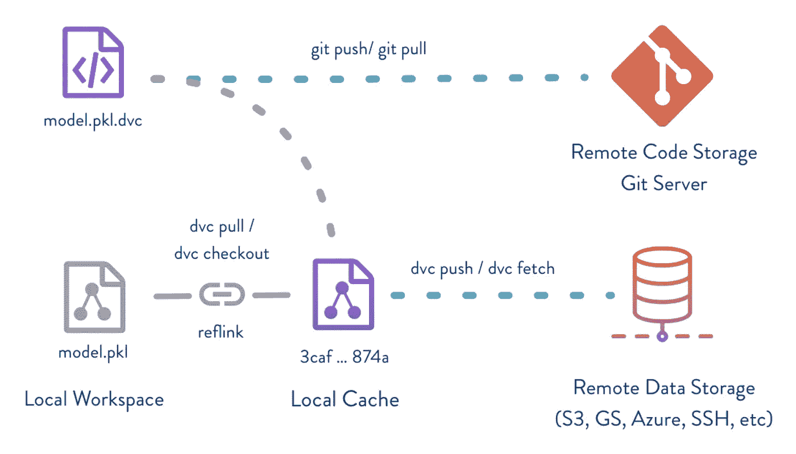
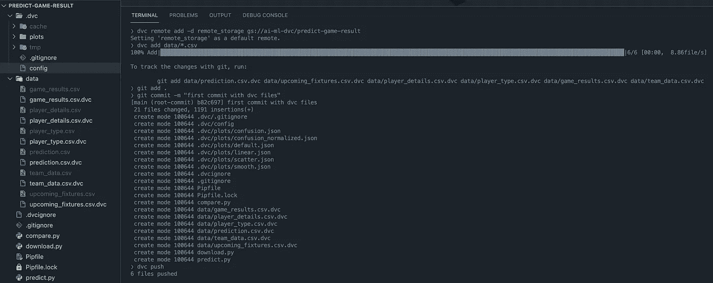
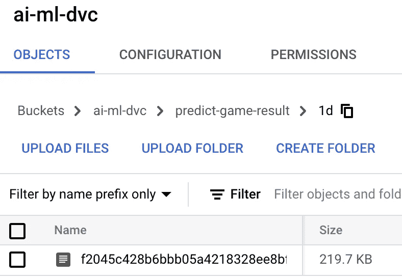

# 使用 Google 云存储和 Python 进行 ML 的数据版本控制(DVC)

> 原文：<https://medium.com/geekculture/data-version-control-dvc-with-google-cloud-storage-and-python-for-ml-fe99dc7d338?source=collection_archive---------4----------------------->

## 数据版本控制是一个即将到来的领域，需要更快地实现机器学习迭代，并仍然跟踪数据和模型的变化。



# 介绍

机器学习项目生命周期不同于正常的软件生命周期，正常的软件生命周期不太依赖于数据，而在机器学习中，每个模型都依赖于底层数据，并且当数据改变时，模型的行为也不同。

> 简单来说——数据变化> ml 代码需要重新校准>模型变化

所以绝对需要跟踪的不仅仅是代码，还有用于构建模型的数据。

# 欢迎使用数据版本控制

在这篇文章中，我们将看到一个叫做`dvc`的工具，它与`git`非常相似，但是用于数据。对于不熟悉 git 的人来说，`git`是一个开源版本控制系统，用于跟踪文件集的变化，并保存这些变化的历史。这主要用于所有软件开发生命周期，是 DevOps 的组成部分之一。(我们将在另一篇文章中讨论类似的 MLOps 概念)。

这里的核心概念是，我们跟踪文件更改，并使用推送命令将文件更改存储在具有标识符`hash`的远程位置，稍后当我们需要代码/数据的版本时可以获取这些更改。

对于使用`git`的代码变更，我们有 GitHub、BitBucket、GitLab 等选项..类似地，对于数据更改(我们正在谈论的是巨大的文件)，我们需要一个位置来在远程存储中存储这些文件。

使用这种方法，我们将数据从代码中分离出来，并且可以根据需求提取数据。

虽然`dvc`可以用于在各种平台上远程存储数据，包括(但不限于)AWS、Google Drive、Local Folder、SSH，但在本文中，我将使用 Google 云存储(因为我很难端到端地完成它，包括更改 ml 代码，并且我无法在一个地方找到所有指令。)

## 先决条件

您已经安装了 Google Cloud SDK，并且凭证(最终用户或服务帐户)保存在一个位置，该位置作为`GOOGLE_APPLICATION_CREDENTIALS`添加到您的环境变量中。这个过程不在本文的讨论范围之内。

让我用我的一个 git repo 来演示一下。

```
git clone [https://github.com/avinashknmr/predict-game-result.git](https://github.com/avinashknmr/predict-game-result.git)
cd predict-game-result
```

文件夹结构如下

```
predict-game-result
├── Pipfile
├── Pipfile.lock
├── compare.py
├── data
│   ├── game_results.csv
│   ├── player_details.csv
│   ├── player_type.csv
│   ├── prediction.csv
│   ├── team_data.csv
│   ├── upcoming_fixtures.csv
├── download.py
└── predict.py
```

接下来，我们将设置 DVC 并向其中添加文件。为此，首先，让我们使用您喜欢的安装程序安装`dvc`。我使用`pipenv`,但是这个命令对于`pip`也是一样的。对于 macOS，你可以通过自制软件`brew install dvc`安装，但是如果你在虚拟环境中使用它，你的代码需要有`[gs]`，也需要安装在虚拟环境中。欲了解详细文档，请访问 dvc.org。

```
pipenv install "dvc[gs]"pip install "dvc[gs]"
```

`[gs]`需要使用 Google 云存储进行此演示。并且假设我们已经配置了`GOOGLE_APPLICATION_CREDENTIALS`。否则，该设置的后续部分将无法将数据推送到 Google 云存储中。

开始`dvc`吧。许多`dvc`命令与`git`相似，因为它是在它的基础上构建的，除了一些变化。

```
dvc init
```

让我们将 Google 云存储作为默认远程存储添加到这个 repo 中。

```
# dvc remote add -d remote_storage gs://<bucket-name>/<folder-name>
dvc remote add -d remote_storage gs://ai-ml-dvc/predict-game-result
```

dvc 配置文件看起来像这样`.dvc/config/`

```
[core]
    analytics = false
    remote = remote_storage
['remote "remote_storage"']
    url = gs://ai-ml-dvc/predict-game-result
```

接下来，让我们为数据版本控制添加所有数据文件

```
dvc add data/*.csv
```

此时`.csv.dvc`被创建在`data`文件夹下，该文件夹跟踪数据版本。现在让我们看看一个`.csv.dvc`文件的内容。它包含一个链接到原始文件的`md5 hash`。稍后，当我们将数据推送到 remote_storage 时，文件将使用此哈希名称保存。当文件改变时，`md5 hash`改变，并通过`git`跟踪。

```
outs:
- md5: 1df2045c428b6bbb05a4218328ee8bff
  size: 225002
  path: game_results.csv
```

让我们添加所有未分级的更改

```
git add .
```

提交所有阶段性更改

```
git commit -m "first commit with dvc files"
```

现在让我们将数据文件推送到谷歌云存储中，使用—

```
dvc push
```



接下来，我们将把更改推送到 git 存储库，以便跟踪和保存更改。

```
git push -u origin develop
```

现在让我们检查一下我们的云存储空间，您会发现每个文件都有一个文件夹，其中前 2 个字符是`md5 hash`，其余字符是文件夹中的文件名。下一次，当文件改变时，随着`md5 hash`的改变，创建不同的文件夹。



# 如何在我们的 ML 代码中使用数据？

只有`.csv.dvc`文件知道文件名，因此不删除这些文件非常重要，否则我们无法从云存储中获取文件。

现在，在我们的脚本中，我们为各种操作导入了`dvc.api`,而`get_url`是获取被跟踪文件的链接的一个绝对基本的方法。

```
>>> import dvc.api
>>> dvc.api.get_url('data/game_results.csv')
'gs://ai-ml-dvc/predict-game-result/1d/f2045c428b6bbb05a4218328ee8bff'
>>> data_path = dvc.api.get_url('data/game_results.csv')
```

代码的其余部分保持不变，除非文件名改变，否则不需要改变代码。

```
>>> import pandas as pd
>>> df = pd.read_csv(data_path)
>>> df.shape
(125, 37)
```

数据版本由`dvc`跟踪，而 dvc 配置文件和代码版本由`git`跟踪。

这是跟踪数据变更的完美方式，包括模型对象和指标。此外，这将数据与代码分开，但仍会跟踪数据变化，这是机器学习项目的先决条件。

# 结论

`dvc`与`git`一起工作，是使用 CI/CD 工具进行持续机器学习的核心组件，也是 MLOps 流程中第一步也是最重要的一步。`git`对代码做了什么，`dvc`对数据做了什么——跟踪和维护变更，并在需要时检索版本。此外，这两个工具保持了代码的整洁，将代码与数据分离开来(数据通常很大，存在安全问题),我们可以更好地控制整个过程。我们已经考虑过建立一个这样的存储(云存储)，但是如果在小项目上工作，我们可以使用 AWS、Azure、SSH、HTTP 甚至 Google Drive。