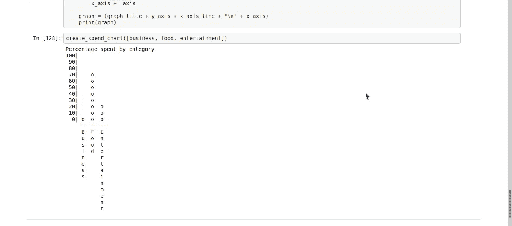
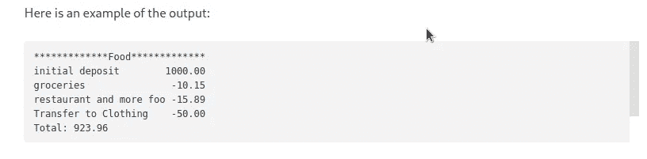
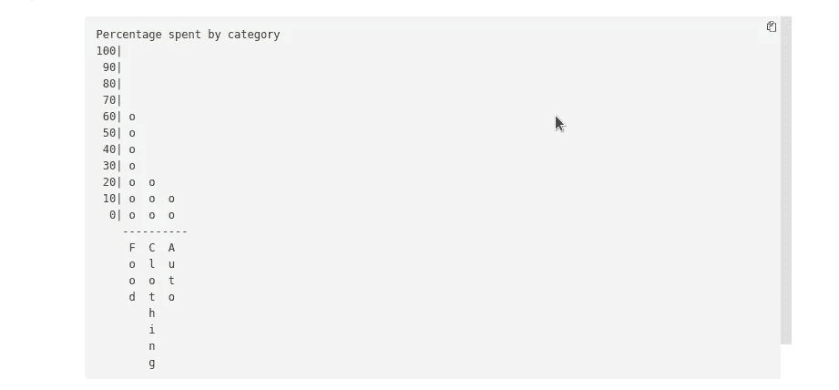
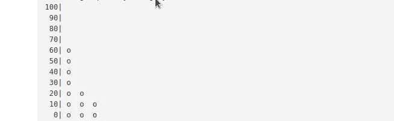
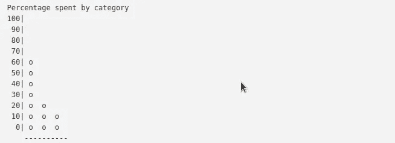
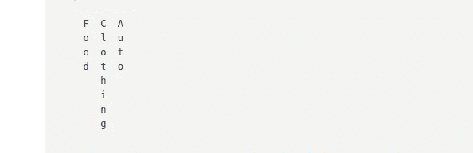

# 没有绘图库的数据可视化图形；计算机编程语言

> 原文：<https://medium.com/geekculture/data-visualization-graph-without-plotting-libraries-python-e2626e5d0627?source=collection_archive---------15----------------------->

> **在没有导入像 matplotlib 这样的 python 绘图库的情况下，我如何图形化地显示每个类别的消费百分比？**

几天前，我接受了来自[自由代码营](http://freecodecamp.org)的挑战，创建了一个预算应用。挑战在于编写一个 python 类来打印预算/账户细节，以及一个函数来可视化每个预算类别的支出百分比。在没有导入像 matplotlib 这样的 python 绘图库的情况下，我是如何可视化的呢？

Python Graph Representing Consumption per Category

因为这是获得认证的一个挑战，所以我不打算像我在我的[网络抓取文章](https://irfan-ahmad.medium.com/)中那样展示我的代码。我会解释我是如何找到解决办法的。

# **出现的问题**

1-创建一个包含不同函数的类来打印预算明细的收据。

Budget App Receipt Output

2-创建一个绘制条形图的函数。该图表应显示传递给该函数的每个类别中花费的百分比。

Budget App Graph Output

# **解决方案**

*1-问题 1 的解决方法相对容易。所以，我就跳过这个。*

第二个问题实际上对我来说是一个挑战。这就是我如何找到解决方案的。

> “分而治之”

是的，这个图是一个 python 字符串。

# **让我们来绘制图表**

它由以下几部分组成:

## I-title:“`Percentage spent by category`”

Graph Title

只需创建一个包含图形标题的字符串。

## ii- y 轴(由百分比的 y 标签和竖线“o”组成)

Y-axis

创建一个包含从 100 到 0 的百分比的列表，并在每个值上放一个竖线“|”，即['100| '，' 90| '，…..'0|']

计算每一类花费的百分比。为此，取每个类别的总支出，除以预算中所有支出的总和。

为每个类别创建一个“o”列表，其中包含的“o”的数量与其在百分比列表中所占百分比的索引数量一样多。

在百分比列表中运行 for 循环:

> 对于 n in (['100| '，' 90| '，…..'0|']):

如果某个百分比的指数等于类别中的任何指数，则在该行中加上“o ”,否则为空格，即“”。

这将创建一个类似上面的字符串。

## iii- x 轴线(用'-'绘制)

X-axis

创建一个包含破折号的字符串，即以“-”作为 x 轴线。它的长度是类别数的三倍+ 1((类别数*3)+1)。(在我的函数中，我创建了一个包含类别名称的列表和一个类别数量的计数器。)

## iv-沿 x 轴的类别标签

X-labels

运行 for 循环以获得类别的最大长度

如果类别名称包含的字母数与类别中的最大长度一样多，则打印其字母。否则，打印一个空格。我用了“试试……除了“为了这个。

最后把所有的部分组合起来；图表=标题+ y 轴+ x 轴+ x 标签