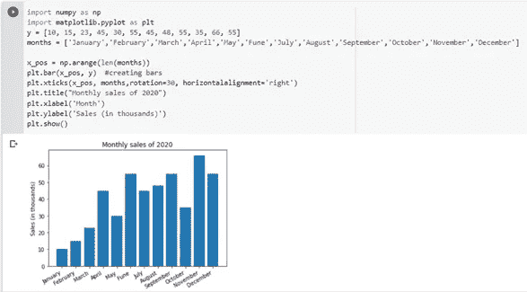
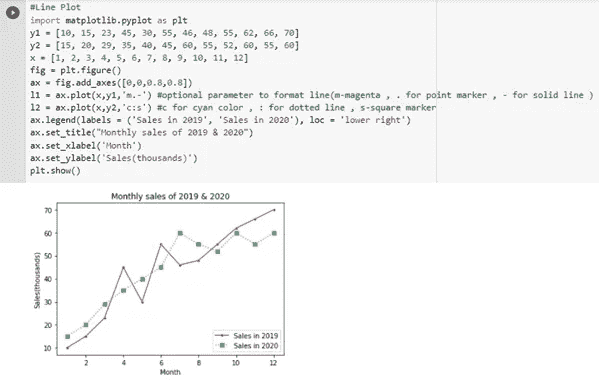
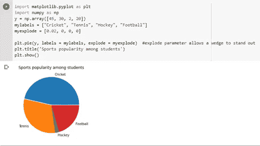
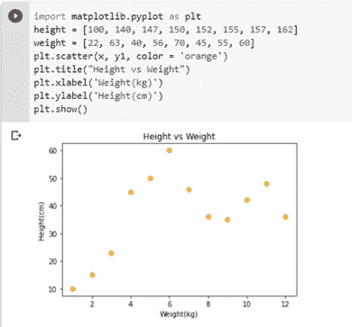
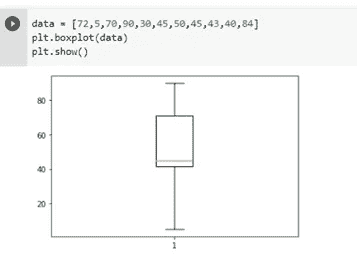

# 使用 Matplotlib 实现数据可视化

> 原文：<https://medium.com/geekculture/data-visualization-using-matplotlib-a85cfe747cff?source=collection_archive---------40----------------------->

数据可视化是一种创建创造性和交互式可视内容的实践，以便更好地理解数据中的趋势、模式和变化。它将复杂的数据简化为更简单的格式，从而帮助读者快速吸收信息，获得更好的见解，更快地做出决策。由于大数据和数据分析项目越来越受欢迎，可视化变得比以往任何时候都更加重要。

许多工具可用于可视化。Python 提供了许多用于数据可视化的库，它们是使用最多的。很少有库是-Matplotlib，Seaborn，Pandas visualization，Plotly。

在这篇博客中，我们将看到使用 Matplotlib 的数据可视化。所以，让我们开始吧！

**Matplotlib**

Matplotlib 是一个跨平台的图形化绘图 Python 库，有助于从数组中的数据制作 2D 图。它建立在 NumPy 数组上。此外，它被设计为与更广泛的 SciPy 堆栈一起工作。它是最流行的数据可视化 Python 库。我们可以使用 Matplotlib 绘制几个图，比如条形图、饼图、散点图等等。

**Matplotlib 中的地块**

1.  **条形图** -条形图用于显示数字和类别变量之间的联系，因此当我们想要比较同一类别中的多个类别变量时，最好使用它。使用 Matplotlib 中的 *bar()* 生成绘图。

**2。直方图** -直方图通过将数据分割成不同的条块，用于连续变量的数字数据分布的图形表示。用于查看数据分布的对称性。使用 *hist()方法生成直方图。*

*人们经常混淆条形图和直方图，因此，条形图用于表示分类数据，而直方图用于表示连续数据。*

**3。折线图-** 折线图用于表示两个数据之间的关系，并观察一段时间内的趋势。

**4。饼图** -饼图用于表示一个类别中元素的比例分布。方法 *pie()* 用于创建饼图。

**5。散点图** -散点图用于表示两个变量之间的关系。我们很容易发现这两个变量之间的任何关联。使用*散点图()*方法绘制散点图。

**6。箱形图** -箱形图用于表示关于数字数据分布的汇总统计。它有助于检测异常值。在箱线图中，从第一个四分位数到第三个四分位数绘制一个方框，一条垂直线穿过中间的方框。使用 *boxplot()* 方法绘制盒状图。

其他图包括堆积图、气泡图、表格图、极坐标图、等高线图。

**Matplotlib 的优势**

*   简单，容易掌握。
*   它是开源的。
*   它是跨平台和可移植的，因此可以在任何操作系统上工作。
*   它具有 MATLAB 语言和其他可视化工具所缺乏的许多特性。
*   它提供对图形的各种元素的控制，如 DPI、图形颜色等。

**结论**

我们的结论是 Matplotlib 是一个很好的数据可视化 Python 库。我们可以很容易地绘制各种图形，并相应地定制它们。

谢谢你！