# 使用 Power BI 学习数据可视化

> 原文：<https://medium.com/geekculture/data-visualization-with-microsoft-power-bi-c7b8cd145654?source=collection_archive---------8----------------------->

## 全球自杀率分析和可视化


[**Microsoft Power BI**](https://powerbi.microsoft.com/en-us/)

# 介绍

作为 She 代码导师计划数据科学专题的一部分，我有机会学习了 [Power BI](https://learn.datacamp.com/courses/introduction-to-power-bi) 。Microsoft Power BI 是领先的数据可视化工具之一，旨在提供创建交互式报告和仪表板的简单功能。

Power BI 具有各种组件，允许您执行不同的功能。Power BI 组件包括 Power BI 桌面、Power BI 服务、Power BI 网关、 [Power BI Pro](https://powerbi.microsoft.com/en-us/power-bi-pro/) 和 [Power BI 手机 App](https://docs.microsoft.com/en-us/power-bi/consumer/mobile/) 。

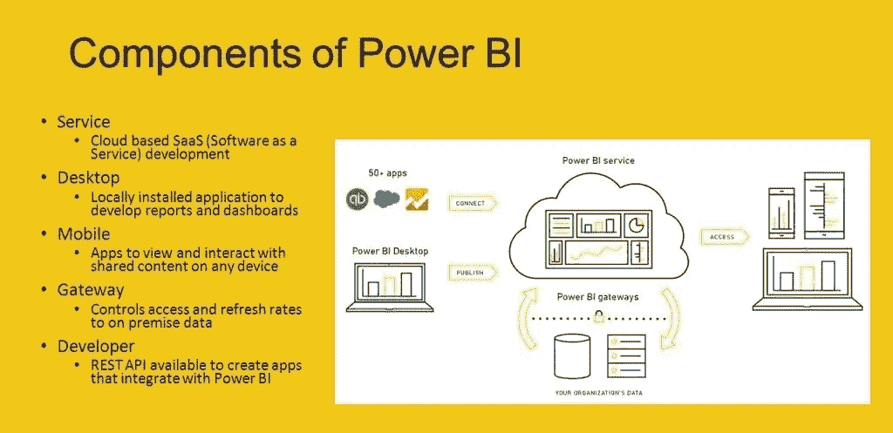

[**Power BI Components**](https://tecrada.com/the-microsoft-power-bi-desktop-tool/)

## Power BI 组件和工具

我将在本文中用来分享我的体验的 Power BI Desktop 版本是 100%免费的。它允许您执行数据分析，创建交互式可视化和报告。但是，使用该版本的限制是协作和创建仪表板。为了共享报告、创建仪表板或与其他团队成员协作，您必须利用 [Power BI Service](https://powerbi.microsoft.com/en-us/landing/signin/) (云服务组件)。


[**Power BI Desktop & Power BI Service Comparison**](https://docs.microsoft.com/en-us/power-bi/fundamentals/service-service-vs-desktop)

## 数据源

Power BI Desktop 允许连接各种文件格式的[不同数据源](https://docs.microsoft.com/en-us/power-bi/connect-data/desktop-data-sources)。

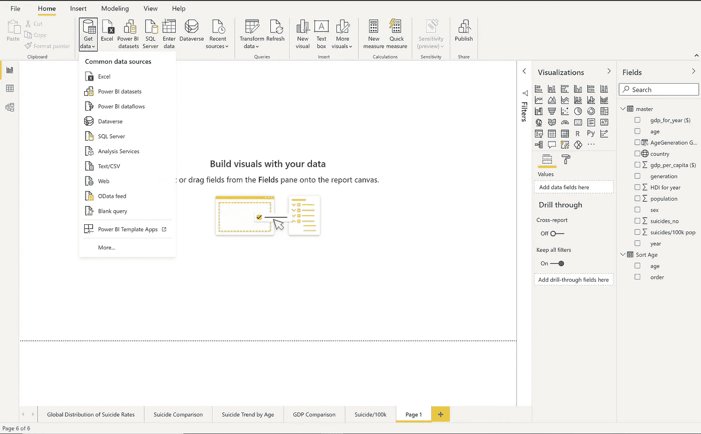

[全球自杀率数据集](https://github.com/Mapenzi-Supaki/SCAMP-Cohort-4-Miniprojects/blob/master/master.csv)是一个包含 12 列的 CSV 文件；国家、年份、性别、年龄、自杀人数、人口、自杀/10 万人口、国家年份、年份的人类发展指数、年份的国内生产总值(美元)、人均国内生产总值(美元)和世代。

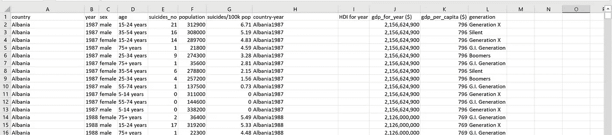

[Sample dataset](https://github.com/Mapenzi-Supaki/SCAMP-Cohort-4-Miniprojects/blob/master/master.csv)

## 数据预处理

Power BI 桌面有三个视图:

*   **报告视图(默认):**使您能够创建报告和视觉效果
*   **数据视图:**允许您查看数据模型中正在使用的、与报告相关联的数据。
*   **关系视图:**显示数据模型的关系视图，并允许您管理表之间的关系。

导入数据集后，下一步是清理并将其转换为可展示的形式。Power BI Desktop 为此提供了一个强大的功能，称为 **Power BI 查询编辑器**，它允许您在将数据加载到 Power BI 之前执行此功能。

对数据集执行的函数:

1.  **删除列** 使用 **RIGHT()** 函数从 *country_year* 数据中提取年份。在这里，我发现来自 *country_year* 列的数据是由 *country* 和 *year* 列合并而来的。我不需要该列，因此将其从数据集中删除。
2.  **替换年度的值** *HDI 有空白行。使用 Replace Value 选项，我将该列中的所有空值替换为 0。*
3.  **自定义栏** *世代*栏中的一些数据没有与*年龄*栏对齐。

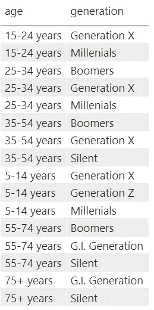

使用嵌套 IF 函数的 [DAX，在数据集中创建了自定义列*年龄生成组*，以将*生成*与正确的*年龄*范围相匹配。](https://docs.microsoft.com/en-us/dax/if-function-dax)

**DAX** (数据分析表达式)是在 Power BI 中创建计算的语言。

> 把 DAX 想象成 Excel 函数和公式。

在现实世界中，5-14 岁的年龄组是“阿尔法一代”，而 88 岁以上的年龄组被认为是“通用一代”。在我的数据中，由于“阿尔法一代”不在初始数据集中，他们被分解为“Z 世代”。“美国大兵一代”与“沉默”结合在一起，因为 75 岁以上符合他们的年龄范围。

```
#*AgeGeneration Group calculated column*AgeGeneration Group = IF(master[age] ="5-14 years", "Generation Z", IF(master[age] = "15-24 years", "Generation Z", IF(master[age] = "25-34 years", "Millenials",IF(master[age] = "35-54 years", "Generation X", IF(master[age] = "55-74 years","Boomers", IF(master[age] = "75+ years", "Silent/G.I Generation"))))))
```

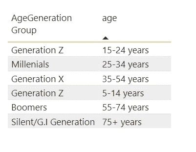

New Generation Column (My Workspace)

4.**按列排序** Power BI 允许您[按升序或降序以及数据字段对指定数据](https://radacad.com/sort-by-column-in-power-bi)进行排序。

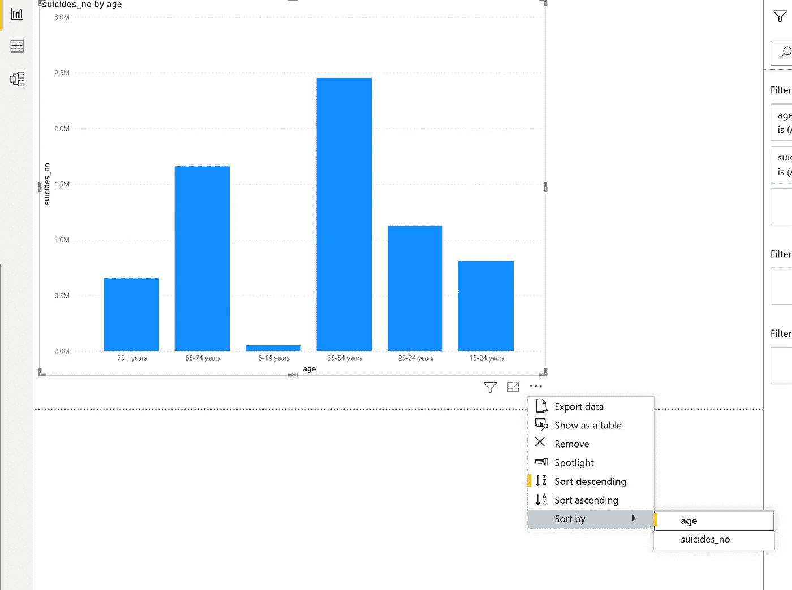

Sort suicide_no by age data field (My Workspace)

我正在根据年龄降序排列自杀率。然而，如果你看看年龄范围上面的图表，5-14 岁是错误的顺序。为了按照 75 岁以上、55-74 岁、35-54 岁、25- 34 岁、15-24 岁和 5-14 岁的顺序排列，或者相反，我们必须根据另一列对我们的列进行排序。

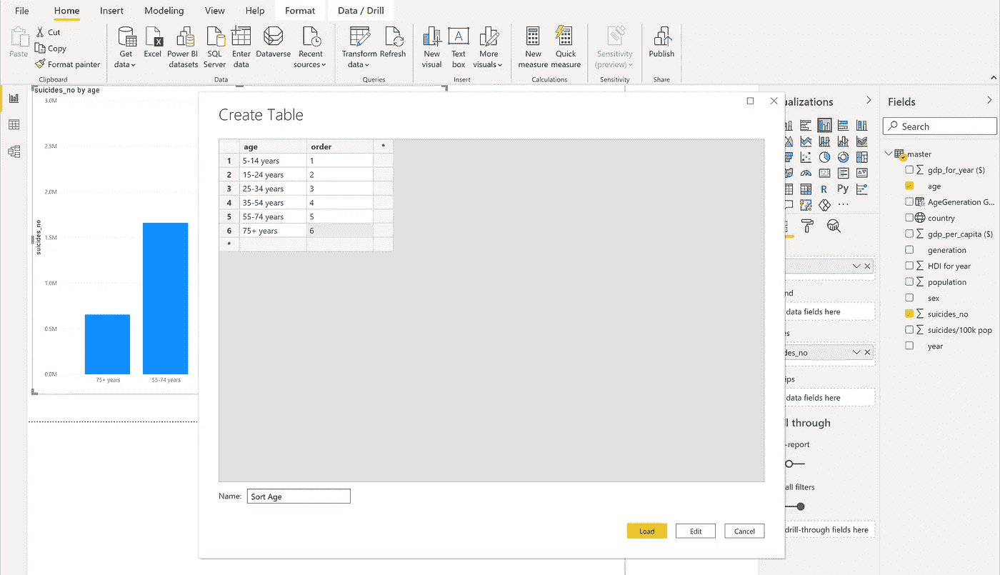

Sort by Column (My Workspace)

**步骤**:使用*输入数据*选项创建一个*分类年龄*表。新表应该与要排序的原始列具有相同的值。一旦您创建了*年龄*列，您就创建了*顺序*列来指示年龄范围应该被排列的顺序。

一旦创建了排序表，您就在*排序年龄*表和*主*表之间创建了一个关系。一个[多对一关系](https://www.tutorialspoint.com/One-to-Many-or-Many-to-One-Relationship-in-DBMS)将被创建。

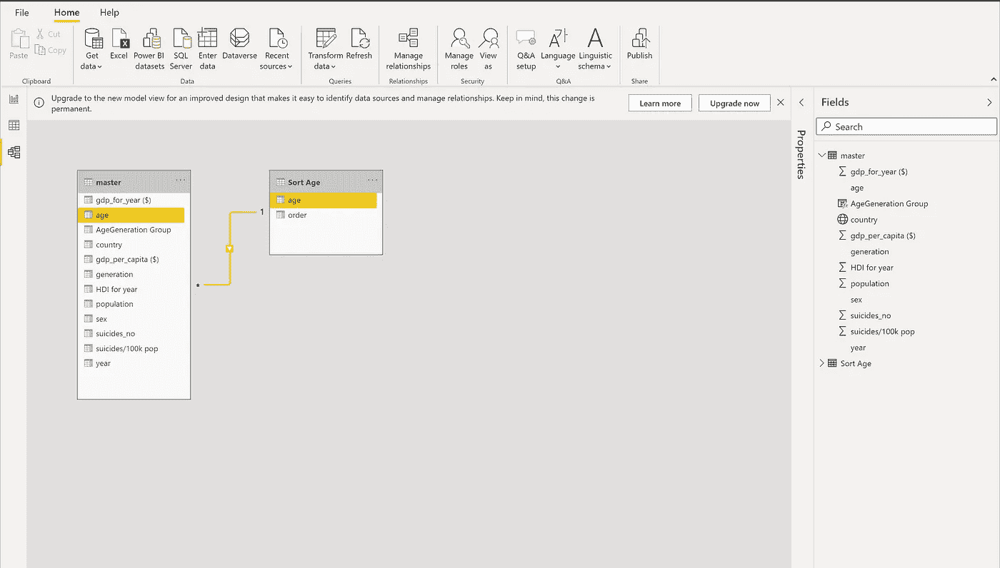

Sort Age Relationship View (My Workspace)

如果要将 s *ort age* 表中的 *age* 列带到原来的 *master* 表中，可以使用下面的 **RELATED ()** 函数创建一个计算列。在我的例子中，我决定保持新表不变。

```
// New Column in master table
RELATED('Sort Age'[age])
```

现在，当按新的*年龄*排序列对*自杀 _ 无*列进行排序时，它的排名很好。

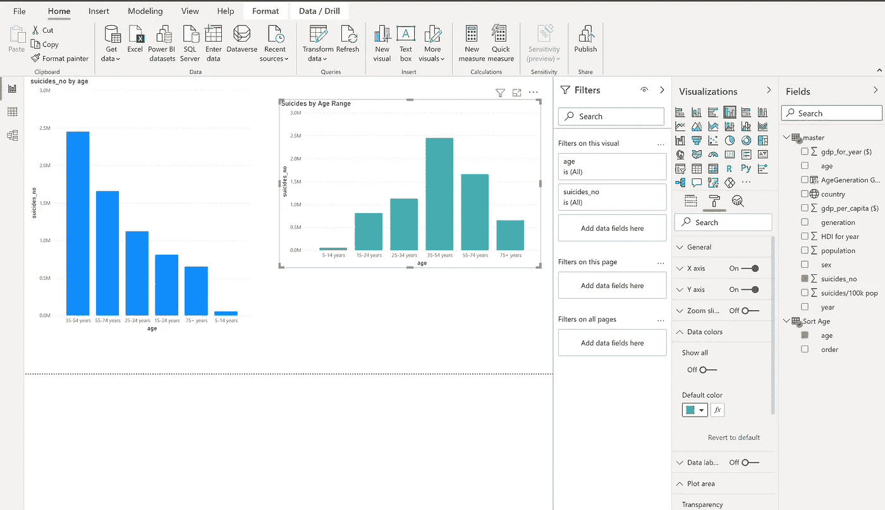

Comparison charts between the unsorted and sorted age columns

## Power BI 报告

此功能允许您可视化并呈现来自数据集的不同发现和见解。该报告可以包括一页或多页不同的相互关联的图像。

在这些报告中，您还可以向下钻取、过滤和使用 DAX 函数来提供更多见解。

Power BI 提供了具有不同功能的可视化选项。它们包括柱形图和条形图、堆积条形图/柱形图、簇状条形图/柱形图、100%堆积条形图/柱形图、组合图、折线图、面积图、饼图、圆环图、树状图、地图、卡片、多行卡片、KPI、仪表图、表格和矩阵。

## *全球自杀率分析*

> **人口增长**

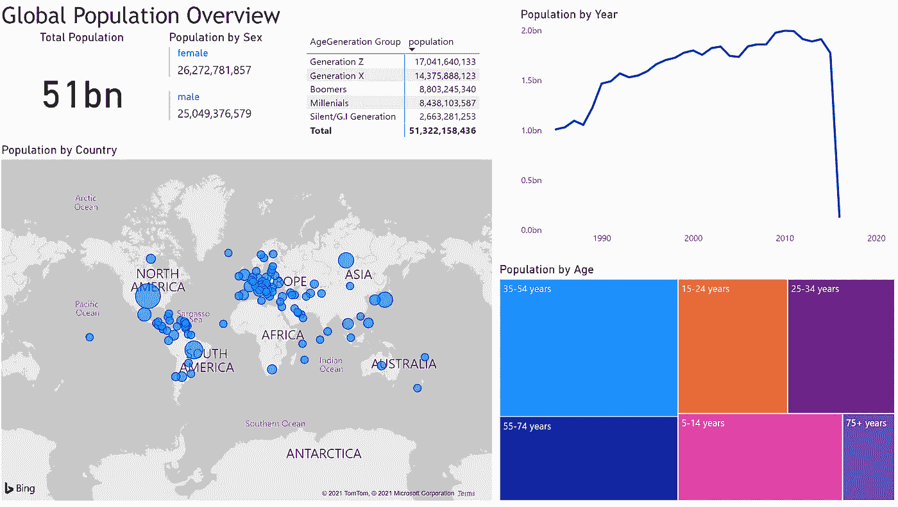

My Workspace

美国人口最多。圆圈越大，这个国家的人口就越多。

> **全球自杀率概览**

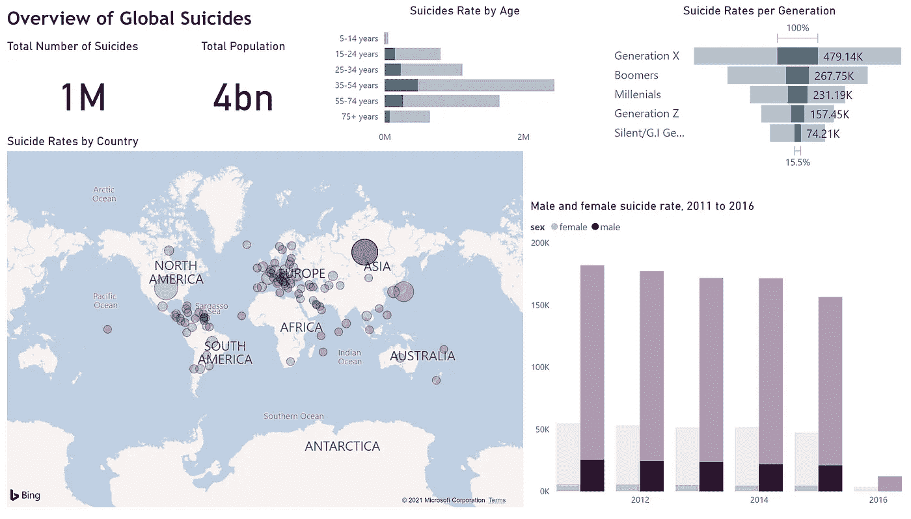

My Workspace

俄罗斯联邦拥有 40 亿人口，自杀率最高，大多数人年龄在 35-54 岁之间(X 世代)。

> **按年度国内生产总值、人均国内生产总值、人类发展指数分列的自杀率**

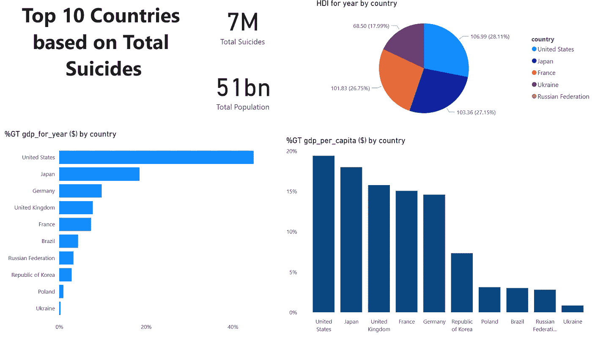

My Workspace

人均 GDP、HDI 和年 GDP 最高的国家，人口和自杀率也较高。

> **自杀者性别**

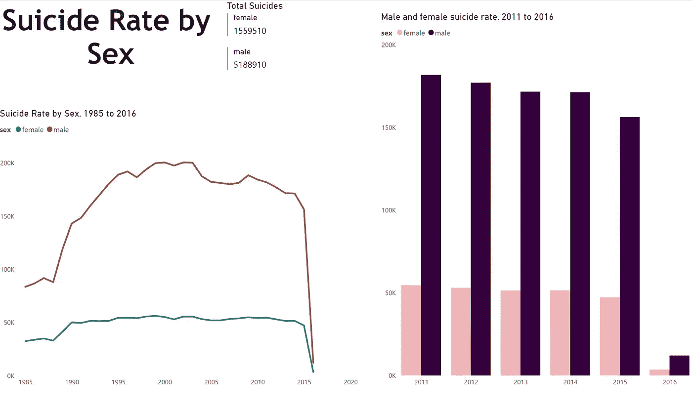

这些年来，自杀的男性多于女性。然而，自 2011 年以来，自杀人数有所下降，2016 年男女自杀率均大幅下降。

> **自杀人口**

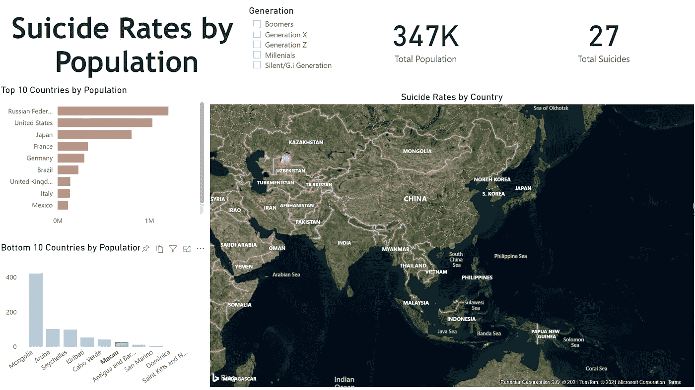

My Workspace

人口稠密的国家自杀率较高，而人口稀少的国家自杀率较低。

> **按年龄划分的自杀人数**

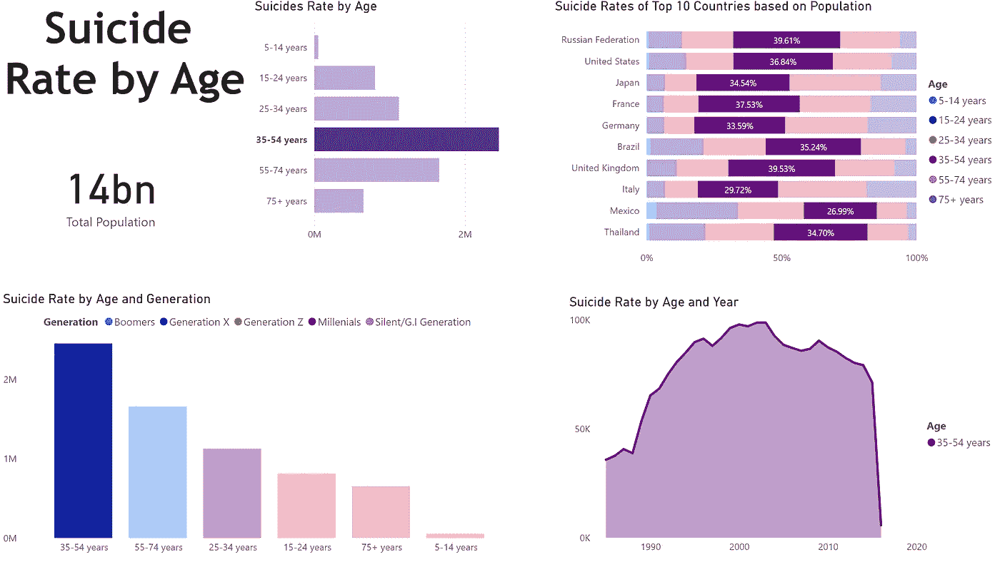

My Workspace

在这里的图表中，自杀率按年龄、世代、年份和人口最多的 10 个国家进行了细分。从全球来看，35-54 岁人群(X 世代)的自杀率很高。

> **自杀者/100k**

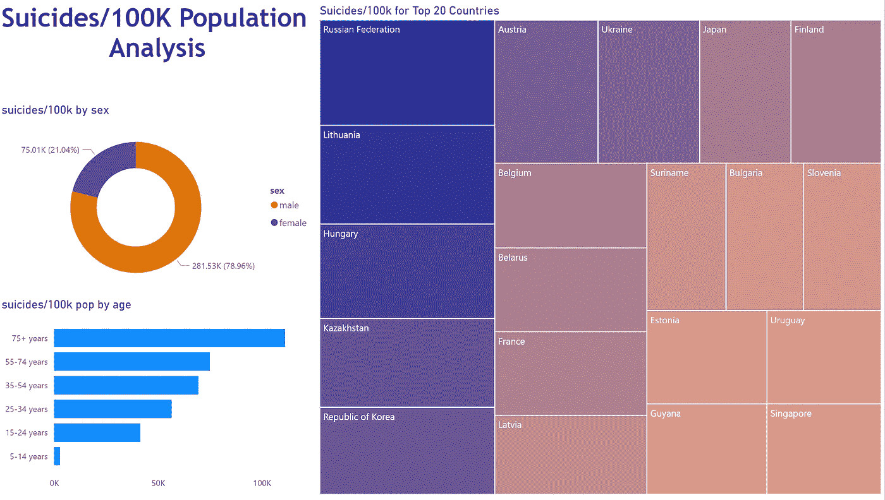

My Workspace

在这张图表中，我们看到了特定人群中每 10 万人中的自杀死亡人数。这些数字按性别、年龄和自杀人数最多的 10 个国家分类。根据图表，男性和 75 岁以上的人死于自杀的人数更多。

# 结论

这是我第一次尝试使用 Power BI，我可以很高兴地肯定它确实是用户友好的。我喜欢这样的事实，由于拖放功能，它在可视化和报告的创建中是交互式的。

另一件事是，使用 Power BI，您可以集成和运行您的 R 或 Python 脚本，并获得可视化。你可以在这里阅读全部内容[。作为一名 Pythonista，我迫不及待地想深入了解这个特性。](https://www.datacamp.com/community/tutorials/data-visualisation-powerbi)

如果你喜欢这篇文章，请记得鼓掌，并与任何认为这篇文章有用的人分享。请随时在 [LinkedIn](https://www.linkedin.com/in/mapenzi-supaki/) 或 [Twitter](https://twitter.com/Mapenzi_Supaki) 上与我联系。

☲☲☲☲☲☲☲ ☲☲☲☲☲☲☲ **干杯！** ☲☲☲☲☲☲☲ ☲☲☲☲☲☲☲