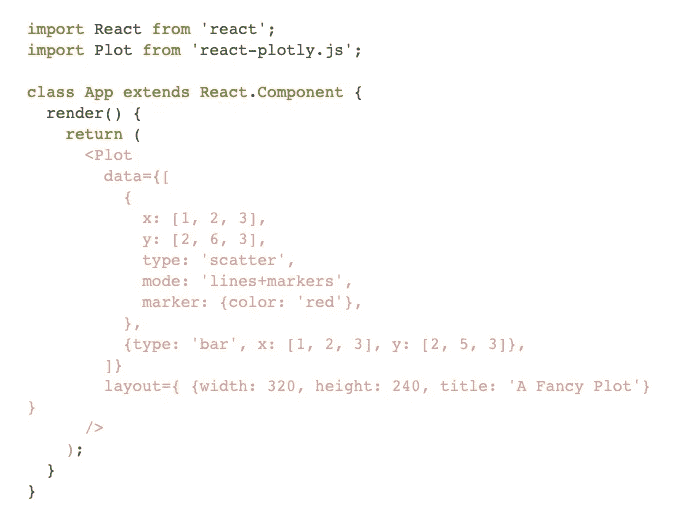
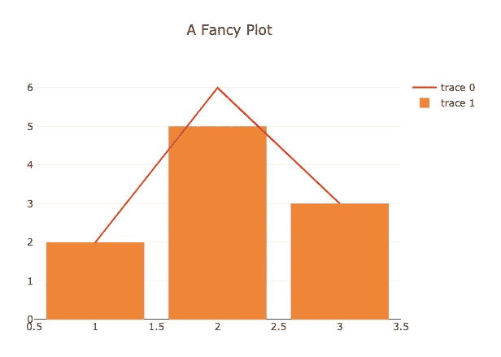
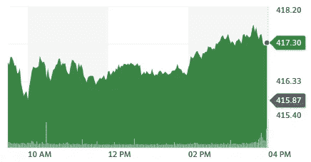
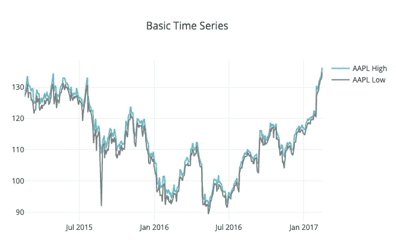
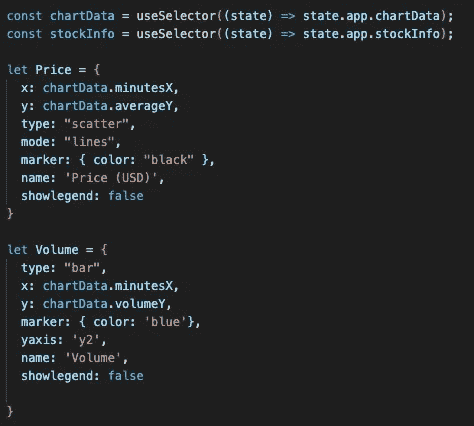
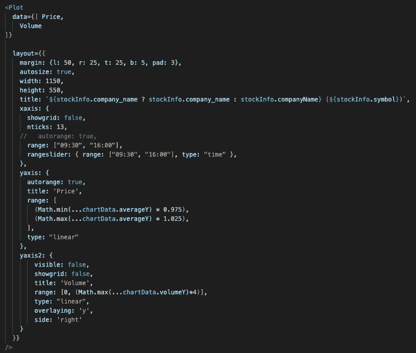
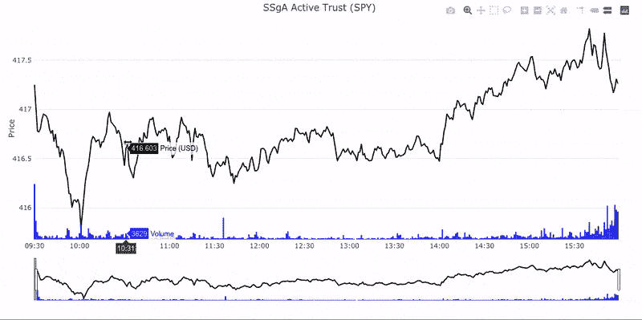

# 用 Plotly.js 实现数据可视化

> 原文：<https://medium.com/geekculture/data-visualization-with-plotly-js-59bae614cc65?source=collection_archive---------19----------------------->

我在寻找一个图形库的过程中遇到了 [Plotly](https://plotly.com/graphing-libraries/) ，这个图形库可以将从 IEX 云 API 接收到的数据转换成可消化的视觉效果，提供比 300 多个数据点阵列更多的洞察力。让我后退一步来解释为什么我需要这个特性。

对于我在熨斗学校的顶点，我决定尝试创建我自己的股票筛选/股票报价应用程序。我认为这很简单，我会创建一个 IEX 交易所所有交易股票的数据库，并根据客户的要求更新信息……但我很快意识到，我的电话是有限的，维护 IEX 涵盖的每一只“股票”的数据库是不可行的(需要明确的是，有近 40，000 只证券，包括普通股、共同基金、指数基金、交易所交易基金、优先股，还有很多……)。因此，我重新聚焦的 MVP 是有两个简单的功能，能够制作一个股票的*观察列表*，并且能够查看特定股票的*股票信息*页面。这就是我需要像 Plotly 这样的数据可视化库的原因。

Plotly 是一个主要针对 Python 的可视化库，但幸运的是它集成了 JavaScript 和 React！这个特定库吸引我的是内置在图表中的范围滑块和缩放功能，我们可以在下面的示例中查看这些功能。

Plotly 立即提供了一些非常简单的入门示例:

Taken directly from Plotly’s ‘Quick Start’ section ([https://plotly.com/javascript/react/](https://plotly.com/javascript/react/))

The result graph from the above code

结束了。

这绝不可能是我的项目的结果！虽然上面的标题是'*一个奇特的剧情*，但更恰当的名字应该是'一个*简单的剧情*或者更准确的'*一个不准确的对 Plotly 能力剧情*的描述。'

在我的脑海中，我有一个更接近雅虎财经图表的愿景:

SPY 4/16/21

它似乎由两个主要部分组成，线形图代表股票的价格，底部的小白线代表股票全天的交易量。因此，看起来我们的'*花式图'*仍然有一个伟大的股票可视化图表的气质。

在对 Plotly.js [文档](https://plotly.com/javascript/time-series/)进行了一番挖掘之后，我偶然发现了一张*时间序列财务图*。它似乎完全符合我的需要，除了一个关键因素，代表具体股票的量的小酒吧不见了。

所以再深入一点，我发现我需要的是我的时间系列情节中的一个次要情节。这是一个情节中的情节(主题曲加强)。如前所述，我们将处理一只股票的两组数据价格和交易量，这两组数据都是我们图表上的 y 轴。两组的 x 轴将是一个时间序列。在上面的例子中，时间的增量似乎是以周为单位，大约每 6 个月一次。对于我们的图表，我们将在一分钟内递增，因为我希望创建的图表是一个日内图表。

The above syntax can be found at the ‘Time Series with Range Slider Section [here](https://plotly.com/javascript/time-series/).

顺便提一下，变量 chartData 和 stockInfo 表示从我的 Redux 存储中调用的数据。这些数据是从我的后端提供的，我已经将从 IEX 云 API 中检索到的数据解析成 Plotly 可以使用的格式(基本上是一长串数据点)。目前，本文的范围不包括数据检索和操作，只知道 x:和 y:属性是与特定股票价格和交易量相关的长数组。

一旦您将数据以状态存储或硬编码为文件中的变量，我们就可以访问`<Plot />`组件。

这个组件的两个主要属性是上面讨论的数据属性(由价格和交易量组成的数组)和[布局属性](https://plotly.com/javascript/reference/index/)。在正常的布局中，只有 xaxis 和 yaxis 属性，但是因为我们有了一个子图，yaxis2 就变得必要了。关于 yaxis2 的一些见解，首先它被标记在图表的右侧，其次它的范围被增加到最高音量点的最大值的 4 倍(这样条形会缩小，不会完全控制图表)，第三轴不应该可见，以保持图表的整洁。请注意，正常 yaxis 的范围分别是最低价格和最高价格上下 2.5%，这使图表对基础股票的价格波动保持动态，并相应地调整其范围。

终于…你们期待已久的时刻到了。我呈现给你的是一个真正的“奇特的情节”

内置的测距仪是一个很大的优势，增加了任何图表的功能。以及允许用户聚焦于图表的特定区域的拖放缩放功能。当您在图表上悬停时，工具提示还会跟随价格、交易量和时间值。Plotly 是许多数据可视化库中的一个，我希望在我作为软件工程师的旅程中继续使用它，并变得更加熟练。