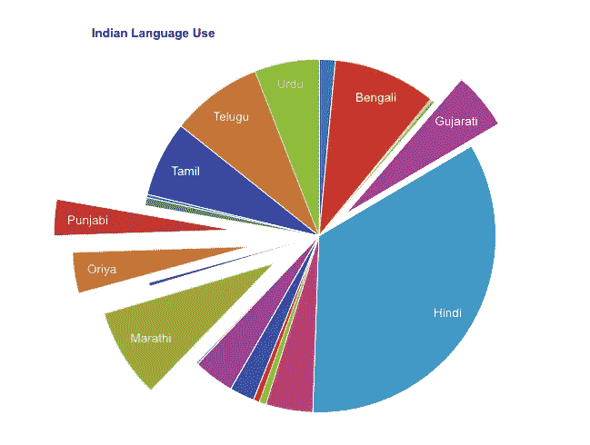
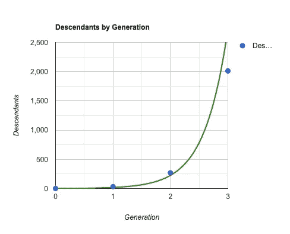

# React Google 图表的数据可视化

> 原文：<https://medium.com/geekculture/data-visualization-with-react-google-charts-82bc759d828f?source=collection_archive---------10----------------------->

我已经在我的网站[这里](https://michaeldfaber.github.io/#/google-charts)发布了这些例子。跟着走！

数据是新的黄金。但是，如果数据以这种形式出现，它对客户或潜在客户有什么好处呢？

```
[
    ['Language', 'Speakers (in millions)'],
    ['Assamese', 13], ['Bengali', 83], ['Bodo', 1.4],
    ['Dogri', 2.3], ['Gujarati', 46], ['Hindi', 300],
    ['Kannada', 38], ['Kashmiri', 5.5], ['Konkani', 5],
    ['Maithili', 20], ['Malayalam', 33], ['Manipuri', 1.5],
    ['Marathi', 72], ['Nepali', 2.9], ['Oriya', 33],
    ['Punjabi', 29], ['Sanskrit', 0.01], ['Santhali', 6.5],
    ['Sindhi', 2.5], ['Tamil', 61], ['Telugu', 74], ['Urdu', 52]
]
```

数据可视化至关重要。它使数据更容易消化，并帮助人们看到趋势和收集见解。这就是 [React Google Charts](https://www.react-google-charts.com/examples) 的用武之地，它是我最喜欢的数据可视化工具之一。



Pie Chart of Indian Language Use

React Google Charts 拥有你能想象到的各种可视化功能，从直方图到时间线再到树状图。让我们探索一下如何使用 React Google Charts，只用几行代码就可以将 JSON 变成网页上的一个漂亮的可视化工具。

在你的 React 应用程序中，安装 React 谷歌图表:
`npm i react-google-charts`

用
`import { Chart } from "react-google-charts"`将 React Google 图表导入组件

在 React Google Chart 的示例中找到满足您需求的可视化效果。对于这个例子，我们将使用一个[散点图](https://www.react-google-charts.com/examples/scatter-chart#changing-the-color)。



单击您选择的可视化旁边的“打开沙盒”按钮。打开`App.tsx`，复制代码片段，并调整它以包含您自己的数据。在生产环境中，您的数据可能来自 API、数据库等。为了进行概念验证，我们将继续使用硬编码数据。对于上面的散点图，看起来是这样的:

```
<Chart
    chartType="ScatterChart"
    width="100%"
    height="400px"
    data={[
        ["Generation", "Descendants"],
        [0, 1],
        [1, 33],
        [2, 269],
        [3, 2013],
    ]}
    options={{
        title: "Descendants by Generation",
        hAxis: { 
            title: "Generation", minValue: 0, maxValue: 3 },
            vAxis: { 
                title: "Descendants", minValue: 0, maxValue: 2100 
            },
            trendlines: {
                0: {
                type: "exponential",
                color: "green",
            },
        },
    }}
/>
```

你可以走了！现在，您已经拥有了使用 React Google Charts 可视化数据的工具。

感谢您的阅读！