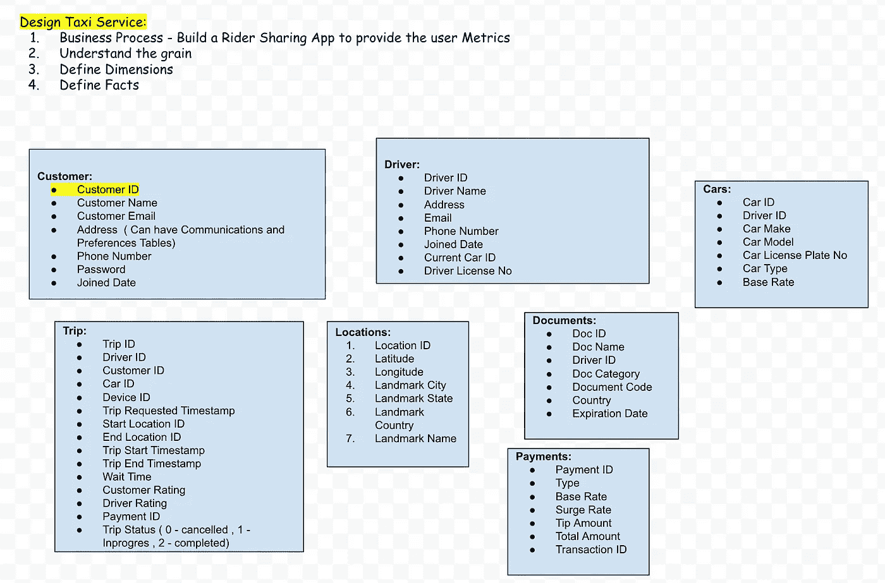

# 数据仓库:为拼车或出租车服务设计数据模型

> 原文：<https://medium.com/geekculture/data-warehouse-design-data-model-for-ride-sharing-or-taxi-service-5fc20d8eb424?source=collection_archive---------1----------------------->

Photo by [Andre Benz](https://unsplash.com/@trapnation?utm_source=medium&utm_medium=referral) on [Unsplash](https://unsplash.com?utm_source=medium&utm_medium=referral)

[网上词源词典](http://www.etymonline.com/index.php?term=taxi&allowed_in_frame=0)中“taxi”一词的来源是“taxicab”一词的简称，来源于“taximeter”和“cabriolet”两个词。出租车或出租车服务已经存在了几个世纪，在过去叫出租车服务是非常昂贵的，现在已经变得比以前更便宜了。由于我们周围的技术不断发展，我们现在可以从你的设备上预订出租车并实时跟踪旅程。在本文中，我们将设计一个数据模型，该模型可以捕获所有关键数据元素，包括行程、评级、文档和驾驶员绩效指标。

## 四步维度设计流程:金宝集团

1.  选择业务流程
2.  声明粒度(“如何描述事实表中的单个行？”)
3.  确定维度(“业务人员如何描述从业务流程度量事件中得到的数据？”)“何人、何事、何地、何时、为何、如何”与事件关联。
4.  确认事实

参考自[https://www . Kimball group . com/data-warehouse-business-intelligence-resources/Kimball-techniques/dimensional-modeling-techniques/four-4-step-design-process/](https://www.kimballgroup.com/data-warehouse-business-intelligence-resources/kimball-techniques/dimensional-modeling-techniques/four-4-step-design-process/)

## 解决办法

**业务流程:**出租车公司希望设计一个数据模型来捕获所有关键数据元素。

> 车手完成的赛道驾驶及其表现
> 
> 一个普通/著名的目的地(机场、公园、博物馆等)每天有多少次乘车经历
> 
> 每天有多少趟行程被取消。
> 
> 每天高峰时段的乘坐次数和平均价格。

**颗粒:**每个交易级别上的单独行程

**维度:**日期、客户、司机、汽车、文档、设备、地点。

**事实:**旅行、付款

**派生事实:**建议将它们物理存储在表中。在这个案例研究中，总数是直接的，但是存储它意味着在 ETL 过程中它的计算是一致的，以消除用户计算错误的可能性。**某些派生事实可以添加到视图中以最小化空间，或者可以添加到任何 BI 工具中。**

> 例如:**行程总成本栏**:增加基本费率、激增费率、税费、通行费、附加费用。

**第一部分:尺寸**

**日期维度:**

所有数据模型总是需要一个显式的日期维度表。SQL date 函数不支持许多日期组件，包括周数、财政年度、季节、假日、工作日和周末。与其试图在查询中确定这些计算，不如将其存储在日期维度表中。

**客户维度:**

在这方面，我们将覆盖正在使用乘车服务应用程序的用户。我们将在模型的中心使用这些信息。用户表包含所有相关用户(当前用户和新用户)的列表。对于每个用户，我们将存储他们的唯一 ID、姓名(名和姓)、电子邮件、地址、电话号码、加入日期、当前计划 ID(以确定他们当前使用的会员身份)、活动(以确定用户是否仍然活动或选择退出服务)和付款 ID。

> 请注意，users 表中没有提到用户登录的详细信息，我们当然可以维护不同的表，以便根据用户的权限(如果有的话)跟踪用户的每次登录(登录开始日期、登录结束日期)。
> 
> 另请注意，如果用户有多个地址或电话号码，我们可以添加通信(通信类型列(电话/电子邮件/地址)和首选项表。

**驱动维度:**

在这方面，我们将涵盖在顺风车服务 app 上提供服务的司机。驱动因素表包含所有驱动因素的列表，包括过去和当前的驱动因素。对于表中的每个驾驶员行，我们将存储他们的唯一 ID、姓名(名和姓)、电子邮件、地址、电话号码、加入日期、当前汽车 ID(以确定驾驶员将哪辆车设置为默认)、驾驶执照号和活动状态(以确定驾驶员是活动还是未活动)。

**单据尺寸:**

此表包含实体(可以是客户或用户)上传的所有文档。在前面的客户维度表中，我们存储了驾照号码，但其他信息，如文档 ID、文档名称、文档类别、文档类型、文档状态、到期日期、国家、司机 ID 等列将存储在文档表中。该表是 1:M(一对多)，一个驱动程序可以在该表中有多个文档。(例如:用户可以在他/她的当前许可证过期后上传另一个许可证文档)。

**汽车尺寸:**

该表存储了司机在平台上注册的所有汽车。所有汽车都有唯一的汽车 ID、驾驶员 ID、年份、品牌、型号、车牌号码、汽车类型(标准型、豪华型、紧凑型)、基本费率和有效标志，以指示记录有效。这个表是 1:M(一对多)，一个司机可以同时拥有多辆车。

**设备尺寸:**

该表存储了兼容使用该平台的所有设备。所有设备都有唯一的 ID、设备类型(手机、平板电脑、台式机)和活动标志，以指示设备的状态。

**位置尺寸:**

该表存储了该特定城市或国家的所有著名地标的详细信息。表中的每一行都有唯一的位置 ID、纬度、经度、地标类型(机场、公园、博物馆)、地标名称、地标城市、州和国家。

**第二节:事实**

**Trips 事实:**

在这一领域，我们将涵盖用户为访问拼车平台而创建的所有行程。每个行程都有唯一的行程 id、客户 id、司机 id、设备 id、汽车 id、行程请求时间戳、行程开始和结束时间戳、行程等待时间、开始和结束位置 Id、司机和客户评级、付款 ID 和行程状态(0:已取消，1:进行中 2:已完成)

**支付事实:**

该表存储了客户的所有付款。每笔付款包括付款 id、客户 Id(付款人)、付款日期、付款方式、总金额、基本费率、激增费率、小费金额、税费、交易 ID 和付款状态。

