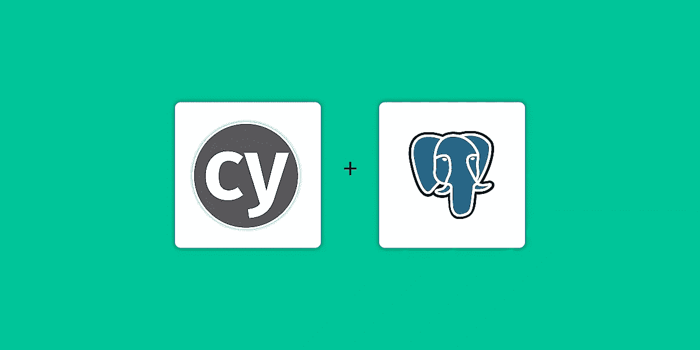
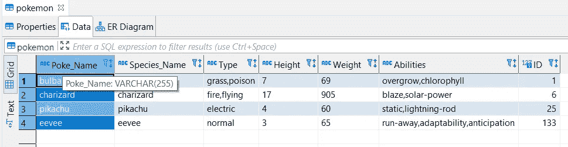

# 用 Cypress 测试数据库(第 8 部分)

> 原文：<https://medium.com/geekculture/database-testing-with-cypress-part-8-98bc8eff785d?source=collection_archive---------12----------------------->



你好，

在这个 Cypress 框架中，我们做了一些 cypress.io 默认不提供的有用的补充。在本文中，我们将了解如何利用到 SQL 数据库的连接，并使用它来验证存储在数据库表中的值。

## 安装 pg

[pg](https://www.npmjs.com/package/pg) 是 Node.js .纯 JavaScript 和可选原生 libpq 绑定的非阻塞 PostgreSQL 客户端。我们将使用它作为 JavaScript 代码到 SQL 数据库的连接器。我们从执行以下命令开始:

```
npm install --save-dev pg
```

pg 应该在 devDependencies 末尾的 ***package.json*** 文件中得到反映。


installing pg

# 连接到 SQL 数据库

为了连接到数据库，我们需要数据库的以下连接信息。我们将把这些信息添加到 cypress.json 文件末尾的“ ***env*** ”对象中。

cypress.json 文件中的数据库连接详细信息:

```
...  
"env":{
  "DB": {
      "user": "myuser",
      "host": "127.0.0.1",
      "database": "pokemonDB",
      "password": "pass",
      "port": 32763
  }
}
}
```

在本文中，我们使用一个简单的"***pokemon DB***" DB，并将在一个" pokemon "表上执行我们的操作，该表包含以下与 pokemon 生物相关的信息:



pokemon Table data

我们将从添加一个名为“数据库”的新 Cypress 任务开始。为此，我们将在 cypress/plugins/index.js 文件中添加一个新任务。这项任务接受两件主要的事情:

i) dbConfig —(这是使用 Cypress.env()
从 cypress.json 文件中检索的数据库连接信息)ii) sql —(这是我们需要执行的 sql 命令)

***cypress/plugins/index . js***添加了一个名为**数据库**的新任务后:

```
/// <reference types="cypress" />
// ***********************************************************
// This example plugins/index.js can be used to load plugins
//
// You can change the location of this file or turn off loading
// the plugins file with the 'pluginsFile' configuration option.
//
// You can read more here:
// https://on.cypress.io/plugins-guide
// ***********************************************************

// This function is called when a project is opened or re-opened (e.g. due to
// the project's config changing)

/**
 * @type {Cypress.PluginConfig}
 */

 const fs = require('fs-extra');
 const pg = require("pg");
 const path = require('path');
 const cucumber = require('cypress-cucumber-preprocessor').default;

module.exports = (on, config) => {
  on('file:preprocessor', cucumber());
  // `on` is used to hook into various events Cypress emits
  // `config` is the resolved Cypress config

 //Connects to an env db and fetches query result
 on("task", {
  DATABASE ({ dbConfig, sql, values }) {
    // const pool = new pg.Pool(config.db);
    const pool = new pg.Pool(dbConfig);
    try {
        return pool.query(sql, values)
    } catch (e) {
    }
  }
});

  function getConfigurationByFile(env) {
      const pathToConfigFile = path.resolve("cypress/config", `${env}.config.json`);

      return fs.readJson(pathToConfigFile);
  }
  //if no environment is provided, then QA env will be default
  const env = config.env.configFile || "qa";  

  return getConfigurationByFile(env);
};
```

现在为了执行一个简单的"*SELECT * FROM pokemon*" SQL 查询，我们将创建一个名为***DB _ test1 . feature***file 的示例特性文件

```
@DB
Feature: Test DB connection
    @smoke @test
    Scenario: Pokemon Table SQL query executions
        Given I execute select all query on pokemon DB
        When I execute selet query on pokemon DB, where name equals  "pikachu"
```

相应的 JavaScript 代码将如下所示。这里我们在“sql”参数下提供 SQL 查询部分。

***dbSteps.js*** 文件:

```
Given('I execute selet all query on pokemon DB',() => {
    cy.task("DATABASE", {
      dbConfig: Cypress.env("DB"),
      sql: `
      select * from pokemon    
      `
    }).then((result) => {
      console.log(result.rows)
    });
  });
```

然后，在执行这个测试时，我们的代码将产生表中的所有记录，并将它们打印在控制台上。

## 使用断言

为了对从 DB 中检索到的值进行断言，必须在我们获取“结果”对象的 then 块中完成。
**对数据库查询结果进行断言的测试步骤代码:**

```
When('I execute selet query on pokemon DB, where name equals {string}',(pokemonName) => {
    cy.task("DATABASE", {
      dbConfig: Cypress.env("DB"),
      sql: `
      select * from pokemon where Poke_Name = '${pokemonName}'   
      `
    }).then((result) => {
      console.log(result.rows[0]);
        expect(result.rows[0].Poke_Name).to.have.string(`${pokemonName}`);
    });
  });
```

> Github 代码:
> 
> [https://github . com/far 11 ven/Cypress-test framework/tree/develop/Part 08](https://github.com/far11ven/Cypress-TestFramework/tree/develop/Part%2008)

*最初发布于*[https://kushalbhalaik . XYZ](https://kushalbhalaik.xyz/blog/)