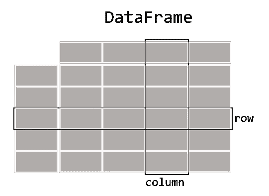
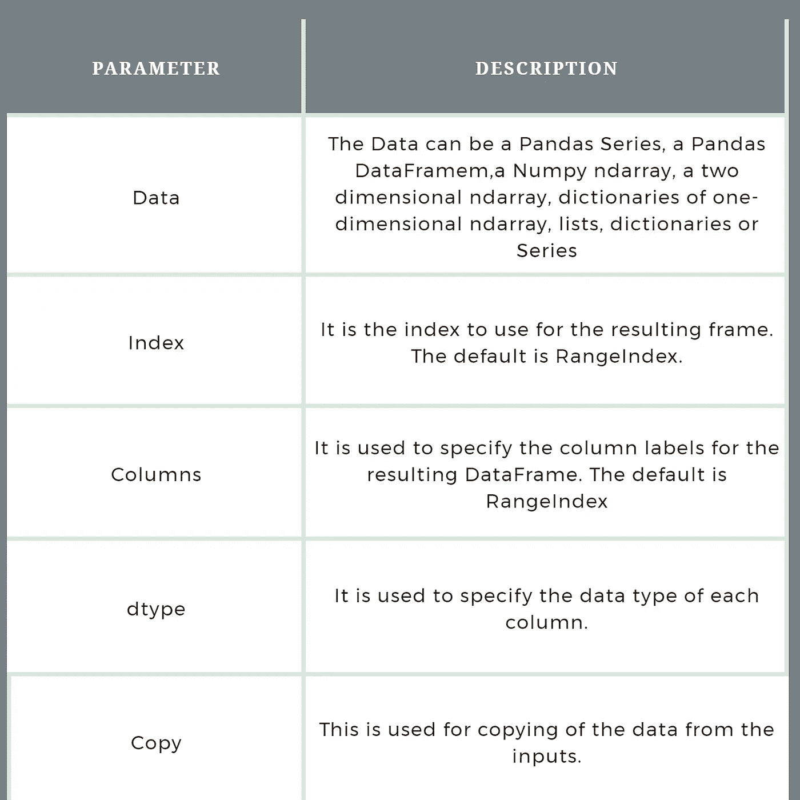

# Python 中的数据帧

> 原文：<https://medium.com/geekculture/dataframe-in-python-3dcc3af43f51?source=collection_archive---------10----------------------->

## 介绍

Guido Van Rossum 在 20 世纪 90 年代开发的 [Python](https://docs.python.org/3/) 编程语言在 2021 年栈溢出开发者调查中被列为第三大最受欢迎的编程语言。Python 的 Numpy 和 Pandas 包是全球 33.84%和 28.12%的开发者的首选，主要用于数据科学和机器学习。使用 Python 及其框架可以做很多事情。这篇博客介绍了 Python 中的 DataFrame 以及各种例子和程序。数据帧是 Pandas 包的主要数据结构。它提供了快速、灵活和富于表现力的数据结构，旨在使处理关系数据或标签数据更容易；pandas 的两种主要数据结构，系列(一维)或简单的对象数组和数据框架(二维)，经常用于金融和统计领域。

# Python 中的数据帧是什么？



Source: Pandas Documentation

一个[数据帧](https://www.interviewbit.com/python-interview-questions/#define-pandas-dataframe)被定义为二维的、大小可变的、潜在异构的表格数据。( ***“可变”意味着可以在数据帧中插入和删除列，潜在的异构数据意味着列可能包含不同数据类型的数据*** )。DataFrame 是熊猫的数据结构。它们是系列的容器，从这些容器中插入和删除对象是以类似字典的方式完成的。

> 创建数据帧的构造函数是:
> 数据帧([数据、索引、列、数据类型、副本])

该构造函数的参数如下:



Pandas 数据框架的三个主要组成部分是数据、索引和列。数据可以是 Pandas 系列、Pandas 数据帧、Numpy 数组、二维 n 数组、一维 n 数组的字典、列表、字典或系列。本博客将讨论数据帧的基本操作，如数据帧的创建、插入、删除、重命名和排序。在实际项目中，将通过从数据库、CSV 文件或 excel 文件加载数据来创建数据框架。首先，让我们看看除了直接导入表格数据之外，如何使用不同的方法创建 DataFrame:

# 数据帧的创建

在实际项目中，将通过从数据库、CSV 文件或 excel 文件加载数据来创建数据框架。首先，让我们看看除了直接导入表格数据之外，如何使用不同的方法创建 DataFrame:

*   ***使用列表创建数据帧***
    可以使用单个列表或一系列列表创建数据帧。

## 示例 1

此示例使用单个列表来创建数据帧。

```
import pandas as pd

# This will create an empty DataFrame
df1 = pd.DataFrame()
print(df1)

listOne = ['DataFrame', 'in','Python']

# Calling DataFrame constructor on list
df2 = pd.DataFrame(listOne)
print(df2)
```

上面的代码在执行时将生成一个熊猫数据帧，如下所示

```
Empty DataFrame
Columns: []
Index: []
          0
0 DataFrame
1        in
2     Python
```

## 说明

在上面的示例中，创建了一个 Python 列表。然后使用 pandas 包的 DataFrame()构造函数将该列表转换为 DataFrame。然后打印数据帧。注意，由于我们没有为行指定列名和索引，Python 默认会这样做，并为数据帧的各行提供从零开始的索引。您还可以通过对上面的代码做一点小小的修改来指定索引和列名。

## 示例 2

```
*import* pandas *as* pdlistOne = ['DataFrame', 'in','Python']# *Calling DataFrame constructor on list*df = pd.DataFrame(listOne, index=['i1','i2','i3'], columns=['Names'])print(df)
```

上述代码在执行时将生成如下所示的 Pandas 数据帧:

```
import pandas as pd
       Names
i1 DataFrame
i2        in
i3    Python
```

## 解释:

在上面的例子中，创建了一个 Python 列表 listOne。然后，使用 DataFrame()构造函数将该列表转换为 Pandas 数据帧。在上面的示例中，index=['i1 '，' i2 '，' i3']用于指定行索引，columns=['Names']用于指定列名。然后打印数据帧。请注意，DataFrame 现在有了我们在调用 DataFrame 构造函数时指定的列索引和行索引。

## 示例 3

此示例使用指定了列名和索引的多维列表。

```
import pandas as pd

listTwo = [[‘Alexa’, 10], [‘Siri’, ‘20’],[‘Echo’, 30]]

# Calling DataFrame constructor on list
df2 = pd.DataFrame(listTwo, index=[‘a’,’b’,’c’], columns=[‘Name’, ‘Score’])
print(df2)
```

其输出如下:

```
 Name Score
a Alexa 10
b Siri 20
c Echo 30
```

## 解释:

在上面的例子中，使用了列表的列表。然后，每个列表被视为数据帧中的单独一行。上面的示例中还使用了列名 columns=['Name '，' Score']，以及索引 index=['a '，' b '，' c']。

## 实例 4

这个例子使用了一个指定了列名、索引和数据类型的多维列表。

```
import pandas as pd

listTwo = [[‘Alexa’, 10], [‘Siri’, ‘20’],[‘Echo’, 30]]

# Calling DataFrame constructor on list
df2 = pd.DataFrame(listTwo, index=[‘a’,’b’,’c’], columns=[‘Name’, ‘Score’],dtype=float)
print(df2)
```

其输出如下:

```
 Name Score
a Alexa 10.0
b Siri  20.0
c Echo  30.0
```

注意，dtype 参数将 Score 列的类型更改为浮点型。

## 解释:

在上面的例子中，使用了一个列表列表，在调用构造函数时也指定了行索引和列名。此外，还使用了一个新参数，dtype=float。这指定了分数的数据类型是 float。

*   ***从列表字典创建数据框架***

字典用于以键、值对的形式存储数据。在下面的示例中，键是列名，值是这些列中的数据。

## 示例 1

```
import pandas as pd

data = {‘Name’:[‘ABC’,’DEF’,’GHI’], ‘Age’:[12, 13, 14]}

df = pd.DataFrame(data)
print(df)
```

上述代码的输出是

```
 Name Age
0 ABC  12
1 DEF  13
2 GHI  14
```

## 说明

在上面的例子中，创建了一个列表字典。注意，对应于键的值是列表格式的。然后，使用 DataFrame()构造函数将列表字典转换为 DataFrame。然后打印数据帧。

## 示例 2:

上面的例子非常简单。让我们考虑另一个例子，其中我们将得到 3 个列表，我们将把这些列表转换成字典，然后把字典转换成数据帧。

```
# Three Lists
name = ['ABC','DEF','GHI','JKL']
age = [20, 22, 26, 28]
qualifications = ['BA', 'B.Tech','B.Tech + MBA', 'CA']

# Defining a dictionary containing the name, age 
# and qualifications 
data_persons = {
    'Name': name,
    'Age' : age,
    'Qualifications' : qualifications
}

# Converting the dictionary into a DataFrame
df = pd.DataFrame(data_persons)
print(df)
```

上述代码的输出是:

```
Name  Age Qualifications
0  ABC   20             BA
1  DEF   22         B.Tech
2  GHI   26   B.Tech + MBA
3  JKL   28             CA
```

## 解释:

在上面的例子中，首先创建了三个列表，分别是姓名、年龄和资格。然后用关键字“姓名”、“年龄”和“资格”创建一个字典。对应于这些键的值分别是列表、姓名、年龄和资格。这样就创建了一个列表字典。然后使用 DataFrame()构造函数将其转换为 DataFrame 并打印出来。注意，字典的每个键都是数据帧中的一列。行索引是从零开始的。

*   ***从字典列表中创建数据帧***

字典列表可以作为输入数据传递，以创建数据帧。默认情况下，字典键将作为列名。

## 示例 1

```
import pandas as pd

# {'a': 1, 'b': 2} is first dictionary
# {'a': 3, 'b' : 4, 'c' : 7} is second dictionary
data = [{'a': 1, 'b': 2}, {'a': 3, 'b' : 4, 'c' : 7}]

# Converting the list of dictionaries to a DataFrame
df = pd.DataFrame(data)

print(df)
```

其输出如下:

```
 a  b    c
0  1  2  NaN
1  3  4  7.0
```

## 解释:

在上面的例子中，创建了一个字典列表。在每个字典中，键-值对用:分隔。然后使用 DataFrame()构造函数将词典列表转换为 DataFrame。
注意，在转换到数据帧时，每个键都变成列名，与之对应的值是数据帧的行。另外，值得注意的是，在第一个字典{'a': 1，' b': 2}中，与第二个字典{'a': 3，' b' : 4，' c' : 7}不同，只有两个键值对。因此，在结果数据帧中，对应于第三列的值被视为 NaN。NaN 代表非数字，是表示数据中缺失值的常用方法之一

总是建议指定行索引。行索引和列索引在其他操作中非常方便。

## 示例 2

下面的例子展示了如何创建一个包含字典列表、行索引和列索引的 DataFrame。

```
import pandas as pd

# {‘a’: 1, ‘b’: 2} is first dictionary
# {‘a’: 3, ‘b’ : 4, ‘c’ : 7} is second dictionary
data = [{‘a’: 1, ‘b’: 2}, {‘a’: 3, ‘b’ : 4, ‘c’ : 7}]

# Converting the list of dictionaries to a DataFrame
df = pd.DataFrame(data,index=[‘first’,’second’] , columns=[‘a’,’b’,’c’])

print(df)
```

其输出如下:

```
 a  b    cfirst   1  2  NaNsecond  3  4  7.0
```

## 解释:

在上面的例子中，创建了一个字典列表。然后使用 DataFrame()构造函数将词典列表转换为 DataFrame。我们还使用指定了行索引，index=['first '，' second']，使用 columns=['a '，' b '，' c']指定了列名。请注意，在转换到 DataFrame 时，每个键都成为列名，与之对应的值是 DataFrame 的行。然后打印数据帧，注意现在列名和行索引是我们指定的，而不是默认的从零开始的。

# 基本数据帧操作

*   **数据框的尺寸**
    shape()方法用于获取数据框的高度和宽度。
*   **数据帧头**
    Head()方法用于获取数据帧的前五行，tail()方法用于获取后五行。
*   **定位行**
    loc 属性用于返回一个或多个指定的行。
*   **获取列名**
    你可以通过使用 DataFrame 对象中的列来获取列名列表。
*   **获取所有列的数据类型**
    使用 dtypes 获取数据帧中每一列的数据类型。

还有许多其他基本的数据帧操作。下面的程序说明了上面讨论的基本操作。

```
import pandas as pd

# Three Lists
name = ['ABC','DEF','GHI','JKL','MNO','PQR']
age = [20, 22, 26, 28, 29, 30]
qualifications = ['BA', 'B.Tech','B.Tech + MBA', 'CA', 'Intermediate', 'MBBS']

# Defining a dictionary containing the name, age 
# and qualifications 
data_persons = {
    'Name': name,
    'Age' : age,
    'Qualifications' : qualifications
}

# Converting the dictionary into a DataFrame
df = pd.DataFrame(data_persons)
print(df)

# Shape
print("\n\nPrinting the shape of dataframe")
print(df.shape)

# Head
print("\n\nPrinting the head of dataframe")
print(df.head())

# Tail
print("\n\nPrinting the tail of dataframe")
print(df.tail())

# Location of row
print("\n\nPrinting the third row of dataframe")
print(df.loc[2])

# Column Names
print("\n\nPrinting the column names of dataframe")
print(df.columns)

# Data types
print("\n\nPrinting the Data Types of dataframe")
print(df.dtypes)
```

上述程序的输出是:

```
Name  Age Qualifications
0  ABC   20             BA
1  DEF   22         B.Tech
2  GHI   26   B.Tech + MBA
3  JKL   28             CA
4  MNO   29   Intermediate
5  PQR   30           MBBSPrinting the shape of dataframe
(6, 3)Printing the head of dataframe
  Name  Age Qualifications
0  ABC   20             BA
1  DEF   22         B.Tech
2  GHI   26   B.Tech + MBA
3  JKL   28             CA
4  MNO   29   IntermediatePrinting the tail of dataframe
  Name  Age Qualifications
1  DEF   22         B.Tech
2  GHI   26   B.Tech + MBA
3  JKL   28             CA
4  MNO   29   Intermediate
5  PQR   30           MBBSPrinting the third row of dataframe
Name                       GHI
Age                         26
Qualifications    B.Tech + MBA
Name: 2, dtype: objectPrinting the column names of dataframe
Index(['Name', 'Age', 'Qualifications'], dtype='object')Printing the Data Types of dataframe
Name              object
Age                int64
Qualifications    object
dtype: object
```

## 说明

在上面的例子中，创建数据帧的过程与上面在从列表字典创建数据帧的例子 2 中讨论的过程相同。输出顺序解释如下:

*   首先打印数据帧，然后打印其形状，即元组中的行数和列数。
*   数据帧的 head()是数据帧的前五行。
*   数据帧的 tail()是数据帧的最后五行。
*   df.loc[2]用于打印数据帧的第三行。注意，我们在 loc[]中指定了 2，因为除非明确指定，否则默认情况下使用从零开始的索引。
*   df.columns 用于打印数据帧的列标签。
*   df.dtypes 用于打印数据帧中所有列的数据类型。

# 对数据帧中的列的操作

在现有的数据框架中，我们可以非常容易地重命名列名、添加列和删除列。对列的所有三种基本操作解释如下:

## 添加列

要向数据框架添加新列，请创建一个系列，并将其作为新列分配给原始数据框架。以下示例说明了这一点:

```
import pandas as pd

listTwo = [[‘Alice’, 10], [‘Bob’, ‘20’],[‘Charlie’, 30]]

# Calling DataFrame constructor on list
df = pd.DataFrame(listTwo, index=[‘a’,’b’,’c’], columns=[‘Name’, ‘Age’],dtype=float)

print(“Printing the original DataFrame”)
print(df)

# Creating a pandas Series
states = pd.Series([‘New York’,’Seattle’,’Washington’])
# Assigning the pandas Series as a new column
df[‘state’] = states
print(“\n\n Printing the modified DataFrame”)
print(df)
```

上述程序的输出是:

```
Printing the original DataFrame
      Name   Age
a    Alice  10.0
b      Bob  20.0
c  Charlie  30.0Printing the modified DataFrame
      Name   Age state
a    Alice  10.0   NaN
b      Bob  20.0   NaN
c  Charlie  30.0   NaN
```

## 解释:

在上面的例子中，首先使用列表的列表创建一个 DataFrame，在 DataFrame()构造函数中指定了行索引和列名以及数据类型。然后打印 DataFrame()。

一个名为“系列”的熊猫系列诞生了。熊猫系列被指定为数据框的新列。然后打印修改后的数据帧。

## 列的重命名

我们可以使用。熊猫的 rename()方法。以下示例说明了单列和多列的重命名

```
import pandas as pd

df = pd.DataFrame({
        'Name' : ['Alice','Bob','Charlie'],
        'Age' : [12, 13, 14]
     })

print("Printing the original DataFrame")
print(df)

# Renaming of single column 'Name'
df.rename(columns={'Name':'FirstName'}, inplace=True)
print("\n\nPrinting the DataFrame after changing a single column\n")
print(df)

# Renaming of multiple columns
df.rename(columns={'FirstName':'fName', 'Age':'Years'}, inplace=True)
print("\n\nPrinting the DataFrame after changing multiple column names\n")
print(df)
```

输出如下所示:

```
Printing the original DataFrame
      Name  Age
0    Alice   12
1      Bob   13
2  Charlie   14Printing the DataFrame after changing a single column FirstName Age
0     Alice   12
1       Bob   13
2   Charlie   14Printing the DataFrame after changing multiple column names fName  Years
0    Alice     12
1      Bob     13
2  Charlie     14
```

## 解释:

在上面的例子中，首先使用列表字典创建一个数据帧。然后打印原始数据帧。

df.rename()方法用于重命名列名，方法是将原始列名和修改后的列名作为字典的键:值对，columns={'Name':'FirstName'}。inplace=True 用于指定数据被就地修改，这意味着它将不返回任何内容，并且原始数据帧现在已被修改。然后打印修改后的数据帧。

再次使用 df.rename()方法。这一次将重命名两个列名。原始列名和修改后的列名都作为字典中的键:值对传递，columns={'FirstName':'fName '，' Age':'Years'}。然后打印修改后的数据帧。

当重命名一列或几列时，上面的方法非常方便。然而，对于包含数百个列的大型数据集，指定新旧名称变得很繁琐。在这种情况下，可以通过分配一系列新的列名来进行重命名。

```
import pandas as pd

df = pd.DataFrame({
 ‘Name’ : [‘Alice’,’Bob’,’Charlie’],
 ‘Age’ : [12, 13, 14]
 })

print(“Printing the DataFrame column names”)
print(df.columns)

# Modifying the column names by passing a list of new column names.
df.columns = [‘FName’, ‘Years’]
print(“Printing the DataFrame column names after modification”)
print(df.columns)
```

输出如下所示:

```
Printing the DataFrame column names
Index([‘Name’, ‘Age’], dtype=’object’)
Printing the DataFrame column names after modification
Index([‘FName’, ‘Years’], dtype=’object’)
```

## 解释:

在上面的例子中，DataFrame 是使用列表字典创建的。print(df.columns)用于打印数据帧的列名。

通过传递新列名的列表来修改列名，df.columns = ['FName '，' Years']。然后打印修改后的列名。

## 删除列

可以使用 del 和 pop()函数删除列。以下示例说明了列的删除。

```
import pandas as pd

# Three Lists
name = ['ABC','DEF','GHI','JKL']
age = [20, 22, 26, 28]
qualifications = ['BA', 'B.Tech','B.Tech + MBA', 'CA']

# Defining a dictionary containing the name, age 
# and qualifications 
data_persons = {
    'Name': name,
    'Age' : age,
    'Qualifications' : qualifications
}

# Converting the dictionary into a DataFrame
df = pd.DataFrame(data_persons)
print(df)

# Using the del function
print("\n\nDeleting the first column")
del df['Name']
print(df)

# Using the pop function
print("\n\nDeleting the second column")
df.pop('Age')
print(df)
```

其输出如下:

```
 Name  Age Qualifications
0  ABC   20             BA
1  DEF   22         B.Tech
2  GHI   26   B.Tech + MBA
3  JKL   28             CADeleting the first column
   Age Qualifications
0   20             BA
1   22         B.Tech
2   26   B.Tech + MBA
3   28             CADeleting the second column
  Qualifications
0             BA
1         B.Tech
2   B.Tech + MBA
3             CA
```

## 解释:

在上面的例子中，首先，使用列表字典创建数据帧。打印原始数据帧。
然后使用 del df['Name']，通过传递列名来删除单个列。再次打印数据帧。
然后使用 df.pop['Age']通过传递列名来删除另一列。再次打印数据帧。

除了语法上的区别，del 和 pop 方法之间的另一个区别是 pop 从列表中返回被删除的值，而 del 不返回任何内容。

# 对数据帧中行的操作

在现有的数据框架中，我们可以非常容易地添加和删除一行。所有这三种基本操作都在下面讨论:

## 插入行

我们可以使用 append 函数向数据帧添加一个新行。该函数用于在末尾插入行。下面的例子说明了这一点:

```
import pandas as pd

df1 = pd.DataFrame([[1, 2], [3, 4]], columns = ['col1','col2'])
print("Original DataFrame")
print(df1)

df2 = pd.DataFrame([[5, 6],[7, 8]], columns=['col1','col2'])
df1 = df1.append(df2)
print("\n\nDataFrame df1 after concatenation with df2")
print(df1)
```

输出如下所示:

```
Original DataFrame
   col1  col2
0     1     2
1     3     4DataFrame df1 after concatenation with df2
   col1  col2
0     1     2
1     3     4
0     5     6
1     7     8
```

## 说明

在上面的例子中，使用一个列表的列表创建了一个数据帧 df1，还指定了列名。然后打印原始数据帧。

以类似的方式创建新的数据帧 df2。append 将调用数据帧视为主对象，并将数据帧中的行添加到该数据帧中，这些数据帧作为参数 df1 传递给函数。Append()用于将 df2 插入到 df1 中。然后打印修改后的数据帧。

除了 append()方法之外，concat()方法也可用于在数据帧中插入/添加行。如下例所示:

```
import pandas as pd

df1 = pd.DataFrame([[1, 2], [3, 4]], columns = ['col1','col2'])
print("Original DataFrame")
print(df1)

df2 = pd.DataFrame([[5, 6],[7, 8]], columns=['col1','col2'])
df1 = pd.concat([df2, df1]).reset_index(drop = True)
print(df1)
```

输出如下所示:

```
Original DataFrame
   col1  col2
0     1     2
1     3     4
   col1  col2
0     5     6
1     7     8
2     1     2
3     3     4
```

## 说明

在上面的例子中，首先，使用列表的列表创建数据帧 df1。还指定了列名。然后打印原始数据帧。以类似的方式创建另一个数据帧 df2。
concat()方法用于沿着特定的轴连接熊猫对象。使用 concat()方法连接两个数据帧 df1 和 df2。然后打印修改后的数据帧。

## 删除行

可以使用索引标签从数据帧中删除行，使用。drop()方法。下面的例子说明了这一点

```
import pandas as pd

# Three Lists
name = ['ABC','DEF','GHI','JKL','MNO','PQR']
age = [20, 22, 26, 28, 29, 30]
qualifications = ['BA', 'B.Tech','B.Tech + MBA', 'CA', 'Intermediate', 'MBBS']

# Defining a dictionary containing the name, age 
# and qualifications 
data_persons = {
    'Name': name,
    'Age' : age,
    'Qualifications' : qualifications
}

# Converting the dictionary into a DataFrame
df = pd.DataFrame(data_persons)
print(df)

# Drop row with label 2
df = df.drop(2)
print("\n\n Printing DataFrame after deletion of a row")
print(df)
```

输出如下所示:

```
Name  Age Qualifications
0  ABC   20             BA
1  DEF   22         B.Tech
2  GHI   26   B.Tech + MBA
3  JKL   28             CA
4  MNO   29   Intermediate
5  PQR   30           MBBSPrinting DataFrame after deletion of a row
  Name  Age Qualifications
0  ABC   20             BA
1  DEF   22         B.Tech
3  JKL   28             CA
4  MNO   29   Intermediate
5  PQR   30           MBBS
```

## 说明

在上面的例子中，首先，使用列表字典创建数据帧，然后打印数据帧。
df . drop()方法用于根据行号删除一行，在本例中是默认的从零开始的索引。然后打印修改后的数据帧。

# 结论

本文讨论了 python 中的数据帧、它的实现以及对它的各种操作，并给出了例子。强烈建议学习这些操作，并实际自行实现。[了解更多](https://pandas.pydata.org/docs/reference/api/pandas.DataFrame.html)。

也探索其他操作。你探索得越多，获得的知识就越多！！

如果你对在采访中被问到的关于熊猫的问题类型感到困惑，你必须参考结构化面试问题列表。它们是由专家策划的，涵盖了面试中几乎所有的重要概念。