# DataOps:使用 LakeFS 进行数据版本控制

> 原文：<https://medium.com/geekculture/dataops-using-lakefs-for-data-version-control-6ef5ddd65ebe?source=collection_archive---------6----------------------->

## 如果 Git 是用于代码版本控制，那么我们可以使用 LakeFS 进行数据版本控制吗？


Photo by [Saketh Garuda](https://unsplash.com/@sakethgaruda) on [Unsplash](https://unsplash.com/photos/oAcozr3ru3E)

Git 是代码版本控制领域的游戏改变者，每个开发人员都同意这一点。多个开发人员能够轻松地在项目上工作，每个团队成员都能够在项目的不同部分工作，直到发布完整的产品。在 Git 的帮助下，开发人员能够开发新特性，并将新特性无缝地引入生产环境。这正是 LakeFS 带给数据世界的解决方案。

问题是我们能否拥有一个系统来监控和跟踪投入生产的数据的变化？在团队成员错误地引入扰乱生产环境的脏数据之前，我们能否回滚到以前工作正常的数据？答案是肯定的，我们可以。我们需要推出坏数据并回滚到更干净的数据，在 LakeFS 的帮助下，我们可以通过一个命令轻松实现这一点。

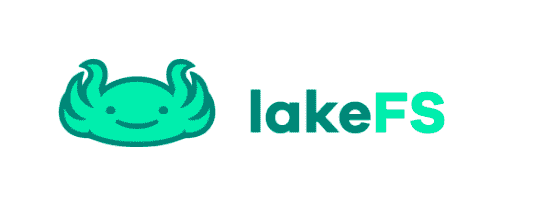

Photo by [LakeFS](https://github.com/treeverse/lakeFS)

# LakeFS 帮助解决什么问题？

这些是我们作为数据工程师每天遇到的一些问题，这些是 LakeFS 帮助解决的一些问题。LakeFS 解决的一些问题包括从数据错误中无缝恢复、数据重新处理和回填、生产问题的故障排除、交叉收集一致性以及建立数据质量。

例如，如果您的 Spark 代码如下所示:

```
df **=** spark.read.parquet(“s3a://my-bucket/collections/foo/”)
```

然后您可以插入您的应用程序，使用下面的命令直接从 LakeFS 分支读取:

```
df **=** spark.read.parquet(“s3a://my-repo/main-branch/collections/foo/”)
```

这允许您在将数据投入生产之前测试和验证开发中的数据。我知道在这一点上，一切看起来仍然可疑，但不要担心，你会知道这是如何运作的。

在这篇博文中，我们将建立 LakeFS:一个与 AWS S3 存储桶通信并跟踪数据变化的数据版本控制系统。这种方法可以适用于 Azure blob 存储或 Google 云存储，而不是使用 AWS S3 存储桶，但重点将是 AWS S3 存储桶。如果你热衷于学习如何设置这个，那就跟我来。

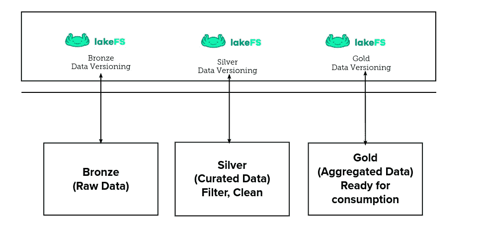

LakeFS for Delta Lake version control (Image by author)

这篇文章中使用的数据是由 [Kaggle](https://www.kaggle.com/datasets/bravehart101/sample-supermarket-dataset) 提供的开源样本超市数据集。在本帖中，我们将创建一个 AWS S3 桶并将我们的数据上传到 S3 桶，在 LakeFS 可以与我们的 S3 桶通信之前设计一个专用的 AWS IAM 角色。我们还将为我们的 bucket 创建一个 AWS bucket 策略，在本地安装和配置 AWS CLI，然后使用 Docker Compose 文件设置 LakeFS。

我们还将在本地安装和配置 LakeFS CLI (lakectl ),并且我们将使用 LakeFS CLI 从终端创建一个数据存储库。下面是最有趣的部分，我们将使用 lakectl 向主分支上传新数据。然后，我们将创建一个新的分支，并使用 lakectl 命令上传缺少列的数据，以模拟如何使用 LakeFS 处理生产中的中断，最后我们将回滚到具有完整列的先前数据。

让我们开门见山，不要浪费太多时间，在当地建立 LakeFS。您也可以在云上设置它，并在您公司的环境中添加不同的贡献者。出于本文的目的，您将需要一个 AWS 帐户，并且需要创建一个 AWS S3 桶。你也可以使用 MinIO 来代替 S3 桶，它的 API 与 AWS S3 桶兼容，但是我们将使用 AWS S3 桶来存储我的对象。这样，你就可以走了。

# **#1 创建一个 AWS S3 存储桶，并将您的数据上传到 S3 存储桶**

从 AWS 控制台，导航到 AWS S3 铲斗控制台，点击**创建铲斗，**，然后输入您的铲斗名称，其他选项为默认。下载数据集并将文件上传到 bucket 中。

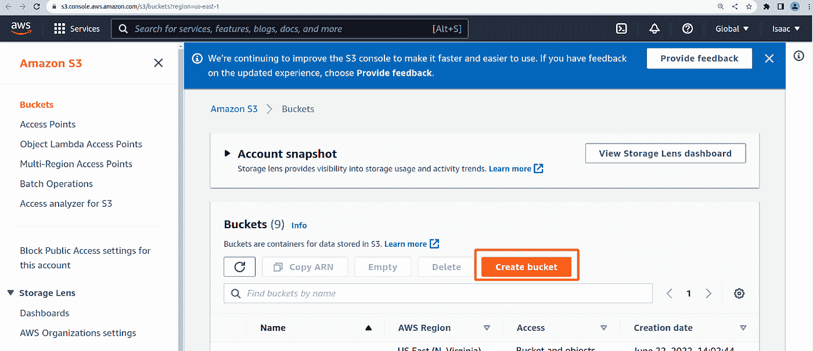

AWS S3 bucket creation icon (Image by author)

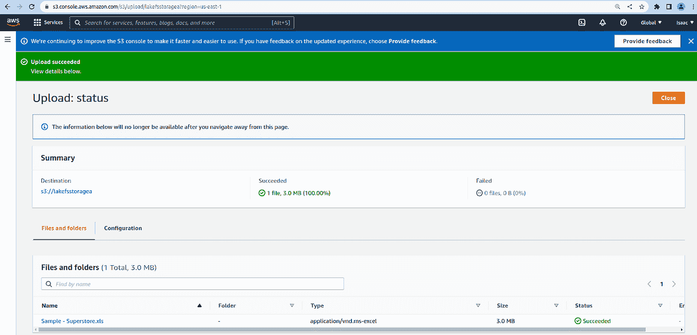

Image showing data uploaded to the S3 bucket (Image by author)

# **#2 为您的存储桶创建一个专用的 AWS IAM 角色**

导航到 AWS IAM 角色控制台，并为您的存储段创建 IAM 角色和策略。您可能希望为您的 AWS 资源提供严格的规则，在这种情况下，请非常认真地对待这一点，您不希望暴露基础架构安全方面的漏洞。在我们的例子中，IAM 策略如下所示:

# **#3 为您的 S3 时段创建 AWS 时段策略**

在我们能够在 AWS 控制台上创建 IAM 角色策略之后，现在是我们创建 bucket 策略的时候了。存储桶策略如下所示:

# **#4 在本地获取并配置 AWS CLI**

为了从 LakeFS 环境中与 AWS S3 存储桶进行通信，我们必须设置 AWS CLI 并充分配置 CLI，这样我们就能够执行不同的操作，如从 AWS S3 存储桶向我们的存储库注入数据，从 LakeFS CLI 连接并创建 S3 存储桶等。为了实现这一点，我们将执行以下操作:

*   **获取 AWS CLI 包，并在您的终端中使用以下命令进行安装:**

```
**# Get the AWS CLI package** curl "https://awscli.amazonaws.com/awscli-exe-linux-x86_64.zip" -o "awscliv2.zip"**# Unzip the file** unzip awscliv2.zip**# Install the AWS CLI package and move the installation to the bin folder** ./aws/install -i /usr/local/aws-cli -b /usr/local/bin**# Check the version of AWS installed to confirm that the CLI is installed** aws --version
```

如果你做了正确的事情，那么你会看到如下的截图:


**AWS CLI version confirmation (Image by author)**

*   **配置 AWS CLI**

由于我们看到 AWS CLI 已成功安装，我们将配置 CLI。我们将需要 AWS IAM 用户凭证，我们只需要我们的访问密钥，秘密访问密钥，默认区域是 **us-east-1** ，默认输出格式是 **json** 。

```
aws configure
**# Result will look like the below**
# AWS Access Key ID [None]: AKIATExample
# AWS Secret Access Key [None]: HSIIYDJKejkjsiExample
# Default region name [None]: us-east-1
# Default output format [None]: json
```

为了确认我们的配置工作正常，让我们列出我们客户中的所有 AWS S3 产品。下面还提供了结果截图:

```
aws s3 ls
```

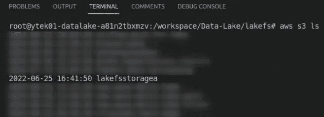

List of S3 buckets in the AWS account (Image by author)

# **#5 使用 Docker 合成文件设置 LakeFS**

随着 AWS CLI 的启动，我们将继续使用 Docker 容器设置 LakeFS 和 Postgres 数据库。Postgres 数据库用于存储和检索 LakeFS 操作的元数据。以下是实现这一目标的步骤。你可以直接从 LakeFS GitHub 仓库中获取，这里有[的](https://github.com/treeverse/lakeFS)。你也可以从官方的 LakeFS Docker [hub](https://hub.docker.com/r/treeverse/lakefs) 获取你的 LakeFS 图片。但是不要担心，我已经在我的 GitHub 库中包含了这个 Docker Compose 文件的副本，可以克隆这个库并自由使用它:

```
git clone [https://github.com/yTek01/data-versioning-using-lakefs.git](https://github.com/yTek01/data-versioning-using-lakefs.git)
```

**启动 Docker 容器:**

```
docker-compose -f docker-compose.LakeFS.yaml up -d
```

非常重要的是，当你读到这篇博文的时候，Docker 图片可能已经有了一个重要的更新，一定要更新它。容器启动并运行后，从浏览器转到 [http://localhost:8000](http://localhost:8000/) ，如果一切正常，您将看到类似下面的截图:

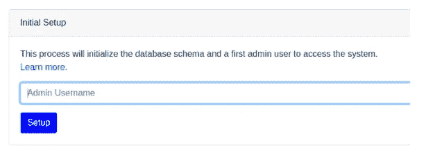

LakeFS initialization page (Image by author)

输入您的管理员信息并进入下一页。在下一页，您将看到访问 LakeFS UI 控制台所需的凭证。现在确保下载 lakectl.yaml 文件。这将是您最后一次看到凭据，因此请确保下载它们。它包含在初始化页面上显示的凭据。输入您在上一页下载的访问密钥 ID 和秘密访问密钥，并使用凭据登录。

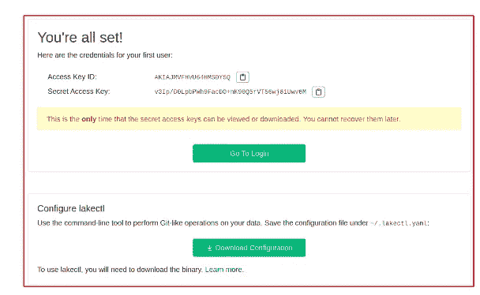

LakeFS UI login page (Image by author)

您应该会看到存储库窗口，如下图所示:

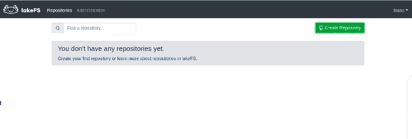

LakeFS Repository (Image by author)

# **#6 在本地获取并配置 LakeFS CLI(lake CTL)**

LakeFS 启动并运行后，我们将按照以下步骤设置 LakeFS CLI。LakeFS CLI (lakectl)是 LakeFS 的一个方面，它允许我们从命令行界面管理 LakeFS 资源。

**使用以下命令进行设置:**

```
**# Get the LakeFS CLI set up file with the command below:**
wget   [https://github.com/treeverse/lakeFS/releases/download/v0.68.0/lakeFS_0.68.0_Linux_x86_64.tar.gz](https://github.com/treeverse/lakeFS/releases/download/v0.68.0/lakeFS_0.68.0_Linux_x86_64.tar.gz)**#** **Extract the lakectl file using the command below:** tar -xf lakeFS_0.68.0_Linux_x86_64.tar.gz**Move the extracted file to the bin location so that we can use lakectl from anywhere in our instance:** mv lakectl /usr/local/bin
```

配置 LakeFS CLI 进行通信，以便我们可以与 AWS S3 和 LakeFS 实例进行通信。您的访问密钥 Id 和秘密访问密钥是从 LakeFS UI 下载的，而不是 AWS 用户 IAM 凭证。对于本地部署，您的服务器端点 URL 是 [http://127.0.0.1:8000](http://127.0.0.1:8000) 。

```
lakectl config**# My result looks like this.**
# Config file /root/.lakectl.yaml will be used
# ✔ Access key ID: AKIAJVYVYBRAExample█
# ✔ Secret access key: ****************************************█
# Server endpoint URL: http://127.0.0.1:8000
```

# **#7 使用 LakeFS CLI (lakectl)创建一个存储库**

现在，我们可以开始从 UI 或 CLI 创建我们的存储库。确保您的 LakeFS 容器可以与 AWS S3 通信。如果您在 UI 和 LakeFS CLI 上看到与“**未能创建存储库:未能访问存储库**”相关的错误，那么应该知道 AWS 凭证有问题。LakeFS 无权访问您的 AWS 凭据。如果您试图从 CLI 与 LakeFS 通信，请确保您拥有正确的权限，否则您将会得到****“错误认证请求”**。**

****我们将使用 LakeFS CLI 创建一个 LakeFS 存储库，命令如下:****

```
lakectl repo create lakefs://stagingtable s3://lakefsstoragea -d main
```

# ****#8 使用 lakectl 命令将数据摄取到主分支****

**我们可以决定通过不同的选项将数据接收到我们的 LakeFS 环境中，我们可以上传(将本地文件上传到指定的 URI)，我们可以决定使用接收方法(将对象从外部源加载到 LakeFS 分支，而不实际复制它们)。在我们的例子中，我们将使用下面的命令将上传到 S3 存储桶的数据接收到主分支中:**

```
lakectl ingest --from s3://lakefs.data.versioning/Sample_Superstore.xlsx --to lakefs://stagingtable/main/store/Sample_Superstore.xlsx
```

**结果显示在下面截图中的终端上。**

**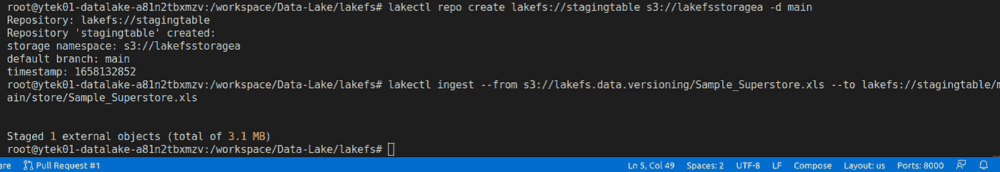**

**Response of the ingestion method (Image by author)**

**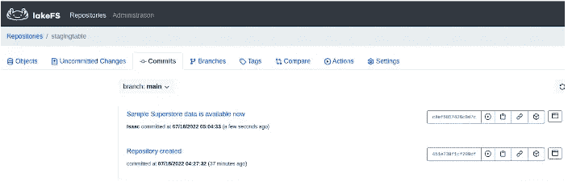**

**List of LakeFS commits to the main branch (Image by author)**

# ****#9 使用 LakeFS CLI 创建一个新分支并上传缺少列的数据****

**此时，我们将创建一个新的分支，并将不完整的数据上传到该分支中，我们将有意识地这样做，看看我们如何在生产中处理这种类型的暴行，并回滚我们工作数据的先前版本。过程如下。**

****创建一个新的分支来存放不完整的数据，以展示暴行:****

```
lakectl branch create lakefs://stagingtable/removed-a-column-from-data --source lakefs://stagingtable/main
```

**#执行命令后的终端响应如下所示:**

```
Source ref: lakefs://stagingtable/main
created branch ‘removed-a-column-from-data’ 451e738f1cf290df0cc52eb339c0c4a7788fb59e8dff3ecdf7ef640fdff74f11
```

**下面的屏幕截图显示了 LakeFS UI 中现在可用的分支列表。**

**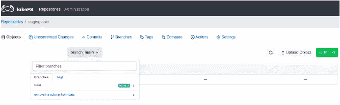**

**List of branches in the stagingtable repository (Image by author)**

****将数据上传到名为‘removed-a-column-from-data’的新分支:****

```
lakectl fs upload -s Sample_Superstore.xlsx lakefs://stagingtable/removed-a-column-from-data/store/Sample_Superstore.xlsx
```

**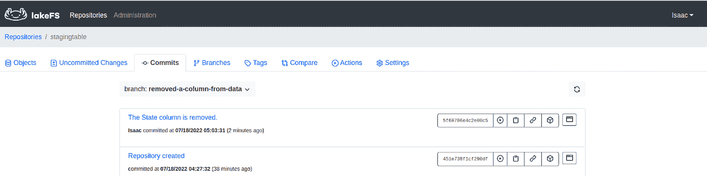**

**List of commits (Image by author)**

**合并新分行和主分行**

**上面，我们的新数据在特征分支中，我们将分支合并到主分支中。以下命令有助于我们实现这一目标:**

```
lakectl merge lakefs://stagingtable/removed-a-column-from-datalakefs://stagingtable/main
```

**合并两个分支后的数据结果如下所示:**

**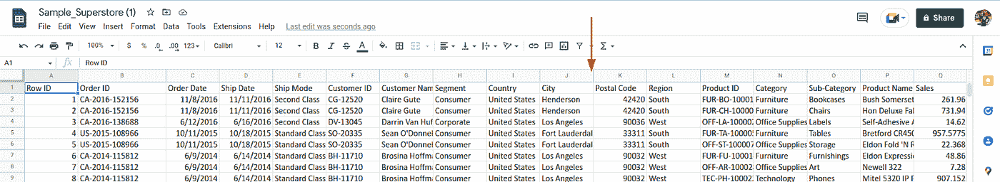**

**Superstore data without the State column (Image by author)**

# ****#10 使用已完成的列**回滚到之前的数据**

**对于存储库中不需要的数据，我们必须回滚已经导致的更改。在我们的例子中，一个非常重要的列丢失了，State 列必须包含在我们的示例超市数据中。我们将把最后一次合并操作中所做的所有更改恢复到最近一次提交时的状态，即没有错误。以下命令有助于我们实现这一目标:**

```
lakectl branch revert lakefs://stagingtable/main <commit_id> --yes
```

**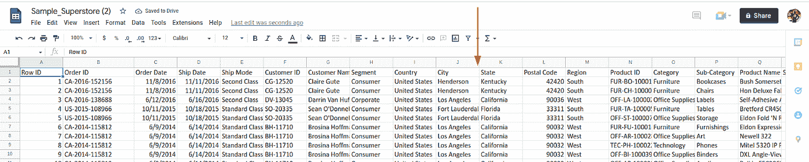**

**Table with State column after rolling back to the initial commit (Image by author)**

**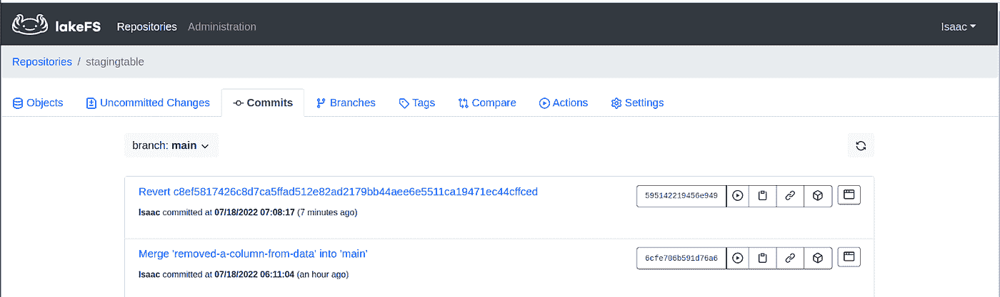**

**Commit page showing the reverting operation (Image by author)**

# ****结论****

**在这篇文章中，我们已经展示了在 LakeFS 的帮助下管理我们的数据操作是多么容易。LakeFS 帮助我们在一个非常接近 Git 代码版本管理的过程中管理我们的数据。有趣的是，LakeFS 为您提供了一个 S3 兼容性 API，允许我们在数据管道中直接使用 LakeFS 功能分支链接，以在我们将数据工作负载转移到生产中之前确认一切正常。事实上，您可以自动化数据质量验证，并抽象掉手工工作。**

****推荐阅读****

**[1] [什么是 LakeFS — LakeFS](https://docs.lakefs.io/)**

**[2] [LakeFS Github 页面— Treeverse](https://github.com/treeverse/lakeFS)**

**[3] [数据版本化:您需要知道的一切— Bex T.](https://towardsdatascience.com/data-versioning-all-you-need-to-know-7077aa5ed6d1)**

**感谢您的阅读。我很乐意回答任何问题，并听取任何意见。**