# SQL 中的日期和时间函数

> 原文：<https://medium.com/geekculture/date-and-time-functions-in-sql-fae1a014ad36?source=collection_archive---------10----------------------->

Photo by [Sonja Langford](https://unsplash.com/@sonjalangford?utm_source=unsplash&utm_medium=referral&utm_content=creditCopyText) on [Unsplash](https://unsplash.com/s/photos/time?utm_source=unsplash&utm_medium=referral&utm_content=creditCopyText)

能够处理数据中的日期和时间对于获得重要见解至关重要，MySQL 为用户提供了一组**日期和时间函数**来操作日期和时间值。

> 将这篇文章添加到您的阅读列表中，每当您遇到与日期和时间函数相关的问题时，请访问它。

Photo by [Joan Gamell](https://unsplash.com/@gamell?utm_source=unsplash&utm_medium=referral&utm_content=creditCopyText) on [Unsplash](https://unsplash.com/s/photos/functions?utm_source=unsplash&utm_medium=referral&utm_content=creditCopyText)

## **CURDATE():**

该函数返回当前日期，格式为***‘YYYY-MM-DD’。***

## **CURTIME():**

该函数以***‘HH-MM-SS’，*** 的格式返回当前时间，并且还提供了指定最高达 6 位精度的秒的选项。

query to return the current date and the time precisely upto 4 digits

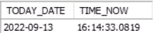

result of the above query [you can see that the seconds in time is precise up to 4 digits]

## 制作日期(年、月、日):

该函数接收两个参数 year 和一年的第 n 个日期，并以***‘YYYY-MM-DD’的格式返回日期。***

## *生产时间(小时、分钟、秒):*

该函数总共接收三个参数小时、分钟和秒，并以***‘HH-MM-SS’的格式返回时间。***

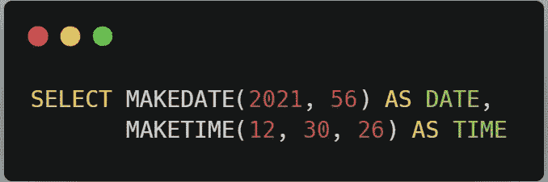

query to return the 56th date of the year 2021 and the time (hr=12, min=30, sec=26)

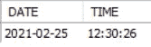

results of the above query

## CONVERT_TZ(日期，从，到):

此功能用于将时间从一个时区更改为另一个时区。

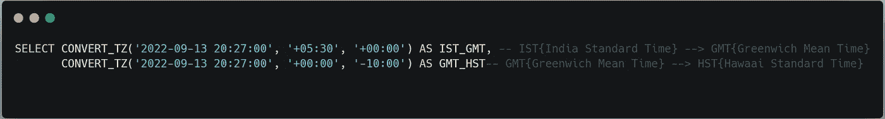

query to convert the IST to GMT and GMT to HST

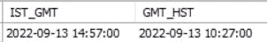

results for the above query

## 日名(日期):

该函数返回日期的星期名称(日期必须以***【YYYY-MM-DD】***的格式提及)。

## 星期几(日期):

此函数从日期(日期必须以***【YYYY-MM-DD】***的格式提及)返回一个月中的第几天(1–31)。

## 星期几(日期):

此函数从日期中返回一周中的第几天(1–7)。 *{1 →周日，2→周一，3 →周二，4 →周三，5 →周四，6 →周五，7→周六}。*

## 年月日:

此函数从日期返回一年中的某一天(***1–365/366***)(日期必须以***【YYYY-MM-DD】***的格式提及)。

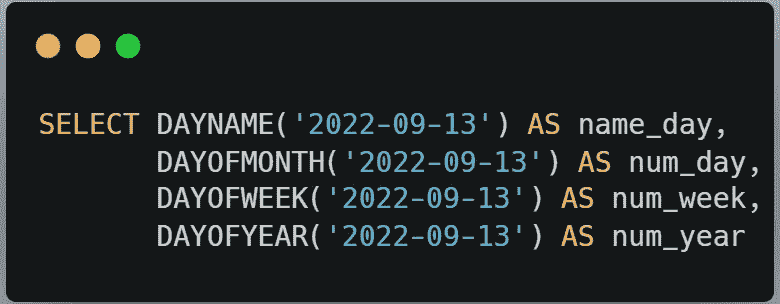

query to return the name of the day, day of the month, day of the week and day of the year for the given date

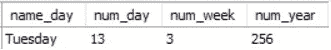

results for the above query

## 时间():

此函数返回时间或日期时间表达式的时间部分。

## 时间差异(A1，A2):

此函数返回日期时间或时间表达式(A1-A2)的时间部分之间的差值。 *{A1 和 A2 必须是同一类型，即如果 A1 是日期-时间，那么 A2 必须是日期-时间类型；如果 A1 是时间类型，那么 A2 必须是时间类型}。*

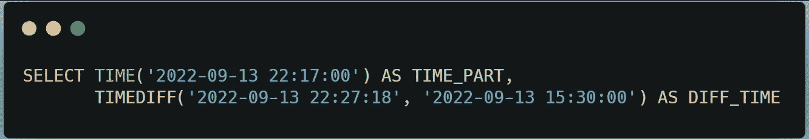

query to return the time part of the date-time expression and difference in time between the two given arguments.

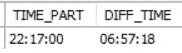

results for the above query

## 时间戳(A1)/时间戳(A1，A2):

该函数同时运行单个参数和两个参数，在单个参数的情况下，该函数将日期表达式作为日期时间表达式返回，在两个参数的情况下 *{A1 是日期时间表达式，A2 是时间表达式}* 将时间表达式(A2)添加到 A1 并返回*。*

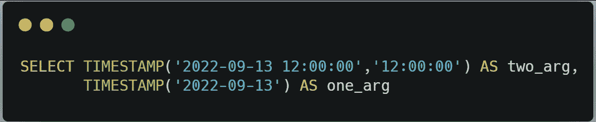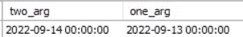

results of the above query

## TIMESTAMPADD(单位，间隔，A1):

将整数表达式 interval 添加到日期或日期时间表达式 A1(日期-时间表达式)中，interval 的单位由 unit 参数给出，它应该是下列值之一:微秒、秒、分钟、小时、日、周、月、季度和年。

## TIMESTAMPDIFF(单位，A1，A2):

此函数返回整数值 A2-A1{A2 和 A1 是日期/日期时间表达式}，并返回其单位由 unit 参数定义的值。

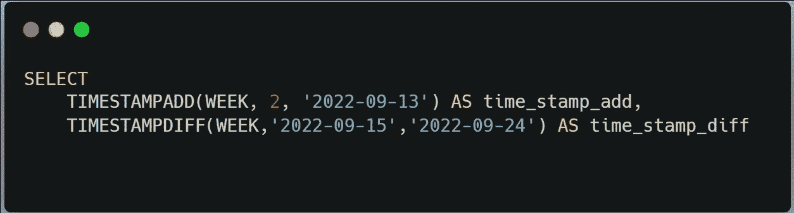

query to return the timestampadd and timestampdiff

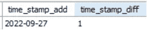

results of the above query (as the week difference between 24th September and 15 September more than 1 and less than 2 the function returns 1)

## 微秒(时间):

从时间/日期-时间表达式返回 0 到 999999 范围内的微秒数。

## 秒(时间):

返回从 0 到 59 范围内的时间/日期-时间表达式的秒数。

## 分钟(时间):

返回 0 到 59 范围内的分钟/日期-时间表达式。

## 季度(日期):

对于 1 到 4 范围内的日期，返回一年中的第几个季度。

## 月份名称(日期):

返回日期所在月份的全名。

## 月份(日期):

返回 1 到 12 范围内的日期月份。*{ 1→1 月，2→2 月，3→3 月，…12→12 月}* 。

## 年份(日期):

该函数返回日期中的年份部分。

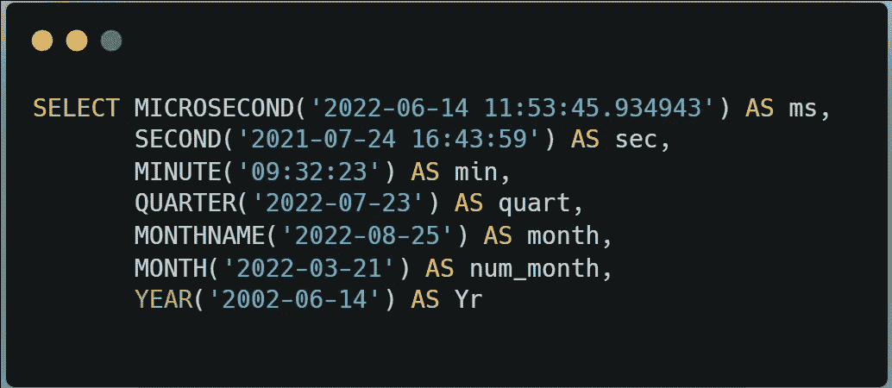

query to return the value of microsecond, second, minute, quarter, monthname, month and year.

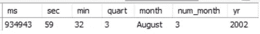

results of the above query

## 工作日(日期):

从日期/日期时间表达式返回日期*(0→星期一，1→星期二，2→星期三，3→星期四，4→星期五，5→星期六，6→星期日)*的工作日索引。

## 一年中的第几周(日期):

从日期/日期-时间表达式中返回 1 到 53 范围内日期的日历周。

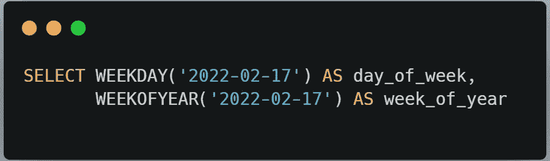

query to obtain weekday and weekofyear

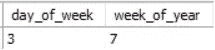

results of the above query

## 摘录(单位起始日期):

该函数从日期/日期-时间表达式中提取指定的单位值。*{单位—年，年 _ 月，时 _ 分，分 _ 秒}。*

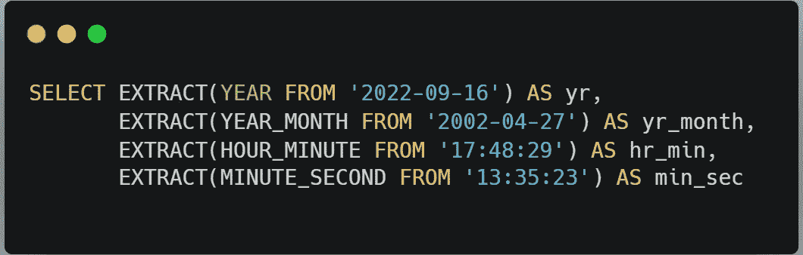

query to extract year, yearmonth, hourminute, minutesecond from date/date-time expression

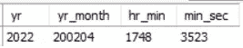

results of the above query

## 总结:

因此，本文讨论了一些重要的日期和时间函数来操作日期和时间数据，将它作为一个备忘单，并在您有疑问时访问它。

感谢您的阅读。…………………