# 用于角度应用的 DatoCMS

> 原文：<https://medium.com/geekculture/datocms-for-angular-applications-424eb83e6ee8?source=collection_archive---------26----------------------->

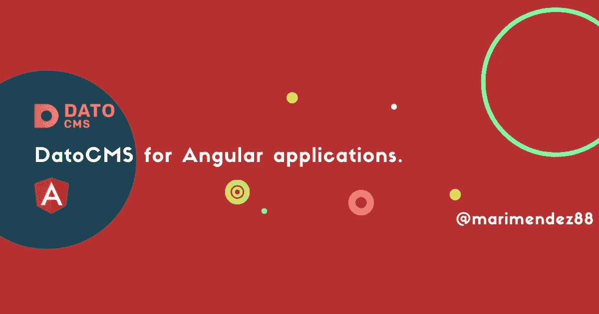

Dato CMS for angular applications

> *几天前，我和我的弟妹——也是一名软件工程师——进行了一次对话，当我们谈论 Datocms 时，我想起了当我试图在一个新的 angular 应用程序上使用我已经创建的 CMS 时所面临的所有困难，我使用 DatoCMS 的其他时候的不同之处在于，我是在一个 React 应用程序上实现它的，这是这个奇妙的 CMS 的游戏规则改变者*

Dato CMS 是最受欢迎的无头 CMS 之一，简而言之，为什么这些 CMS 现在如此流行？

首先，见鬼的**无头 CMS** 是什么意思:

如果你习惯了传统的 CMS，比如 [WordPress](https://wordpress.com/) ，这很容易在你的脑海中描绘出来。

假设一个传统的 CMS 是一个身体，其中“头”是前端,“身体”是后端。如果您删除前端代码(head ),您将剩下一个**无头 CMS。**

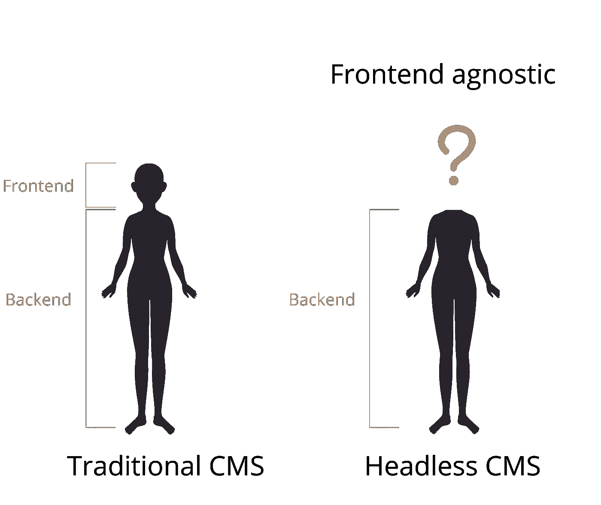

Traditional CMS vs Headless CMS

这种类型的 CMS 背后的所有科学都不会依附于前端系统，这意味着默认情况下，每个无头 CMS 都是前端不可知的，这意味着你的内容可以以你想要的方式发布和显示，使用你想要的框架，同时也可以在多个来源上发布和显示。

很酷，对吧？

好了，让我们回到正题， [DatoCMS](https://www.datocms.com/) 是这些强大工具中的一个，我完全爱上了它，我一年前开始使用它，从那时起，他们除了改进他们的平台和让我们的生活变得更容易之外什么也没做..

但是没有什么是玫瑰色的，对吗？

这就是我写这篇文章的原因，因为我发现从 angular 应用程序中获取日期并不容易。

这里举个例子，这是我的专业网站:[mtekh.com](http://mtekh.com/)，用[盖茨比](https://www.gatsbyjs.com/) — [反应](https://reactjs.org/) — [graphQL](https://graphql.org/graphql-js/) 和 [DatoCMS](https://www.datocms.com/) 搭建。

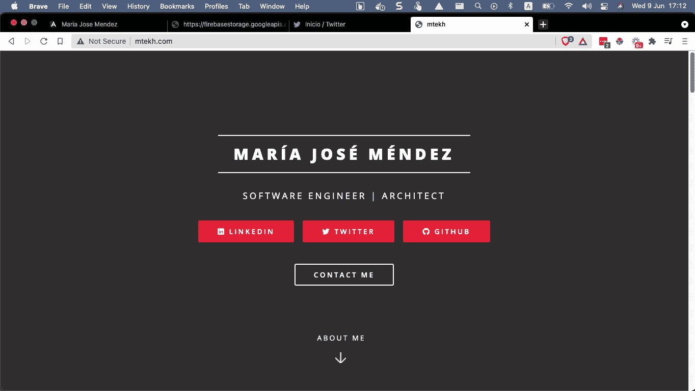

[mtekh.com](http://mtekh.com)

这是我作为一名开发人员销售我的服务的地方，我展示了一点我的背景，我的服务，社交媒体链接等。

但是我想建立我的面向开发者的网站，我不想在那里显示我的服务，但是我想显示其他重复的信息，例如:

*   我的社交网络用户名
*   专业背景
*   技能
*   我的联系信息

我不想在两个不同的网站上写两次相同的信息，相反，我把我所有的内容整合在 DatoCMS 中。

这里有一个小提示:我是一个非常不安分的开发者，总是喜欢构建新的东西，这就是为什么我不想在这里使用 react 而使用另一个堆栈。

首先，我将向您展示我的一个 GraphQL 查询，我们将尝试在 angular 应用程序中获取这些数据

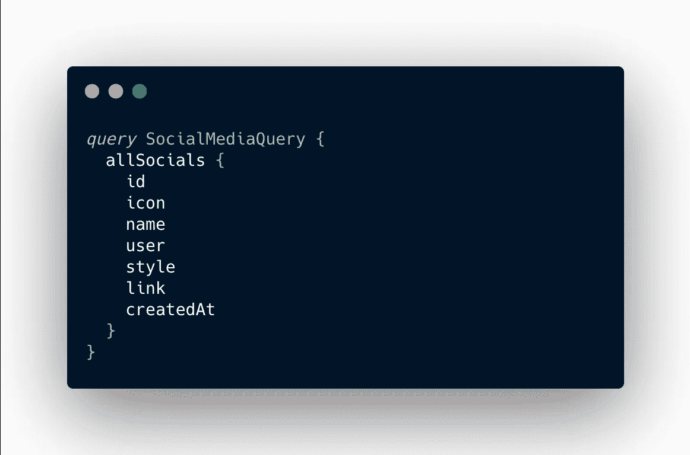

社交媒体查询

在这里，我们请求列出参数的每一个文档。

现在你已经知道了这些信息，我们将开发一个角度应用程序来展示这些信息

处理 angular 和 datoCMS 的第一步是连接两者，具体步骤如下:

*   安装 DatoCMS 客户端

```
npm i datocms-client
```

*   现在，我们将稍微深入一下 datoCMS 配置，以获得我们需要的密钥

→设置→ API 令牌→生成一个或复制现有令牌

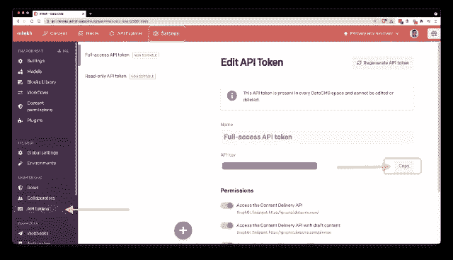

*   创建连接:

src → app →让我们创建 2 个文件:连接和常量。

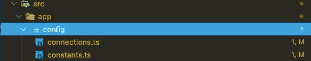

*   Constants:我把我的键放在这里只是为了演示，但是当然你应该在 env 文件或者其他不可见的文件上管理这些信息。

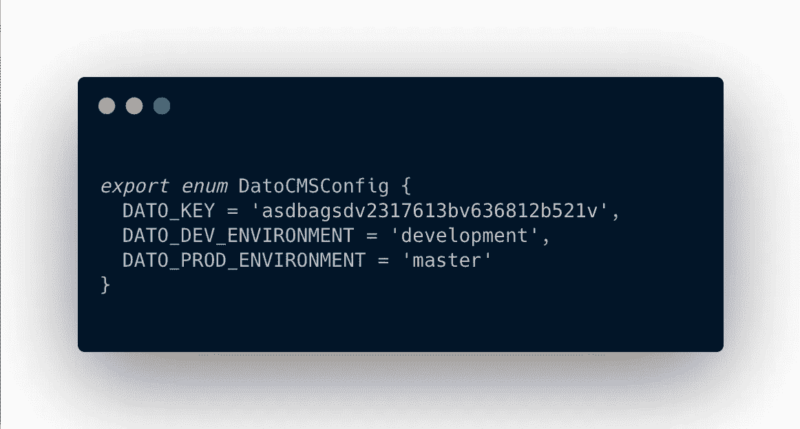

*   那么让我们建立联系:

此时，您应该从安装的“datocms-client”NPM 包中导入 SiteClient。

有了变量，我们现在能够创建一个新的 SiteClient 实例，发送 2 个参数

1.  DatoCMS Api 密钥令牌
2.  期望的环境

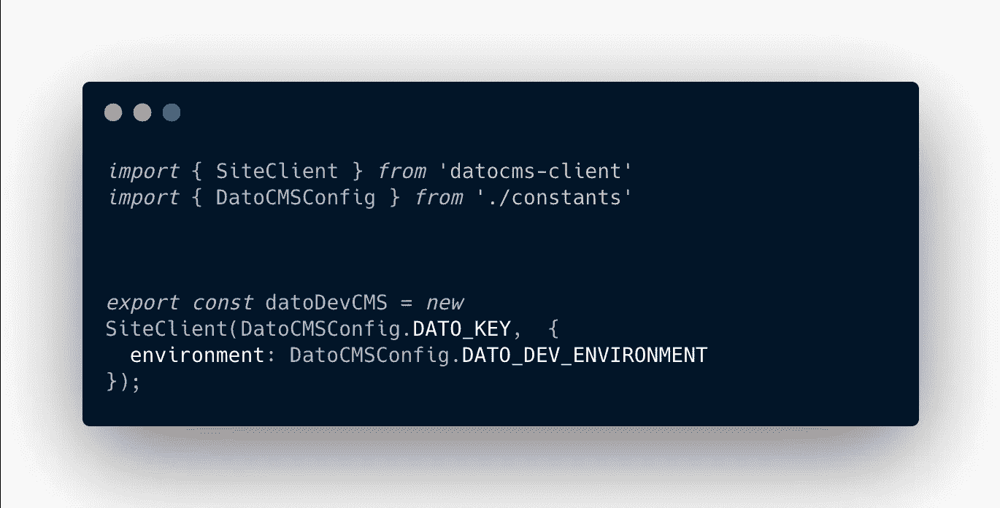

DatoCMS connection

*   建立连接后，我们将从任何地方调用这个 datoDevCMS 变量，对于这个例子，我将使用一个简单的 home 组件，并从那里调用它来查看我收到的信息。

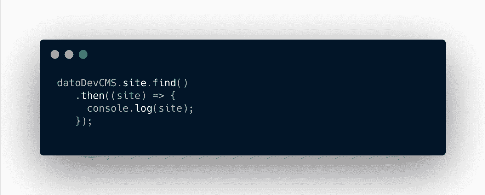

Dato CMS finding my site with my API Key and Environment name

那么，打印 console.log 是什么呢？

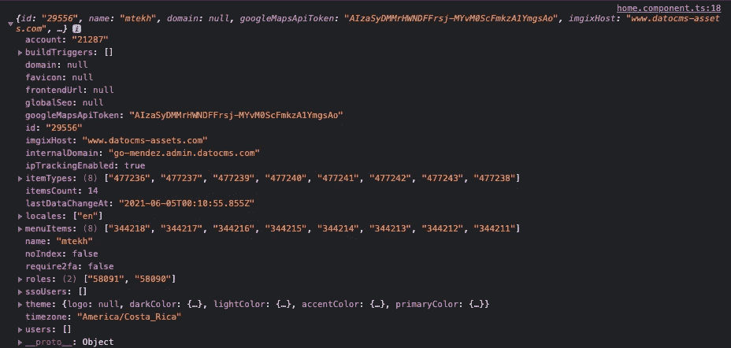

有大量的信息，但真正重要的是什么呢？

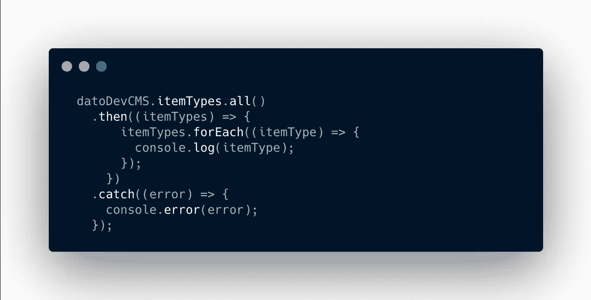

项目类型是我们的模型，但网站信息并没有给我第一眼，所以我们要做的是，简单地调用 Dato 网站，请求所有的*项目类型*并在一个普通的 *forEach* 循环中打印单个项目。

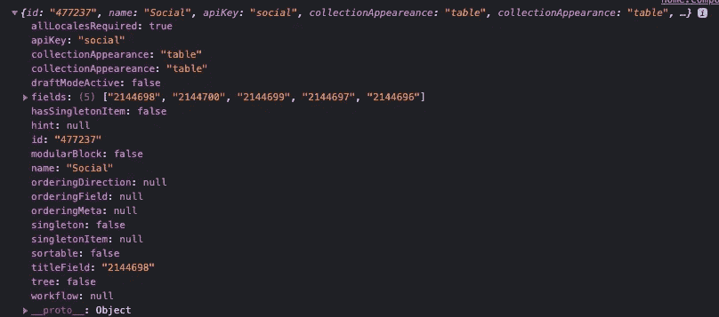

在这里，我们发现:

ID 和 ApyKey(型号名称)

有了这些信息，我知道我的社交模型是 id: **477237，**，所以我可以请求我的 CMS 中托管的所有信息。

当然，我们可以使用枚举来存储我们的 ID，并在构建更复杂的产品时使用可读性更好的变量名。

我们将调用我们的 DatoCMS 站点，请求所有项目，按类型(型号)过滤它们。

这是我的新网站上需要的最后一条信息


就这样，这里我们列出了所有属性的项目:

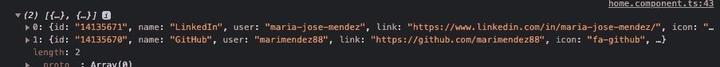

我希望你今天喜欢并学到了一些新东西，如果你有任何问题或建议，不要忘记评论。我很想知道更多关于你的事。

玛丽亚·何塞·门德斯