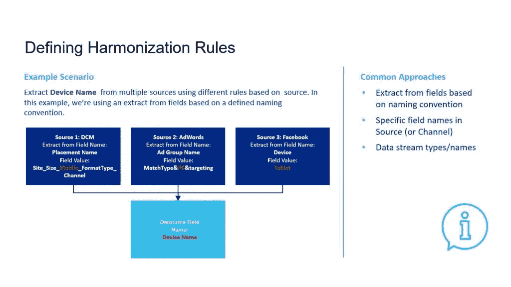

# Datorama 协调|统一活动报告| Nabler

> 原文：<https://medium.com/geekculture/datorama-harmonization-unified-campaign-reporting-nabler-bab8f84d8609?source=collection_archive---------26----------------------->

## DATORAMA 营销智能工具

## Datorama 的数据协调

Image credit nabler.com

几年前，Datorama 宣布了两项改变游戏规则的功能，以帮助营销人员将数据准备、分析和可视化提高到一个新的水平。

这些工具是 Data Canvas 和 [Datorama 协调](https://www.nabler.com/datorama/articles/datorama-harmonization-code-less-unified-campaign-reporting/)中心，这两个被低估的功能使 Datorama 脱颖而出。

Data Canvas 允许营销人员快速、轻松地创建令人印象深刻的定制小部件，而无需了解 JavaScript 或 CSS。数据画布为[仪表板和](https://www.nabler.com/datorama/articles/datorama-dashboards-examples-marketing-intelligence-powered-by-ai/)报告提供了拖放动作和漂亮的开箱即用主题。[纳布勒](https://www.nabler.com/)擅长利用这一功能开发标志性的视觉效果。链接到我们的 PDF 获取 10 个技巧。

然而，在本文中，我们将仔细研究 Datorama 的协调中心，该中心旨在帮助营销人员清理、分类和丰富数据，以进行更准确、更有意义的营销分析。

> *"* [*数据协调*](https://www.nabler.com/datorama/articles/datorama-data-harmonization/) *是将不同数据源中具有不同文件格式、命名约定和列的数据统一起来，并将其转换成一个内聚的数据集。"*

了解您的客户之旅，以及客户如何参与您的营销活动对您的业务至关重要。但是，当您有多个地区、购买平台、活动、受众和创意时，统一的活动报告会带来巨大的挑战。

要实现这一点，您需要 Datorama 协调中心来创建客户旅程的综合视图。

在我们开始之前，这里有一些你应该知道的定义。

1.  **提取、转换、加载**是数据库操作，负责将数据移动到公共数据库中。提取会读取原始数据库中的数据。转换是指改变查询和分析的格式。加载是将数据写入目标数据库。传统上，这是数据集成中最具挑战性的部分，因为在整个过程中，任何步骤中的一个错误都可能导致数据不准确或丢失。
2.  **数据集中**是将您的营销数据集中在一个位置的过程。
3.  **数据清理**有助于纠正或移动数据集中不准确、损坏或错误的数据。
4.  **数据标准化**可以与数据协调互换使用。两者都使数据的基本方面相同。
5.  **分类**是数据中的字段名称。它们是表格中各列顶部的标题。在其他方面，这些是帮助你分割你的数据。

# 什么是数据协调？

[数据协调](https://www.nabler.com/datorama/articles/datorama-harmonization-code-less-unified-campaign-reporting/)是将来自不同数据源、具有不同文件格式、命名约定和列的数据统一起来，并将其转换成一个内聚的数据集。如果“集中”你的营销数据就是把它放在一个公共的地方，那么“统一”就是把它们连接成一个无缝的表格进行分析。

考虑到 luma scape，营销数据本质上是孤立的，使用不同的数据平台、命名约定和标记约定使得集成变得更加困难。此外，营销是一项团队运动，潜在的许多参与者执行您的活动、网站、事件、受众购买、合作伙伴和战略。例如，要在这些维度上组织您的报告，您需要标准化，以及一个描述区域、渠道、活动或受众的通用关键字。

Image credit nabler.com

# 为什么要在 Datorama 中协调数据？

Datorama 的协调中心是一个无代码特性，它允许您跨孤立的数据源创建一致的命名约定。

Datorama 是由营销人员为营销人员构建的，具有用户友好的数据集成系统和直观的数据模型，使数据编排过程尽可能简单。

这种无代码特性为您混合数据，无需技术支持或复杂的定制开发。

# 自然地，用 Datorama 协调数据

在数字营销中，同一营销活动可以在多个营销渠道中有效，并与多个数据类型相关联。因此，活动实体可用于各种数据流类型。将不同来源的活动值映射到相似的活动维度—无论信息流类型、来源或来源数量如何，都可以在活动名称级别自动协调。

例如，如果类似的活动活跃在不同的平台上，如谷歌广告、社交媒体、营销云和谷歌分析，当可视化这些数据时，您将理想地看到来自所有数据源的匹配活动名称值的测量值。

在 Datorama 中自动协调数据有几个好处:

*   快速构建和组织数据以建立清晰的关系
*   无缝统一来自不同来源的商业智能
*   轻松合并多个数据源和格式，以便于比较和分析

## 为什么是纳布勒？

作为[认证的 Datorama 实施合作伙伴](https://www.nabler.com/datorama/articles/nabler-datorama-certification/)，我们遵循既定的流程，同时一丝不苟地遵循客户的要求和批准的技术解决方案。

我们将记录、构建和自动化新的报告解决方案，或者扩展现有报告基础架构的价值。

联系 Nabler，他是经认证的 Datorama [合作伙伴](https://www.nabler.com/datorama/)，也是可视化和数据管理领域屡获殊荣的领导者。

**亦读:**

*   [Datorama 仪表盘:人工智能驱动的营销智能](https://www.nabler.com/datorama/articles/datorama-dashboards-examples-marketing-intelligence-powered-by-ai/)
*   [Datorama Salesforce:整合、准备和导出您的营销数据](https://www.nabler.com/datorama/articles/datorama-salesforce-integrate-prepare-and-export-your-marketing-data/)
*   [Datorama Total Connect:处理不完整数据的完美工具](https://www.nabler.com/datorama/articles/datorama-total-connect-the-perfect-tool-for-imperfect-data/)

*原载于*[*https://www.nabler.com*](https://www.nabler.com/datorama/articles/datorama-harmonization-code-less-unified-campaign-reporting/)*。*