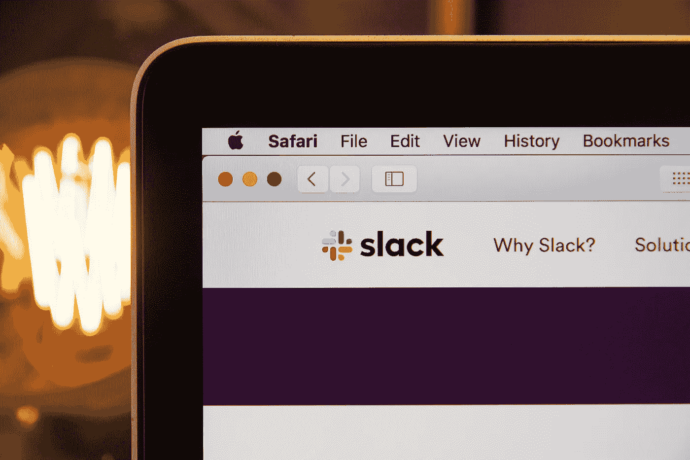

# Datorama & Slack:面向数据驱动型劳动力的现代通信

> 原文：<https://medium.com/geekculture/datorama-slack-modern-communications-for-the-data-driven-workforce-59aa4fed17f?source=collection_archive---------61----------------------->

## Salesforce 将 Slack 整合到其营销核心中

## 全数字世界中作品的未来

采用和使用是企业级数据平台的敌人。数据专业人员一直在寻找围绕数据使用促进更好协作的方法。但是，这也经常失败。

随着 Salesforce 将 Slack 整合到其营销核心中，真的会鼓励对销售和营销业绩数据的讨论吗？Slack 是否是旨在改善销售、服务和营销专业人员的营销决策的协作中心？这些问题的答案最终可能就在 Slack 的名字里:所有对话和知识的可搜索日志。

# 什么是懈怠？

Slack 是一个多服务应用程序，它结合了主要的通信线路，包括视频/语音呼叫、直接消息传递和文档共享。它集成了 2200 多种现有服务，包括 Office 365 和 Google Drive，因此员工可以完全在其中操作。Slack 有超过 2400 个预制的“工作流”(完成日常任务的小应用程序)，可以加速流程，而无需打开单独的程序。员工可以使用这些快捷的工作流来发送休假请求、会议提醒和需要签名的文档，所有这些都可以直接集成到 Google Calendar 和 DocuSign 等程序中。2020 年，Slack 托管了超过 1200 万的日活跃用户。根据 SiliconAngle 的数据，每个工作日，Slack 的使用时间都超过 10 亿分钟。

> *“sales force 和 Slack 将共同塑造企业软件的未来，并改变每个人在全数字化、随处工作的世界中的工作方式”——****sales force 首席执行官马克·贝尼奥夫***

# Salesforce 为什么要以 280 亿美元收购 Slack？

2020 年 11 月，Slack 被 Salesforce 收购，sales force 是全球最大的专注于客户资源管理的企业软件服务公司之一。Slack 是将 Salesforce 定位为企业商业通信领域竞争者的众多收购之一。

Salesforce 通过现金和股票交易收购了 Slack，价值接近 280 亿美元。但是，它为什么要这样做呢？最简单的答案是与微软团队、Oracle 和 SAP 竞争，作为一个占主导地位的消息传递和文档共享平台。这是在改善企业数据协作和知识共享方面的一大赌注，但这是在一次收购上花费如此之多的唯一原因吗？

**Salesforce 对应用增长的押注**

众所周知，Salesforce 希望成为所有客户数据的一站式商店，包括营销、销售、商务和服务。早在被收购之前，Slack 就已经成功地建立了人际关系，并通过集成数以千计的生产力应用程序来改善数据工作流。底线是，正如每个人在过去几十年中所看到的，如果一个商店什么都有，人们就会去那里。Salesforce 希望成为企业通信的超级商店。

# Slack 改变了员工的沟通方式

Slack 是为后 Covid 时代设计的，在这个时代，员工必须随机应变才能完成工作——有时甚至没有警告。它为大多数(如果不是全部的话)许多企业不得不匆忙采取的应急措施提供了一个交钥匙答案。应用和集成能力可能是转变员工生产力和沟通的关键，这也是 Salesforce 最大的赌注。

> 87%的 Slack 用户表示，它改善了业务中的沟通和组织。(来源:证券交易委员会)

Image by [hostreviews](https://unsplash.com/@hostreviews) | unsplash.com

在企业中最难做的事情之一是整合销售、营销、数据存储和分析、客户访问和购买趋势、库存、内部沟通信息。这些拼图块经常不能成功地拼在一起。Slack 有一个难得的机会来帮助 Salesforce 实现销售和营销专业人员普遍无法实现的目标:改进知识共享、数据协作和数据社会化。

Salesforce 正在将 Slack 整合到他们的其他产品中，以便为他们的客户创建一个统一的计划。但从长远来看，这意味着什么呢？这是内部和外部业务沟通的一大进步吗？它仅仅是另一个有着一堆花哨功能的聪明的软件包吗？

# Datorama 和 Slack 的婚姻

要回答这些问题，让我们看一个来自 Salesforce 核心数据平台的示例。Datorama 是一个营销和销售智能平台，拥有超过 4000 个企业用户，它因其数据管理、ETL 和营销仪表板功能而备受推崇。

Datorama 通过将每个仪表板变成一个“通道”来集成 Slack。频道是 Slack 使用专用空间组织对话的方式。它们可以为任何项目、主题或团队而创建，在一个地方有合适的人员和信息，团队可以共享想法、做出决策并推进工作。

一旦建立了通道，用户可以立即添加成员、存档对话、上传文件、发送消息、查看历史评论，甚至生成新的协作通道。

# 这一切对未来意味着什么？

对于 Datorama，Slack 创建了一个更加用户友好的界面，具有巨大的定制潜力。学习起来很快，团队成员可以简化日常任务。

值得注意的是，Slack 维护着一个基于权限的企业级数据应用程序库，这些应用程序可用于直接从其界面控制各种第三方提供商，包括云存储、电子邮件、网络会议应用程序和文档管理工具。

封锁证明了许多办公室工作不需要实体办公室，这为公司节省了管理费用。此外，无论员工身在何处，它都使沟通变得更加容易。因此，我们与他人合作和互动的方式可能已经发生了不可逆转的变化。

但有一件事几乎可以肯定是真的:我们对访问数据、改进和更有组织的决策的贪得无厌的需求现在是、将来也将是真正支持它的企业的竞争优势。

Slack 和 Salesforce 的结合最终会打破数据惯性坝吗？或者我们会继续做得更少，即使有更多的数据？

*最初发表于*[*【https://www.nabler.com】*](https://www.nabler.com/articles/datorama-and-slack-modern-communications-for-the-data-driven-workforce/)*。*