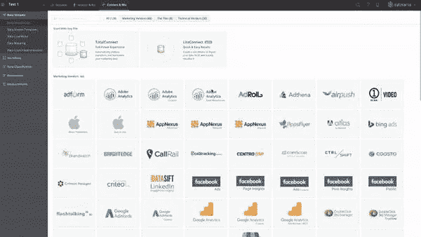
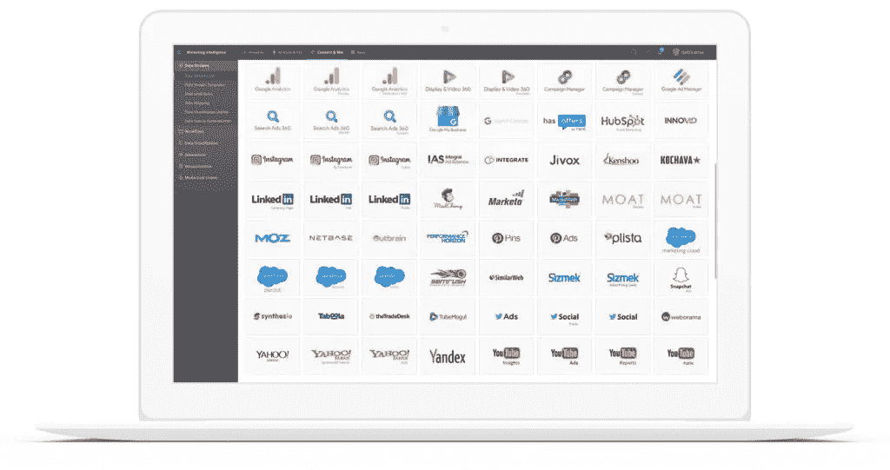

# Datorama TotalConnect:不完美数据的完美工具| Nabler

> 原文：<https://medium.com/geekculture/datorama-totalconnect-perfect-tool-for-imperfect-data-nabler-9c5d47e79412?source=collection_archive---------28----------------------->

## Datorama 营销智能工具

## 使用 Datorama Total Connect 更好地管理不完善的营销数据

Datorama 是一个营销智能和数据管理平台，帮助营销人员从第三方数据平台(如脸书、营销云、AdWords 和 Google Campaign Manager)获取、整合和分析数据。Datorama 允许您将数据连接、分类和分段到一个集中的平台中，当您需要一种从数据源上传数据的方法并且没有 API 连接器时，Datorama 创建了一个灵活的功能，称为 Datorama Total Connect。

对于许多广告品牌和机构来说，整合数据、自动化报告和创建营销仪表板的前景令人兴奋。通过深思熟虑的数据战略，Datorama 提供的工具可以帮助您获得更高的营销效率和对客户行为的更深入了解。

但是还有一个更大的机会。通过正确的培训、工具、技术和流程，Datorama 可以帮助您的组织更好地利用数据，成为以洞察为中心的企业，成为在一个封闭的、持续优化的循环中使用数据、分析和洞察的少数企业之一。

如今，市场上有许多出色的数据平台，如 Forrester Wave，它将允许您分发仪表盘并提供见解。然而，随着您在整个企业中扩展数据的使用，真正的挑战很快变成了敏捷数据管理。

# 营销 API 和仪表板的真相

**API 的出现让分析师的工作变得更加轻松**

API 连接在可用时非常有用，但是您是否经常希望从一个流行的媒体购买平台装载数据，并且发现 API 缺少粒度、指标、维度甚至历史数据？

你该怎么办？也许你可以拿起电话，打电话给你的数据工程组，让他们为你建立一个定制的连接器？但是，对大多数人来说，没有这样的可用资源。

当 API 以这种方式失败时，通常意味着您的自动化项目变得不太理想，其中一些数据源是自动化的，但是其他的仍然需要手动过程。事实是，API 开发可能需要时间、金钱和大量的资源，但是随着营销人员变得越来越老练、需求增加和数据提供商数量增加，当 API 不完整或不可用时，您将需要更灵活的解决方案。

为了应对这一挑战，Datorama 创建了 Total Connect。

> 数据管理可能具有挑战性，公开的 API 可能不完美，但 Datorama 的 TotalConnect 是整合不完美数据的完美工具

# Datorama 连接器:使用 Datorama 连接和统一您的数据

Datorama 使营销人员能够将您的所有数据源(无论是少数还是数百家数据提供商)集成在一起，形成一个单一的数据模型，以实现更快、自动化和更高效的报告。

在本文中，我们将探讨 Datorama 如何允许您以两种非常具体的方式连接营销数据:API 连接器和前面提到的总连接:

**Datorama API 连接:**

借助 Datorama，您可以连接到广泛的 API 库、数据库、存储平台和大数据环境。为了分析数据，您还可以连接到许多公开可用的广告、社交、搜索、展示、电子邮件、视频、web 和 CRM 工具。

APIConnect 允许访问营销 API、流行数据库、云存储平台和大数据环境的库。通过选择可用的 Datorama 连接器，您可以自动处理数据并更新您选择的时间间隔。有了 Datorama 提供的受支持的 API，您就可以享受 Martech 和 Adtech 生态系统的全方位服务。

## Datorama 连接器:LiteConnect

LiteConnect 是连接到任何平面文件并在 Datorama 中即时可视化的最简单方法。您可以只拖放单个或平面文件来查看和分析。如果您想这样做一次，就不需要用 Datorama 映射源数据。

通过自动从数据切换到可视化，简化单个数据文件的数据接收和分析。只需拖放您的数据文件，就可以立即看到它的可视化效果。

此选项最适合即席分析和非营销来源，如销售、地理或天气数据，因为它们不需要任何前期模型考虑。使用 LiteConnect，您可以按日期将您的数据自动覆盖到任何系统数据上，或者通过数据融合将它与您的数据模型统一起来。

*图片鸣谢:*[*https://datorama . com/blog/2018/03/14/introducing-lite connect/*](https://datorama.com/blog/2018/03/14/introducing-liteconnect/)

# Datorama 总连接

Datorama Total Connect 通过使用机器学习智能来分析数据文件，自动进行数据清理和数据模型映射。它有助于通过内置的数据模型智能将您的数据动态地组织到正确的 KPI、指标和分类中。

虽然有 5000 多种工具可用，但你需要人工智能技术来智能地理解和适应任何数据，即时。TotalConnect 旨在自动化所有基于文件的报告源的接收、清理、收集和数据模型映射过程。这也涵盖了漏洞，包括手动方法难以理解的关键步骤。

Datorama Total Connect 负责所有的可视化过程，让您有更多的时间专注于分析和见解，而不是数据工程。成千上万的数据流可用于不断教授机器学习。

*图片来源:*[*https://www . sales force . com/in/products/marketing-cloud/marketing-intelligence/*](https://www.salesforce.com/in/products/marketing-cloud/marketing-intelligence/)

## 总连接功能

函数在创建公式时使用，允许您对数据执行复杂的操作。下列函数在 Datorama 中可用，并被分成不同的组，以便您可以轻松地找到您正在寻找的函数:

*   数字函数
*   文本功能
*   日期函数
*   聚合函数
*   逻辑函数
*   类型转换函数
*   经营者

[点击此处详细了解这些功能。](https://support.datorama.com/en/support/solutions/articles/4000083947-totalconnect-functions)

## Total Connect 如何提供无限的人工智能支持的数据集成

营销数据总是在不断变化，因此，营销部门灵活连接任何数据源的需求也在不断增加。TotalConnect 应对了这一挑战，超越了 API，当真正存在差距时，实现了无限集成。

TotalConnect 利用机器学习智能的力量来分析数据文件，然后自动执行需要高级手动技能来进行数据清理和数据模型映射的关键步骤。就像一个好助手一样，它可以分析数据，并通过电子邮件、SFTP 等安排持续的数据更新来完成工作。TotalConnect 为您提供了随时集成任何数据的机会和灵活性，无需数据工程。

## 为什么选择 Nabler 作为您的 Datorama 合作伙伴

作为[认证的 Datorama 合作伙伴](https://www.nabler.com/datorama/articles/nabler-datorama-certification/)，我们遵循既定的流程，同时一丝不苟地遵循客户的要求和批准的技术解决方案。广告商、代理商和出版商通常需要真正创造性的战略思维来成功交付可扩展的数据解决方案。

[与 Datorama 在数据管理领域的领导者之一合作](https://www.nabler.com/datorama/)。Nabler 将为您记录、构建和自动化新的报告解决方案，或者扩展您现有报告基础架构的价值。向我们寻求[快速启动](https://www.nabler.com/contactus)。

**亦读:**

*   [Datorama 仪表盘:人工智能驱动的营销智能](https://www.nabler.com/datorama/articles/datorama-dashboards-examples-marketing-intelligence-powered-by-ai/)
*   [Datorama Salesforce:整合、准备和导出您的营销数据](https://www.nabler.com/datorama/articles/datorama-salesforce-integrate-prepare-and-export-your-marketing-data/)
*   [Datorama 协调:无代码、统一的活动报告](https://www.nabler.com/datorama/articles/datorama-harmonization-code-less-unified-campaign-reporting/)

*原载于*[*https://www.nabler.com*](https://www.nabler.com/datorama/articles/datorama-total-connect-the-perfect-tool-for-imperfect-data/)*。*