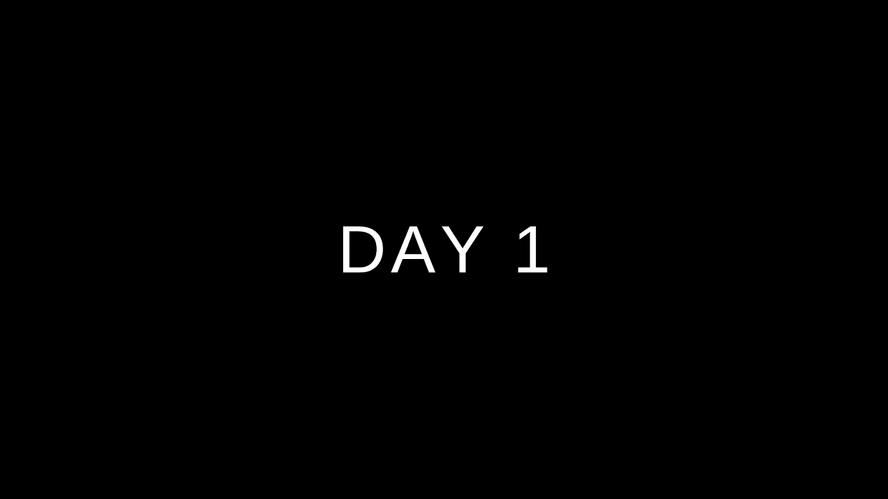
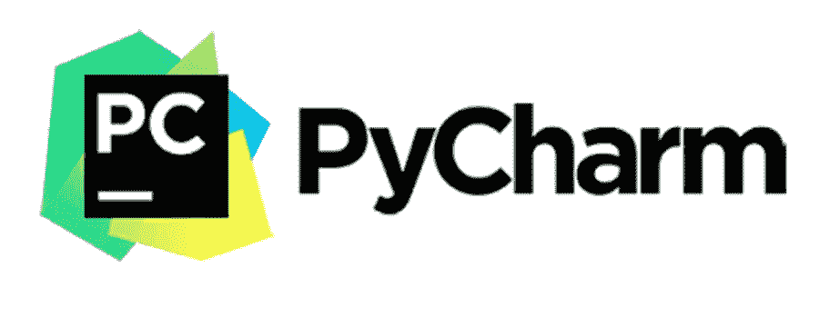
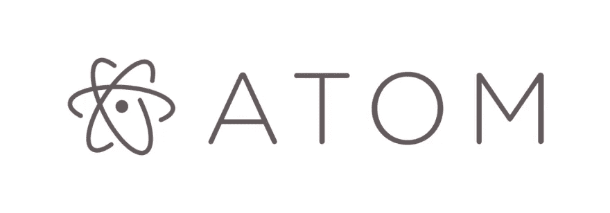
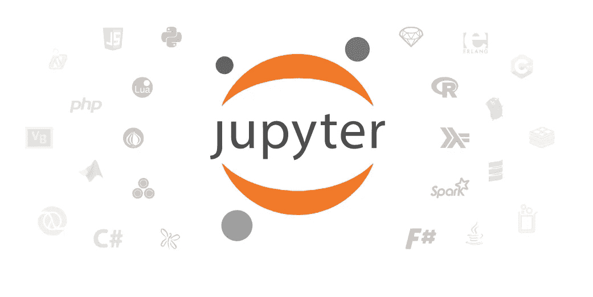

# 学习 python 的第一天

> 原文：<https://medium.com/geekculture/day-1-of-learning-python-ff8d7151deb5?source=collection_archive---------19----------------------->

## 10 天掌握 python 基础知识

嘿，伙计们，我已经为你们开设了 python 课程，所以在接下来的 10 天里，你们将学习 python，在完成课程后，你们可以制作项目

所以在第一天，我会和你讨论这些话题

*   python 简介
*   python 的应用
*   安装 IDE

# Python 简介

Python 是一种简单易学、功能强大的编程语言。它具有高效的高级数据结构和简单而有效的面向对象编程方法。Python 优雅的语法和动态类型，加上它的解释性质，使它成为大多数平台上许多领域中脚本和快速应用程序开发的理想语言。

# python 的应用

python 有广泛的应用

*   机器学习
*   人工智能
*   网络应用
*   游戏开发
*   科学和数字应用

# 安装 IDE

你可以免费获得很多 python 的 ide，我会在这里一一列出，你可以看到哪些对你更好，我提供了下面的链接，你可以下载

[**vscode**](https://code.visualstudio.com/download)

[py charm](https://www.jetbrains.com/pycharm/download/#section=mac)

**原子**

**jupyter**

**spyder**

我个人推荐 vscode 和 pycharm

# 结论

我希望你们今天都很好地了解了 Python。第二天，我们将讲述 Python 的基础知识，包括运算符、数据类型和条件表达式。

## 我们将涉及的主题

*   数据类型及其用途
*   条件语句
*   python 中的运算符