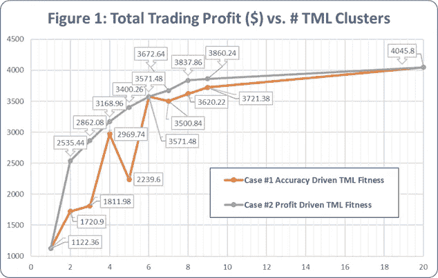
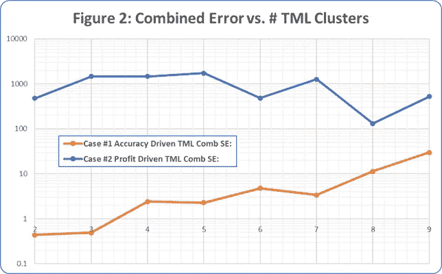
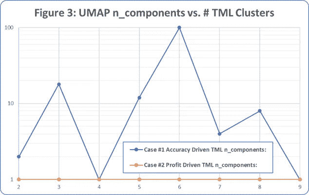

# 人工智能日内交易:利用多维机器学习获得更高利润的案例研究(TML)

> 原文：<https://medium.com/geekculture/day-trading-with-ai-a-case-study-in-higher-profits-using-transdimensional-machine-learning-tml-c90e8ee1a38d?source=collection_archive---------10----------------------->

## 想象一个流形，其中集群由您的用例驱动


Photo by PhonlamaiPhoto on iStock.

# TLDR:

> **平均日交易总利润比基线优化的最佳单“**[](https://www.investopedia.com/terms/b/buytoopen.asp#:~:text=%22Buy%20to%20open%22%20is%20a,investor%20should%20buy%20to%20open.)****”有条件订单利润水平增加了 158%(最大 232%)，使用 TML 和“准确性驱动”适合标准增加了 200%(最大 244%)。最终证明仅使用(9)个 TML 集群的利润水平是理想利润水平的 95%!****

****

****背景帖#1:** [新 AI 淘金热——跨维度机器学习(潘提供！)](/@andycarl_40001/the-new-ai-gold-rush-pan-provided-981c0f96e8e7)**

****背景帖#2:** [日内交易用 AI:什么时候持有，什么时候解套，什么时候不玩！](https://levelup.gitconnected.com/day-trade-market-clustering-with-transdimensional-machine-learning-b088f585923a)**

# **一个例子:**

*   **开发内部的" **2StrikeTrader** "分布式利润优化& [回溯测试](https://www.youtube.com/watch?v=cQbOV_RNd5k)应用程序是为了提供"[**【think script】**](https://tlc.thinkorswim.com/center/reference/thinkScript)【兼容】[有条件订单](https://www.youtube.com/watch?v=9hBO5MN3th4)"的真实“逐笔”性能，如在[TDAmeritrade](https://www.tdameritrade.com/home.page)[ThinkorSwim](https://www.tdameritrade.com/tools-and-platforms/thinkorswim.page)交易平台上所证明的。**
*   **从 2020 年 1 月到 2020 年 10 月的时间段中随机选择了(20)个交易日。**
*   **一个候选的" [**"购买-打开**](https://www.investopedia.com/terms/b/buytoopen.asp#:~:text=%22Buy%20to%20open%22%20is%20a,investor%20should%20buy%20to%20open.) "条件-订单格式和结构与" [**Thinkscript**](https://tlc.thinkorswim.com/center/reference/thinkScript) "被选中进行评估和利润优化，在这个特定的实例中，(4)关联的数字参数。**
*   **为“[](https://www.investopedia.com/terms/s/selltoclose.asp)**”条件选择了一个实际的“ [**头皮**”值，以帮助限制计算要求，尽管“ **2StrikeTrader** ”应用程序除了支持链式条件订单交易外，还支持任意打开&关闭条件订单。](https://tradingsim.com/blog/scalp-trading-active-investing-strategy/)****
*   ****选择了一个现实的“ [**止损点**](https://www.investopedia.com/terms/s/stop-lossorder.asp) 和各种交易规则，如连续交易之间的最短时间和最大交易持续时间限制。****
*   ****所有订单“[](https://www.investopedia.com/terms/f/fill.asp)**”都是[](https://en.wikipedia.org/wiki/Nondeterministic_algorithm#:~:text=In%20computer%20programming%2C%20a%20nondeterministic,differently%20from%20run%20to%20run.)****不确定的，具有随机现实的有限持续时间，并受实际历史“逐笔交易”价格差异的影响，而不考虑相关触发条件的具体情况，并包括实际交易费用和成本。**********
*   ******在最基本的层面上，向" **2StrikeTrader** "应用程序呈现特定时间段的条件订单和相关交易规则的实例，在本例中是与标准 NYSE 交易时间相对应的指定历史交易日，并且所有产生的交易(如果有的话)与相关的损益和各种结果数据一起被制成表格。******
*   ****在本案例中，针对之前引用的(20)个交易日的每个随机样本，将“[](https://www.investopedia.com/terms/b/buytoopen.asp#:~:text=%22Buy%20to%20open%22%20is%20a,investor%20should%20buy%20to%20open.)**”条件订单的每个实例提交给“ **2StrikeTrader** ”应用程序，并将所有产生的交易(如果有)以及相关的损益和各种结果数据制成表格。******
*   ****对“ [**“买入-开仓**](https://www.investopedia.com/terms/b/buytoopen.asp#:~:text=%22Buy%20to%20open%22%20is%20a,investor%20should%20buy%20to%20open.) ”条件订单参数空间上的交易利润执行内部/内部集群的持续分布式优化，在本例中使用了大约(3)百万次回溯测试交易的中间结果。****
*   ****使用 TML(**[**)的前期研究用 AI 做日内交易:何时持有，何时解套，何时不玩！**](https://levelup.gitconnected.com/day-trade-market-clustering-with-transdimensional-machine-learning-b088f585923a)**)确定了大约(9)种独特的交易日/集群类型。********
*   ******根据上述优化的损益结果编制了“[](https://www.investopedia.com/terms/b/buytoopen.asp#:~:text=%22Buy%20to%20open%22%20is%20a,investor%20should%20buy%20to%20open.)**买入开仓”有条件订单列表，选择标准是，对于之前参考的(20)个交易日的每个随机样本，将为单个交易日提供最高利润的有条件订单添加到列表中。从而产生(20)个交易日中每一天的(1)个唯一条件订单的列表。********
*   ******这些中间结果用于确定优化的单个最佳" [**"买入到开仓**](https://www.investopedia.com/terms/b/buytoopen.asp#:~:text=%22Buy%20to%20open%22%20is%20a,investor%20should%20buy%20to%20open.) "有条件订单和相关利润水平，当应用于上述所有(20)个参考交易日列表时，形成了所呈现结果的"**基线**"(即$1122.36)。******
*   ****此外，这些中间结果还被用于确定优化的(20)最佳" [**"买入到开仓**](https://www.investopedia.com/terms/b/buytoopen.asp#:~:text=%22Buy%20to%20open%22%20is%20a,investor%20should%20buy%20to%20open.) "有条件订单和相关利润水平，当应用于上述(20)个参考交易日列表中的每一个时，形成所呈现结果的"**理想**"利润(即$4045.80)。****
*   ****使用上面参考的条件订单列表，为每个交易日创建(20)维原始数据向量，包括每个交易日每个条件订单的利润结果，产生(20)行矩阵，每行对应于一个交易日，乘(20)列，其中每列对应于取自上面参考的条件订单列表的特定条件订单。****
*   ****出于本分析的目的，[**UMAP**](https://github.com/lmcinnes/umap)“n _ components”参数被限制在(1)到(100)的范围内，以帮助限制计算要求。****
*   ******案例#1** :如“ [**背景文章#1**](https://levelup.gitconnected.com/the-new-ai-gold-rush-pan-provided-981c0f96e8e7) 中所述，对(20)个交易日的(2)至(9)个聚类的实例的(20)维原始数据向量执行 TML，其中“适合度”是“精度驱动的”，如下面的“**代码片段#1** 中所定义和所示。****
*   ******案例#2** :如“ [**背景文章#1**](https://levelup.gitconnected.com/the-new-ai-gold-rush-pan-provided-981c0f96e8e7) ”中所述，对(20)个交易日的(2)至(9)个聚类实例的(20)维原始数据向量执行 TML，除了“适合度”是“利润驱动的”，定义为作为应用于同一聚类中包含的每个成员交易日的最佳条件订单的结果而获得的最大利润，如下面的“**代码片段#2** 所示。****

> ******代码片段#1:案例# 1——精度驱动的 TML 适应度定义******

```
**if ( num_clusters_found == desired_num_clusters ):
    genome.fitness = 10000.0 / abs( clustered_COMB_sum_SE + 1)
elif ( num_clusters_found == 0 ):
    genome.fitness = -99999.0
else:
    genome.fitness = 10000.0 / abs( clustered_COMB_sum_SE + 1) - ( abs( num_clusters_found - desired_num_clusters ) * 10000.0 )**
```

> ******代码片段#2:案例# 2——利润驱动的 TML 健身定义******

```
**if ( num_clusters_found == desired_num_clusters ):
    genome.fitness = round( max_profit_results_total , 2 )
elif ( num_clusters_found == 0 ):
    genome.fitness = -99999999.99
elif ( num_clusters_found > desired_num_clusters ):
    genome.fitness = round( max_profit_results_total , 2 ) - ( abs( num_clusters_found - desired_num_clusters ) * 999999.99 )
elif ( num_clusters_found < desired_num_clusters ):
    genome.fitness = round( max_profit_results_total , 2 )**
```

> *******案例#1 聚类结果:<每个交易日的聚类 ID>*******

```
**2_groups =  [0, 1, 0, 0, 0, 1, 0, 1, 1, 1, 1, 0, 1, 1, 1, 0, 1, 1, 0, 0]
3_groups =  [0, 2, 0, 0, 0, 2, 0, 2, 2, 2, 2, 0, 1, 2, 2, 0, 1, 2, 0, 0]
4_groups =  [1, 3, 1, 0, 1, 2, 0, 3, 2, 3, 3, 1, 3, 3, 3, 1, 3, 3, 0, 1]
5_groups =  [1, 2, 1, 1, 1, 3, 1, 2, 3, 4, 2, 0, 2, 4, 4, 1, 2, 4, 1, 0]
6_groups =  [4, 0, 5, 1, 4, 2, 1, 0, 2, 3, 2, 5, 2, 3, 3, 5, 2, 2, 1, 5]
7_groups =  [5, 3, 2, 6, 5, 4, 6, 3, 4, 4, 3, 0, 1, 4, 4, 2, 1, 4, 6, 0]
8_groups =  [2, 6, 4, 3, 2, 1, 3, 6, 1, 0, 7, 5, 7, 0, 0, 4, 7, 1, 3, 5]
9_groups =  [5, 2, 6, 6, 5, 7, 0, 2, 3, 4, 3, 1, 8, 7, 4, 6, 8, 3, 0, 1]**
```

> *******案例#2 聚类结果:<每个交易日的聚类 ID，-1 =噪声>*******

```
**2_groups = [0, 0, 0, 1, 0, 1, 1, 0, 1, 1, 1, 0, 1, 1, 1, 0, 1, 1, 1, 0]
3_groups = [0, 2, 0, 1, 0, 2, 1, 2, 2, 2, 2, 0, 1, 2, 2, 0, 1, 2, 1, 0]
4_groups = [3, 1, 3, 2, 3, 1, 2, 1, 1, 0, 1, 3, 1, 0, 0, 3, -1, 1, 2, 3]
5_groups = [4, 1, -1, 3, 4, 2, 3, 1, 2, 0, 2, 4, 2, 0, 0, 4, 2, 2, 3, 4]
6_groups = [1, 4, 2, 0, 1, 5, 0, 4, 5, 3, 5, 2, 5, 3, 3, 2, 5, 5, 0, 2]
7_groups = [1, 3, 0, 0, 1, 6, 2, 3, 4, 5, 3, -1, 6, 5, 6, 0, 4, 6, 2, -1]
8_groups = [4, 2, 6, 4, 7, 0, 5, 2, 0, 1, 2, 6, 3, 1, 1, 7, 3, -1, 5, 6]
9_groups = [7, 0, 7, 6, 5, 2, 8, 0, 2, 1, 0, 4, -1, 1, 3, 5, 6, 3, 8, 4]**
```

> *******案例#1“精度驱动”的 Transdimension 机器学习结果:*******

```
**# $$$$$$$$$$$$$$$$$$$$$$$$$$$$$$$$$$$$$$$$$$$$$$$$$$$
# New best_fitness_so_far =  6960.645449059028 283
# New best: metric                    =  euclidean
# New best: n_neighbors               =  2
# New best: min_dist                  =  0.9899501200650853
# New best: n_components              =  2
# New best: min_samples               =  2
# New best: min_cluster_size          =  1
# New best: cluster_selection_epsilon =  9.899501200650853
# **OUT: num_clusters_found              =  2**
# OUT: ratio_clustered                 =  1.0
# OUT: clusterer_probabilities_sum     =  1.0
# OUT: clusterer_probabilities_sum_SE  =  0.0
# OUT: clusterer_outlier_scores_sum    =  0.0015822293367931729
# OUT: clusterer_outlier_scores_sum_SE =  0.43664837882984625
# OUT: clustered_COMB_sum_SE           =  0.43664837882984625
# $$$$$$$$$$$$$$$$$$$$$$$$$$$$$$$$$$$$$$$$$$$$$$$$$$$# $$$$$$$$$$$$$$$$$$$$$$$$$$$$$$$$$$$$$$$$$$$$$$$$$$$
# New best_fitness_so_far =  6720.868483129303 373
# New best: metric                    =  euclidean
# New best: n_neighbors               =  3
# New best: min_dist                  =  0.9806751960376385
# New best: n_components              =  18
# New best: min_samples               =  2
# New best: min_cluster_size          =  1
# New best: cluster_selection_epsilon =  1.6702124432516032
# **OUT: num_clusters_found              =  3**
# OUT: ratio_clustered                 =  1.0
# OUT: clusterer_probabilities_sum     =  0.9993063223980639
# OUT: clusterer_probabilities_sum_SE  =  0.09623772308554056
# OUT: clusterer_outlier_scores_sum    =  0.0025235186134864853
# OUT: clusterer_outlier_scores_sum_SE =  0.39166522057448777
# OUT: clustered_COMB_sum_SE           =  0.48790294366002834
# $$$$$$$$$$$$$$$$$$$$$$$$$$$$$$$$$$$$$$$$$$$$$$$$$$$# $$$$$$$$$$$$$$$$$$$$$$$$$$$$$$$$$$$$$$$$$$$$$$$$$$$
# New best_fitness_so_far =  2939.8809783443057 4630
# New best: metric                    =  euclidean
# New best: n_neighbors               =  2
# New best: min_dist                  =  0.9844851363095762
# New best: n_components              =  1
# New best: min_samples               =  2
# New best: min_cluster_size          =  1
# New best: cluster_selection_epsilon =  1.1229283586031105
# **OUT: num_clusters_found              =  4**
# OUT: ratio_clustered                 =  1.0
# OUT: clusterer_probabilities_sum     =  0.9968783377316119
# OUT: clusterer_probabilities_sum_SE  =  1.2007491244818755
# OUT: clusterer_outlier_scores_sum    =  0.0031216622683879758
# OUT: clusterer_outlier_scores_sum_SE =  1.2007491244818773
# OUT: clustered_COMB_sum_SE           =  2.401498248963753
# $$$$$$$$$$$$$$$$$$$$$$$$$$$$$$$$$$$$$$$$$$$$$$$$$$$# $$$$$$$$$$$$$$$$$$$$$$$$$$$$$$$$$$$$$$$$$$$$$$$$$$$
# New best_fitness_so_far =  3045.165030327623 3917
# New best: metric                    =  euclidean
# New best: n_neighbors               =  7
# New best: min_dist                  =  0.6260033494778696
# New best: n_components              =  12
# New best: min_samples               =  2
# New best: min_cluster_size          =  1
# New best: cluster_selection_epsilon =  1.2862412571303103
# **OUT: num_clusters_found              =  5**
# OUT: ratio_clustered                 =  1.0
# OUT: clusterer_probabilities_sum     =  0.9975813533345275
# OUT: clusterer_probabilities_sum_SE  =  0.5958724223069191
# OUT: clusterer_outlier_scores_sum    =  0.005716892648354481
# OUT: clusterer_outlier_scores_sum_SE =  1.6880218495658013
# OUT: clustered_COMB_sum_SE           =  2.2838942718727204
# $$$$$$$$$$$$$$$$$$$$$$$$$$$$$$$$$$$$$$$$$$$$$$$$$$$# $$$$$$$$$$$$$$$$$$$$$$$$$$$$$$$$$$$$$$$$$$$$$$$$$$$
# New best_fitness_so_far =  1732.0858838985607 4545
# New best: metric                    =  euclidean
# New best: n_neighbors               =  2
# New best: min_dist                  =  0.00014802695356725215
# New best: n_components              =  100
# New best: min_samples               =  2
# New best: min_cluster_size          =  1
# New best: cluster_selection_epsilon =  0.0014802695356725215
# **OUT: num_clusters_found              =  6**
# OUT: ratio_clustered                 =  1.0
# OUT: clusterer_probabilities_sum     =  0.9956191549442621
# OUT: clusterer_probabilities_sum_SE  =  2.3866928865825363
# OUT: clusterer_outlier_scores_sum    =  0.0043808450557378305
# OUT: clusterer_outlier_scores_sum_SE =  2.3866928865825368
# OUT: clustered_COMB_sum_SE           =  4.773385773165073
# $$$$$$$$$$$$$$$$$$$$$$$$$$$$$$$$$$$$$$$$$$$$$$$$$$$# $$$$$$$$$$$$$$$$$$$$$$$$$$$$$$$$$$$$$$$$$$$$$$$$$$$
# New best_fitness_so_far =  2285.7317026684736 5927
# New best: metric                    =  euclidean
# New best: n_neighbors               =  4
# New best: min_dist                  =  0.9897506613403609
# New best: n_components              =  4
# New best: min_samples               =  2
# New best: min_cluster_size          =  1
# New best: cluster_selection_epsilon =  1.5290874475004406
# **OUT: num_clusters_found              =  7**
# OUT: ratio_clustered                 =  1.0
# OUT: clusterer_probabilities_sum     =  0.9961980874927786
# OUT: clusterer_probabilities_sum_SE  =  1.4769404959232644
# OUT: clusterer_outlier_scores_sum    =  0.005252921933911367
# OUT: clusterer_outlier_scores_sum_SE =  1.8980261671918843
# OUT: clustered_COMB_sum_SE           =  3.3749666631151487
# $$$$$$$$$$$$$$$$$$$$$$$$$$$$$$$$$$$$$$$$$$$$$$$$$$$# $$$$$$$$$$$$$$$$$$$$$$$$$$$$$$$$$$$$$$$$$$$$$$$$$$$
# New best_fitness_so_far =  810.1674860187684 1423
# New best: metric                    =  euclidean
# New best: n_neighbors               =  2
# New best: min_dist                  =  1.4868494804381109e-06
# New best: n_components              =  8
# New best: min_samples               =  2
# New best: min_cluster_size          =  1
# New best: cluster_selection_epsilon =  1.4868494804381112e-05
# **OUT: num_clusters_found              =  8**
# OUT: ratio_clustered                 =  1.0
# OUT: clusterer_probabilities_sum     =  0.9909003457401072
# OUT: clusterer_probabilities_sum_SE  =  5.6715633943426
# OUT: clusterer_outlier_scores_sum    =  0.009099654259892849
# OUT: clusterer_outlier_scores_sum_SE =  5.671563394342598
# OUT: clustered_COMB_sum_SE           =  11.343126788685197
# $$$$$$$$$$$$$$$$$$$$$$$$$$$$$$$$$$$$$$$$$$$$$$$$$$$# $$$$$$$$$$$$$$$$$$$$$$$$$$$$$$$$$$$$$$$$$$$$$$$$$$$
# New best_fitness_so_far =  325.6759659174568 5198
# New best: metric                    =  euclidean
# New best: n_neighbors               =  18
# New best: min_dist                  =  8.039789228616619e-05
# New best: n_components              =  1
# New best: min_samples               =  2
# New best: min_cluster_size          =  1
# New best: cluster_selection_epsilon =  0.000803978922861662
# **OUT: num_clusters_found              =  9**
# OUT: ratio_clustered                 =  1.0
# OUT: clusterer_probabilities_sum     =  0.9896990917080315
# OUT: clusterer_probabilities_sum_SE  =  14.852683413142193
# OUT: clusterer_outlier_scores_sum    =  0.010300908291968587
# OUT: clusterer_outlier_scores_sum_SE =  14.852683413142191
# OUT: clustered_COMB_sum_SE           =  29.705366826284383
# $$$$$$$$$$$$$$$$$$$$$$$$$$$$$$$$$$$$$$$$$$$$$$$$$$$**
```

> *******案例#2“利益驱动”的 Transdimension 机器学习结果:*******

```
**# $$$$$$$$$$$$$$$$$$$$$$$$$$$$$$$$$$$$$$$$$$$$$$$$$$$
# New best_fitness_so_far =  2535.44 1395
# New best: metric                    =  euclidean
# New best: n_neighbors               =  2
# New best: min_dist                  =  0.9898727892678176
# New best: n_components              =  1
# New best: min_samples               =  2
# New best: min_cluster_size          =  1
# New best: cluster_selection_epsilon =  9.898727892678176
# **OUT: num_clusters_found              =  2**
# OUT: ratio_clustered                 =  1.0
# OUT: clusterer_probabilities_sum     =  1.0
# OUT: clusterer_probabilities_sum_SE  =  0.0
# OUT: clusterer_outlier_scores_sum    =  0.10330661568964306
# OUT: clusterer_outlier_scores_sum_SE =  476.4889195566858
# OUT: clustered_COMB_sum_SE           =  476.4889195566858
# $$$$$$$$$$$$$$$$$$$$$$$$$$$$$$$$$$$$$$$$$$$$$$$$$$$# $$$$$$$$$$$$$$$$$$$$$$$$$$$$$$$$$$$$$$$$$$$$$$$$$$$
# New best_fitness_so_far =  2862.08 6642
# New best: metric                    =  euclidean
# New best: n_neighbors               =  2
# New best: min_dist                  =  0.9889775140187894
# New best: n_components              =  1
# New best: min_samples               =  2
# New best: min_cluster_size          =  1
# New best: cluster_selection_epsilon =  5.439376327103341
# **OUT: num_clusters_found              =  3**
# OUT: ratio_clustered                 =  1.0
# OUT: clusterer_probabilities_sum     =  0.9008155222968117
# OUT: clusterer_probabilities_sum_SE  =  494.3500852332057
# OUT: clusterer_outlier_scores_sum    =  0.1796910875126781
# OUT: clusterer_outlier_scores_sum_SE =  973.9897235113592
# OUT: clustered_COMB_sum_SE           =  1468.3398087445648
# $$$$$$$$$$$$$$$$$$$$$$$$$$$$$$$$$$$$$$$$$$$$$$$$$$$# $$$$$$$$$$$$$$$$$$$$$$$$$$$$$$$$$$$$$$$$$$$$$$$$$$$
# New best_fitness_so_far =  3168.96 544
# New best: metric                    =  euclidean
# New best: n_neighbors               =  2
# New best: min_dist                  =  0.9899646227970397
# New best: n_components              =  1
# New best: min_samples               =  2
# New best: min_cluster_size          =  1
# New best: cluster_selection_epsilon =  1.268392172958707
# **OUT: num_clusters_found              =  4**
# OUT: ratio_clustered                 =  0.95
# OUT: clusterer_probabilities_sum     =  0.9040157841809119
# OUT: clusterer_probabilities_sum_SE  =  783.7466136449924
# OUT: clusterer_outlier_scores_sum    =  0.10391968348217817
# OUT: clusterer_outlier_scores_sum_SE =  687.0016157510179
# OUT: clustered_COMB_sum_SE           =  1470.7482293960102
# $$$$$$$$$$$$$$$$$$$$$$$$$$$$$$$$$$$$$$$$$$$$$$$$$$$# $$$$$$$$$$$$$$$$$$$$$$$$$$$$$$$$$$$$$$$$$$$$$$$$$$$
# New best_fitness_so_far =  3400.26 3984
# New best: metric                    =  euclidean
# New best: n_neighbors               =  2
# New best: min_dist                  =  0.07610414130677623
# New best: n_components              =  1
# New best: min_samples               =  2
# New best: min_cluster_size          =  1
# New best: cluster_selection_epsilon =  0.6754242540976391
# **OUT: num_clusters_found              =  5**
# OUT: ratio_clustered                 =  0.95
# OUT: clusterer_probabilities_sum     =  0.9173306574389718
# OUT: clusterer_probabilities_sum_SE  =  620.9235863442633
# OUT: clusterer_outlier_scores_sum    =  0.14005500094976522
# OUT: clusterer_outlier_scores_sum_SE =  1125.5807144701594
# OUT: clustered_COMB_sum_SE           =  1746.5043008144225
# $$$$$$$$$$$$$$$$$$$$$$$$$$$$$$$$$$$$$$$$$$$$$$$$$$$# $$$$$$$$$$$$$$$$$$$$$$$$$$$$$$$$$$$$$$$$$$$$$$$$$$$
# New best_fitness_so_far =  3571.48 4003
# New best: metric                    =  euclidean
# New best: n_neighbors               =  2
# New best: min_dist                  =  0.11196689952462023
# New best: n_components              =  1
# New best: min_samples               =  2
# New best: min_cluster_size          =  1
# New best: cluster_selection_epsilon =  0.48985518542021356
# **OUT: num_clusters_found              =  6**
# OUT: ratio_clustered                 =  1.0
# OUT: clusterer_probabilities_sum     =  0.9554661189961415
# OUT: clusterer_probabilities_sum_SE  =  240.74812753244228
# OUT: clusterer_outlier_scores_sum    =  0.04453388100385862
# OUT: clusterer_outlier_scores_sum_SE =  240.74812753244228
# OUT: clustered_COMB_sum_SE           =  481.49625506488456
# $$$$$$$$$$$$$$$$$$$$$$$$$$$$$$$$$$$$$$$$$$$$$$$$$$$# $$$$$$$$$$$$$$$$$$$$$$$$$$$$$$$$$$$$$$$$$$$$$$$$$$$
# New best_fitness_so_far =  3672.64 3289
# New best: metric                    =  euclidean
# New best: n_neighbors               =  17
# New best: min_dist                  =  1.1788093535203123e-05
# New best: n_components              =  1
# New best: min_samples               =  2
# New best: min_cluster_size          =  1
# New best: cluster_selection_epsilon =  0.00011788093535203124
# **OUT: num_clusters_found              =  7**
# OUT: ratio_clustered                 =  0.9
# OUT: clusterer_probabilities_sum     =  0.8712199643328573
# OUT: clusterer_probabilities_sum_SE  =  1083.217201695875
# OUT: clusterer_outlier_scores_sum    =  0.05462809203438301
# OUT: clusterer_outlier_scores_sum_SE =  193.552372568906
# OUT: clustered_COMB_sum_SE           =  1276.769574264781
# $$$$$$$$$$$$$$$$$$$$$$$$$$$$$$$$$$$$$$$$$$$$$$$$$$$# $$$$$$$$$$$$$$$$$$$$$$$$$$$$$$$$$$$$$$$$$$$$$$$$$$$
# New best_fitness_so_far =  3837.86 2136
# New best: metric                    =  euclidean
# New best: n_neighbors               =  4
# New best: min_dist                  =  0.8185177469639503
# New best: n_components              =  1
# New best: min_samples               =  2
# New best: min_cluster_size          =  1
# New best: cluster_selection_epsilon =  0.8185177469639503
# **OUT: num_clusters_found              =  8**
# OUT: ratio_clustered                 =  0.95
# OUT: clusterer_probabilities_sum     =  0.9702919848658391
# OUT: clusterer_probabilities_sum_SE  =  63.60717739223244
# OUT: clusterer_outlier_scores_sum    =  0.03424018339893043
# OUT: clusterer_outlier_scores_sum_SE =  67.71528722826933
# OUT: clustered_COMB_sum_SE           =  131.32246462050176
# $$$$$$$$$$$$$$$$$$$$$$$$$$$$$$$$$$$$$$$$$$$$$$$$$$$# $$$$$$$$$$$$$$$$$$$$$$$$$$$$$$$$$$$$$$$$$$$$$$$$$$$
# New best_fitness_so_far =  3860.24 4165
# New best: metric                    =  euclidean
# New best: n_neighbors               =  20
# New best: min_dist                  =  0.08596176527296671
# New best: n_components              =  1
# New best: min_samples               =  2
# New best: min_cluster_size          =  1
# New best: cluster_selection_epsilon =  0.08596176527296671
# **OUT: num_clusters_found              =  9**
# OUT: ratio_clustered                 =  0.95
# OUT: clusterer_probabilities_sum     =  0.9449802983006546
# OUT: clusterer_probabilities_sum_SE  =  505.03948103008213
# OUT: clusterer_outlier_scores_sum    =  0.012417795839334533
# OUT: clusterer_outlier_scores_sum_SE =  15.985840410910544
# OUT: clustered_COMB_sum_SE           =  521.0253214409927
# $$$$$$$$$$$$$$$$$$$$$$$$$$$$$$$$$$$$$$$$$$$$$$$$$$$**
```

****************

# ****总结:****

*   ****利润增加了 232%,平均比使用 TML 优化的最佳单个条件订单高出 158%,符合“准确性驱动”的适应性标准(图 1)。****
*   ****利润增加了 244%,平均比采用“利润驱动”适合度标准的 TML 优化的最佳单个条件订单高出 200%(图 1)。****
*   ****使用 TML，仅用(9)个 TML 集群就实现了相当于理想利润水平 95%以上的利润水平(图 1)。****
*   ****综合误差本身并不一定代表最佳用例特定的 TML 流形选择标准(图 2)。****
*   ****鉴于 TML 流形的维数被限制在(1)到(100)维，情况#1“精度驱动”的结果可能受益于上限的增加(图 3)。****
*   ****案例#2“利润驱动”结果的 TML 流形维度应被视为该特定用例所独有的(图 3)。****
*   ****值得注意的是，在情况#2 聚类结果的实例中，用聚类 ID“-1”标识的交易日被标识为“噪声”,因此对多个聚类/组的总利润关联实例贡献(0)利润(即，只有 2、3 和 6 个聚类分组包括所有(20)个交易日的利润贡献)。****
*   ****首先，“准确性驱动”的适合性标准极大地提高了日内交易利润，尽管“利润驱动”(即特定用例)的适合性标准在所有情况下都更好，除了(6)个 TML 聚类的结果相同(图 1)。值得注意的是，在“利润”结果相同的(6)个 TML 聚类的实例中，相应的“准确性”结果(图 2)和 TML 流形“维度”结果(图 3)明显不同。****
*   ******一般提示:**即使对于相同的数据，也有无限多的 TML 流形可用。对于您的特定使用情形，它们的性能各不相同！ ***使用 TML 和基于 Hybrid-NEAT 的强化学习，您可以挖掘出最符合您的用例的结果！*******

# ****灵感:****

*   ****UMAP，利兰·麦金尼斯****
*   ****HDBSCAN，利兰·麦金尼斯，约翰·希利，史蒂夫·阿斯特尔斯****
*   ****[齐](https://www.cs.ucf.edu/~kstanley/neat.html)，肯尼斯·斯坦利****

# ****关于安德鲁(安迪)卡尔:****

****“trans dimensional Machine Learning”(TML)应用程序布道者，是“2StrikeTrader”日间交易应用程序、“2StrikeHitter”计算机控制的棒球投球机控制器、“GitHub AI Brain-of-Brains”和“GitHub 2 vec”NLP 生产力工具的热心开发者。一位充满激情的多学科航空航天机械工程师，在基于混合强化学习的复杂空中、空间和地面系统的优化、设计和分析以及工程工具开发方面具有丰富的经验，包括人工智能、混合强化机器学习( **Hybrid-NEAT** )、数据科学和多学科模拟。****

*   ****[**安迪的《GitHub AI 脑中之脑》**](https://2strikehitter.com/AI_BrainofBrains.html)****
*   ****[**安迪的在线大脑**](https://afcarl.github.io/)****
*   ****[**安迪上领英**](https://www.linkedin.com/in/andrew-andy-carl-3875a310b/)****
*   ****[**安迪在 GitHub 上**](https://github.com/afcarl)****
*   ****[**安迪在电脑控制的棒球投球机上**](https://www.2strikehitter.com/) **:)******