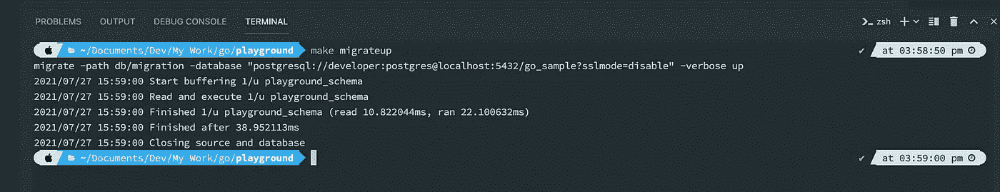
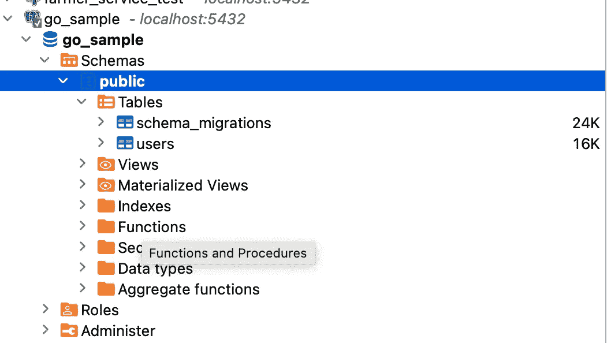
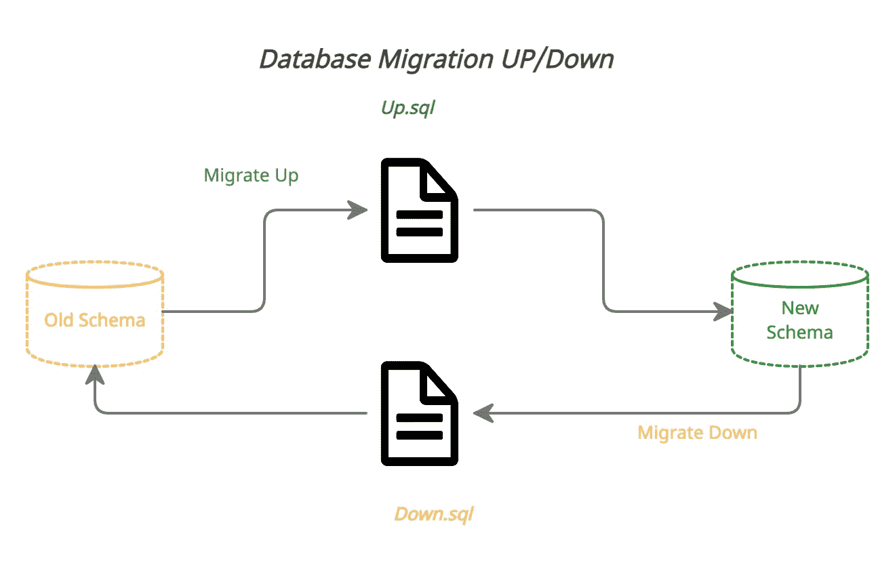
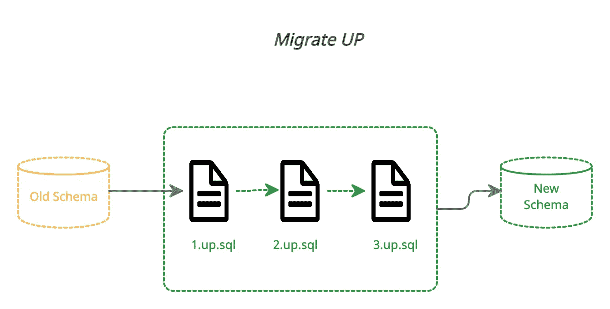
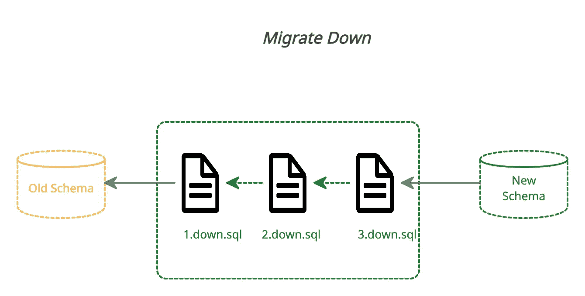
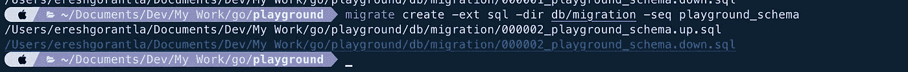
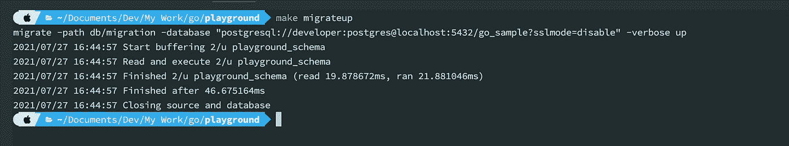

# Go Lang 中的数据库迁移

> 原文：<https://medium.com/geekculture/db-migration-in-go-lang-d325effc55de?source=collection_archive---------0----------------------->

当使用数据库时，模式迁移是我们应该在整个应用程序生命周期中完成的一项特殊任务。在这篇博客中，我们将看到如何使用 Go lang 管理数据库迁移。

为此，我们使用 golang-migrate [库](https://github.com/golang-migrate/migrate)。该库支持许多数据库引擎，如 Postgres，MySQL，Mongo …

有关 CLI 文档，请单击此处的。

使用自制软件安装 golang-migrate

```
**brew install golang-migrate**
```

下面是 golang-migrate 的用法

```
$ migrate -help
Usage: migrate OPTIONS COMMAND [arg...]
       migrate [ -version | -help ]

Options:
  -source          Location of the migrations (driver://url)
  -path            Shorthand for -source=file://path
  -database        Run migrations against this database (driver://url)
  -prefetch N      Number of migrations to load in advance before executing (default 10)
  -lock-timeout N  Allow N seconds to acquire database lock (default 15)
  -verbose         Print verbose logging
  -version         Print version
  -help            Print usage

Commands:
  create [-ext E] [-dir D] [-seq] [-digits N] [-format] NAME
               Create a set of timestamped up/down migrations titled NAME, in directory D with extension E.
               Use -seq option to generate sequential up/down migrations with N digits.
               Use -format option to specify a Go time format string.
  goto V       Migrate to version V
  up [N]       Apply all or N up migrations
  down [N]     Apply all or N down migrations
  drop         Drop everything inside database
  force V      Set version V but don't run migration (ignores dirty state)
  version      Print current migration version
```

让我们创建一个简单的文件夹，看看迁移是如何进行的

```
mkdir playground
cd playground
mkdir -p db/migration
```

> 我已经在我的本地 mac 上安装了 postgres。这里没有使用 docker。

让我们创建第一个迁移文件。

```
**$ migrate create -ext sql -dir db/migration -seq playground_schema**
```

上面的命令将创建两个文件，在所创建的 sql 文件的后缀处使用 up 和 down。当我们启用了`seq`标志时，文件是用版本号创建的。


文件是空的。让我在`up`文件中创建一些表，在`down`文件中创建回滚命令。

**000001 _ playground _ schema . up . SQL**

```
***CREATE TABLE users (
   id BIGSERIAL primary key,
   first_name TEXT not null,
   last_name TEXT,
   created_at TIMESTAMP default now()
);***
```

**000001 _ playground _ schema . down . SQL**

```
***DROP TABLE IF EXISTS users;***
```

让我们创建一个 Makefile 以便于使用。

```
*migrateup:
migrate -path db/migration -database "postgresql://<user>:<pwd>@localhost:5432/go_sample?sslmode=disable" -verbose up**migratedown:
migrate -path db/migration -database "postgresql://<user>@<pwd>:5432/go_sample?sslmode=disable" -verbose down*
```

现在执行 migrateup 命令



这将创建两个表`users`和`schema_migrations`。后一种是由迁徙的戈兰人创造的。它实际上并不存储 changelog，而只是存储迁移是否成功。



下面的流程显示了新旧模式之间的迁移是如何进行的。



***向上迁移***



> *向上迁移将按照 SQL 文件的前缀顺序依次运行。*

***向下迁移***



> *向上迁移将按照与 SQL 文件相反的前缀顺序依次运行。*

让我们初始化另一个版本，要求是将`phone_number`添加到用户表中。

```
**$ migrate create -ext sql -dir db/migration -seq playground_schema**
```



**000002 _ playground _ schema . up . SQL**

```
**ALTER TABLE users add column phone_number not null;**
```

**000002 _ playground _ schema . down . SQL**

```
**Alter table users drop column phone_number**
```

现在运行`make migrateup`命令



**使用 golang 迁移时的缺点**

1.  这并不像其他流行的移植那样先进，比如 npm 的`sequelize`，java 的`liquibase`。它不存储 changelog，所以只说明版本是否是脏的。
2.  默认情况下，migrate up 和 migrate `down`会删除对模式的所有更改，我们在使用它时应该小心。它提示申请全部或不申请。
    我们应该使用下面的命令`goto`恢复到一个特定的版本。

```
**$ migrate -path db/migration -database "postgresql://<user>:<pwd>@localhost:5432/go_sample?sslmode=disable" -verbose goto 1**
```

***结论***

golang 中还有其他可以进行数据库迁移的模块。实现一个请明智选择。