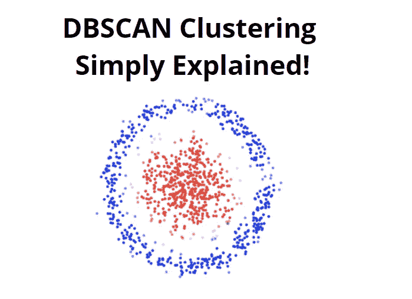

# 用于机器学习的 DBSCAN 聚类算法

> 原文：<https://medium.com/geekculture/dbscan-clustering-algorithm-simply-explained-993c195d1f63?source=collection_archive---------16----------------------->

**机器学习快速指南。**

一种不需要指定聚类数量的聚类技术是 DBSCAN 或(基于密度的空间聚类)。

但是，DBSCAN 基本上需要两个参数:eps 和 min samples。Eps 指定了两个数据样本之间的最大距离，在该距离中，其中一个数据样本应该是一个…