# DDA 画线算法

> 原文：<https://medium.com/geekculture/dda-line-drawing-algorithm-be9f069921cf?source=collection_archive---------1----------------------->

## DDA 画线算法举例说明

在计算机图形学中，我们需要用离散的像素来表示连续的图形对象。这个过程称为扫描转换。每个图形系统都必须将直线、圆和椭圆等图元转换成像素集合。

画线算法用于在离散的图形媒体中画线。计算机图形学中有三种画线算法。

1.  DDA 算法(数字微分分析器)
2.  中点算法
3.  布雷森汉姆线算法

今天我将介绍 DDA 算法并解释它是如何工作的。

在继续算法之前，让我们回忆一下线方程。

## 直线方程

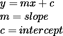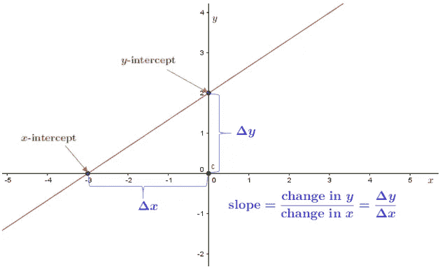

## 寻找下一个画直线的像素

我们需要两个端点，P 和 Q，在[光栅](https://en.wikipedia.org/wiki/Raster_scan)屏幕上画一条线。我们从 P 坐标开始，寻找下一个像素，直到到达端点 q。

我们画线的时候有三种特殊情况。

***案例一:画一条水平线:m = 0***

水平线具有相同的 Y 坐标值。在这种情况下，我们只需要考虑 X 坐标值的变化。我们首先绘制像素 P，并仅将 X 坐标值增加 1 来获得下一个像素。

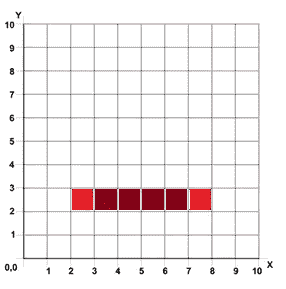

***情况二:画一条竖线:m 未定义***

垂直线具有相同的 X 坐标值和不同的 Y 坐标值。与水平线绘制类似，我们首先绘制初始像素(P)，这次我们将 Y 坐标值增加 1 以获得下一个像素，直到到达端点 q。

***案例三:画一条对角线:m = 1***

最后一个特殊场景是画一条对角线，其中斜率等于 1。为了得到对角线上的下一个像素，我们需要将 X 和 Y 坐标值都增加 1。

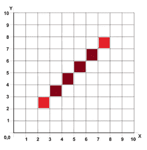

到目前为止，我们讨论的场景都是特例。一般来说，我们要在斜率大于/小于 1 的地方画线。在这种情况下，我们可以使用 DDA 算法来画线。

# DDA 算法

DDA 代表数字微分分析器。这是一个增量线算法，每一步的计算都是基于前一步的结果。

该算法基于斜率值有两种情况。

让我们把(X1，Y1)和(X2，Y2)作为我们的端点。

## ***案例一:当|m| < 1***

假设和 X1 < X2

Start with,

*X = X1，Y = Y1*

正如我们所知，直线的斜率可以用，

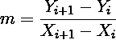

在这种情况下，我们总是将 X 坐标值的差值保持为 1。

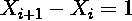

现在，我们可以简单地通过在当前 Y 坐标上添加斜率来计算下一个 Y 坐标值。

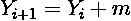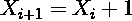

继续直到 X = X2

## ***案例二:当|m| > 1***

与第一种情况类似，首先，

*X = X1，Y = Y1*

但是在这种情况下，我们将 Y 值增加 1，而不是 X 值。

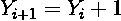

所以，当我们把这个赋值给斜率方程时，我们可以得到当前的 X 值。

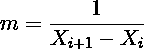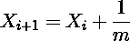

继续直到 Y = Y2

> N 注:由于我们处理的是像素，所以需要整数值作为坐标。我们需要对分数值进行四舍五入。

## 例子

***例 1***

从(2，1)到(8，5)画一条线

X1 = 2，X2 = 8，Y1 = 1，Y2 = 5

首先，我们需要计算直线的斜率。

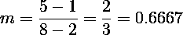

斜率小于 1，我们需要遵循案例 1 中的步骤。将 X 值递增 1，并加上 slope 以获得相应的 Y 值。最后四舍五入 Y 值。

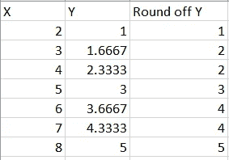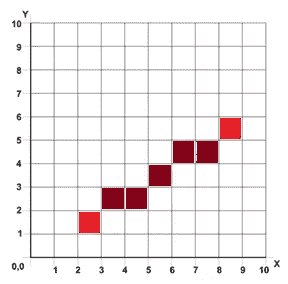

***例 2***

从(3，2)到(7，8)画一条线

X1 = 3，X2 = 7，Y1 = 2，Y2 = 8

线的斜率

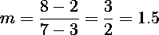

斜率大于 1，我们需要遵循情况 2 中的步骤。

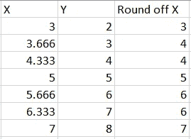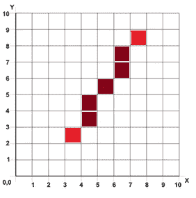

DDA 算法简单且易于计算，因为每一步只有两次加法。这种算法的缺点之一是涉及舍入功能。舍入运算耗费大量时间，舍入值的累加会导致累加误差。

> 注意:
> 
> 如果 X1 > X2，则以(X2，Y2)为起点，以(X1，Y1)为终点，然后继续我们今天所学的 DDA 算法。

DDA 线绘制点计算的节点包实现—[https://www.npmjs.com/package/dda-line-algorithm](https://www.npmjs.com/package/dda-line-algorithm)

GitHub—[https://github.com/anushaihalapathirana/DDALineDrawing](https://github.com/anushaihalapathirana/DDALineDrawing)