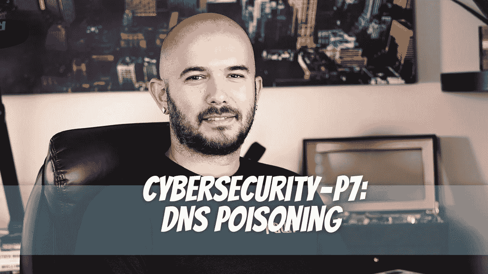

# 网络安全— P7: DNS 中毒

> 原文：<https://medium.com/geekculture/ddcybersecurity-p7-dns-poisoning-70fd630a9e46?source=collection_archive---------18----------------------->

DNS(域名系统)服务器是接受我们输入的域名并为我们提供 IP 地址的域服务器。修改 DNS 记录可能会将某人发送到他们意想不到的 IP 地址。现在不太常见了，但还是会发生。

# 为什么 DNS 中毒这么危险？