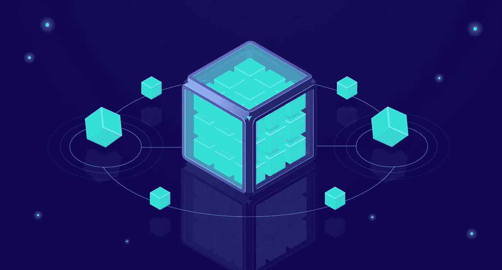

# 与 AWS SNS-SQS 和 AWS Lambdas 解耦的微服务应用

> 原文：<https://medium.com/geekculture/de-coupled-microservice-applications-with-aws-sns-sqs-and-aws-lambdas-4416e54f705a?source=collection_archive---------3----------------------->

最近接触了微服务架构的工作环境，我开始意识到微服务架构中解耦应用的重要性。

> 基本上，这些“分离的应用程序”意味着应用程序保持完全的自治，并且彼此不知道。这允许应用程序执行它们的任务…