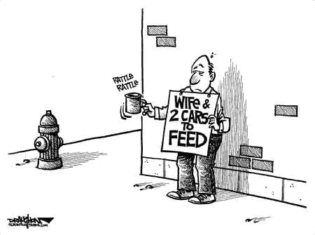
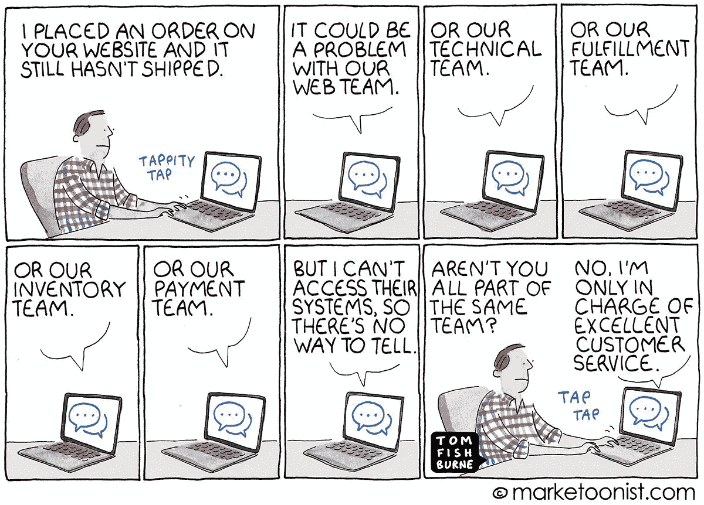

# 去 Fi 生态系统:关注客户，客户会来找你

> 原文：<https://medium.com/geekculture/de-fi-ecosystem-focus-on-the-customer-the-customer-will-come-to-you-eea65a60e9d7?source=collection_archive---------7----------------------->

迄今为止，在区块链的故事中，每年都有新的趋势。2017 年，ETH 智能合约带来了初始硬币供应的概念，2018 年游戏应用程序增多，2019 年专注于赌博应用程序，2020 年的趋势是明确无误的:去中心化金融运动是迄今为止最具影响力的趋势，并将继续增长。

随着加密货币的普及，新的数字货币需要基于加密的金融工具和产品。这种需求导致了加密货币新的金融基础设施层的产生，称为 DeFi。它使用户能够以分散的无信任方式轻松访问金融工具，允许:

**(1)借贷双方直接匹配:**

一种个人可以使用加密货币(例如 ETH)作为彼此的抵押品直接借钱(或稳定硬币)的方式。

**(2)无风险机制的点对点直接交易:**

今天的交易格局主要由几个大玩家主导，主要是比特币基地、Bitfinex 和币安。虽然集中交易已经广泛流行，但这不是大多数密码爱好者和企业家希望实现的金融经济。

鉴于集中控制，这些交易所存在高度安全漏洞，并且缺乏透明度。最近，Kucoin exchange 遭到黑客攻击，用户资产损失超过 1.5 亿美元。需要一个开放(透明)的交易系统，消除典型的中介或集中控制点。

分散式交易所在开放、无风险的环境中运营，提供直接的点对点交易机会。Uniswap 今年成为加密货币交易的首选分散交易所(DEX)。

**使 DeFi 产品蓬勃发展的一些生态系统或服务:**

# (1)稳定硬币:

稳定资产是相对于目标价格(如美元)保持稳定价值的加密资产。在加密领域，稳定的硬币提供了针对加密货币价格波动的风险保护，用作加密资产的交易对。当涉及 DeFi 贷款协议时，贷款人以稳定的硬币提供信贷，以他们的抵押品为抵押进行借贷。

稳定硬币还有其他几种使用情况，例如:

*   忠诚度计划:沃尔玛正在建立自己的美元硬币，很可能使用其稳定硬币作为忠诚度积分的升级。
*   JPM·科恩:摩根大通和其他银行正在努力提高银行运营效率。

# (2)数据市场:

预测市场是使用 DeFi 协议的另一个例子。在这种情况下，成千上万的个人集体或独立地利用他们的知识来预测结果。例如，数据科学家(或分析师)预测股票价格，并用资本押注(或打赌)他们的预测。然后，数据科学家会根据他们预测的准确性获得奖励。

ChainLink 就是这样一家区块链公司，它正在围绕数据市场构建一个完整的生态系统。它提供了分散的 oracles，将现实世界中的数据放入区块链。使用智能合约，开发人员可以构建不可信、透明的应用程序来利用这些预言。

# 现在是改变的时候了吗？

加密世界正在转变为一种经济，在这种经济中，越来越多的个人直接参与这些 DeFi 协议来赚取被动收入。去年，超过 5 亿美元的资产被锁定在 DeFi 协议中，并在 2020 年迅速增长至 150 亿美元。Uniswap 、MakerDAO、Compound、dx/dy、Curve 等等，都是这种持续 DeFi 势头最鲜明的例子。

DeFi 协议的用户极大地受益于一个开放的市场，与集中式交易相比，该市场不收取过高的交易和服务费。这种新方法不仅可以成功地与现有的传统金融模拟产品竞争，还可以在许多方面超越它们，例如:

*   透明度，
*   价格效率由于价格取决于市场需求，
*   访问的便利性和速度，以及
*   审查阻力和不变性

尽管如此，我们不应忘记这些金融基本要素的实验性质，它们伴随着风险因素，例如:

# (1)智能合约风险:

普通开发者学习并开始编写智能合约需要很长时间。在以太坊编程模型“Solidity”中编写智能合同时犯简单的错误可能会导致巨大的后果，如安全漏洞或失去所有锁定的资金。

这就像带着眼罩走路，并期待最好的结果。

**一些编码糟糕的智能合约的著名例子:**

(a)分散自治组织(DAO)黑客攻击导致[360 万以太被盗](https://www.coindesk.com/understanding-dao-hack-journalists)。
(b) [奇偶使用的智能合约](https://cryptovest.com/news/parity-was-warned-in-august-about-bug-that-froze-over-500-wallets/)中发现的 Bug，被利用导致 50 万 Ether (ETH)损失，价值超过 2.8 亿美元。

即使对有经验的程序员来说，编写智能合同也不容易。最近，一个分散金融(DeFi)贷款协议 bZx 遭到黑客攻击，尽管其合同由两家知名的安全公司审计，但由于其智能合同中的错误代码，损失了 800 多万美元。

# (2)流动性低:

创建一个新的金融体系最重要也是最困难的方面之一，是创造有效投资所需的必要流动性。流动性是个人购买或出售金融工具而不影响资产价格的能力。

Why collect drop when you have a river flowing next to you…..

在 DeFi 贷款协议的情况下，低流动性可能影响利率的均衡，从而导致贷款匹配的不确定性。大多数贷款平台使用过度担保模式，然而，考虑到加密资产的不稳定性，这种策略仍然有风险。最近一个例子是马克尔道'黑色星期四'。由于 MakerDAO 项目利用 ETH 进行抵押，2020 年 3 月 12 日，ETH 价格大幅下跌，导致抵押品价值 100%变现。

对于 DEX 而言，交易所的低流动性不会引起交易者的兴趣，而更高的价差很容易推高价格。DEX 的低流动性也招致了套利机会。套利是一种利用相同资产在不同交易所的价格差异获利的交易。最近，由于套利攻击，DeFi protocol Harvest Finance 损失了 2400 万美元。攻击者以 Harvest 协议的流动性池为目标，使用一大笔快速贷款进行套利攻击。

流动性低的一个关键原因是用户在分散应用程序中的不愉快体验。在集中式 exchange 中，易于导航和更好的用户界面使它成为“首选”选项。

# (3)燃气费上涨:

DeFi 用户支付燃气费，使他们的交易(与 protocol 的智能合同交互)获得批准并添加到区块中。以太坊燃气费自今年年初以来一直在上涨，这缩小了 APY 的用户范围。这使得大型投资者可以获得 DeFi 协议。对于散户投资者(金额低于 1000 美元)，收益农业可能会出现亏损。

Eventually, you may have to give up daily rides, start pooling…..

# 最大限度降低 DeFi 风险——新兴协议和解决方案

如上所述，从风险的角度来看，这个新系统的管理可能很复杂。过去的一年使这些问题成为人们关注的焦点，许多公司和开发商现在寻求将这些风险因素降至最低。

最近，互操作性被认为是革新 Defi momentum 的下一步，Defi momentum 是一种交叉通信协议，其中两个或更多完全不同的区块链系统可以相互交谈并交换值。Polkadot、Fusion、Ren、Cosmos、T3 等秘密初创公司让这一梦想成为现实。

这些解决方案当然打开了“价值互联网”的自由流动，但它们只限于互联网上的“价值”交换。在我看来，价值互联网，从本质上来说，不仅仅是关注价值的自由交换或关注可扩展性，而是要保证可用性和用户体验。

# 关注客户，客户会来找你:

如果我们继续构建解决方案，而忽略采用的关键方面——客户，我们可能会再次相互竞争，从其他加密生态系统中加入社区。

其中一家初创公司 NEAR protocol 正致力于在区块链架构和编程模型中引入新思维。以下是 NEAR 如何解决 DeFi 协议的风险。

NEAR protocol 是一个分片的、开发人员友好的、证据确凿的可扩展公共区块链，从头开始构建，使开发人员能够更轻松地构建和搭载用户。目前在主网络中运行，用户在基于 NEAR 的 dApps 中体验到快速交易结算(3 秒结束),与基于 ETH 的 dApps 相比，燃气费用减少了 10，000 倍。

**让我们看看 NEAR 协议如何解决这些挑战:**

# 通过使用您已经熟悉的编程语言编写代码，最大限度地减少智能合约错误:

大多数开发经验都不是最理想的。鉴于大多数开发人员对构建 defi/ smart 契约的极度关注，与通过集中工程工作构建的工具相比，最终结果并没有很好地集成和用户友好。

为了解决开发人员的困难，开发人员可以使用熟悉的语言编写 defi 智能合同，比如 Typescript 和 Rust，它们可以编译成 WebAssembly。这使得开发人员更容易编写智能合同，因为他们不必学习新的领域语言来编写智能合同，从而减少智能合同中的错误。

# 快速、简单的开发流程，构建用户友好的 DeFi 应用:

大规模采用区块链应用面临的挑战之一是难以获得主流用户的支持。在大多数情况下，用户需要下载元掩码，生成地址，注册交易所，购买 ETH，将 ETH 发送到他们的钱包，然后他们就可以开始玩了。

对于一个精通加密的人来说，这可能听起来不太复杂，但是对于普通的 Bob 来说，这完全是令人厌烦的。因此，游戏开发者关注的焦点是从加密社区吸引玩家(用户)，限制他们的用户(或观众)基础。

[NEAR 协议](https://cryptopurview.com/near-usdt-price-live-charts/)解决了开发者代替用户支付交易费用的挑战。用户可以免费试用分散式应用，就像他们试用所有其他应用一样。开发人员可以为他们预付交易费用，这样他们的用户就不需要为了开始使用应用程序而想办法在外部交易所购买加密令牌。

为了避免普通 Bob 首先知道“什么是区块链或本机令牌”的复杂性，开发人员可以使用 NEAR 的渐进式安全功能，该功能允许用户注册(或注册)该应用程序，就像他们从 Web2 注册其他应用程序一样。

通过这种方式，用户可以逐步了解分散式应用程序，从而方便用户的加入。一旦用户准备好提交，他们就可以链接他们的帐户安全，而不需要任何浏览器扩展，如 Metamask。

# 开发环境:

NEAR 还为开发者提供了一个在线集成开发环境，为软件开发提供全面的设施。使用在线 IDE，开发人员可以浏览、导航或可视化编程代码结构中的组件，还可以自动化/调试他们的智能合约。

它使开发过程变得简单快捷。开发者可以专注于构建功能丰富且集成良好的 DeFi 协议，从而提供愉悦的用户体验和更好的产品粘性。

# 总而言之:

许多公司和开发商都在寻求将 DeFi 风险因素降至最低。当然，解决方案和新的商业模式将有助于至少减少其中一些问题，但这可能需要一些时间，除非在区块链的基础层进行彻底的改变，以完全缓解这些问题。

NEAR protocol 正致力于在区块链架构和编程模型中引入新思维，以缓解上述所有挑战。