# 使用谷歌云数据丢失防护消除 Salesforce 中的敏感信息

> 原文：<https://medium.com/geekculture/de-identifying-sensitive-information-in-salesforce-with-google-cloud-data-loss-prevention-ffb717f17207?source=collection_archive---------3----------------------->

## 如何从检测转向预防—大规模消除敏感数据

# TL；速度三角形定位法(dead reckoning)

本文探讨了使用[谷歌云数据丢失防护](https://cloud.google.com/dlp)从敏感数据的检测和分类转移到**防护**。我将使用 Salesforce 作为数据源来证明我们如何能够近实时地**去识别**非结构化数据中的个人、健康、凭证和财务信息。

Google Cloud DLP 是一项完全托管的服务，旨在帮助您发现、分类和保护您最敏感的数据。我喜欢它的一点是，它可以轻松地从检测转向预防，提供旨在屏蔽敏感信息的服务和衡量重新识别风险的服务(可能与单个个人或小团体相关的数据元素或组合)。

我的目标是能够证明**编辑非结构化数据中的**敏感信息的能力——并大规模实现。

> *我可以在 Salesforce 中编辑* *电子邮件、文件和聊天中输入的敏感数据吗？我能否检测到某人是否在其通信中包含了信用卡号、税务档案号、医疗保健号和其他敏感数据？*

以下是我决定测试的约束。

*   编辑密码、云 api 密钥、医疗卡和信用卡号
*   近乎实时地编辑文本和图像中的敏感信息
*   每分钟处理 100 条记录，并提供可扩展的存储
*   必须有针对意外停机的冗余设计
*   必须能够使用 Salesforce 以外的数据源

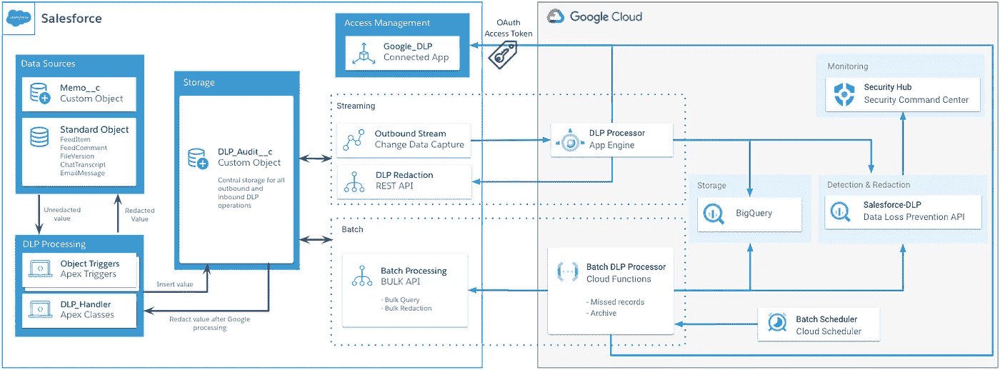

De-identifying data with Google Cloud Data Loss Prevention API

我认为我探索了我认为是设计的关键领域背后的思维过程，而不是详细地走一遍设置。

# 谷歌设计决策

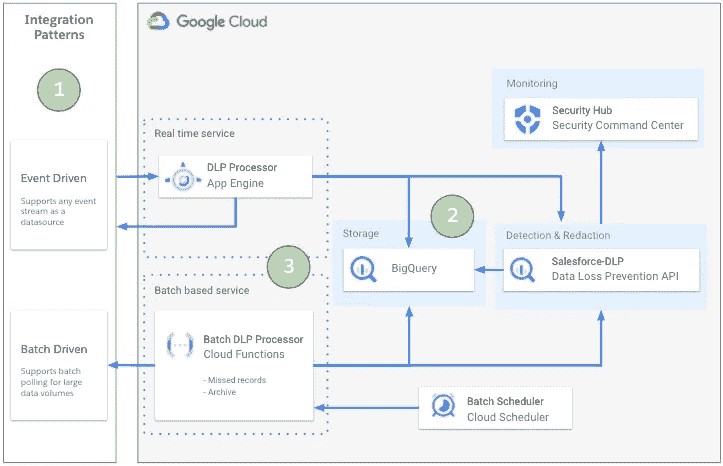

Supporting disparate data sources using multiple integration patterns and a redundant design

## 1.集成模式

***实时*** —为了支持接近实时的用例，我选择了一种异步操作的事件驱动模式。这将扩展到我需要的数量，而不会影响用户体验。

***批处理*** —为了支持不需要实时支持的应用程序，我已经包含了一个批处理处理器。这具有额外的优点，即它

*   将满足实时处理中的中断需求—轮询源系统中尚未处理的任何记录。
*   就 Salesforce 而言，当源表中的记录被安全地归档到 BigQuery 中时，它可以删除这些记录，以防止数据过度增长。
*   如果规则发生变化，可以追溯性地删除数据

## 2.储存；储备

我选择 BigQuery 来存储所有去标识的审计数据。这就具备了将 Google Cloud DLP 作为原生工具运行的能力。它还可以扩展到多个数据源。

## 3.服务

每个需要消除数据标识的应用都有 2 个微服务。一个托管在 Google App Engine 上，用于订阅入站事件，另一个托管为云功能，计划定期运行。然后，开发团队可以决定使用哪种编程语言、临时存储和部署模型。

为每个入站系统使用服务也允许开发者选择哪个[去标识](https://cloud.google.com/dlp/docs/classification-redaction)工具和[数据类型](https://cloud.google.com/dlp/docs/infotypes-reference)用于他们的用例。

由于 Salesforce 是我唯一的数据源，我选择:

*   解密电子邮件地址、澳大利亚医疗卡号、GCP API 密钥、密码和信用卡号
*   用星号掩盖信用卡号码
*   为了可读性，将其他敏感数据替换为信息类型，这样 jane@secretemail.com 就变成了[编辑的电子邮件地址]

因此，从 DLP 批处理或实时服务向 Google de-identification 服务发出的请求示例如下所示:

JSON structure to de-identify text using Google Cloud DLP API

对于图像，需要以下请求结构

JSON structure to de-identify images using Google Cloud DLP API

# Salesforce 设计决策

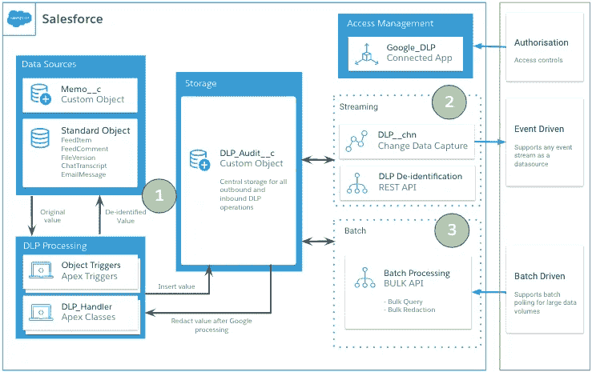

## 1.数据源、DLP 处理和存储

Salesforce 中的数据源需要涵盖客户可能输入敏感数据的常见用例。一个好的解决方案应该尽可能覆盖这些对象的最大集合。在这里我证明了。

*   内容版本—扫描的 JPEG 文件
*   FeedItem 和 FeedComment —非结构化聊天
*   LiveChatTranscript —网络聊天对话
*   电子邮件—入站电子邮件通信
*   标准和自定义对象中的文本字段—一般非结构化输入

现在，我已经确定了潜在敏感数据的来源，我需要这些数据来决定将他们的更新传送到 Google 的最佳方式。由于这是架构的关键部分，我根据我用来评估 API 关键决策的 3 个关键标准(增长和规模、Salesforce 对象支持和易维护性)总结了我的思考过程。

> 这些年来，我学到的最重要的技能是研究每个选项的调控器限制，并根据您的用例研究估计的使用情况。现在规划替代方案比开始构建后更容易，并且将确保您的解决方案可以增长和扩展。

**流** —下表总结了事件驱动集成模式的选项。

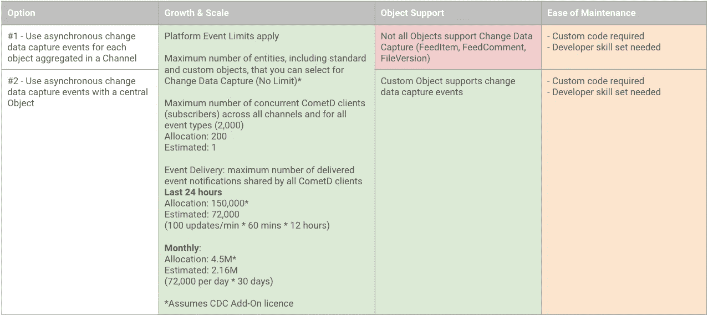

Options for streaming updates from Salesforce

正如你所看到的，我决定选择第二种——因为考虑到规模、对象支持和易于维护，这是最不坏的选择。

我创建了一个中央自定义对象(DLP_Audit__c ),并有一个 Apex 触发器框架来从每个对象获取原始数据，并对其进行预处理以获得一致的形状。

> 其他集成选项呢？

为了完整起见，让我们快速掩盖其他选项，以及我为什么认为它们不适合这个目的的一些理由。

***同步顶点***——不是个好主意。这可能会达到调控器的限制，导致显示错误和同步阻塞事务的性能问题。

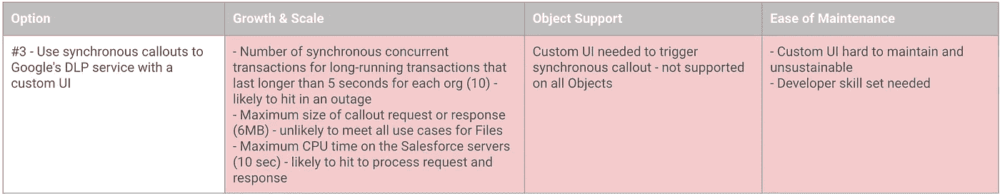

Synchronous Apex

***异步顶点*** —更好的主意。无论是批处理还是未来的调出都会减轻调控器限制，但我们仍有可能在短时间内添加大量的未来请求，并且可能会由于流量控制而经历较长的延迟。我们还必须考虑这样一个事实，即未来的调用不一定按照它们被调用时的顺序执行，这可能会导致插入和编辑混淆，从而可能导致我们打乱字段值的顺序。

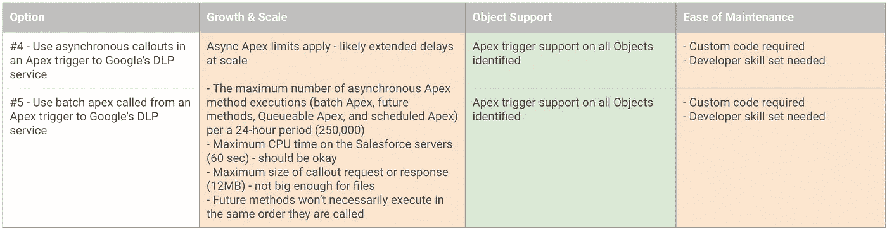

Asynchronous Apex

> 设计决策并不总是有一个正确和错误的答案。通过使用交通灯系统并确保你的推理被记录下来，你可以增加你做出一个好决定的可能性。

## 2-流式传输

为了让订阅者随时可以使用 DLP_Audit__c 中的事件，我创建了一个[自定义通道](https://developer.salesforce.com/docs/atlas.en-us.228.0.api_tooling.meta/api_tooling/tooling_api_objects_platformeventchannel.htm)。这允许我插入我想要包含的字段。在这种情况下，一个外部 id 表示 BigQuery 中的 id，用于标识它是否已经被处理。

```
//Create the channel
{
 “FullName”: “DLP__chn”,
 “Metadata”: {
 “channelType”: “data”,
 “label”: “Data Loss Prevention Channel”
 }
}//Associate the channel to the DLP_Audit__c Change Events
{
 “FullName”: “DLP_Channel_DLP_Audit_ChangeEvent”,
 “Metadata”: {
 “eventChannel”: “DLP__chn”,
 “selectedEntity”: “DLP_Audit__ChangeEvent”
 }
}
```

## 3 —批次

该架构的一个关键部分是冗余设计。事情会出错，我想减轻对业务的影响。一个预定的批处理作业将允许我通过轮询未处理的记录并执行它们来进行恢复。

因为我希望能够一次性处理多达 5 天的数据，所以我需要能够提取和识别大约。36 万条记录。(每天 7.2 万)。为了处理大数据量，Salesforce 提供了批量 API，并允许我处理大批量的查询和更新(每批 10，000 条记录)。不使用批量 API 可能会导致您超过每 24 小时的最大 API 调用次数(100，000 +(许可证数量 x 每种许可证类型的调用次数)+购买的 API 调用附加组件)。

通过使用批量 API，我可以确保处理 360，000 条审计记录时只使用 72 个 API 调用(36 个用于查询，36 个用于相应的更新)。

# 摘要

Google Cloud Data Loss Prevention 服务允许您检测和保护可能包含敏感信息的资产，并且可以在您的企业中扩展以支持大量的用例。

通过使用这种架构，我能够证明以下几点:

## 1.chatter 帖子中的自由文本可以被编辑

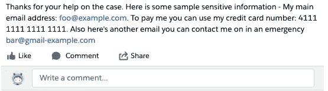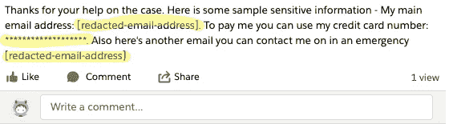

Before and after: email addresses and credit card numbers are redacted

## 2.入站电子邮件可以被编辑

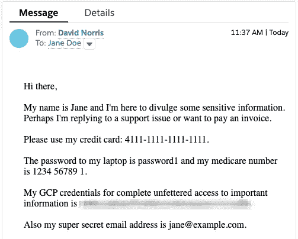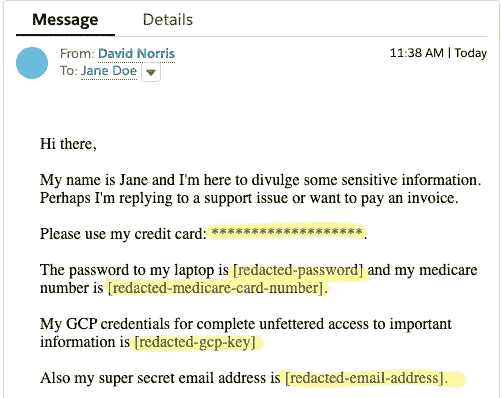

Before and after: Inbound emails from customers — sensitive information redacted

## 3.标准和自定义对象中的字段值可以被修订

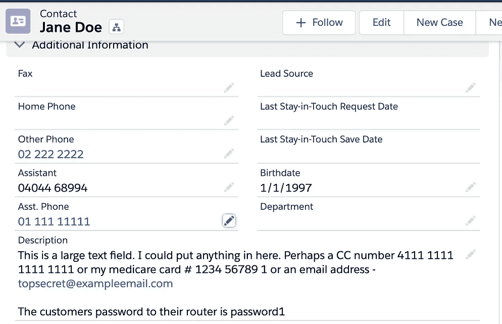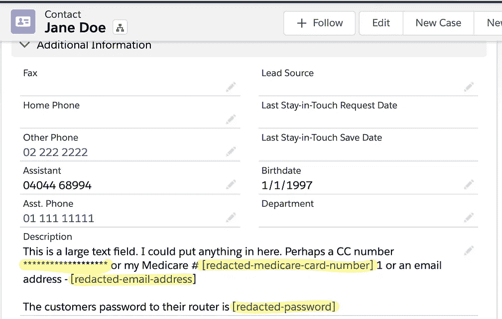

Before and after: Free text fields on standard and custom objects

## 4.图像可以被编辑(JPEG)

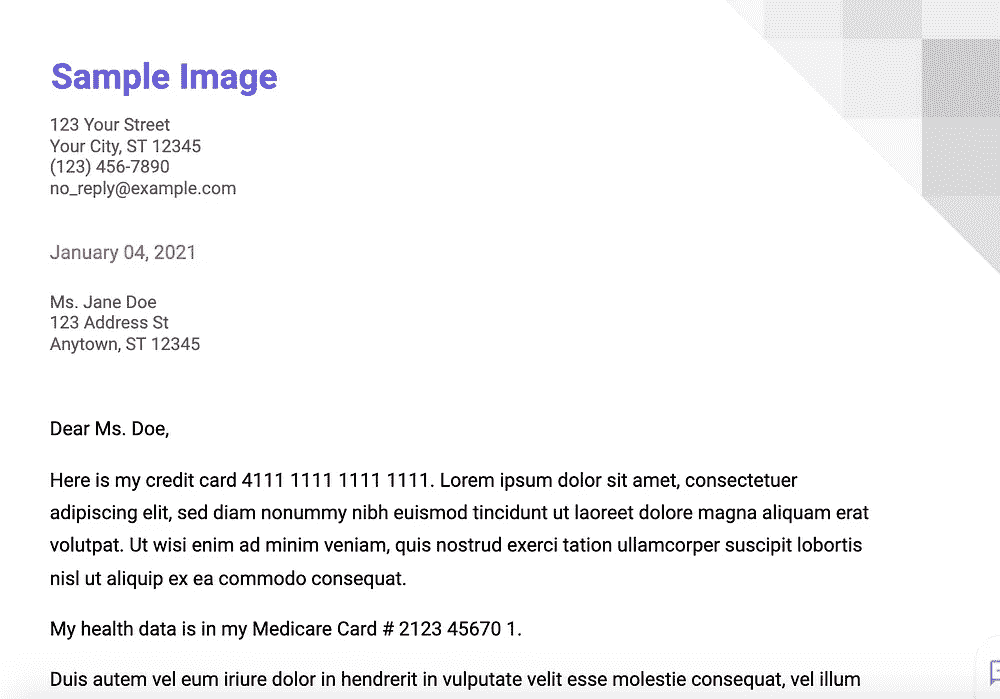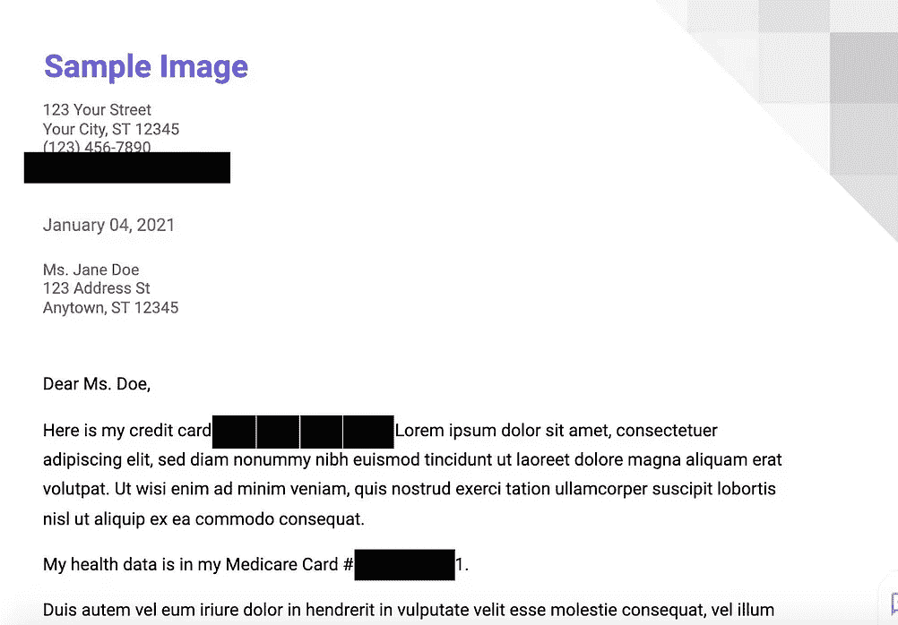

Before and after: Supported file types have the same data types redacted using opaque boxes

# 逮到你了

和大多数事情一样，我犯了以下错误，这些错误会在我将来的技术设计中考虑进去。

**增强型电子邮件** —如果您使用增强型电子邮件，您的 Apex 处理人员必须能够编辑与入站电子邮件相关的任务和电子邮件记录。此外，由于电子邮件是只读的，您必须在获得身份取消结果后删除原始记录，并创建一个新记录。

**文件** —这种架构假设您可以在流程中删除包含敏感数据的文件，并用修订版替换它们。

**审计字段** —对于文件和增强型电子邮件，由于您正在删除和重新创建记录，因此您需要确保使用原始记录中的日期设置 CreatedDate 和 LastModifiedDate 字段。为此，集成用户需要拥有“创建记录时设置审核字段”权限。

**字段历史跟踪** —由于架构依赖异步事件，Salesforce 已经对数据变更进行了审核。如果您已请求跟踪字段历史，这意味着可识别数据已被复制到相应的历史对象中。我将确保我没有跟踪任何我因此想要取消标识的字段，而是跟踪在取消标识服务运行后更新的影子字段。

**图像** —图像的去识别仅限于 JPEG、BMP 和 PNG。尚不支持 DOCX 和 PDF。