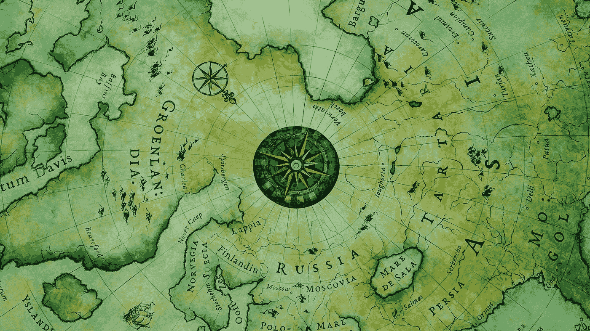

# 航位推算——一种受自然启发的路径整合，让我们发现了新世界

> 原文：<https://medium.com/geekculture/dead-reckoning-a-nature-inspired-path-integration-that-made-us-discover-the-new-world-ce67ee9d407d?source=collection_archive---------26----------------------->

## 你有没有想过在没有 GPS 的情况下，航海是如何实现的？

你可能会，有时也可能不会，对吗？让我们看看通过海洋到达新世界的航行和空中力量的使用是如何变得对人类可靠的。

Photo by [yang wewe](https://unsplash.com/@weweclub_wewe?utm_source=medium&utm_medium=referral) on [Unsplash](https://unsplash.com?utm_source=medium&utm_medium=referral)