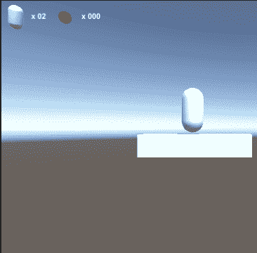
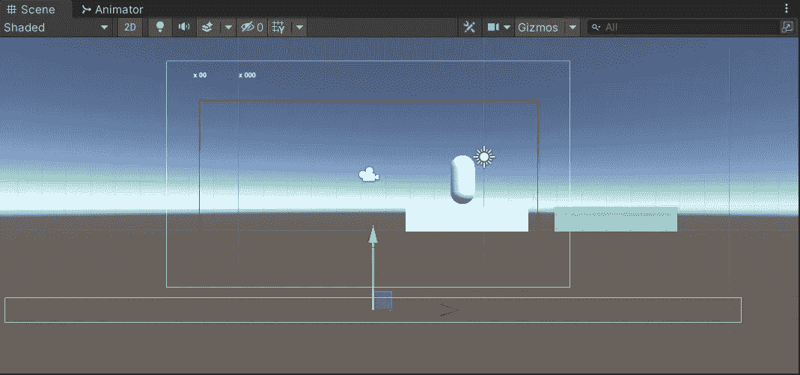

# 死亡地带——因坠落而死亡

> 原文：<https://medium.com/geekculture/dead-zones-dying-by-falling-1784b7cd441b?source=collection_archive---------16----------------------->

**目的**:让玩家在跌落平台后死亡并重生

如何让玩家因**掉落**而死亡？

这个问题的解决方案就在另一个问题的解决方案下面:我如何检测从平台上掉下来的情况？

我们可以检查 **y 位置**是否低于阈值，或者我们可以使用**触发器**。第一个选项将迫使我们将检查放在一个更新方法中，并且将很难(但不是不可能)模块化:想想在 x 和 y 中具有不同位置的平台，其中一些可能被放置在非常低的 y 值，因此当玩家获得甚至更低的值时，死亡将会发生。这意味着我们可能必须考虑不同区域的不同阈值，或者，如果你愿意，一个阈值是 x 坐标的(阶跃)函数。

另一方面，如果我们在附加到它们的脚本中使用碰撞器、触发器和`OnTriggerEnter()`方法，我们可以在任何需要的地方放置它们的许多实例。

当把这样一个**死区**放到场景中时，我建议也给它一个足够大的 **z** 比例，比通常的平台比例更大:一个人可能永远不会知道，也许在未来我们可以开发更多的 2.5D 平台的第三维空间，并创造障碍将玩家沿着 z 轴推下平台。安全总比后悔好。

剧本本身真的很简单。

*PlayerMovement* 类中的`Respawn()`方法将在检查玩家是否有足够的生命后，简单地将玩家放到给定的位置。`AddLife()`方法将`-1`加到生命计数中并更新 UI。

