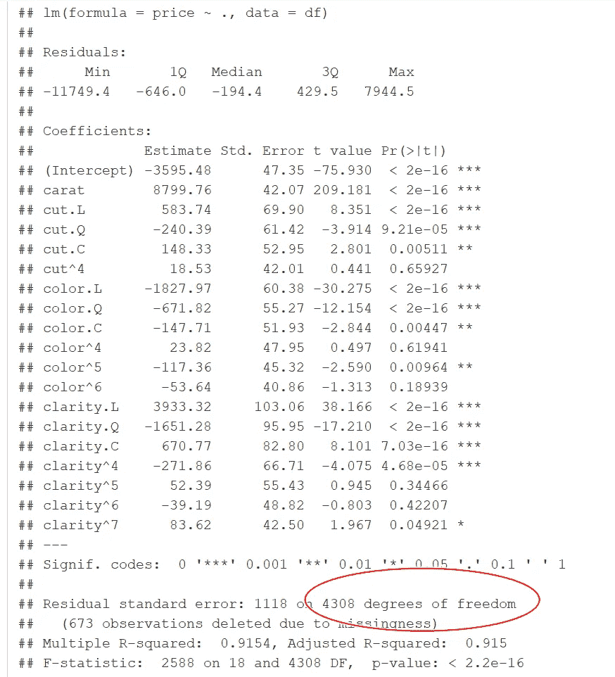

# R 中缺失值的处理:从删除到替换再到机器学习

> 原文：<https://medium.com/geekculture/dealing-with-nas-in-r-from-deletion-to-replacing-to-machine-learning-95194f5aa0f2?source=collection_archive---------3----------------------->


我们经常遇到缺少值的数据集(在数据框中表示为 NAs)。缺少值会使部分数据变得无用。为什么缺少这些值是另外一个故事，超出了本文的范围。这里只说治疗。

主要的处理方法是删除有缺失值的行(减少观察值的数量)或者删除有缺失值的列(放弃一些信息)。有些人不喜欢精简的数据集，他们用汇总统计数据(如可用值的平均值或中值)替换缺失值。一种相对复杂的方法是使用贝叶斯方法来估计缺失值和模型参数。这种方法在计量经济学圈子里很流行(当然是贝叶斯人)，但是我没有看到在那个领域之外的广泛采用(我不是贝叶斯的忠实粉丝，所以我将跳过这种方法)。

最近，人们使用机器学习算法来“猜测”出缺失的信息，并在数据中填入猜测，就好像它们首先就在那里一样。我无法判断这种方法的利弊，本文旨在为 R 学习者提供一个实施猜测方法的思路。我们还将总结 R 中处理 NAs 的一些有用的函数。

我们再次使用 ggplot2 包中的钻石数据，以便于复制。我们从中抽取 5000 颗钻石样本，从中随机选择 500 颗钻石用 NAs 替换其克拉值，200 颗钻石用 NAs 替换其价格，100 颗钻石用 NAs 替换其颜色。

为了保持易处理性，我们只保留四个 Cs 变量:克拉、颜色、净度和切工，以及价格。如果我们运行线性回归，四个 c 是 RHS 变量，价格是 LHS。

```
data(diamonds,package="ggplot2")set.seed(450)
df=diamonds %>% sample_n(5000)%>% select(1:4,7)set.seed(450)
df$carat[sample(1:5000, 500)]=NA
df$price[sample(1:5000, 200)]=NA
df$color[sample(1:5000, 100)]=NA
```

这五个变量是使用它们的列 id 通过上面的代码选择的:管道中的 *select(1:4，7)* 。 *set.seed* 函数允许我们每次重新运行代码时复制结果。可以使用 *set.seed* ()里面的任意正整数。

下面的两个*应用*代码有助于检测列是否有缺失值，并分别计算有多少个缺失值。

```
sapply(df,function(x)all(any(is.na(x))))
sapply(df,function(x)sum(is.na(x)))
```

我们有如下输出。

```
## carat     cut   color clarity   price    
##   TRUE   FALSE   TRUE FALSE   TRUE ## carat     cut   color clarity   price     
##     500       0      100       200       0 
```

如果不对缺失值进行任何处理，我们可以进行线性回归和许多其他分析。带有 NAs 的行将被排除在外，恕不另行通知。

```
lm.model=lm(price~.,data=df)
summary(lm.model)
```

这是 NAs 带来的问题之一。在检查摘要中的自由度之前，您甚至不会意识到带有 NAs 的行被删除了(下面的红色椭圆形)。



如果检测到 NAs，其他一些分析或操作可能无法进行。我们必须让 R 删除 NAs。例如，要计算克拉的平均值，我们必须将 *na.rm = T* 添加到代码中:

```
mean(df$carat,na.rm=T)
```

在这些情况下，我们必须先清理数据帧中的 NAs，然后再将数据提供给分析。下面我总结了三种方法。

# 删除 NAs

我们首先列出一些删除缺少值的行的代码。

```
df1=na.omit(df)
df1=df %>% filter(complete.cases(df))
```

如果有多列缺少值，我们可以通过所选列的缺少值来删除行。

```
df1=df %>% filter(!is.na(carat))
df1=df %>% drop_na(carat)
```

要删除具有 NA 值的列(这样您就可以使用完整的行维度，但使用较少的变量)，可以使用 select(-变量名)删除那些缺少信息的列。

# 替换 NAs

对于数值变量，我们可以用给定的值代替 NAs，例如平均值，如下面的代码所示。

```
mean.carat=mean(df$carat,na.rm=T)
df1=df %>% mutate(carat=ifelse(is.na(carat),mean.carat,carat))
```

或者写在一根管子里

```
df1=df %>% mutate(carat=ifelse(is.na(carat),mean(df$carat,na.rm=T),carat))
```

使用平均值替换缺失值会导致在替换缺失值后克拉的平均值相同。假设缺少值的变量的分布是高度偏斜的，例如，太多的离群值会使平均值远离中值。在这种情况下，我们将使用中间值来替换缺失值。

对于因子变量，我们必须指定一个新的因子级别。但是我们不能直接把它赋给变量。我们首先需要将其转换为字符变量，替换缺失的值，然后将其转换回因子。

```
df$color=as.character(df$color)
df1=df %>% mutate(color=ifelse(is.na(color),"Other",color))flevel=row.names(as.matrix(table(df1$color)))
df1$color=factor(df1$color,levels=flevel)
table(df1$color)
```

*flevel* 从表参数中提取因子级信息(先转换成矩阵)，省去我们打字的麻烦。最后一行验证“其他”作为新的因子级别添加。

如果我们想用 NAs 替换多个列的值，我们可以使用 *replace_na* 。语法如下。 *replace_na* 还保留了因子等级的标签，所以省去了提取的麻烦。

```
df1=df %>% replace_na(list(carat=mean.carat,price=0, color="Not Available")) %>% mutate(color=factor(color))str(df1$color)
```

在上面的代码中，我们将缺失的克拉值替换为平均克拉，将缺失的价格值替换为零，将缺失的颜色值替换为字符串“不可用”*多值替换需要列表*参数。

如果我们有许多带有缺失值的数字列，并且我们想用相应的列来替换它们而不需要太多的输入，那么 *mutate_if* 函数就能帮上忙。

```
df1=df %>% mutate_if(is.numeric, function(x) replace(x, is.na(x), mean(x, na.rm = TRUE)))
```

在上一行中，克拉和价格的缺失值分别被相应的列平均值替换。

# 猜测 NAs

现在考虑我们想要通过机器学习预测来猜测缺失的克拉信息的情况。

为了保持文章的可读性，我们删除了所有以前的结果，并创建了一个新的钻石数据框，仅在克拉上缺少值。我们采样了 10，000 颗钻石，将 1，000 颗钻石的克拉价值定为 NA。我们将通过机器学习来预测它们。

```
rm(list=ls(pattern="df"))#execute with cautiondf=diamonds %>% sample_n(10000) %>% mutate(id=1:10000)
set.seed(451)
df$carat[sample(1:10000, 1000)]=NA
```

对于剩余的 9000 颗具有克拉值的钻石，我们将它们按照 7:3 的比例分成训练和测试数据集，并分别命名为 *df.train* 和 *df.test* 。

```
set.seed(450)
df.train=df %>% filter(!is.na(carat)) %>% sample_n(6300) %>% arrange(id)
df.test=df %>% filter((!is.na(carat))&(!id%in%df.train$id)) %>% arrange(id)
```

然后，我们运行一系列线性回归，使用火车数据中的任何数据(不包括价格和 id)来解释火车数据中的克拉值(听起来有点奇怪，但这就是 R-square 的用途)。当我们觉得我们找到了一个具有足够解释力的模型时，我们用它来预测测试数据中的箱值，用实际的克拉值来测量 RMSE，并通过比较 RMSE 值来来回回地搜索“最佳”模型，直到我们确信我们有一个。

```
lm1=lm(carat~cut+color+clarity,df.train)
summary(lm1)
pred=predict(lm1,df.test)
rmse1=sqrt(mean((df.test$carat-pred)^2))lm2=lm(carat~.-id-price,df.train)
summary(lm2)
pred2=predict(lm2,df.test)
rmse2=sqrt(mean((df.test$carat-pred2)^2))
```

为了便于说明，我只训练了两个线性模型。但是我们可能需要训练几十个模型才能找到理想的。在这种情况下，使用 [***函数式编程***](https://martinqiu.medium.com/two-weapons-to-instantly-buff-your-r-coding-power-part-2-de8e95b92dc2) 非常有用，所以我们不需要重复上面的大部分代码。

假设我们决定使用模型 *lm2* 来预测缺失的克拉值。使用替换 NA 小节中的代码，我们用预测的克拉值替换 NAs。

```
df1=df %>% mutate(carat=ifelse(is.na(carat),predict(lm2,.),carat))
```

我们现在有了一个没有丢失值的新数据帧 *df1* ，为任何后续分析做好了准备。

线性回归方法可以用适合于预测数值的任何其他机器学习对数来代替。下面我用 KNN。

```
df2=df %>% mutate_if(is.factor,as.character) %>%  model.matrix(~color+cut+clarity-1,.)%>% cbind(select(df,-c(cut,color,clarity))) %>% select(carat,everything()) %>% mutate_at(names(.)[2:25],scale)%>% as.data.frame()
```

通过一系列管道操作，我将 df 中的所有因子变量转换为虚拟变量(0–1)。这是因为 KNN 在 R 中使用欧几里得距离，每个变量都应该是数字。我将在未来写一篇关于 model.matrix 和其他 R 函数的新文章，以促进 0-1 转换。因此，所有变量都是数字。然后，除了克拉和 id(也是为了计算欧几里德距离)，我将它们全部标准化。我把这个新的数据帧叫做 *df2* 。

在从 *df2* 中排除缺失克拉值的行之后，我像往常一样将 *df2* 中剩余的行分成训练集和测试集。

```
set.seed(450)   
df2.train=df2 %>% filter(!is.na(carat)) %>% sample_n(6300) %>% arrange(id)
df2.test=df2 %>% filter((!is.na(carat))&(!id%in%df2.train$id)) %>% arrange(id)
```

应用 KNN 算法，并加载必要的包。

```
library(caret)
library(class)knn.pred = knn(df2.train[,2:25],df2.test[,2:25],df2.train$carat,k=3) %>% as.character() %>% as.numeric()rmse.knn=sqrt(mean((as.numeric(as.character(knn.pred))-df2.test$carat)^2))
```

我尝试了不同的邻居数量值，并根据 RMSE 选择了一个较小的 k =3。请注意，小 ks 可能会导致过度拟合。无论如何，这篇文章是为了演示的目的，所以我会得到太多的模型调整。

下一步是通过 KNN 应用克拉的预测结果来替换 *df2* 中缺失的克拉值，为此我们创建一个子集数据帧，称为 *df2.guess* ，由 1000 颗缺失克拉信息的钻石组成。

```
df2.guess=df2 %>% filter(is.na(carat))knn.pred.carat = knn(df2.train[,2:25],df2.guess[,2:25],df2.train$carat,k=3) %>% as.character() %>% as.numeric()df2.guess= df2.guess %>% mutate(carat=knn.pred.carat)
```

最后一步是将储存在 *df2.guess* 到 *df* 中的预测克拉值插回。

```
df3=df %>%  mutate(carat = replace(carat, match(df2.guess$id, id), df2.guess$carat))
```

我们已经准备了另一个没有丢失值的数据帧 *df3* ，为将来的分析做好了准备。