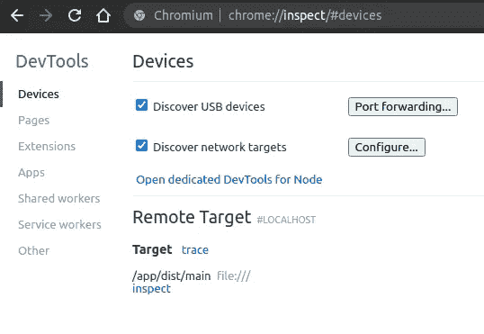
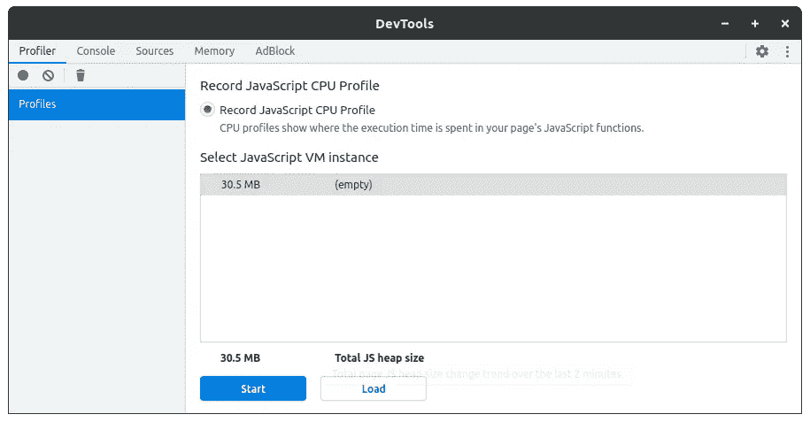
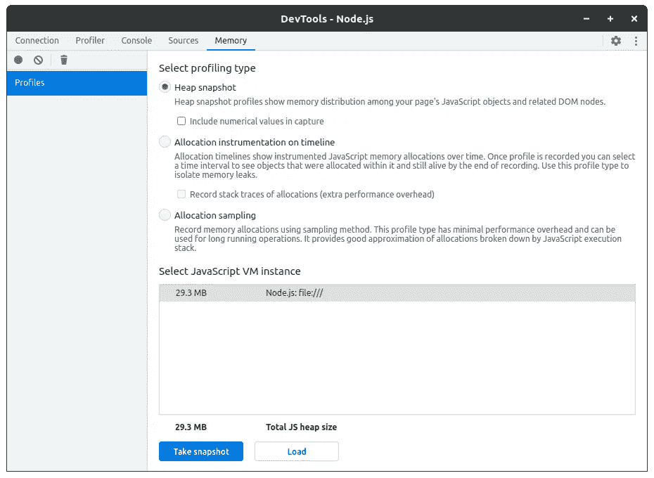
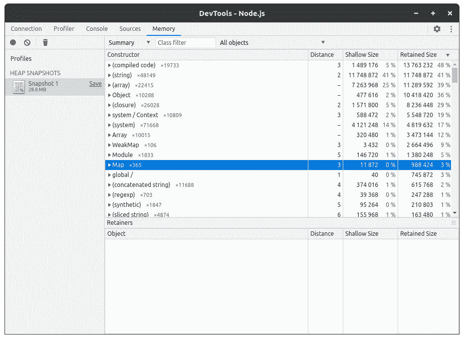
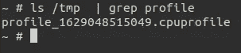

# 在生产中处理 Node.js 高 CPU

> 原文：<https://medium.com/geekculture/dealing-with-node-js-high-cpu-in-production-71c432d8bece?source=collection_archive---------0----------------------->

让我们假设您在生产中部署了一个 Node.js 服务，每一行代码都经过了审查和测试。但是随着每秒 10 个请求，Node.js 进程开始消耗 100%的 CPU，或者在 CPU 图上出现一些随机峰值，结果，响应时间增长并影响所有消费者。当然，您可以增加正在运行的实例的数量，但这并不能解决问题，服务的行为是一样的。


# CPU 高的根本原因

*   循环和迭代。如果不限制 iterable 集合的大小，任何`.map`、`.reduce`、`.forEach`和其他迭代方法调用都会导致问题。与`for`和`while`循环相同的潜在问题。如果您必须处理大型集合，请使用流或将集合分成块，并异步处理它们。它会在不同的 EventLoop 迭代之间分配负载，阻塞效应会降低。
*   递归函数。同样的原则，你需要考虑递归深度，特别是当函数是同步的时候。从我的经验来看:我的一个队友增加了一个解决[交易推销员问题](https://en.wikipedia.org/wiki/Travelling_salesman_problem)的功能，它一直工作得很好，直到它以 28 分被调用。结果，每个调用都阻塞了整个 Node.js 进程 2 秒钟，占用了 100%的 CPU。
*   巨大的有效载荷。Node.js 是为处理大量异步操作而创建的，比如向数据库发出请求或外部 API 调用。并且它可以完美地工作，直到来自外部资源的有效载荷很小。不要忘记 Node.js 需要先读取一个有效载荷并将其存储在内存中，然后将 JSON 解析为一个对象(添加了更多内存)，对该对象执行一些操作。来自 Node.js 服务的巨大负载也可能是一个问题，因为 Node.js 首先将对象发送到 JSON，然后再将它们发送到客户机。所有这些操作都会导致 CPU 占用率很高，请确保有效负载不会很大，使用分页，并且不要预填充不必要的数据。对于 GraphQL 服务，使用复杂性来限制响应负载。
*   `Promise.all`。别误会，`Promise.all`本身就 OK。但是如果你用大量的操作来调用它，可能会引起问题。例如，您有一个 id-s 数组，您需要从数据库中读取实体。如果列表中有 10 个 id-s，这不是问题，但是如果有 1000 个……试着像这样批量操作，用游标从数据库中读取数据。
*   内存泄漏。Node.js 有一个内置的垃圾收集器，根据不同的情况垃圾收集器从内存中移除未使用的对象。搜索和移除不必要的对象是一项不便宜的操作。如果 Node.js 服务中存在内存泄漏，垃圾收集器会一遍又一遍地尝试释放内存，但不会成功，只会浪费 CPU。

# 那么，如何找到 CPU 高的根本原因呢？


显而易见的决定是试图在本地重现这个问题。尝试在本地运行您的服务，并向它发出一些请求。您可以在 Node.js 上创建负载测试脚本，或者使用像[cannon](https://artillery.io/)这样的负载测试框架。请记住，本地配置应该尽可能接近生产。打开资源监视器，运行负载测试并观察。如果成功再现，使用`--inspect`标志重启应用程序，再次执行负载测试，在 chrome 浏览器中打开 chrome://inspect:



点击应用下方的`inspect`,然后启动 CPU 分析:



等待一段时间，通常 10-15 秒就足够了，然后您得到了 CPU 配置文件:


现在你可以检测你的代码有什么问题，CPU profile 有你需要的一切。

此外，获取堆配置文件来检测是否存在内存泄漏也很有用。点击*内存*标签，点击*拍摄快照*:



结果，你会得到这样的东西:



忽略系统类型为`(compiled code)`、`(string)`、`(array)`、`Object`、`(closure)`、`system / Context`、`(system)`、`Array`、`WeakMap`等的行。大多数情况下，它们对检测代码中的内存没有帮助。尝试制作几个堆快照，看看每种类型的对象数量是如何变化的。如果它只增长，我打赌你有内存泄漏:)

# 生产呢？如何获取正在运行的实例的 CPU 配置文件？


在大多数情况下，很难重现性能问题，因为您需要相同的环境配置、数据库中相同的数据、缓存等等。性能问题可能只针对某些类别的用户，因为他们有特定的数据。

生产中的调试模式呢？不建议在生产中启用调试模式，因为在调试模式下 Node.js 进程会消耗更多的资源，而且不安全。

但是有一个更好的方法，使用`inspector`模块[https://nodejs.org/api/inspector.html](https://nodejs.org/api/inspector.html)按需获取配置文件。是 Node.js 内置模块，不用安装任何额外的依赖项，不过我推荐你用`inspector-api`[https://www.npmjs.com/package/inspector-api](https://www.npmjs.com/package/inspector-api)。这是一个带有承诺支持的简单包装器。让我们创建一个记录 CPU 配置文件的端点，我将为 NestJS 创建一个示例，对于其他框架，它看起来非常相似:

所有代码都用`setImmediate`包装，因为我们不需要等到录音结束。请不要忘记保护这个端点，它必须只有超级管理员或系统用户可以访问。让我们用 curl 来测试一下:

```
curl -X POST [http://127.0.0.1/profile/cpu](http://127.0.0.1/api/profile/cpu)
```

10 秒钟后，我们在临时目录中得到一个配置文件:



让我们为堆分析添加一个类似的端点:

现在，您可以随时获取 CPU 和堆配置文件，只需在记录后将它们复制到本地。

如果您不想将此功能添加为 HTTP 端点，您可以将它们包装在流程信号处理程序中，如下所示:

并通过用`kill`命令发送信号来使用它:

```
kill -USR1 ${pid}  // for CPU 
kill -USR2 ${pid}  // for Heap
```

如果你使用 Kubernetes，从 pods 复制文件可能会很棘手，对于这种情况，`inspector-api`作者添加了一个惊人的功能:上传配置文件到 AWS S3。要启用它，将所需的选项传递给`Inspector`构造函数，并将 AWS 凭证变量设置为环境:

# 结论

今天，我们讨论了什么会导致 Node.js 应用程序中的性能问题，如何在本地和运行的生产环境中发现问题而无需重启。IMHO 性能修复和优化是开发人员工作中最有趣的部分。如果您有合适的工具，找到并修复任何问题都不会太难。

*下次见！Servus！*