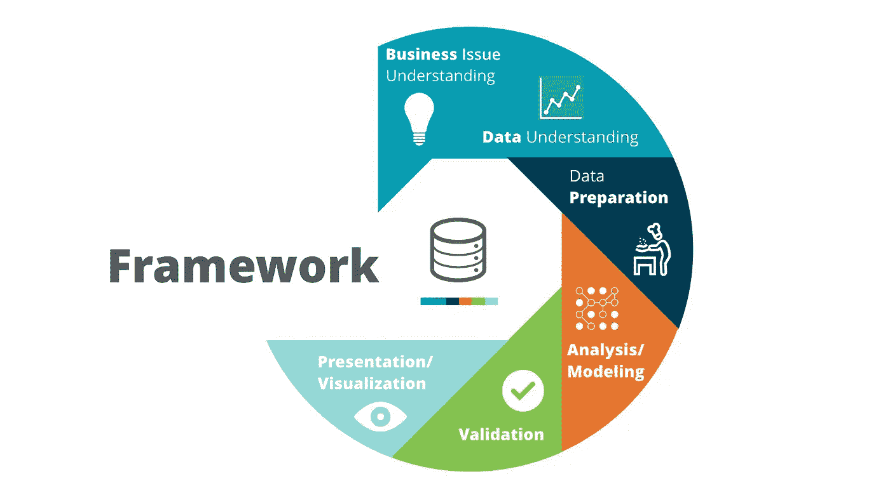
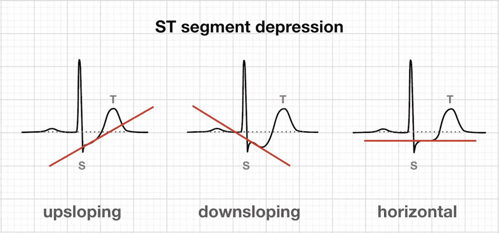
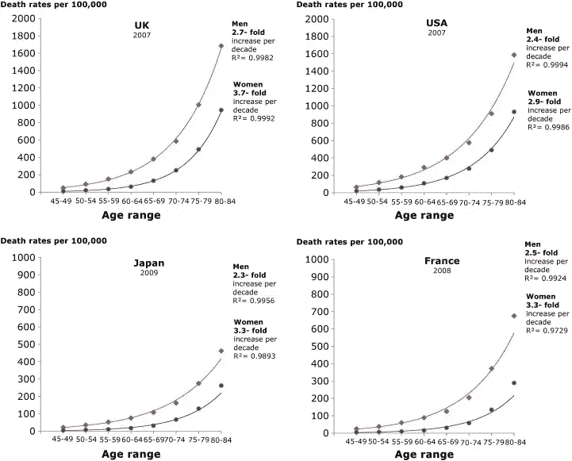
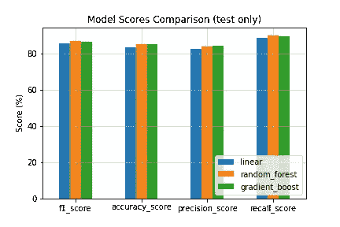
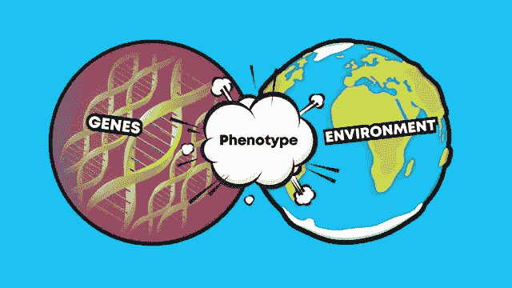
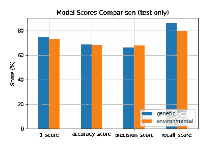
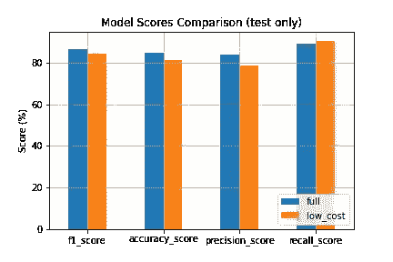
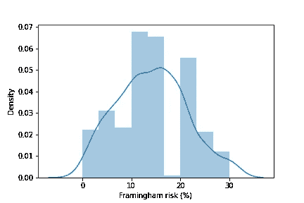
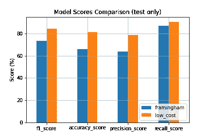

# 处理世界上最常见的死因

> 原文：<https://medium.com/geekculture/dealing-with-the-most-common-cause-of-death-in-the-world-c8b4fb509ac1?source=collection_archive---------42----------------------->

## 我们能否利用数据将心脏病风险评估和教育扩展到医疗资源有限的人群？


> **免责声明:**我写这篇文章是作为 Udacity 的数据科学家纳米学位项目的一个项目。**我的任何发现都不应被视为医学建议**，尽管我确实在医学院咨询过我的兄弟，但这绝不是同行评审的科学工作。确保在任何健康问题上寻求专业帮助。

关于心脏状况和冠状动脉疾病的文献浩如烟海，诊断方法也多种多样，但是有没有一种方法可以降低成本，并将医疗援助**扩展到无法获得专业诊断设备的人群？在本文中，我们将使用 **CRISP-DM** 框架来更好地理解这个问题，并尝试提出可行的解决方案。**

## 脆皮什么？

CRISP-DM 是对数据挖掘的跨行业标准流程的别称。这是一个包含数据挖掘所有步骤的框架，可以应用于任何可量化的问题。



该过程由以下一般步骤组成:

**1。业务理解**，或收集关于问题领域的信息，如技术术语、通用流程或实践、目标和之前对某个主题的研究。

**2。** **数据理解**，通常需要了解数据来源、固有偏差、数据收集条件或目标以及数据集中每个变量/特征的细节。

**3。数据准备**，或处理缺失数据、根据变量类型重新映射变量并删除有噪声或不可靠数据的过程。

**4。建模**，也被称为数据科学家的乐趣时代，它包括对预处理的数据采用统计模型，并生成可能有助于回答问题或估计未来值的预测值。

**5。评估**，或确保模型实际上如预期的那样运行，以及验证结果与文献和先前实验的一致性。

6。部署/可视化，包括汇编所有获得的知识和生成的工具，并使用这些资源来回答最初的问题或帮助解决预先陈述的问题。

这些步骤在设计上是非特定的，因此该过程实际上可以应用于几乎任何领域，从医学数据到油画，从工程到文学和社交媒体。这些步骤也是相互关联的，例如，经常在建模和评估之间来回切换，或者并行收集业务和数据理解。

> 这篇文章的重点是我的分析结果，如果你想更深入地了解 CRISP-DM 方法的代码和应用，请点击[链接](https://github.com/guischmitd/heart_attack_analysis)到我的 Github repo。

我们将使用来自 [UCI 机器学习库](https://archive.ics.uci.edu/ml/index.php)的[心脏病数据集](https://archive.ics.uci.edu/ml/datasets/Heart+Disease)，并尝试使用 CRISP-DM 框架回答 3 个问题:

**1。**冠状动脉疾病的**关键指标**有哪些？

**2。**遗传**/内在因素**比环境**/行为因素**更能预测未来吗？****

**3。**有没有更简单或者**低成本**的方法来评估**自身患冠心病的风险**？

该数据集由 1981 年至 1987 年在欧洲和美国的 5 个合作心脏病机构的 920 行(或患者)上观察到的 76 列(或变量)组成。这些数据最初由 Detrano 等人用于本文，后来被用于该领域的许多其他研究。

我在 [Kaggle](https://www.kaggle.com/rashikrahmanpritom/heart-attack-analysis-prediction-dataset) 中找到了干净的`.csv`数据子集，只包含 14 个变量和来自克利夫兰诊所的 303 名患者。完整的数据集可以在 [UCI 机器学习库](https://archive.ics.uci.edu/ml/datasets/Heart+Disease)找到。尽管存在丢失数据和损坏文件的问题，但通过一些定制的解析代码和数据清理，我能够整合数据集并使其达到相当可用的状态。原始文件、解析代码和完整处理过的数据集都可以在[项目的 Github 页面](https://github.com/guischmitd/heart_attack_analysis)上找到。

## 问题 1:冠状动脉疾病的一些关键指标是什么？

在数据清理和填充之后，相关性分析揭示了以下结果。

```
**# Feature #                  # Correlation to target #**
cp_type_atypical_angina              -0.3965 
heart_rate_peak                      -0.3813 
sex_F                                -0.3218 
ex_duration                          -0.2834 thalium_stress_result_normal         -0.2774
chol                                  0.1154
age                                   0.2775 
cp_rest_relieve                       0.2881 
cp_exertion                           0.3200 
sex_M                                 0.3218 
st_dep                                0.3689 
ex_angina                             0.4328 
cp_type_no_pain                       0.5112
```

*   `ex_angina`、`cp_exertion`和`cp_rest_relieve`与目标的相关值分别为 0.43、0.32 和 0.29。这表明，随着休息而消失的运动诱发的胸痛与冠状动脉疾病呈正相关。
*   `st_dep`在 0.37 告诉我们，在 EKG 期间测量的 [ST 段](https://litfl.com/st-segment-ecg-library/)压低与冠状动脉疾病之间存在直接关联。



st_dep relates to the amount by which the wave deviates downward between the S and T wave segments in the EKG

*   `age`和`sex_M`都与冠状动脉疾病呈正相关，这一点在文献中得到广泛认同，并且[也得到了世卫组织统计数据的证实。](https://www.ncbi.nlm.nih.gov/pmc/articles/PMC3819990/)



WHO statistics showing a higher prevalence of death by heart disease in older men

*   `heart_rate_peak`和`ex_duration`与目标值呈负相关，这表明健康人能够达到更高的心率，并在更长时间内进行锻炼，而不会过度劳累或导致胸痛。
*   `thalium_stress_result_normal`也显示负相关值，表明正常的[闪烁扫描](https://en.wikipedia.org/wiki/Scintigraphy#Heart)结果是整体冠状动脉健康的良好指标。

这些*大部分与预期一致*，尽管数值可能看起来有点低。另一方面，一些结果提出了有趣的问题:

*   **最高正相关特征**是`cp_type_no_pain`，这指向以下结论之一:1)患者没有报告胸痛是心脏病的强指标，或者 2)我们的样本偏向于先前没有胸痛报告史的冠状动脉疾病患者。假设 1 似乎不太可能，这允许进一步调查以识别数据中的这种偏斜。一个可能的假设是，**男性不太容易报告胸痛** ( [或任何其他症状](https://www.ncbi.nlm.nih.gov/pmc/articles/PMC1495200/))，这是对“脆弱”的普遍感觉的结果，尤其是在 20 世纪 80 年代，**同时整体上更容易患心脏病**。该假设得到了以下事实的支持:数据集中 59%的男性报告没有胸痛，相比之下，只有 35%的女性没有胸痛，而 63%的男性和 24%的女性患有 CAD。这个特性将在我们最后的建模步骤中被删除。
*   `chol`显示值为 0.11，这与高胆固醇水平是心脏病*本身*的一个强风险因素的流行观点相矛盾。的确，胆固醇在心脏病风险中扮演了一个角色，但是**有不同类型的胆固醇和脂肪需要观察**。我的哥哥很快就要成为一名内科医生，他结束了他的医学院学业，在向他咨询时，他告诉我，血清胆固醇(正在通过这项功能进行测量)本身在测量风险方面没有什么价值。我们必须验证其他更具体指标的比率，如低密度脂蛋白、高密度脂蛋白和甘油三酯。该数据集中另一个缺失的信息是**患者是否正在接受胆固醇控制药物治疗**，这肯定会扭曲这一特征。

总体而言，相关性分析表明，预测心脏病风险需要关注的关键指标是**年龄**(年龄较大)**性别**(男性)**运动诱发的心绞痛**(胸痛)**运动耐力**(时间更长、心率更高)，以及特定的医学检查结果，如 **ST 波压低**、**铊-201 闪烁扫描结果**。

## 问题 2:**遗传**/内在因素**比**环境**/行为因素更好预测吗？**

我们将特性分成几类，并采用自动统计建模来评估特性的重要性，并比较不同类别之间的结果。对于模型训练和优化，我用 python 写了一些简单的建模函数，使用 sklearn 来辅助下面的步骤。同样，细节可以在这个项目的 Github 页面上找到。

第一步是评估基于**所有可用功能**的不同模型架构的性能:



```
 **linear  random_forest  gradient_boost** 
**f1_score** 85.245902      86.557377       86.468647 **accuracy_score** 83.333333      84.814815       84.814815 **precision_score** 82.278481      83.544304       83.974359 **recall_score** 88.435374      89.795918       89.115646
```

所有三个训练过的模特**在数据**上都表现良好，在每个测试指标上得分在 80%到 90%之间。随机森林模型在 [F1 和回忆分数](https://en.wikipedia.org/wiki/F-score)中得分最高，而梯度增强模型获得了更高的精度。RF 模型的**召回率高于其精度**，这意味着该模型更加**敏感**，并且检测到更多的 CAD 病例，而**可能容易出现假阳性**。在像这样的风险评估任务中，这可能是首选行为，只要假阳性保持在合理的比例。

既然我们的建模流程已在完整数据集上得到验证，我们可以将相同的方法应用于特征子集，并将这些结果与第一次测试中获得的结果进行比较。两个被评估的特征类别如下所述。



**环境/行为特征**是可以被习惯、环境或药物影响的特征:

```
 **feature      feature_type**
34                 chol            E 
35               smoker            E 
36  smoker_cigs_per_day            E 
37         smoker_years            E 
38  fasting_blood_sugar            E
```

**遗传/内在特征**是患者和医务人员无法控制的指标:

```
 **feature      feature_type**
0                  sex_F            G
1                  sex_M            G 
29                   age            G 
39  heart_disease_family            G
```

在仅用可用特征的子集训练模型之后，获得了以下分数:



```
 **genetic  environmental** 
**f1_score** 75.147929      73.354232 
**accuracy_score** 68.888889      68.518519 
**precision_score** 66.492147      68.023256 
**recall_score** 86.394558      79.591837
```

总体而言，**遗传特征是冠心病风险的更好预测因素**，尤其是考虑到回忆(或敏感度)得分。这些分数与之前使用所有可用特征训练模型时发现的分数不一致，这在一定程度上是意料之中的。将模型限制在如此少的特征上显然对它们的预测能力有负面影响，但这种比较仍然成立。

## 问题 **3:** 有没有更简单或者**低成本**的方法来评估**自身患冠心病的风险**？

这是本研究开始时提出的主要问题，也是我和参与分析的人认为最实用的问题。

在本节中，我们将使用所有的先验知识来训练一个用于**预测冠状动脉疾病风险**的模型，该模型仅基于**低成本**和**简单测量给定患者的**特征，同时将其性能与先前的发现进行比较。我们还将在文献中寻找可比较的方法，以进行进一步的比较，并根据机器学习和心脏病学的最新发展来理解我们的结果。

我们将继续使用**功能类别**将所有可用的列分为需要专门设备的列和不需要昂贵设备和训练有素的员工就可以执行的列。

除了上一个问题中使用的`genetic`和`environmental`类别之外，我们将为这个测试增加两个要素类:

*   **历史数据(H)** 与患者的病史相关，特别是他们过去是否有任何胸痛发作
*   **廉价测试(CT)** 仅包含可以用最少的设备和医学知识进行的测试，如粗略测量心率和测量休息时的血压。

```
**# Full list of features used by the low-cost model** **feature      feature_type** 
      blood_press_s_rest           CT 
         heart_rate_peak           CT 
         heart_rate_rest           CT 
               ex_angina           CT
 cp_type_atypical_angina            H 
         cp_type_no_pain            H 
     cp_type_non_anginal            H 
  cp_type_typical_angina            H
                    chol            E 
                  smoker            E 
     smoker_cigs_per_day            E 
            smoker_years            E 
     fasting_blood_sugar            E                   
                   sex_F            G 
                   sex_M            G 
                     age            G 
    heart_disease_family            G
```

与全特征模型相比，在这些特征上训练的随机森林模型实现了以下结果:



```
 **full   low_cost** 
**f1_score** 86.468647  84.177215
**accuracy_score** 84.814815  81.481481 
**precision_score** 83.974359  78.698225 
**recall_score** 89.115646  90.476190
```

我们**能够真正接近**完整的模型，而不使用任何更昂贵和复杂的测试结果，我们甚至能够实现更高的召回率，即使以精度为代价。这告诉我们，至少对于这个样本来说，**我们可以以相当高的置信度**预测患者的心脏病风险**，而不需要昂贵的设备**和高度专业化的员工。这可以用作将患者分成风险组并优先考虑那些更有可能患有严重心脏病的患者的分类方法。类似的模型**也可以部署**作为在线工具**供人们评估自己的心脏病风险**，只要做更多的研究来发现隐藏的偏见，并在不同人群和种族群体中交叉验证结果。

## 奖励回合！弗雷明汉风险评分

对这一主题的初步研究揭示了许多旨在回答这一具体问题的论文和长期研究，并从整体上对心脏病有了更好的理解。值得注意的是，[弗雷明汉风险评分](https://en.wikipedia.org/wiki/Framingham_Risk_Score)是在与我哥哥的交谈中首先出现的方法之一。


The city of Framingham, MA

弗雷明汉评分是由弗雷明汉心脏研究开发的一种非侵入性方法，弗雷明汉心脏研究是一项对马萨诸塞州弗雷明汉居民的长期持续研究，始于 20 世纪 40 年代末，目前已有第三代参与者。该分数是根据几个变量计算出来的，用于评估患者未来 10 年的心血管风险。在这项研究中，我实现了该算法的一个版本，试图将我的模型的结果与这个流行的工具进行比较。

由于弗雷明汉模型的输出是一个连续的概率(即 10 年内心脏病发作的百分比“机会”)，我必须定义一个阈值来区分健康和患病患者的预测(顺便说一下，这被称为[离散化](https://en.wikipedia.org/wiki/Discretization_of_continuous_features))。这是通过反复分割和评估结果并确定可能的最佳 F1 分数的分割来完成的。**选择弗雷明汉风险评分的 8%** 阈值来确定患者是健康还是患病。



```
 **framingham   low_cost** 
**f1_score** 73.563218  84.177215 
**accuracy_score** 65.925926  81.481481 
**precision_score** 63.681592  78.698225 
**recall_score** 87.074830  90.476190
```

需要注意的是**这些模型预测的目标**并不完全相同，假设这些结果表明我们训练的模型比 Framingham Score 等相当成熟的算法*更好*是不负责任的。一种更好的表述方式是，给定我们的样本和目标，我们证明了训练一个具有高准确度、精确度和召回率的统计模型是可能的，这当然可以**进行优化和进一步测试**，以便最终部署为医疗专业人员和普通大众的有用工具。

## 参考

*   从 Kaggle 下载的数据集—[https://www . ka ggle . com/rashikrahmanpritom/heart-attack-analysis-prediction-dataset](https://www.kaggle.com/rashikrahmanpritom/heart-attack-analysis-prediction-dataset)
*   原始数据(https://archive.ics.uci.edu/ml/datasets/Heart+Disease UCI ML 存储库)——
*   **上世纪 80 年代的原始论文:**
*   贝叶斯概率分析:对其在冠心病诊断中的临床应用的前瞻性论证—[https://pubmed.ncbi.nlm.nih.gov/6692516/](https://pubmed.ncbi.nlm.nih.gov/6692516/)
*   冠心病诊断新概率算法的国际应用—[https://pubmed.ncbi.nlm.nih.gov/2756873/](https://pubmed.ncbi.nlm.nih.gov/2756873/)
*   使用临床可解释的基于模糊规则的系统进行冠状动脉疾病无创诊断的方法—【https://www.ncbi.nlm.nih.gov/pmc/articles/PMC4468223/ 
*   ST 段—【https://litfl.com/st-segment-ecg-library/ 
*   心脏缺血时的电生理变化—[https://www.cvphysiology.com/CAD/CAD012](https://www.cvphysiology.com/CAD/CAD012)
*   心脏病指标—[http://r studio-pubs-static . S3 . Amazon AWS . com/24341 _ 184 a 58191486470 cab 97 acdbbfe 78 ed 5 . html](http://rstudio-pubs-static.s3.amazonaws.com/24341_184a58191486470cab97acdbbfe78ed5.html)
*   https://lucdemortier.github.io/projects/3_mcnulty 麦纽提项目:评估心脏病的风险
*   非典型胸痛——是时候摆脱了——[https://www . amjmed . com/article/s 0002-9343(12)00488-3/pdf](https://www.amjmed.com/article/S0002-9343(12)00488-3/pdf)或[https://www . amjmed . com/article/s 0002-9343(12)00488-3/full text](https://www.amjmed.com/article/S0002-9343(12)00488-3/fulltext)
*   女性和男性的躯体症状报告—[https://www.ncbi.nlm.nih.gov/pmc/articles/PMC1495200/](https://www.ncbi.nlm.nih.gov/pmc/articles/PMC1495200/)

## 承认

感谢 Detrano M.D .等人在我们没有 google drive 来快速存储和共享的时候勤奋地保存数据。

特别感谢我的兄弟利奥花时间讨论、研究和发掘 80 年代的论文，以及审阅草稿和最终文本。

也感谢我的合作伙伴安娜审查文本和跳跃的想法关于医学历史，临床行为和社会科学。

感谢每一位同意参与最初研究的患者，希望推进我们对心脏病的理解。