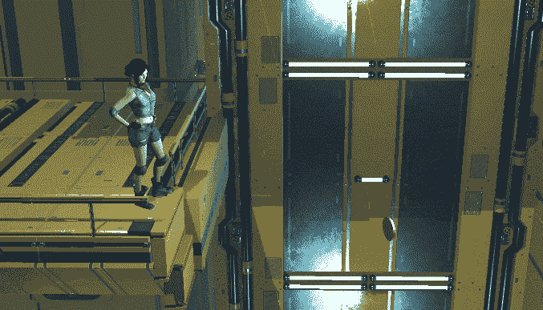
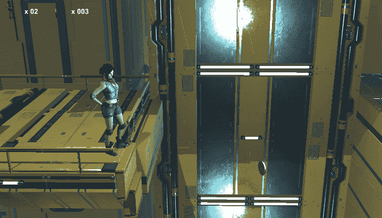

# 坠落致死——没有死区，只有撞击

> 原文：<https://medium.com/geekculture/death-by-falling-no-dead-zones-just-impact-bff6cb467646?source=collection_archive---------17----------------------->

**目标**:让玩家在摔落一个平台后死去

我想同样是**对一个平台的猛烈冲击**应该是**致命**。这意味着，除了死区的使用，我们需要实现一个功能来识别这种影响——在长时间坠落后——并使玩家死亡。

既然我们有一个有效的死亡逻辑，我们应该试着在这个场景中使用它。

检测致命坠落的一种方法是通过**测量 y 速度**:如果它比给定的负值**低**(因此绝对值**比**大)，将没有生还的机会！作为开始，我选择了-50。

我们需要在角色**下落**时检查这个值。幸运的是，我们知道当这种情况发生时，国家行为已经在下降脚本中起作用，我们可以在那里放置我们的逻辑。基本上，在更新时，我们检查玩家最终被**接地**时的 y 速度:如果它超过阈值，我们调用死亡逻辑，它将处理与死亡有关的一切，否则，我们照常着陆。

非常简单！

