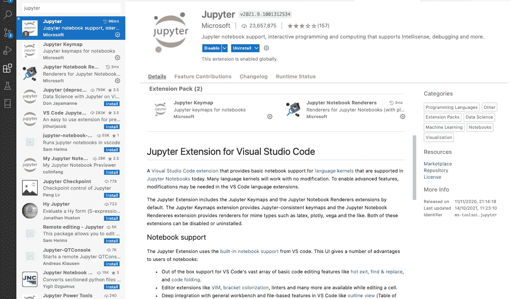
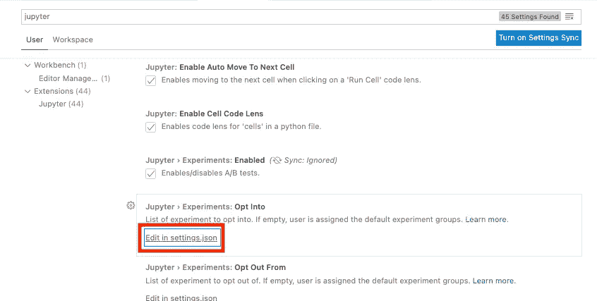
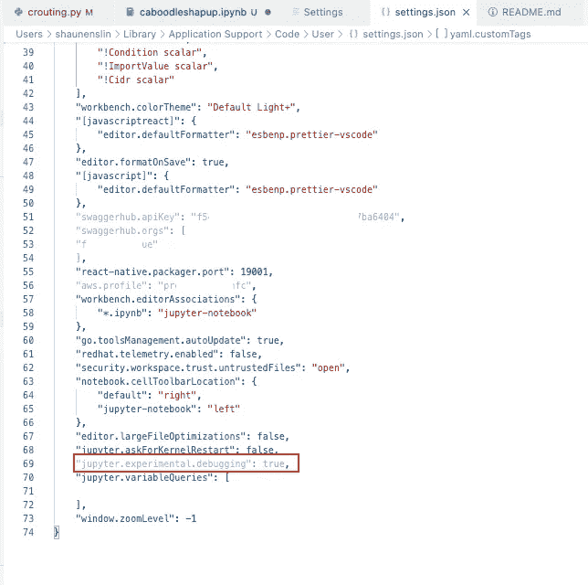
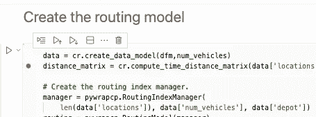
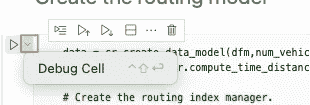
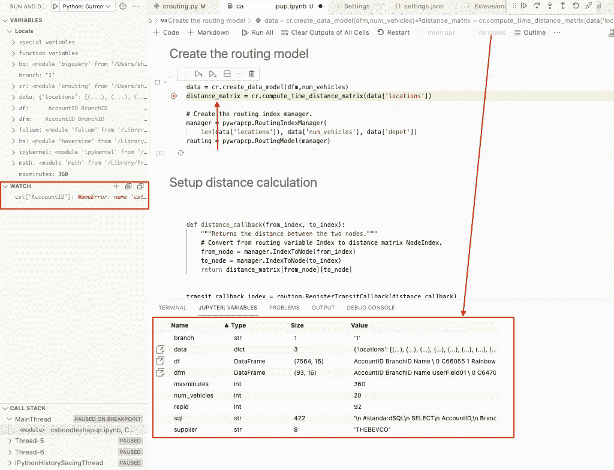

# 在 VSCode 中调试 jupyter 笔记本

> 原文：<https://medium.com/geekculture/debug-jupyter-notebooks-in-vscode-21b2be259f9d?source=collection_archive---------3----------------------->

## 你当然想调试你的 jupyter 笔记本。使用 print 进行调试只会让您的生活变得困难。谁要难；-)


Baviaans Kloof — South Africa

调试尝试使用 print 语句几乎足以让你抓狂。当然，你可以把你的 jupyter 笔记本导出来，然后用 python 调试，但是每次都要做太多的工作。经过一些搜索，有一个简单的步骤来开始调试您的 jupyter 笔记本。希望这三个步骤能帮助你。

# 第一步

您需要一些先决条件:

*   安装最新的 VSCode 版本后
*   确保您使用的是 python 3.7 >
*   在 vscode 中安装 python 扩展
*   现在确保也安装 jupyter 扩展，如下所示



# 第二步

现在，进入用户设置并搜索 jupyter，然后点击**‘在 settings.json 中编辑’**



现在，如下，去包括实验调试。

```
“jupyter.experimental.debugging”: true,
```



# 第三步

现在，我们可以做一些调试，在重启 VSCode 之后，首先，确保按照下面的红点设置断点。



要开始调试代码单元，选择下面的向下的 v 形符号，然后选择 debug。



好了，我们在 vscode 中调试，还可以观察变量或从常用的变量按钮查看它们…



# 结论

调试总是比使用打印语句更好，希望这能帮助你加速你的 AI & ML 编码…